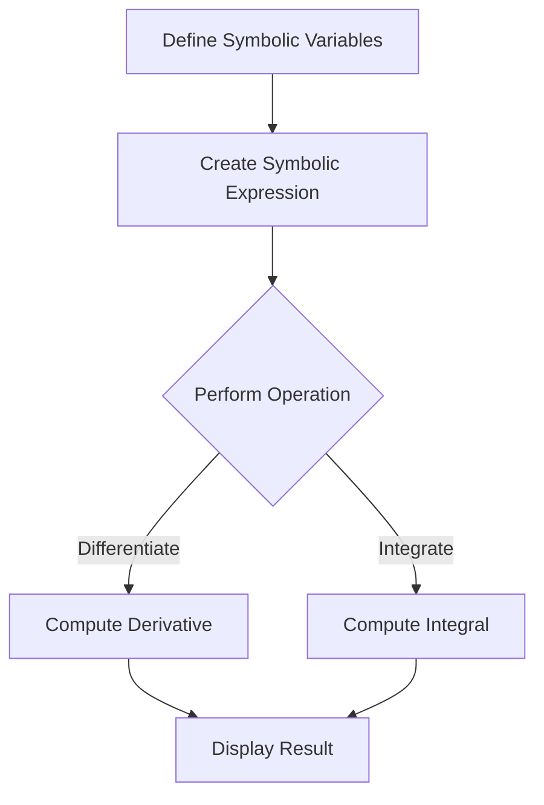

## 12.6 Symbolic Mathematics Using Symbolics.jl

Symbolic mathematics is a powerful tool in scientific computing, allowing for the manipulation of mathematical expressions in a symbolic form. This capability is crucial in fields such as analytical mechanics, control theory, and simplifying complex expressions. In Julia, the `Symbolics.jl` package provides a robust framework for symbolic computation, enabling users to define symbolic variables, perform symbolic operations, and solve equations analytically.

### Symbolic Computation

Symbolic computation involves the manipulation of mathematical symbols rather than numerical values. This approach allows for exact solutions and transformations, which are essential in theoretical and applied mathematics.

#### Defining Symbolic Variables

To begin with symbolic computation in Julia, we need to define symbolic variables. These variables serve as placeholders for mathematical expressions and can be manipulated algebraically.

```julia
using Symbolics

@variables x y z

println(x)  # Output: x
println(y)  # Output: y
println(z)  # Output: z
```

In the code above, we use the `@variables` macro from `Symbolics.jl` to create symbolic variables `x`, `y`, and `z`. These variables can now be used in symbolic expressions and operations.

#### Symbolic Operations

Symbolic operations allow us to perform algebraic manipulations on expressions. These operations include differentiation, integration, and equation solving.

##### Differentiation and Integration

Differentiation and integration are fundamental operations in calculus. With `Symbolics.jl`, we can compute exact derivatives and integrals of symbolic expressions.

```julia
expr = x^2 + 3x + 2

d_expr = differentiate(expr, x)
println(d_expr)  # Output: 2x + 3

i_expr = integrate(expr, x)
println(i_expr)  # Output: (1//3)x^3 + (3//2)x^2 + 2x
```

In this example, we differentiate and integrate the expression `x^2 + 3x + 2` with respect to `x`. The `differentiate` function computes the derivative, while the `integrate` function computes the integral.

##### Equation Solving

Solving equations symbolically allows us to find analytical solutions, which are often more insightful than numerical approximations.

```julia
eq = x^2 - 4 == 0

solutions = solve(eq, x)
println(solutions)  # Output: [x == -2, x == 2]
```

Here, we solve the equation `x^2 - 4 = 0` for `x`. The `solve` function returns the solutions `x = -2` and `x = 2`.

### Use Cases

Symbolic computation has numerous applications in various fields of science and engineering. Let's explore some common use cases.

#### Analytical Mechanics

In analytical mechanics, symbolic computation is used to derive equations of motion and analyze mechanical systems.

```julia
@variables t s(t)

v = differentiate(s, t)

a = differentiate(v, t)

println(v)  # Output: Differential(s(t), t)
println(a)  # Output: Differential(Differential(s(t), t), t)
```

In this example, we define symbolic variables for time `t` and displacement `s(t)`. We then compute the velocity and acceleration as derivatives of the displacement with respect to time.

#### Control Theory

Control theory often involves the analysis and design of dynamic systems. Symbolic computation can simplify the process of deriving transfer functions and state-space representations.

```julia
@variables s

H = (s + 1) / (s^2 + 2s + 1)

H_simplified = simplify(H)
println(H_simplified)  # Output: 1 / (s + 1)
```

Here, we define a symbolic transfer function `H` and simplify it using the `simplify` function. This process is crucial in control system analysis and design.

#### Simplifying Expressions

Simplifying complex expressions is another important application of symbolic computation. This process can reveal underlying patterns and relationships in mathematical models.

```julia
complex_expr = (x^2 - 1) / (x - 1)

simplified_expr = simplify(complex_expr)
println(simplified_expr)  # Output: x + 1
```

In this example, we simplify the expression `(x^2 - 1) / (x - 1)` to `x + 1`. The `simplify` function reduces the expression to its simplest form.

### Visualizing Symbolic Computation

To enhance understanding, let's visualize the process of symbolic differentiation and integration using a flowchart.



**Figure 1: Visualizing Symbolic Differentiation and Integration**

This flowchart illustrates the steps involved in symbolic differentiation and integration. We start by defining symbolic variables, create a symbolic expression, perform the desired operation (differentiation or integration), and finally display the result.

### Try It Yourself

Now that we've explored symbolic mathematics using `Symbolics.jl`, it's time to experiment with the code examples. Try modifying the symbolic expressions, perform additional operations, and explore the capabilities of `Symbolics.jl` further.

### References and Links

For further reading on symbolic mathematics and `Symbolics.jl`, consider the following resources:

- [Symbolics.jl Documentation](https://symbolics.juliasymbolics.org/)
- [JuliaLang Documentation](https://docs.julialang.org/)
- [Introduction to Symbolic Computation](https://en.wikipedia.org/wiki/Symbolic_computation)

### Knowledge Check

Let's reinforce your understanding with a few questions and exercises.

1. Define a symbolic variable `a` and compute the derivative of `a^3 + 2a^2 + a` with respect to `a`.
2. Solve the equation `3x^2 + 6x - 9 = 0` symbolically.
3. Simplify the expression `(y^2 - 4) / (y - 2)`.

### Embrace the Journey

Remember, this is just the beginning of your exploration into symbolic mathematics with `Symbolics.jl`. As you progress, you'll uncover more complex and powerful applications of symbolic computation. Keep experimenting, stay curious, and enjoy the journey!

## Quiz Time!



### What is the primary purpose of symbolic computation?

- [x] To manipulate mathematical symbols rather than numerical values
- [ ] To perform numerical approximations
- [ ] To solve only linear equations
- [ ] To visualize data

> **Explanation:** Symbolic computation involves manipulating mathematical symbols to obtain exact solutions and transformations.

### How do you define symbolic variables in Symbolics.jl?

- [x] Using the `@variables` macro
- [ ] Using the `@symbol` macro
- [ ] Using the `define` function
- [ ] Using the `@define` macro

> **Explanation:** The `@variables` macro is used to define symbolic variables in Symbolics.jl.

### Which function is used to compute the derivative of a symbolic expression?

- [x] `differentiate`
- [ ] `integrate`
- [ ] `solve`
- [ ] `simplify`

> **Explanation:** The `differentiate` function is used to compute the derivative of a symbolic expression.

### What is the output of `simplify((x^2 - 1) / (x - 1))`?

- [x] `x + 1`
- [ ] `x - 1`
- [ ] `x^2 - 1`
- [ ] `1`

> **Explanation:** The expression `(x^2 - 1) / (x - 1)` simplifies to `x + 1`.

### Which of the following is a use case for symbolic computation?

- [x] Analytical mechanics
- [x] Control theory
- [ ] Data visualization
- [ ] Web development

> **Explanation:** Symbolic computation is used in analytical mechanics and control theory for deriving equations and simplifying expressions.

### What does the `solve` function do in Symbolics.jl?

- [x] Finds analytical solutions to equations
- [ ] Computes numerical solutions to equations
- [ ] Simplifies expressions
- [ ] Differentiates expressions

> **Explanation:** The `solve` function finds analytical solutions to equations in Symbolics.jl.

### How can symbolic computation simplify complex expressions?

- [x] By revealing underlying patterns and relationships
- [ ] By converting them to numerical values
- [ ] By visualizing them
- [ ] By ignoring them

> **Explanation:** Symbolic computation simplifies complex expressions by revealing underlying patterns and relationships.

### What is the result of differentiating `x^2 + 3x + 2` with respect to `x`?

- [x] `2x + 3`
- [ ] `x^2 + 3`
- [ ] `3x + 2`
- [ ] `2x`

> **Explanation:** The derivative of `x^2 + 3x + 2` with respect to `x` is `2x + 3`.

### Which package in Julia is used for symbolic mathematics?

- [x] Symbolics.jl
- [ ] DataFrames.jl
- [ ] Plots.jl
- [ ] Flux.jl

> **Explanation:** Symbolics.jl is the package used for symbolic mathematics in Julia.

### True or False: Symbolic computation can only be used for differentiation.

- [ ] True
- [x] False

> **Explanation:** Symbolic computation can be used for differentiation, integration, equation solving, and more.




