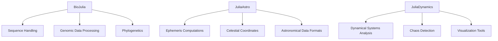

## 12.8 Domain-Specific Packages: Bioinformatics, Astronomy, etc.

Julia's rich ecosystem for scientific computing is bolstered by a plethora of domain-specific packages that cater to various fields such as bioinformatics, astronomy, and nonlinear dynamics. These packages provide specialized tools and functionalities that allow researchers and developers to efficiently tackle complex problems in their respective domains. In this section, we will explore some of the key domain-specific packages in Julia, including **BioJulia**, **JuliaAstro**, and **JuliaDynamics**, and demonstrate how they can be utilized in real-world applications.

### BioJulia: Biological Data Analysis

**BioJulia** is a suite of packages designed for biological data analysis. It provides tools for handling sequences, genomic data, and phylogenetics, making it an invaluable resource for bioinformaticians and computational biologists.

#### Key Features of BioJulia

- **Sequence Handling**: BioJulia offers robust support for handling biological sequences such as DNA, RNA, and proteins. It includes functionalities for sequence alignment, manipulation, and analysis.
- **Genomic Data Processing**: The package provides tools for working with genomic data formats like FASTA, FASTQ, and VCF, enabling efficient data parsing and manipulation.
- **Phylogenetics**: BioJulia includes modules for constructing and analyzing phylogenetic trees, which are essential for understanding evolutionary relationships.

#### Sample Code: Sequence Analysis with BioJulia

```julia
using BioSequences

dna_seq = DNASequence("ATGCGTACGTAGCTAG")

rna_seq = transcribe(dna_seq)

protein_seq = translate(rna_seq)

println("DNA Sequence: ", dna_seq)
println("RNA Sequence: ", rna_seq)
println("Protein Sequence: ", protein_seq)
```

In this example, we demonstrate how to create a DNA sequence, transcribe it to RNA, and then translate it into a protein sequence using BioJulia. This showcases the package's capabilities in handling and transforming biological sequences.

### JuliaAstro: Astronomical Calculations

**JuliaAstro** is a collection of packages tailored for astronomical calculations. It provides tools for ephemeris computations, celestial coordinates, and other astronomical data processing tasks.

#### Key Features of JuliaAstro

- **Ephemeris Computations**: JuliaAstro allows users to compute the positions of celestial bodies at given times, which is crucial for astronomical observations and research.
- **Celestial Coordinates**: The package includes functionalities for converting between different celestial coordinate systems, facilitating accurate data analysis and visualization.
- **Astronomical Data Formats**: JuliaAstro supports various astronomical data formats, enabling seamless integration with existing datasets.

#### Sample Code: Calculating Celestial Coordinates

```julia
using Astropy

latitude = 52.5200  # Berlin
longitude = 13.4050

observation_time = DateTime(2024, 11, 17, 22, 0, 0)

ra, dec = calculate_coordinates(latitude, longitude, observation_time)

println("Right Ascension: ", ra)
println("Declination: ", dec)
```

This example illustrates how to calculate the celestial coordinates of a point in the sky from a specific location and time using JuliaAstro. Such calculations are fundamental for planning astronomical observations.

### JuliaDynamics: Nonlinear Dynamics and Chaos

**JuliaDynamics** is a package suite focused on the analysis of nonlinear dynamics and chaos. It provides tools for studying dynamical systems, making it a valuable resource for researchers in physics, mathematics, and engineering.

#### Key Features of JuliaDynamics

- **Dynamical Systems Analysis**: JuliaDynamics offers functionalities for simulating and analyzing dynamical systems, including tools for phase space analysis and bifurcation diagrams.
- **Chaos Detection**: The package includes methods for detecting chaos in time series data, which is essential for understanding complex systems.
- **Visualization Tools**: JuliaDynamics provides visualization tools for plotting trajectories, attractors, and other dynamical system features.

#### Sample Code: Simulating a Lorenz System

```julia
using DynamicalSystems

lorenz = Systems.lorenz(σ=10.0, ρ=28.0, β=8/3)

trajectory = trajectory(lorenz, 100.0; dt=0.01)

using Plots
plot(trajectory, vars=(1, 2, 3), title="Lorenz Attractor")
```

In this example, we simulate the Lorenz system, a classic example of a chaotic system, using JuliaDynamics. The resulting trajectory is plotted to visualize the Lorenz attractor, demonstrating the package's capabilities in simulating and visualizing dynamical systems.

### Use Cases and Examples

#### Genome Sequencing Analysis

BioJulia can be used to analyze genome sequencing data, enabling researchers to identify genetic variations and understand evolutionary relationships. By leveraging its sequence handling and genomic data processing capabilities, BioJulia facilitates efficient analysis of large-scale genomic datasets.

#### Orbital Mechanics Simulations

JuliaAstro is well-suited for simulating orbital mechanics, allowing astronomers to predict the positions and movements of celestial bodies. This is particularly useful for mission planning and space exploration, where accurate ephemeris computations are critical.

#### Analyzing Dynamical Systems

JuliaDynamics provides tools for analyzing complex dynamical systems, making it ideal for studying phenomena such as turbulence, weather patterns, and population dynamics. Its chaos detection and visualization capabilities enable researchers to gain insights into the behavior of nonlinear systems.

### Try It Yourself

To deepen your understanding of these domain-specific packages, try modifying the sample code examples provided above. Experiment with different parameters, such as changing the DNA sequence in the BioJulia example or adjusting the initial conditions in the JuliaDynamics simulation. By doing so, you'll gain hands-on experience with these powerful tools and discover new ways to apply them to your own research and projects.

### Visualizing Domain-Specific Package Interactions

To better understand how these domain-specific packages interact within the Julia ecosystem, let's visualize their relationships and workflows using a Mermaid.js diagram.



**Diagram Description**: This diagram illustrates the key components and functionalities of the BioJulia, JuliaAstro, and JuliaDynamics packages. Each package is connected to its respective features, highlighting the specialized tools they offer for domain-specific tasks.

### References and Further Reading

- [BioJulia Documentation](https://biojulia.net/)
- [JuliaAstro GitHub Repository](https://github.com/JuliaAstro)
- [JuliaDynamics Documentation](https://juliadynamics.github.io/)
- [Ephemeris Computations](https://en.wikipedia.org/wiki/Ephemeris)
- [Lorenz System](https://en.wikipedia.org/wiki/Lorenz_system)

### Knowledge Check

To reinforce your understanding of the domain-specific packages discussed in this section, consider the following questions:

- How can BioJulia be used to analyze genomic data?
- What are the key features of JuliaAstro for astronomical calculations?
- How does JuliaDynamics facilitate the study of chaotic systems?

### Embrace the Journey

Remember, exploring domain-specific packages in Julia is just the beginning of your journey into scientific computing. As you delve deeper into these tools, you'll uncover new possibilities for research and innovation. Keep experimenting, stay curious, and enjoy the process of discovery!

## Quiz Time!



### What is BioJulia primarily used for?

- [x] Biological data analysis
- [ ] Astronomical calculations
- [ ] Nonlinear dynamics
- [ ] Machine learning

> **Explanation:** BioJulia is a suite of packages designed for biological data analysis, including sequence handling and genomic data processing.

### Which package is tailored for astronomical calculations in Julia?

- [ ] BioJulia
- [x] JuliaAstro
- [ ] JuliaDynamics
- [ ] JuliaML

> **Explanation:** JuliaAstro is a collection of packages specifically designed for astronomical calculations, such as ephemeris computations and celestial coordinates.

### What is a key feature of JuliaDynamics?

- [ ] Sequence alignment
- [ ] Ephemeris computations
- [x] Chaos detection
- [ ] Data visualization

> **Explanation:** JuliaDynamics includes methods for detecting chaos in time series data, which is essential for analyzing complex dynamical systems.

### How can BioJulia help in genomic data processing?

- [x] By providing tools for working with genomic data formats like FASTA and VCF
- [ ] By calculating celestial coordinates
- [ ] By simulating dynamical systems
- [ ] By performing machine learning tasks

> **Explanation:** BioJulia provides tools for working with genomic data formats, enabling efficient data parsing and manipulation.

### What is the Lorenz system an example of?

- [ ] A genomic sequence
- [ ] An astronomical object
- [x] A chaotic system
- [ ] A machine learning model

> **Explanation:** The Lorenz system is a classic example of a chaotic system, often used to study nonlinear dynamics.

### Which package would you use for simulating orbital mechanics?

- [ ] BioJulia
- [x] JuliaAstro
- [ ] JuliaDynamics
- [ ] JuliaML

> **Explanation:** JuliaAstro is well-suited for simulating orbital mechanics, allowing astronomers to predict the positions and movements of celestial bodies.

### What does JuliaDynamics offer for dynamical systems?

- [ ] Sequence handling
- [ ] Celestial coordinate conversion
- [x] Phase space analysis
- [ ] Genomic data processing

> **Explanation:** JuliaDynamics offers functionalities for simulating and analyzing dynamical systems, including tools for phase space analysis.

### How can you visualize a Lorenz attractor using JuliaDynamics?

- [x] By simulating the Lorenz system and plotting the trajectory
- [ ] By calculating celestial coordinates
- [ ] By aligning genomic sequences
- [ ] By performing machine learning tasks

> **Explanation:** JuliaDynamics allows you to simulate the Lorenz system and plot the resulting trajectory to visualize the Lorenz attractor.

### What is a common use case for BioJulia?

- [ ] Calculating ephemeris
- [x] Genome sequencing analysis
- [ ] Simulating chaotic systems
- [ ] Developing machine learning models

> **Explanation:** BioJulia can be used to analyze genome sequencing data, enabling researchers to identify genetic variations and understand evolutionary relationships.

### True or False: JuliaAstro supports astronomical data formats.

- [x] True
- [ ] False

> **Explanation:** JuliaAstro supports various astronomical data formats, enabling seamless integration with existing datasets.



By exploring these domain-specific packages, you can harness the power of Julia to tackle complex problems in bioinformatics, astronomy, and nonlinear dynamics. Keep experimenting and pushing the boundaries of what's possible with these powerful tools!
