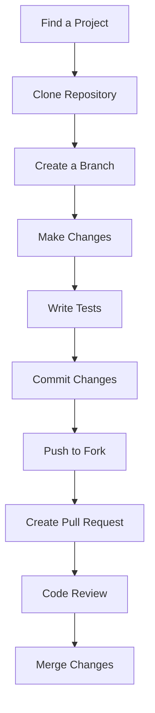

## 12.9 Contributing to the Julia Scientific Ecosystem

The Julia scientific ecosystem is a vibrant and rapidly growing community that thrives on collaboration and innovation. Contributing to this ecosystem not only enhances your skills but also helps in advancing scientific computing. In this guide, we will explore how you can effectively contribute to the Julia scientific ecosystem, focusing on finding projects, mastering version control, and writing effective documentation.

### Open Source Contribution

Open source contribution is a cornerstone of the Julia community. It involves collaborating with other developers to improve existing packages or create new ones. Let's delve into the steps you can take to become an active contributor.

#### Finding Projects

Finding the right project to contribute to can be daunting, especially for newcomers. Here are some strategies to help you identify packages in need of contributions:

1. **Explore JuliaHub and GitHub**: JuliaHub and GitHub are excellent platforms to discover Julia packages. Look for repositories with labels like `good first issue` or `help wanted`.

2. **Join Julia Community Forums**: Engage with the Julia community through forums like [Julia Discourse](https://discourse.julialang.org/) and [Slack](https://julialang.org/slack/). These platforms are great for networking and discovering projects that need help.

3. **Attend JuliaCon and Meetups**: Participating in events like JuliaCon and local meetups can provide insights into ongoing projects and collaboration opportunities.

4. **Follow JuliaLang on Social Media**: Stay updated with the latest developments and opportunities by following JuliaLang on platforms like Twitter and LinkedIn.

5. **Identify Your Interests**: Focus on projects that align with your interests and expertise. This will make your contributions more meaningful and enjoyable.

#### Best Practices

Once you've identified a project, it's important to follow best practices to ensure your contributions are valuable and well-received.

##### Version Control with Git

Version control is crucial for collaborative coding. Git is the most widely used version control system, and understanding its basics is essential for contributing to open source projects.

- **Clone the Repository**: Start by cloning the repository you want to contribute to. Use the command `git clone <repository-url>` to create a local copy.

- **Create a Branch**: Before making changes, create a new branch using `git checkout -b <branch-name>`. This keeps your work organized and separate from the main codebase.

- **Commit Changes**: Make regular commits with descriptive messages. Use `git commit -m "Your message"` to document your changes.

- **Push and Pull Requests**: Push your changes to your forked repository and create a pull request. This is how you propose changes to the original project.

- **Collaborative Techniques**: Engage with other contributors through code reviews and discussions. Be open to feedback and willing to iterate on your contributions.

Here's a simple example of using Git for a Julia project:

```bash
git clone https://github.com/username/julia-project.git

cd julia-project

git checkout -b feature-branch

# ...

git add .

git commit -m "Add new feature"

git push origin feature-branch

```

### Documentation and Testing

Documentation and testing are critical components of any successful open source project. They ensure that your code is reliable and easy to use.

#### Importance of Tests

Testing is essential for ensuring code reliability. It helps catch bugs early and provides a safety net for future changes.

- **Write Unit Tests**: Unit tests verify that individual components of your code work as expected. Use Julia's built-in `Test` module to write and run tests.

- **Continuous Integration**: Set up continuous integration (CI) to automatically run tests whenever changes are made. This ensures that new contributions do not break existing functionality.

- **Test Coverage**: Aim for high test coverage to ensure that most of your code is tested. Use tools like [Coverage.jl](https://github.com/JuliaCI/Coverage.jl) to measure and improve coverage.

Here's an example of a simple unit test in Julia:

```julia
using Test

function add(a, b)
    return a + b
end

@test add(2, 3) == 5
```

#### Writing Effective Documentation

Effective documentation enhances usability and adoption of your project. It serves as a guide for users and contributors.

- **Use Docstrings**: Add docstrings to your functions and modules. This provides inline documentation that can be accessed using Julia's help system.

- **Create a README**: A well-written README file is crucial. It should include an overview of the project, installation instructions, usage examples, and contribution guidelines.

- **Leverage Documentation Tools**: Use tools like [Documenter.jl](https://juliadocs.github.io/Documenter.jl/stable/) to generate comprehensive documentation for your project.

- **Keep Documentation Updated**: Regularly update your documentation to reflect changes in the codebase. This ensures that users always have access to accurate information.

Here's an example of a docstring in Julia:

```julia
"""
    add(a, b)

Add two numbers `a` and `b`.

```julia
julia> add(2, 3)
5
```
"""
function add(a, b)
    return a + b
end
```

### Visualizing the Contribution Process

To better understand the contribution process, let's visualize it using a flowchart. This diagram illustrates the steps involved in contributing to a Julia project.



**Caption**: This flowchart outlines the typical process for contributing to a Julia project, from finding a project to merging changes.

### Knowledge Check

Before we conclude, let's reinforce what we've learned with some questions and challenges:

- **Question**: What are some platforms where you can find Julia projects to contribute to?
- **Challenge**: Clone a Julia repository from GitHub and create a new branch for a feature you want to add.

### Embrace the Journey

Contributing to the Julia scientific ecosystem is a rewarding experience that offers numerous opportunities for learning and growth. Remember, this is just the beginning. As you progress, you'll build more complex and impactful contributions. Keep experimenting, stay curious, and enjoy the journey!

## Quiz Time!



### Which platform is NOT recommended for finding Julia projects to contribute to?

- [ ] JuliaHub
- [ ] GitHub
- [ ] Julia Discourse
- [x] MySpace

> **Explanation:** MySpace is not a platform for finding Julia projects. JuliaHub, GitHub, and Julia Discourse are recommended platforms.

### What is the first step in contributing to a Julia project?

- [x] Find a project
- [ ] Write tests
- [ ] Create a pull request
- [ ] Merge changes

> **Explanation:** The first step is to find a project that you are interested in contributing to.

### Which command is used to create a new branch in Git?

- [ ] git clone
- [x] git checkout -b
- [ ] git commit
- [ ] git push

> **Explanation:** The `git checkout -b <branch-name>` command is used to create a new branch.

### What is the purpose of writing unit tests?

- [ ] To increase code complexity
- [x] To verify individual components work as expected
- [ ] To slow down development
- [ ] To replace documentation

> **Explanation:** Unit tests verify that individual components of the code work as expected.

### Which tool is used for generating documentation in Julia?

- [ ] Coverage.jl
- [ ] Test.jl
- [x] Documenter.jl
- [ ] Debugger.jl

> **Explanation:** Documenter.jl is used for generating documentation in Julia.

### What should a README file include?

- [x] Project overview
- [x] Installation instructions
- [x] Usage examples
- [ ] Personal opinions

> **Explanation:** A README file should include a project overview, installation instructions, and usage examples.

### What is the purpose of continuous integration?

- [ ] To manually run tests
- [x] To automatically run tests on changes
- [ ] To replace version control
- [ ] To write documentation

> **Explanation:** Continuous integration automatically runs tests whenever changes are made to ensure code reliability.

### What is the role of docstrings in Julia?

- [ ] To slow down execution
- [x] To provide inline documentation
- [ ] To replace tests
- [ ] To increase code size

> **Explanation:** Docstrings provide inline documentation that can be accessed using Julia's help system.

### Which command is used to stage changes in Git?

- [x] git add
- [ ] git commit
- [ ] git push
- [ ] git merge

> **Explanation:** The `git add` command is used to stage changes before committing.

### True or False: It's important to keep documentation updated to reflect code changes.

- [x] True
- [ ] False

> **Explanation:** Keeping documentation updated ensures that users have access to accurate information.


