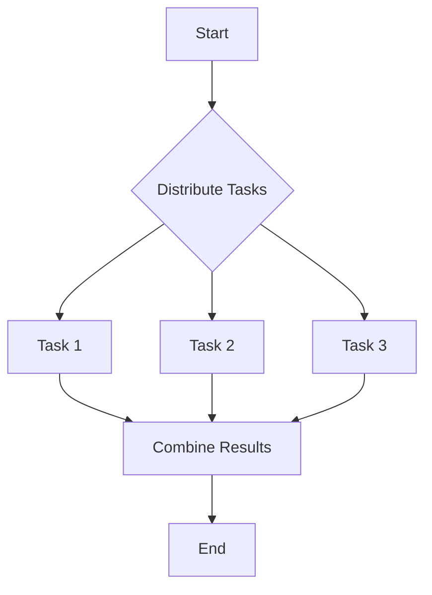

## 13.1 Introduction to Parallel Computing Concepts

Parallel computing is a cornerstone of modern software development, enabling applications to perform complex computations efficiently by leveraging multiple processors or cores. In this section, we will delve into the fundamental concepts of parallel computing, focusing on how Julia, a high-level, high-performance programming language, facilitates parallelism. We will explore the types of parallelism, the significance of parallel computing, and how Julia's features can be harnessed to build scalable and performant applications.

### Understanding Parallel Computing

Parallel computing involves the simultaneous use of multiple compute resources to solve a computational problem. This approach contrasts with serial computing, where tasks are executed one after another. By dividing a problem into smaller sub-problems that can be solved concurrently, parallel computing can significantly reduce computation time and increase efficiency.

#### Types of Parallelism

Parallelism can be broadly categorized into two types: Data Parallelism and Task Parallelism. Each type has its own use cases and advantages, and understanding them is crucial for effectively utilizing parallel computing.

##### Data Parallelism

Data parallelism involves performing the same operation on different pieces of distributed data simultaneously. This type of parallelism is particularly useful in scenarios where large datasets need to be processed, such as in data analysis, machine learning, and scientific computing.

**Example of Data Parallelism:**

Consider a scenario where we need to apply a function to each element of a large array. In Julia, this can be achieved using the `@distributed` macro, which distributes the computation across available processors.

```julia
using Distributed

addprocs(4)

@everywhere function square(x)
    return x * x
end

numbers = 1:1000000
squared_numbers = @distributed (+) for number in numbers
    square(number)
end

println(squared_numbers)
```

In this example, the `@distributed` macro is used to parallelize the computation of squaring each number in the array `numbers`. The computation is distributed across the available processors, significantly reducing the time required to complete the task.

##### Task Parallelism

Task parallelism, on the other hand, involves distributing different tasks (functions or operations) across multiple processors. This type of parallelism is beneficial when tasks are independent and can be executed concurrently.

**Example of Task Parallelism:**

Suppose we have a set of independent tasks that need to be executed. We can use Julia's `@spawn` macro to execute these tasks in parallel.

```julia
using Distributed

@everywhere function task1()
    sleep(2)
    return "Task 1 completed"
end

@everywhere function task2()
    sleep(3)
    return "Task 2 completed"
end

@everywhere function task3()
    sleep(1)
    return "Task 3 completed"
end

task1_future = @spawn task1()
task2_future = @spawn task2()
task3_future = @spawn task3()

results = fetch.(Ref(task1_future), Ref(task2_future), Ref(task3_future))
println(results)
```

In this example, the `@spawn` macro is used to execute `task1`, `task2`, and `task3` concurrently. Each task runs independently, and the results are gathered using the `fetch` function.

### Why Parallelism Matters

Parallel computing is not just a technical curiosity; it is a necessity in today's data-driven world. Here are some reasons why parallelism is crucial:

#### Performance Improvements

One of the primary motivations for parallel computing is performance improvement. By utilizing multiple processors or cores, parallel computing can significantly reduce computation time. This is particularly important for applications that require processing large datasets or performing complex calculations.

**Example:**

Consider a machine learning application that needs to train a model on a large dataset. By parallelizing the training process, we can reduce the time required to train the model, enabling faster iterations and experimentation.

#### Scalability

Parallel computing also enhances scalability, allowing applications to handle larger problems as computational resources increase. This scalability is essential for applications that need to process ever-growing datasets or perform increasingly complex computations.

**Example:**

In scientific computing, simulations often require processing vast amounts of data. By leveraging parallel computing, these simulations can scale to accommodate larger datasets and more complex models, providing more accurate and detailed results.

### Leveraging Julia for Parallel Computing

Julia is designed with parallel computing in mind, offering a range of features and tools to facilitate parallelism. Here are some key aspects of Julia's parallel computing capabilities:

#### Multi-threading

Julia supports multi-threading, allowing you to execute multiple threads within a single process. This is particularly useful for tasks that can be parallelized at a finer granularity.

**Example of Multi-threading:**

```julia
using Base.Threads

function parallel_sum(arr)
    n = length(arr)
    sum = 0.0

    @threads for i in 1:n
        sum += arr[i]
    end

    return sum
end

arr = rand(1_000_000)
println(parallel_sum(arr))
```

In this example, the `@threads` macro is used to parallelize the summation of elements in the array `arr`. Each thread computes a portion of the sum, and the results are combined to obtain the final sum.

#### Distributed Computing

Julia's `Distributed` module provides tools for distributed computing, enabling you to run computations across multiple machines or processors.

**Example of Distributed Computing:**

```julia
using Distributed

addprocs(4)

@everywhere function compute_pi(n)
    count = 0
    for i in 1:n
        x = rand()
        y = rand()
        if x^2 + y^2 <= 1.0
            count += 1
        end
    end
    return 4.0 * count / n
end

n = 100_000_000
pi_estimate = @distributed (+) for _ in 1:4
    compute_pi(n)
end

println(pi_estimate / 4)
```

In this example, the computation of estimating Pi is distributed across four workers, each performing a portion of the computation. The results are combined to obtain the final estimate of Pi.

### Visualizing Parallel Computing Concepts

To better understand the flow of parallel computing, let's visualize the process using a flowchart. This diagram illustrates how tasks are distributed and executed in parallel.



**Diagram Description:** This flowchart represents the process of distributing tasks in parallel computing. Tasks are distributed from a central point, executed concurrently, and the results are combined to complete the computation.

### References and Further Reading

- [Julia Documentation on Parallel Computing](https://docs.julialang.org/en/v1/manual/parallel-computing/)
- [Parallel Computing in Julia: A Tutorial](https://julialang.org/blog/2019/07/multithreading/)
- [Understanding Parallelism: A Guide for Developers](https://www.tutorialspoint.com/parallel_computing/index.htm)

### Knowledge Check

To reinforce your understanding of parallel computing concepts, consider the following questions and challenges:

1. What are the main differences between data parallelism and task parallelism?
2. How can you use Julia's `@distributed` macro to parallelize a computation?
3. What are some potential pitfalls of parallel computing, and how can they be mitigated?
4. Try modifying the code examples provided to experiment with different numbers of processors or tasks.

### Embrace the Journey

Remember, mastering parallel computing is a journey. As you explore these concepts, you'll gain the skills needed to build more efficient and scalable applications. Keep experimenting, stay curious, and enjoy the process of discovery!

## Quiz Time!



### What is data parallelism?

- [x] Performing the same operation on different pieces of distributed data simultaneously.
- [ ] Distributing different tasks across multiple processors.
- [ ] Executing tasks sequentially on a single processor.
- [ ] Using a single thread for computation.

> **Explanation:** Data parallelism involves performing the same operation on different pieces of distributed data simultaneously, which is ideal for processing large datasets.

### What is task parallelism?

- [ ] Performing the same operation on different pieces of distributed data simultaneously.
- [x] Distributing different tasks across multiple processors.
- [ ] Executing tasks sequentially on a single processor.
- [ ] Using a single thread for computation.

> **Explanation:** Task parallelism involves distributing different tasks across multiple processors, allowing independent tasks to be executed concurrently.

### Why is parallel computing important?

- [x] It improves performance by reducing computation time.
- [x] It enhances scalability to handle larger problems.
- [ ] It increases the complexity of applications.
- [ ] It requires more coding effort.

> **Explanation:** Parallel computing is important because it improves performance by reducing computation time and enhances scalability, allowing applications to handle larger problems.

### Which Julia macro is used for multi-threading?

- [x] `@threads`
- [ ] `@distributed`
- [ ] `@spawn`
- [ ] `@parallel`

> **Explanation:** The `@threads` macro in Julia is used for multi-threading, allowing tasks to be executed concurrently within a single process.

### Which Julia module provides tools for distributed computing?

- [x] `Distributed`
- [ ] `Threads`
- [ ] `Parallel`
- [ ] `Concurrent`

> **Explanation:** The `Distributed` module in Julia provides tools for distributed computing, enabling computations to be run across multiple machines or processors.

### What is the purpose of the `@distributed` macro in Julia?

- [x] To parallelize computations across multiple processors.
- [ ] To execute tasks sequentially on a single processor.
- [ ] To create a new thread for each task.
- [ ] To manage memory allocation.

> **Explanation:** The `@distributed` macro in Julia is used to parallelize computations across multiple processors, distributing tasks and combining results.

### How does parallel computing enhance scalability?

- [x] By allowing applications to handle larger problems as computational resources increase.
- [ ] By reducing the number of processors needed.
- [ ] By simplifying the code structure.
- [ ] By increasing the complexity of algorithms.

> **Explanation:** Parallel computing enhances scalability by allowing applications to handle larger problems as computational resources increase, accommodating growing datasets and complex computations.

### What is a potential pitfall of parallel computing?

- [x] Race conditions
- [ ] Improved performance
- [ ] Increased scalability
- [ ] Simplified code

> **Explanation:** A potential pitfall of parallel computing is race conditions, where multiple processes access shared resources concurrently, leading to unpredictable results.

### Which of the following is an example of data parallelism?

- [x] Applying a function to each element of a large array simultaneously.
- [ ] Executing independent tasks concurrently.
- [ ] Running tasks sequentially on a single processor.
- [ ] Using a single thread for computation.

> **Explanation:** Data parallelism involves applying a function to each element of a large array simultaneously, distributing the computation across multiple processors.

### True or False: Parallel computing can only be achieved with multiple machines.

- [ ] True
- [x] False

> **Explanation:** False. Parallel computing can be achieved with multiple processors or cores within a single machine, as well as across multiple machines.


