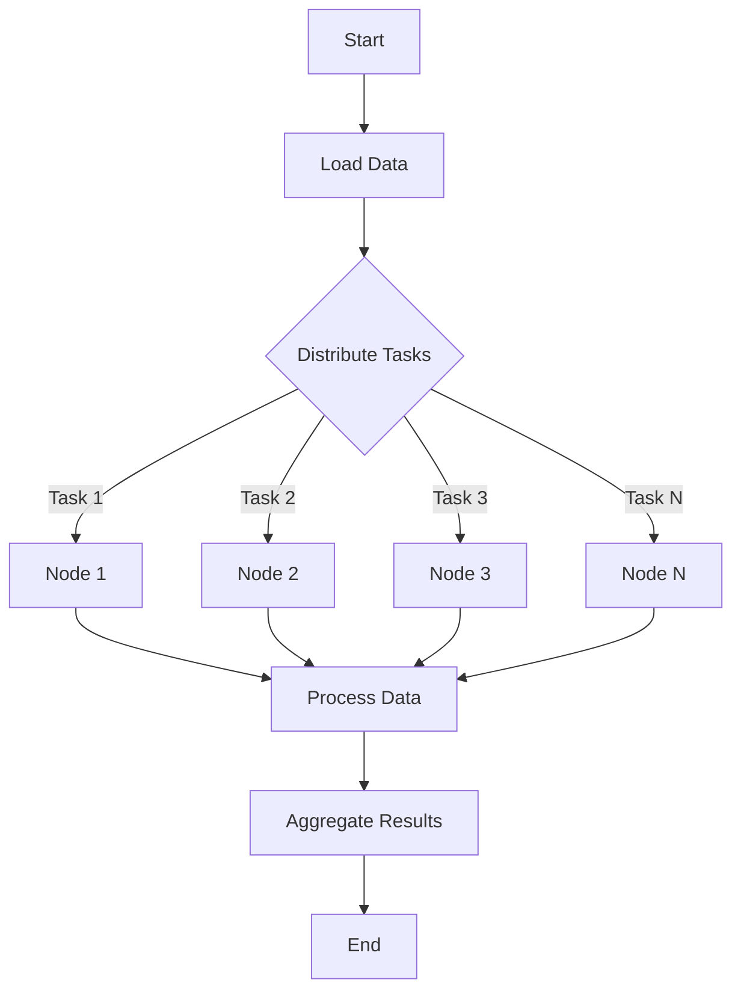

## 13.10 Achieving PetaFLOPS with Celeste.jl

In the realm of scientific computing, achieving PetaFLOPS (quadrillions of floating-point operations per second) is a significant milestone. Celeste.jl, a project developed using the Julia programming language, has demonstrated the power of Julia in handling large-scale astronomical data processing tasks. This section delves into the Celeste.jl project, exploring its technical approach, performance achievements, and key takeaways for optimizing large-scale systems.

### Overview of Celeste.jl Project

**Celeste.jl** is an ambitious project aimed at creating a comprehensive catalog of astronomical objects by processing vast amounts of data collected from telescopes. The project leverages Julia's capabilities to handle complex computations efficiently, making it a prime example of how modern programming languages can be used to tackle scientific challenges.

#### Astronomical Data Processing

The primary goal of Celeste.jl is to build a detailed catalog of stars, galaxies, and other celestial objects. This involves processing data from the Sloan Digital Sky Survey (SDSS), which includes images and spectra of millions of astronomical objects. The challenge lies in the sheer volume of data and the need for precise computations to accurately identify and classify these objects.

- **Data Volume**: The SDSS dataset is massive, comprising terabytes of images and spectra. Processing this data requires efficient algorithms and high-performance computing resources.
- **Precision and Accuracy**: Identifying celestial objects involves complex statistical models and requires high precision to ensure accurate classification.

### Technical Approach

Celeste.jl's success in achieving PetaFLOPS performance can be attributed to several key technical strategies, including algorithm optimization and leveraging Julia's parallel computing capabilities.

#### Algorithm Optimization

One of the core strengths of Celeste.jl is its optimized algorithms, designed to efficiently process large datasets. The project utilizes advanced statistical models to analyze astronomical data, and these models are implemented in Julia to take advantage of its high-performance features.

- **Statistical Models**: Celeste.jl employs Bayesian inference to model the distribution of light from celestial objects. This approach allows for precise estimation of object properties, such as position, brightness, and type.
- **Efficient Computation**: By optimizing the implementation of these models in Julia, Celeste.jl achieves significant performance gains. Julia's just-in-time (JIT) compilation and multiple dispatch features are crucial in optimizing these computations.

#### Leveraging Julia's Performance and Parallelism Capabilities

Julia is renowned for its ability to combine the ease of use of high-level languages with the performance of low-level languages like C and Fortran. Celeste.jl takes full advantage of Julia's parallel computing capabilities to distribute computations across multiple processors.

- **Parallel Computing**: Celeste.jl uses Julia's built-in parallel computing features to distribute tasks across thousands of cores. This parallelism is essential for handling the massive data volumes involved in astronomical data processing.
- **Distributed Computing**: By utilizing Julia's distributed computing capabilities, Celeste.jl can run computations on supercomputers like NERSC's Cori, which consists of thousands of nodes.

### Performance Achievements

Celeste.jl's performance achievements are nothing short of remarkable. The project has set records for astronomical data processing, achieving 1.5 PetaFLOP/s on the Cori supercomputer.

#### Record-Breaking Computations

The ability to achieve PetaFLOPS performance is a testament to the efficiency of Celeste.jl's algorithms and the power of Julia's parallel computing capabilities.

- **NERSC's Cori Supercomputer**: Celeste.jl was run on the Cori supercomputer at the National Energy Research Scientific Computing Center (NERSC). Cori is one of the most powerful supercomputers in the world, with over 600,000 cores.
- **1.5 PetaFLOP/s Performance**: By efficiently distributing computations across Cori's nodes, Celeste.jl achieved a sustained performance of 1.5 PetaFLOP/s, setting a new benchmark for astronomical data processing.

### Key Takeaways

The success of Celeste.jl offers valuable insights into optimizing large-scale systems and leveraging modern programming languages for scientific computing.

#### Optimizing for Large-scale Systems

Celeste.jl's approach to optimizing for large-scale systems can be applied to other domains beyond astronomy. Here are some strategies that contributed to its success:

- **Efficient Use of Resources**: By optimizing algorithms and leveraging parallel computing, Celeste.jl makes efficient use of available computing resources, maximizing performance.
- **Scalability**: The ability to scale computations across thousands of cores is crucial for handling large datasets. Celeste.jl demonstrates how to achieve scalability through distributed computing.
- **Precision and Accuracy**: Maintaining precision and accuracy in computations is essential for scientific applications. Celeste.jl's use of Bayesian inference ensures accurate results.

### Code Example: Parallel Computing with Julia

To illustrate how Julia's parallel computing capabilities can be utilized, let's look at a simple example of parallelizing a computation using Julia's `Distributed` module.

```julia
using Distributed

addprocs(4)

@everywhere function compute(x)
    return x^2 + 2x + 1
end

results = @distributed (+) for i in 1:1000000
    compute(i)
end

println("Result: ", results)
```

In this example, we use the `Distributed` module to add worker processes and distribute a simple computation across them. The `@distributed` macro is used to parallelize the computation, and the results are aggregated using the `+` operator.

### Try It Yourself

Experiment with the code example above by modifying the function `compute` to perform different computations. Try increasing the number of worker processes or the range of the loop to see how it affects performance. This hands-on approach will help you understand the power of parallel computing in Julia.

### Visualizing Celeste.jl's Parallel Computing Architecture

To better understand how Celeste.jl achieves its performance, let's visualize its parallel computing architecture using a flowchart.



**Figure 1: Celeste.jl's Parallel Computing Architecture**

This flowchart illustrates how Celeste.jl distributes tasks across multiple nodes, processes data in parallel, and aggregates the results. Each node performs a portion of the computation, contributing to the overall performance.

### References and Links

For further reading on Celeste.jl and parallel computing in Julia, consider the following resources:

- [Celeste.jl GitHub Repository](https://github.com/jeff-regier/Celeste.jl)
- [JuliaLang Documentation on Parallel Computing](https://docs.julialang.org/en/v1/manual/parallel-computing/)
- [NERSC's Cori Supercomputer](https://www.nersc.gov/systems/cori/)

### Knowledge Check

To reinforce your understanding of Celeste.jl and parallel computing in Julia, consider the following questions:

1. What is the primary goal of the Celeste.jl project?
2. How does Celeste.jl achieve PetaFLOPS performance?
3. What are some key strategies for optimizing large-scale systems?
4. How does Julia's `Distributed` module facilitate parallel computing?
5. What role does Bayesian inference play in Celeste.jl's computations?

### Embrace the Journey

Remember, mastering parallel computing and optimizing large-scale systems is a journey. As you explore Julia and projects like Celeste.jl, you'll gain valuable insights into the power of modern programming languages in scientific computing. Keep experimenting, stay curious, and enjoy the journey!

## Quiz Time!



### What is the primary goal of the Celeste.jl project?

- [x] To build a catalog of astronomical objects from telescope data.
- [ ] To simulate the movement of celestial bodies.
- [ ] To develop a new programming language for astronomy.
- [ ] To create a virtual reality experience of space.

> **Explanation:** The primary goal of Celeste.jl is to build a detailed catalog of stars, galaxies, and other celestial objects by processing data from the Sloan Digital Sky Survey (SDSS).

### How does Celeste.jl achieve PetaFLOPS performance?

- [x] By leveraging Julia's parallel computing capabilities.
- [ ] By using a custom-built supercomputer.
- [ ] By employing machine learning algorithms.
- [ ] By optimizing network bandwidth.

> **Explanation:** Celeste.jl achieves PetaFLOPS performance by utilizing Julia's parallel computing features to distribute computations across thousands of cores on supercomputers like NERSC's Cori.

### What is a key strategy for optimizing large-scale systems?

- [x] Efficient use of resources and scalability.
- [ ] Increasing the number of developers.
- [ ] Reducing the size of datasets.
- [ ] Using only high-level programming languages.

> **Explanation:** Efficient use of resources and scalability are crucial strategies for optimizing large-scale systems, as demonstrated by Celeste.jl.

### What does Julia's `Distributed` module facilitate?

- [x] Parallel computing by distributing tasks across multiple processors.
- [ ] Real-time data visualization.
- [ ] Machine learning model training.
- [ ] Network communication between devices.

> **Explanation:** Julia's `Distributed` module facilitates parallel computing by allowing tasks to be distributed across multiple processors, enhancing performance.

### What role does Bayesian inference play in Celeste.jl's computations?

- [x] It models the distribution of light from celestial objects for precise estimation.
- [ ] It predicts future positions of celestial bodies.
- [ ] It generates random astronomical data.
- [ ] It visualizes astronomical data in 3D.

> **Explanation:** Bayesian inference is used in Celeste.jl to model the distribution of light from celestial objects, allowing for precise estimation of their properties.

### Which supercomputer was used to achieve 1.5 PetaFLOP/s with Celeste.jl?

- [x] NERSC's Cori
- [ ] IBM's Summit
- [ ] Google's TPU
- [ ] Amazon's AWS

> **Explanation:** Celeste.jl achieved 1.5 PetaFLOP/s on NERSC's Cori supercomputer, which is one of the most powerful supercomputers in the world.

### What is a benefit of using Julia for scientific computing?

- [x] Combining ease of use with high performance.
- [ ] Replacing all other programming languages.
- [ ] Eliminating the need for parallel computing.
- [ ] Reducing the cost of hardware.

> **Explanation:** Julia combines the ease of use of high-level languages with the performance of low-level languages, making it ideal for scientific computing.

### What is a challenge in astronomical data processing?

- [x] Handling large volumes of data with precision.
- [ ] Finding enough data to process.
- [ ] Visualizing data in real-time.
- [ ] Developing new programming languages.

> **Explanation:** A significant challenge in astronomical data processing is handling large volumes of data while maintaining precision and accuracy.

### What does the `@distributed` macro do in Julia?

- [x] It parallelizes a computation across multiple processors.
- [ ] It visualizes data in a distributed system.
- [ ] It encrypts data for secure transmission.
- [ ] It compiles code for distributed systems.

> **Explanation:** The `@distributed` macro in Julia is used to parallelize a computation across multiple processors, enhancing performance.

### True or False: Celeste.jl is only applicable to astronomical data processing.

- [ ] True
- [x] False

> **Explanation:** While Celeste.jl is designed for astronomical data processing, the strategies and techniques it employs can be applied to other domains requiring large-scale data processing.


