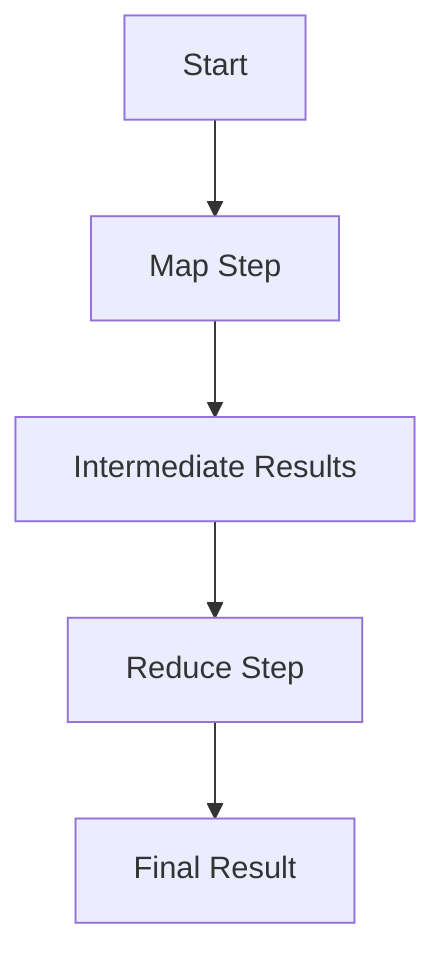

## 13.11 Patterns for Parallelism with Julia

Parallel computing is a powerful technique that allows us to perform multiple computations simultaneously, thereby speeding up the processing of large datasets and complex calculations. Julia, with its high-level syntax and low-level performance, is particularly well-suited for parallel computing. In this section, we will explore common parallel patterns in Julia, including MapReduce, Futures, and Promises, and discuss best practices for implementing parallelism effectively.

### Common Parallel Patterns

#### MapReduce

**Intent:** The MapReduce pattern is a two-step process used to handle large-scale data processing. The "Map" step involves applying a function to each element in a dataset, while the "Reduce" step aggregates the results.

**Key Participants:**
- **Mapper:** Applies a function to each element of the dataset.
- **Reducer:** Aggregates the results from the mapper.

**Applicability:** Use MapReduce when you need to process large datasets in parallel, such as in data analysis or machine learning tasks.

**Sample Code Snippet:**

```julia
using Distributed

addprocs(4)

@everywhere function map_function(x)
    return x^2
end

@everywhere function reduce_function(a, b)
    return a + b
end

function parallel_mapreduce(data)
    mapped = pmap(map_function, data)
    reduced = reduce(reduce_function, mapped)
    return reduced
end

data = 1:1000
result = parallel_mapreduce(data)
println("Result of MapReduce: $result")
```

**Design Considerations:** 
- **Data Partitioning:** Ensure data is partitioned efficiently across workers.
- **Load Balancing:** Distribute tasks evenly to avoid idle workers.

**Differences and Similarities:** MapReduce is often compared to the Fork/Join pattern, but MapReduce is more data-centric, focusing on transforming and aggregating data.

#### Futures and Promises

**Intent:** Futures and Promises are used to handle computations that will complete in the future, allowing for non-blocking execution.

**Key Participants:**
- **Future:** Represents a computation that may not have completed yet.
- **Promise:** A placeholder for a result that will be provided later.

**Applicability:** Use Futures and Promises when you need to perform asynchronous computations or when the result of a computation is not immediately needed.

**Sample Code Snippet:**

```julia
using Distributed

addprocs(4)

@everywhere function long_computation(x)
    sleep(2)  # Simulate a long computation
    return x * 2
end

future_result = @spawn long_computation(10)

println("Doing other work...")

result = fetch(future_result)
println("Result of future computation: $result")
```

**Design Considerations:**
- **Error Handling:** Ensure proper error handling for failed computations.
- **Resource Management:** Manage resources efficiently to avoid overloading the system.

**Differences and Similarities:** Futures and Promises are similar to callbacks but provide a more structured approach to handling asynchronous results.

### Best Practices

#### Immutable Data Structures

**Intent:** Use immutable data structures to prevent data corruption in parallel environments.

**Applicability:** Use immutable structures when sharing data between threads or processes to ensure thread safety.

**Sample Code Snippet:**

```julia
struct Point
    x::Float64
    y::Float64
end

p = Point(1.0, 2.0)

# p.x = 3.0  # Uncommenting this line will cause an error
```

**Design Considerations:**
- **Performance:** Immutable structures can lead to performance improvements due to reduced locking overhead.
- **Safety:** Ensure that all shared data is immutable to prevent race conditions.

#### Chunking Workloads

**Intent:** Break tasks into smaller pieces for distribution across multiple processors.

**Applicability:** Use chunking when dealing with large datasets or computations that can be divided into independent tasks.

**Sample Code Snippet:**

```julia
using Distributed

addprocs(4)

@everywhere function process_chunk(chunk)
    return sum(chunk)
end

data = 1:1000
chunks = [data[i:i+99] for i in 1:100:length(data)]

results = pmap(process_chunk, chunks)
total_sum = sum(results)
println("Total sum: $total_sum")
```

**Design Considerations:**
- **Granularity:** Choose the right chunk size to balance overhead and parallel efficiency.
- **Load Balancing:** Ensure chunks are distributed evenly to avoid bottlenecks.

### Tools and Libraries

#### ParallelDataTransfer.jl

**Description:** A library for efficient data transfer in parallel computations.

**Usage:** Use ParallelDataTransfer.jl to optimize data movement between processes, reducing communication overhead.

**Sample Code Snippet:**

```julia
using ParallelDataTransfer

# Transfer data between processes efficiently
```

#### Transducers.jl

**Description:** A library for composable algorithms that can be executed in parallel.

**Usage:** Use Transducers.jl to build complex data processing pipelines that can be parallelized.

**Sample Code Snippet:**

```julia
using Transducers

# Create a transducer pipeline and execute in parallel
```

### Visualizing Parallel Patterns

To better understand how parallel patterns work in Julia, let's visualize the MapReduce pattern using a flowchart.



**Description:** This flowchart illustrates the MapReduce pattern, where data is first mapped to intermediate results and then reduced to a final result.

### Knowledge Check

- **Question:** What is the primary benefit of using immutable data structures in parallel computing?
- **Answer:** They prevent data corruption and race conditions.

- **Question:** How does chunking workloads improve parallel efficiency?
- **Answer:** By breaking tasks into smaller pieces, it allows for better load balancing and reduced overhead.

### Try It Yourself

Experiment with the provided code examples by modifying the functions used in the MapReduce pattern or changing the chunk sizes in the chunking workloads example. Observe how these changes affect performance and results.

### Embrace the Journey

Remember, mastering parallelism in Julia is a journey. As you continue to explore and experiment with different patterns and techniques, you'll gain a deeper understanding of how to leverage Julia's capabilities for efficient parallel computing. Keep experimenting, stay curious, and enjoy the journey!

## Quiz Time!



### What is the primary purpose of the MapReduce pattern?

- [x] To process large datasets in parallel by mapping and reducing data.
- [ ] To handle asynchronous computations.
- [ ] To manage memory allocation.
- [ ] To optimize data serialization.

> **Explanation:** The MapReduce pattern is used to process large datasets by applying a function to each element (map) and aggregating the results (reduce).

### Which of the following is a key participant in the Futures and Promises pattern?

- [x] Future
- [ ] Mapper
- [ ] Reducer
- [ ] Chunk

> **Explanation:** Futures and Promises involve Futures, which represent computations that may not have completed yet.

### Why are immutable data structures recommended in parallel computing?

- [x] They prevent data corruption and race conditions.
- [ ] They improve serialization speed.
- [ ] They allow for dynamic typing.
- [ ] They reduce memory usage.

> **Explanation:** Immutable data structures are thread-safe and prevent data corruption in parallel environments.

### What is the role of the Reducer in the MapReduce pattern?

- [x] To aggregate results from the Mapper.
- [ ] To apply a function to each element.
- [ ] To handle asynchronous computations.
- [ ] To manage memory allocation.

> **Explanation:** The Reducer aggregates the results produced by the Mapper in the MapReduce pattern.

### How does chunking workloads benefit parallel computing?

- [x] By breaking tasks into smaller pieces for better load balancing.
- [ ] By increasing memory usage.
- [ ] By reducing the number of processors needed.
- [ ] By simplifying code readability.

> **Explanation:** Chunking workloads allows for better load balancing and reduced overhead in parallel computing.

### Which library is used for efficient data transfer in parallel computations?

- [x] ParallelDataTransfer.jl
- [ ] Transducers.jl
- [ ] DataFrames.jl
- [ ] Flux.jl

> **Explanation:** ParallelDataTransfer.jl is used to optimize data movement between processes in parallel computations.

### What is the primary benefit of using Transducers.jl?

- [x] To build composable algorithms that can be executed in parallel.
- [ ] To manage memory allocation.
- [ ] To handle asynchronous computations.
- [ ] To optimize data serialization.

> **Explanation:** Transducers.jl allows for building composable algorithms that can be parallelized.

### Which of the following is NOT a key participant in the MapReduce pattern?

- [x] Future
- [ ] Mapper
- [ ] Reducer
- [ ] Intermediate Results

> **Explanation:** Future is not a participant in the MapReduce pattern; it is part of the Futures and Promises pattern.

### What is the purpose of the Map step in the MapReduce pattern?

- [x] To apply a function to each element of the dataset.
- [ ] To aggregate results.
- [ ] To handle asynchronous computations.
- [ ] To manage memory allocation.

> **Explanation:** The Map step involves applying a function to each element of the dataset.

### True or False: Chunking workloads can lead to better load balancing in parallel computing.

- [x] True
- [ ] False

> **Explanation:** Chunking workloads allows tasks to be distributed more evenly, leading to better load balancing.


