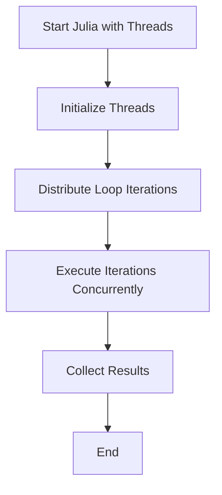

## 13.2 Multi-threading and Shared Memory Parallelism

As we delve into the world of parallel computing in Julia, understanding multi-threading and shared memory parallelism becomes crucial. Julia's design allows developers to harness the power of modern multi-core processors, enabling efficient execution of concurrent tasks. In this section, we will explore the concepts of multi-threading, how to enable it in Julia, and best practices for ensuring thread safety.

### Threads in Julia

Julia's multi-threading capabilities are built into its core, allowing developers to execute code concurrently across multiple CPU cores. This is particularly useful for computationally intensive tasks that can be divided into smaller, independent units of work.

#### Enabling Multi-threading

To take advantage of multi-threading in Julia, you need to start Julia with the appropriate number of threads. This can be done using the `-t` or `--threads` flag when launching Julia from the command line.

```bash
julia -t 4
```

Alternatively, you can set the `JULIA_NUM_THREADS` environment variable before starting Julia:

```bash
export JULIA_NUM_THREADS=4
julia
```

Once Julia is running with multiple threads, you can access the number of threads using the `Threads.nthreads()` function:

```julia
println("Number of threads: ", Threads.nthreads())
```

### The `Threads.@threads` Macro

One of the simplest ways to parallelize loops in Julia is by using the `Threads.@threads` macro. This macro distributes iterations of a loop across available threads, allowing for concurrent execution.

#### Parallel Loops

Consider a scenario where you want to perform a computation on each element of an array. Using the `Threads.@threads` macro, you can parallelize this operation as follows:

```julia
using Base.Threads

function parallel_sum(arr)
    sum = 0.0
    @threads for i in 1:length(arr)
        sum += arr[i]
    end
    return sum
end

arr = rand(1_000_000)
result = parallel_sum(arr)
println("Sum: ", result)
```

**Key Points:**
- The `@threads` macro automatically divides the loop iterations among the available threads.
- Each thread executes a portion of the loop concurrently, potentially leading to significant performance improvements.

### Race Conditions and Synchronization

While multi-threading can improve performance, it also introduces the risk of race conditions. A race condition occurs when multiple threads access shared data simultaneously, leading to unpredictable results.

#### Thread Safety

To ensure thread safety, you must manage concurrent access to shared data. Julia provides several mechanisms to handle synchronization:

1. **Atomic Operations**: Use atomic operations to perform thread-safe updates to shared variables.

   ```julia
   using Base.Threads

   function atomic_sum(arr)
       sum = Threads.Atomic{Float64}(0.0)
       @threads for i in 1:length(arr)
           Threads.atomic_add!(sum, arr[i])
       end
       return sum[]
   end

   arr = rand(1_000_000)
   result = atomic_sum(arr)
   println("Atomic Sum: ", result)
   ```

2. **Locks**: Use locks to control access to shared resources.

   ```julia
   lock = ReentrantLock()

   function locked_sum(arr)
       sum = 0.0
       @threads for i in 1:length(arr)
           lock(lock) do
               sum += arr[i]
           end
       end
       return sum
   end

   arr = rand(1_000_000)
   result = locked_sum(arr)
   println("Locked Sum: ", result)
   ```

**Key Points:**
- Atomic operations are efficient for simple updates but may not be suitable for complex operations.
- Locks provide more control but can introduce overhead and potential deadlocks if not used carefully.

### Best Practices

When working with multi-threading in Julia, adhering to best practices can help you avoid common pitfalls and ensure efficient, safe parallel execution.

#### Avoiding Global State

Minimize the use of global variables and shared mutable state. Instead, pass data explicitly to functions and use local variables within threads.

```julia
function safe_parallel_sum(arr)
    local_sum = Threads.Atomic{Float64}(0.0)
    @threads for i in 1:length(arr)
        Threads.atomic_add!(local_sum, arr[i])
    end
    return local_sum[]
end
```

#### Minimize Synchronization Overhead

While synchronization is necessary for thread safety, excessive use can negate the performance benefits of parallelism. Aim to minimize synchronization points and keep critical sections as short as possible.

#### Use Immutable Data Structures

Whenever possible, use immutable data structures. Immutable data structures can be safely shared between threads without the need for synchronization.

### Visualizing Multi-threading in Julia

To better understand how multi-threading works in Julia, let's visualize the process using a flowchart.



**Diagram Description:** This flowchart illustrates the process of multi-threading in Julia, from starting Julia with threads to executing loop iterations concurrently and collecting results.

### Try It Yourself

Experiment with the provided code examples by modifying the number of threads or the size of the array. Observe how these changes affect performance and explore different synchronization techniques.

### References and Links

- [Julia Documentation on Multi-threading](https://docs.julialang.org/en/v1/manual/multi-threading/)
- [MDN Web Docs on Parallel Computing](https://developer.mozilla.org/en-US/docs/Web/JavaScript/Guide/Parallelism_and_concurrency)
- [W3Schools on Thread Safety](https://www.w3schools.com/)

### Knowledge Check

- What is a race condition, and how can it be avoided in multi-threaded programs?
- How does the `Threads.@threads` macro help in parallelizing loops?
- What are the benefits and drawbacks of using locks for synchronization?

### Embrace the Journey

Remember, mastering multi-threading and shared memory parallelism in Julia is a journey. As you experiment and learn, you'll gain the skills needed to build high-performance applications. Keep exploring, stay curious, and enjoy the process!

## Quiz Time!



### What is the purpose of the `Threads.@threads` macro in Julia?

- [x] To parallelize loop iterations across multiple threads
- [ ] To create new threads
- [ ] To synchronize threads
- [ ] To manage memory allocation

> **Explanation:** The `Threads.@threads` macro is used to parallelize loop iterations across multiple threads, allowing for concurrent execution.

### How can you start Julia with a specific number of threads?

- [x] Use the `-t` or `--threads` flag
- [ ] Use the `-n` or `--nodes` flag
- [ ] Use the `-p` or `--processes` flag
- [ ] Use the `-m` or `--memory` flag

> **Explanation:** You can start Julia with a specific number of threads using the `-t` or `--threads` flag.

### What is a race condition?

- [x] A situation where multiple threads access shared data simultaneously, leading to unpredictable results
- [ ] A condition where threads are executed in a specific order
- [ ] A scenario where threads compete for CPU time
- [ ] A state where threads are waiting for each other

> **Explanation:** A race condition occurs when multiple threads access shared data simultaneously, leading to unpredictable results.

### Which of the following is a method to ensure thread safety?

- [x] Using atomic operations
- [ ] Using global variables
- [ ] Ignoring synchronization
- [ ] Increasing the number of threads

> **Explanation:** Using atomic operations is a method to ensure thread safety by performing thread-safe updates to shared variables.

### What is the role of locks in multi-threading?

- [x] To control access to shared resources
- [ ] To increase the number of threads
- [ ] To manage memory allocation
- [ ] To parallelize loops

> **Explanation:** Locks are used to control access to shared resources, ensuring that only one thread can access the resource at a time.

### Why should global state be avoided in multi-threaded programs?

- [x] To prevent conflicts and ensure thread safety
- [ ] To increase the number of threads
- [ ] To reduce memory usage
- [ ] To simplify code

> **Explanation:** Avoiding global state helps prevent conflicts and ensures thread safety by minimizing shared mutable state.

### What is the benefit of using immutable data structures in multi-threading?

- [x] They can be safely shared between threads without synchronization
- [ ] They reduce memory usage
- [ ] They increase the number of threads
- [ ] They simplify code

> **Explanation:** Immutable data structures can be safely shared between threads without the need for synchronization, reducing the risk of race conditions.

### What is the `JULIA_NUM_THREADS` environment variable used for?

- [x] To set the number of threads for Julia
- [ ] To set the number of processes for Julia
- [ ] To manage memory allocation for Julia
- [ ] To control the execution order of threads

> **Explanation:** The `JULIA_NUM_THREADS` environment variable is used to set the number of threads for Julia.

### What is the main drawback of using locks for synchronization?

- [x] They can introduce overhead and potential deadlocks
- [ ] They increase the number of threads
- [ ] They reduce memory usage
- [ ] They simplify code

> **Explanation:** Locks can introduce overhead and potential deadlocks if not used carefully, which can negate the performance benefits of parallelism.

### True or False: Multi-threading in Julia can only be used for numerical computations.

- [ ] True
- [x] False

> **Explanation:** False. Multi-threading in Julia can be used for a wide range of tasks, not just numerical computations.


