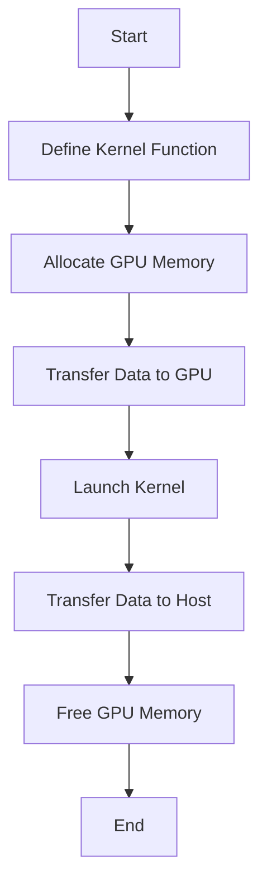

## 13.4 GPU Programming with CUDA.jl and AMDGPU.jl

As we delve into the world of high-performance computing, leveraging the power of Graphics Processing Units (GPUs) becomes essential. GPUs are designed to handle thousands of threads simultaneously, making them ideal for tasks that require massive parallelism. In this section, we'll explore how to harness the power of GPUs in Julia using CUDA.jl for NVIDIA hardware and AMDGPU.jl for AMD hardware. We'll cover the basics of GPU programming, kernel development, and practical use cases.

### Introduction to GPU Computing

#### Parallelism on GPUs

GPUs are specialized hardware designed to accelerate computations by executing many operations in parallel. Unlike CPUs, which have a few powerful cores optimized for sequential processing, GPUs consist of thousands of smaller, efficient cores that can handle multiple tasks simultaneously. This architecture makes them particularly well-suited for data-parallel tasks, such as matrix operations, image processing, and machine learning.

**Key Concepts:**

- **Massive Parallelism:** GPUs can execute thousands of threads concurrently, making them ideal for tasks that can be broken down into smaller, independent operations.
- **Memory Hierarchy:** Understanding the memory hierarchy (global, shared, and local memory) is crucial for optimizing GPU performance.
- **SIMD Architecture:** GPUs use Single Instruction, Multiple Data (SIMD) architecture to perform the same operation on multiple data points simultaneously.

### Using CUDA.jl

CUDA.jl is a Julia package that provides an interface to NVIDIA's CUDA platform, enabling developers to write GPU-accelerated code directly in Julia. It abstracts the complexities of CUDA programming while allowing fine-grained control over GPU resources.

#### Programming NVIDIA GPUs

To program NVIDIA GPUs with CUDA.jl, you need to understand the following concepts:

- **Kernel Functions:** These are functions executed on the GPU. They are defined using Julia syntax and can be launched with a specified number of threads and blocks.
- **Memory Management:** Efficiently managing memory between the host (CPU) and device (GPU) is crucial for performance. CUDA.jl provides functions to allocate, transfer, and free memory on the GPU.
- **Execution Configuration:** Specify the number of threads per block and the number of blocks per grid to optimize kernel execution.

**Example:**

```julia
using CUDA

function add_kernel(a, b, c)
    i = threadIdx().x + (blockIdx().x - 1) * blockDim().x
    c[i] = a[i] + b[i]
    return
end

N = 1024
a = CUDA.fill(1.0f0, N)
b = CUDA.fill(2.0f0, N)
c = CUDA.fill(0.0f0, N)

@cuda threads=256 blocks=div(N, 256) add_kernel(a, b, c)

println(c)
```

In this example, we define a simple kernel function `add_kernel` that adds two arrays element-wise. We allocate memory on the GPU using `CUDA.fill` and launch the kernel with `@cuda`, specifying the number of threads and blocks.

### Using AMDGPU.jl

AMDGPU.jl is a package for programming AMD GPUs in Julia. It provides similar capabilities to CUDA.jl but is tailored for AMD hardware. The syntax and concepts are analogous, making it easy to switch between NVIDIA and AMD platforms.

#### Programming AMD GPUs

AMDGPU.jl allows you to write kernel functions and manage memory on AMD GPUs. The process is similar to CUDA.jl, with some differences in syntax and execution configuration.

**Example:**

```julia
using AMDGPU

function add_kernel(a, b, c)
    i = threadIdx().x + (blockIdx().x - 1) * blockDim().x
    c[i] = a[i] + b[i]
    return
end

N = 1024
a = AMDGPU.fill(1.0f0, N)
b = AMDGPU.fill(2.0f0, N)
c = AMDGPU.fill(0.0f0, N)

@amdgpu threads=256 blocks=div(N, 256) add_kernel(a, b, c)

println(c)
```

The AMDGPU.jl example mirrors the CUDA.jl example, demonstrating the ease of transitioning between platforms.

### Kernel Programming

Kernel programming involves writing functions that run on the GPU. These functions are designed to be executed by multiple threads in parallel, each performing a small part of the overall computation.

#### Defining Kernels in Julia

In Julia, kernel functions are defined using regular Julia syntax. However, they must adhere to certain constraints, such as avoiding unsupported operations and ensuring that all data is accessible to the GPU.

**Key Considerations:**

- **Thread Indexing:** Use `threadIdx()` and `blockIdx()` to determine the thread's position within the grid.
- **Memory Access Patterns:** Optimize memory access patterns to minimize latency and maximize throughput.
- **Synchronization:** Use synchronization primitives to coordinate threads within a block.

### Use Cases

GPU programming is essential for applications that require high computational throughput. Here are some common use cases:

#### High-Performance Computing

GPUs are widely used in high-performance computing (HPC) to accelerate simulations, numerical computations, and data analysis. By offloading compute-intensive tasks to the GPU, we can achieve significant speedups.

**Example:**

- **Simulations:** Simulating physical systems, such as fluid dynamics or molecular interactions, can benefit from GPU acceleration.
- **Deep Learning:** Training deep neural networks involves large matrix operations that are well-suited for GPUs.

### Visualizing GPU Programming Workflow

To better understand the workflow of GPU programming in Julia, let's visualize the process using a flowchart.



**Description:** This flowchart illustrates the typical steps involved in GPU programming with CUDA.jl and AMDGPU.jl, from defining the kernel function to freeing GPU memory.

### Try It Yourself

Experiment with the provided code examples by modifying the kernel function to perform different operations, such as multiplication or subtraction. Try changing the number of threads and blocks to see how it affects performance.

### References and Links

- [CUDA.jl Documentation](https://juliagpu.github.io/CUDA.jl/stable/)
- [AMDGPU.jl Documentation](https://github.com/JuliaGPU/AMDGPU.jl)
- [NVIDIA CUDA Toolkit](https://developer.nvidia.com/cuda-toolkit)
- [AMD ROCm Platform](https://rocmdocs.amd.com/en/latest/)

### Knowledge Check

- What are the key differences between CPU and GPU architectures?
- How does memory management differ between CUDA.jl and AMDGPU.jl?
- What are some common use cases for GPU programming?

### Embrace the Journey

Remember, mastering GPU programming takes time and practice. As you experiment with different kernels and configurations, you'll gain a deeper understanding of how to optimize your code for maximum performance. Keep exploring, stay curious, and enjoy the journey!

## Quiz Time!



### What is the primary advantage of using GPUs for computation?

- [x] Massive parallelism
- [ ] Sequential processing
- [ ] Low power consumption
- [ ] High clock speed

> **Explanation:** GPUs are designed for massive parallelism, allowing them to execute thousands of threads simultaneously.

### Which Julia package is used for programming NVIDIA GPUs?

- [x] CUDA.jl
- [ ] AMDGPU.jl
- [ ] OpenCL.jl
- [ ] Metal.jl

> **Explanation:** CUDA.jl is the Julia package used for programming NVIDIA GPUs.

### What function is used to define a kernel in CUDA.jl?

- [x] @cuda
- [ ] @kernel
- [ ] @gpu
- [ ] @parallel

> **Explanation:** The `@cuda` macro is used to launch kernel functions in CUDA.jl.

### How do you specify the number of threads in a CUDA.jl kernel launch?

- [x] Using the `threads` keyword
- [ ] Using the `blocks` keyword
- [ ] Using the `cores` keyword
- [ ] Using the `parallel` keyword

> **Explanation:** The `threads` keyword is used to specify the number of threads per block in a CUDA.jl kernel launch.

### What is the purpose of the `threadIdx()` function in kernel programming?

- [x] To determine the thread's position within the block
- [ ] To allocate memory on the GPU
- [ ] To synchronize threads
- [ ] To launch the kernel

> **Explanation:** The `threadIdx()` function is used to determine the thread's position within the block.

### Which of the following is a common use case for GPU programming?

- [x] Deep learning
- [ ] Word processing
- [ ] Web browsing
- [ ] Email management

> **Explanation:** Deep learning is a common use case for GPU programming due to its computational intensity.

### What is the main difference between CUDA.jl and AMDGPU.jl?

- [x] CUDA.jl is for NVIDIA GPUs, while AMDGPU.jl is for AMD GPUs
- [ ] CUDA.jl is for AMD GPUs, while AMDGPU.jl is for NVIDIA GPUs
- [ ] CUDA.jl is for CPUs, while AMDGPU.jl is for GPUs
- [ ] CUDA.jl is for Intel GPUs, while AMDGPU.jl is for ARM GPUs

> **Explanation:** CUDA.jl is designed for NVIDIA GPUs, whereas AMDGPU.jl is tailored for AMD GPUs.

### What is the role of memory management in GPU programming?

- [x] To efficiently transfer data between host and device
- [ ] To execute kernel functions
- [ ] To determine thread positions
- [ ] To launch kernels

> **Explanation:** Memory management involves efficiently transferring data between the host (CPU) and device (GPU).

### Which architecture do GPUs use to perform operations on multiple data points simultaneously?

- [x] SIMD (Single Instruction, Multiple Data)
- [ ] MIMD (Multiple Instruction, Multiple Data)
- [ ] SISD (Single Instruction, Single Data)
- [ ] MISD (Multiple Instruction, Single Data)

> **Explanation:** GPUs use SIMD architecture to perform the same operation on multiple data points simultaneously.

### True or False: Kernel functions in Julia can use unsupported operations on the GPU.

- [ ] True
- [x] False

> **Explanation:** Kernel functions must adhere to certain constraints and cannot use unsupported operations on the GPU.


