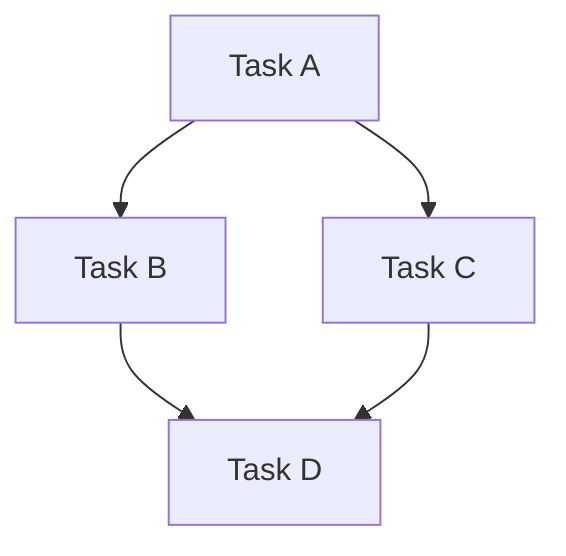
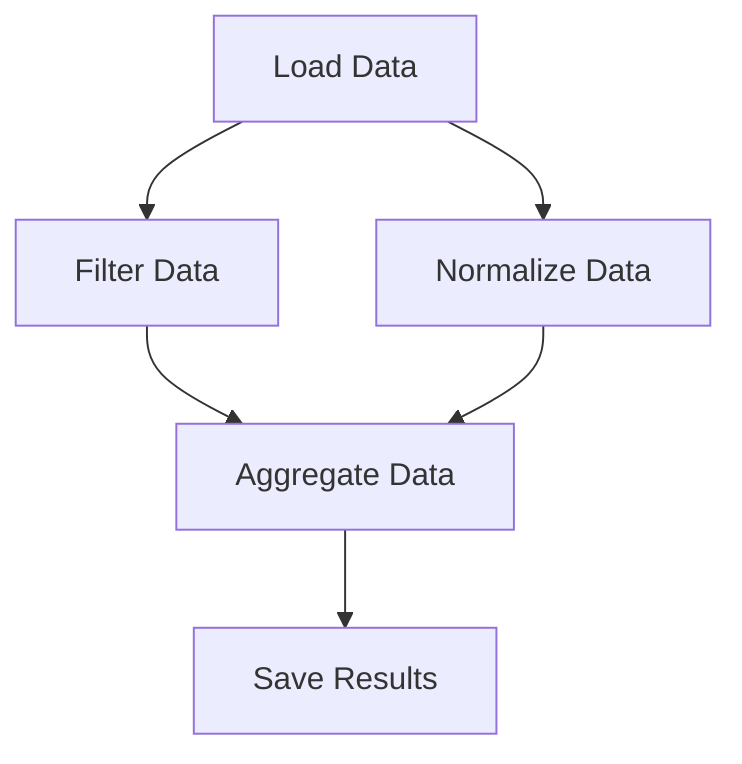

## 13.5 High-Level Parallelism with Dagger.jl

As we delve into the world of parallel computing in Julia, one of the most powerful tools at our disposal is Dagger.jl. This library allows us to harness high-level parallelism through task-based computing, making it possible to efficiently manage complex workflows and computations. In this section, we'll explore how Dagger.jl leverages Directed Acyclic Graphs (DAGs) to model computations, define tasks and dependencies, and cache results for optimal performance.

### Task-Based Parallelism

Task-based parallelism is a paradigm where computations are broken down into discrete tasks that can be executed concurrently. This approach is particularly effective in scenarios where tasks have varying execution times and dependencies. By organizing computations into tasks, we can achieve better load balancing and resource utilization.

#### Directed Acyclic Graphs (DAGs)

A Directed Acyclic Graph (DAG) is a graph structure that consists of nodes and directed edges, where each node represents a task, and edges denote dependencies between tasks. The acyclic nature of DAGs ensures that there are no cycles, meaning that tasks can be executed in a sequence that respects their dependencies.

**Diagram: Visualizing a DAG for Task-Based Parallelism**



*Caption: A simple DAG representing tasks and their dependencies.*

In the diagram above, Task A must be completed before Tasks B and C can begin. Task D depends on the completion of both Tasks B and C. This structure allows for parallel execution of Tasks B and C once Task A is complete.

### Dagger Workflow

Dagger.jl provides a framework for defining and executing tasks in a DAG. Let's explore the key components of a typical Dagger workflow.

#### Defining Tasks and Dependencies

In Dagger.jl, tasks are defined as functions that can take inputs and produce outputs. Dependencies between tasks are specified by passing the output of one task as the input to another. This creates a natural flow of data through the DAG.

**Code Example: Defining Tasks in Dagger.jl**

```julia
using Dagger

task_a = Dagger.@spawn begin
    println("Executing Task A")
    return 42
end

task_b = Dagger.@spawn begin
    a_result = fetch(task_a)
    println("Executing Task B with result from Task A: $a_result")
    return a_result * 2
end

result = fetch(task_b)
println("Final result: $result")
```

*In this example, Task B depends on the result of Task A. The `@spawn` macro is used to define tasks, and `fetch` is used to retrieve the result of a task.*

#### Data Persistence

One of the key features of Dagger.jl is its ability to cache intermediate results. This means that if a task's output is needed multiple times, it can be reused without recomputation, saving time and computational resources.

**Caching Results**

Caching is particularly useful in scenarios where tasks are expensive to compute or when the same data is used across multiple tasks. Dagger.jl automatically manages caching, ensuring that results are stored and retrieved efficiently.

### Use Cases and Examples

Dagger.jl is well-suited for a variety of applications, from data processing pipelines to scientific simulations. Let's explore some common use cases.

#### Pipeline Processing

In data processing workflows, data often needs to be transformed through a series of steps. Dagger.jl can model these workflows as DAGs, allowing for parallel execution of independent steps.

**Code Example: Data Processing Pipeline**

```julia
using Dagger

task_load = Dagger.@spawn begin
    println("Loading data")
    return [1, 2, 3, 4, 5]
end

task_transform = Dagger.@spawn begin
    data = fetch(task_load)
    println("Transforming data")
    return map(x -> x * 2, data)
end

task_save = Dagger.@spawn begin
    transformed_data = fetch(task_transform)
    println("Saving data: $transformed_data")
    return "Data saved successfully"
end

final_status = fetch(task_save)
println(final_status)
```

*This example demonstrates a simple data processing pipeline with tasks for loading, transforming, and saving data.*

### Try It Yourself

To deepen your understanding of Dagger.jl, try modifying the code examples above. Experiment with adding more tasks, changing dependencies, or introducing new data transformations. Observe how Dagger.jl manages task execution and caching.

### Visualizing Dagger.jl Workflows

To better understand how Dagger.jl manages task execution, let's visualize a more complex DAG.

**Diagram: Complex DAG for Data Processing Workflow**



*Caption: A complex DAG representing a data processing workflow with multiple tasks and dependencies.*

### References and Links

For further reading on Dagger.jl and parallel computing in Julia, consider exploring the following resources:

- [Dagger.jl Documentation](https://juliaparallel.github.io/Dagger.jl/stable/)
- [JuliaLang Parallel Computing](https://docs.julialang.org/en/v1/manual/parallel-computing/)
- [Understanding DAGs](https://en.wikipedia.org/wiki/Directed_acyclic_graph)

### Knowledge Check

To reinforce your understanding of high-level parallelism with Dagger.jl, consider the following questions:

1. What is a Directed Acyclic Graph (DAG), and why is it important in task-based parallelism?
2. How does Dagger.jl manage task dependencies and execution?
3. What are the benefits of caching intermediate results in Dagger.jl?
4. How can you visualize a DAG to better understand task dependencies?

### Embrace the Journey

As you explore high-level parallelism with Dagger.jl, remember that this is just the beginning. The power of task-based parallelism lies in its flexibility and scalability. Keep experimenting, stay curious, and enjoy the journey of mastering parallel computing in Julia!

## Quiz Time!



### What is the primary structure used by Dagger.jl to model computations?

- [x] Directed Acyclic Graph (DAG)
- [ ] Binary Tree
- [ ] Linked List
- [ ] Hash Table

> **Explanation:** Dagger.jl uses Directed Acyclic Graphs (DAGs) to model computations and manage task dependencies.

### Which macro is used in Dagger.jl to define tasks?

- [x] `@spawn`
- [ ] `@parallel`
- [ ] `@async`
- [ ] `@task`

> **Explanation:** The `@spawn` macro is used in Dagger.jl to define tasks that can be executed in parallel.

### What is the purpose of caching results in Dagger.jl?

- [x] To avoid recomputation of intermediate results
- [ ] To increase memory usage
- [ ] To slow down execution
- [ ] To create more tasks

> **Explanation:** Caching results in Dagger.jl helps avoid recomputation of intermediate results, saving time and resources.

### How are task dependencies specified in Dagger.jl?

- [x] By passing the output of one task as the input to another
- [ ] By using global variables
- [ ] By defining tasks in a sequence
- [ ] By using a configuration file

> **Explanation:** Task dependencies in Dagger.jl are specified by passing the output of one task as the input to another, creating a flow of data.

### What is a common use case for Dagger.jl?

- [x] Data processing pipelines
- [ ] Web development
- [ ] Game design
- [ ] Text editing

> **Explanation:** Dagger.jl is commonly used for data processing pipelines, where tasks can be executed in parallel.

### What does the `fetch` function do in Dagger.jl?

- [x] Retrieves the result of a task
- [ ] Defines a new task
- [ ] Deletes a task
- [ ] Modifies a task

> **Explanation:** The `fetch` function in Dagger.jl is used to retrieve the result of a task once it has been executed.

### Which of the following is NOT a feature of Dagger.jl?

- [ ] Task-based parallelism
- [ ] Caching intermediate results
- [x] Real-time graphics rendering
- [ ] DAG-based computation modeling

> **Explanation:** Real-time graphics rendering is not a feature of Dagger.jl, which focuses on task-based parallelism and DAG-based computation modeling.

### What is the benefit of using DAGs in parallel computing?

- [x] Efficient scheduling of tasks
- [ ] Increased complexity
- [ ] Reduced performance
- [ ] Simplified code

> **Explanation:** DAGs allow for efficient scheduling of tasks by respecting dependencies and enabling parallel execution.

### Can Dagger.jl be used for scientific simulations?

- [x] True
- [ ] False

> **Explanation:** Dagger.jl can be used for scientific simulations, as it supports complex workflows and parallel execution.

### What is the role of the `@spawn` macro in Dagger.jl?

- [x] To define tasks for parallel execution
- [ ] To serialize data
- [ ] To manage memory
- [ ] To handle exceptions

> **Explanation:** The `@spawn` macro in Dagger.jl is used to define tasks that can be executed in parallel, enabling task-based parallelism.




