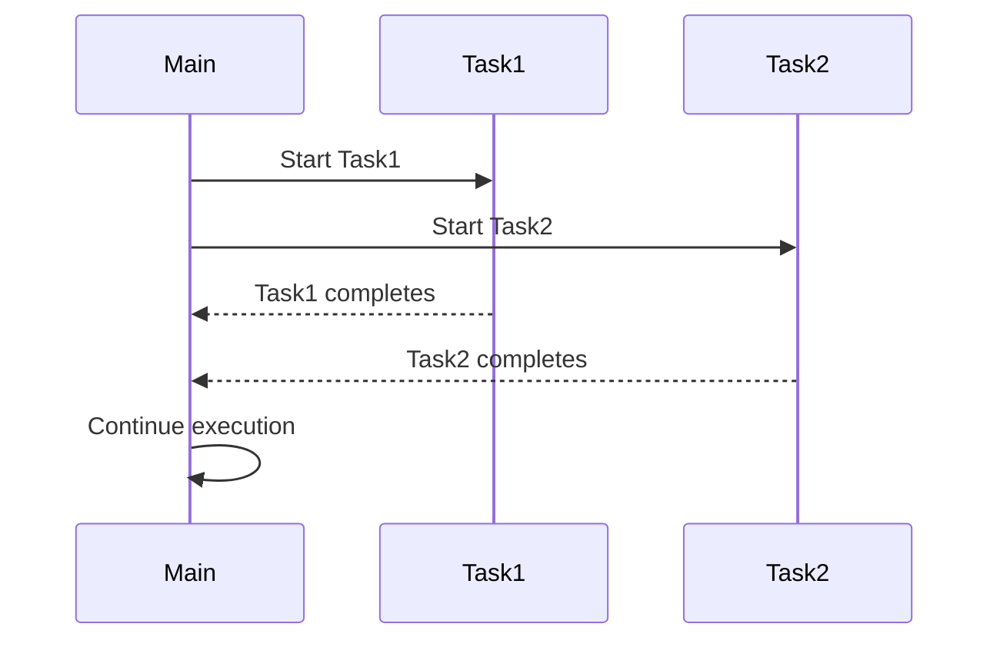

## 13.6 Asynchronous Programming and Task-Based Parallelism

Asynchronous programming and task-based parallelism are powerful paradigms that enable developers to write efficient and responsive applications. In Julia, these paradigms are supported through constructs like tasks, coroutines, and non-blocking I/O operations. This section will guide you through the concepts and practical applications of asynchronous programming in Julia, helping you build applications that can handle multiple tasks concurrently without blocking the main execution flow.

### Understanding Tasks and Coroutines

In Julia, tasks (also known as coroutines) are units of work that can be executed concurrently. They allow you to write code that can pause and resume execution, making it possible to handle multiple operations simultaneously. This is particularly useful in scenarios where you need to perform I/O operations, wait for external resources, or manage multiple connections.

#### The `@async` and `@await` Macros

The `@async` macro in Julia is used to create a task that runs concurrently with other tasks. When you use `@async`, the task is scheduled to run in the background, allowing the main program to continue executing without waiting for the task to complete.

```julia
function fetch_data(url)
    println("Fetching data from $url")
    # Simulate a network request with sleep
    sleep(2)
    println("Data fetched from $url")
end

@async fetch_data("http://example.com")
println("Main program continues to run")
```

In this example, the `fetch_data` function is executed asynchronously, allowing the main program to continue running without waiting for the data fetching to complete.

The `@await` macro is used to wait for an asynchronous task to complete. It pauses the execution of the current task until the awaited task finishes.

```julia
task = @async fetch_data("http://example.com")
println("Waiting for data...")
@await task
println("Data fetching complete")
```

Here, the `@await` macro ensures that the program waits for the `fetch_data` task to complete before proceeding.

### Asynchronous I/O

Asynchronous I/O operations are crucial for building responsive applications that interact with external systems, such as file systems, databases, or network services. In Julia, you can perform non-blocking I/O operations using tasks and asynchronous constructs.

#### Non-blocking I/O Operations

Non-blocking I/O allows your program to initiate an I/O operation and continue executing other tasks while waiting for the operation to complete. This is particularly useful in scenarios where I/O operations can take a significant amount of time, such as reading from a network socket or writing to a file.

```julia
function read_file_async(filename)
    println("Starting to read $filename")
    # Simulate file reading with sleep
    sleep(3)
    println("Finished reading $filename")
end

@async read_file_async("data.txt")
println("Main program continues to run")
```

In this example, the `read_file_async` function simulates a file reading operation. By running it asynchronously, the main program can continue executing without waiting for the file reading to complete.

### Use Cases for Asynchronous Programming

Asynchronous programming is widely used in various applications, including web servers, event loops, and real-time data processing systems. Let's explore some common use cases where asynchronous programming can significantly enhance performance and responsiveness.

#### Web Servers and Event Loops

Web servers often need to handle multiple client connections simultaneously. Asynchronous programming allows a server to manage multiple requests without blocking, improving throughput and responsiveness.

```julia
using Sockets

function handle_client(client)
    println("Handling client connection")
    # Simulate processing with sleep
    sleep(1)
    println("Finished handling client")
    close(client)
end

server = listen(8080)
println("Server listening on port 8080")

while true
    client = accept(server)
    @async handle_client(client)
end
```

In this example, a simple web server listens for client connections on port 8080. Each client connection is handled asynchronously, allowing the server to accept new connections while processing existing ones.

### Visualizing Asynchronous Programming

To better understand the flow of asynchronous programming, let's visualize the process using a sequence diagram. This diagram illustrates the interaction between tasks and the main program flow.



**Diagram Description:** This sequence diagram shows how the main program starts two tasks (`Task1` and `Task2`) concurrently. The tasks run independently, and the main program continues executing without waiting for the tasks to complete. Once the tasks finish, they notify the main program, which then continues its execution.

### Try It Yourself

Experiment with the code examples provided in this section. Try modifying the `fetch_data` and `read_file_async` functions to simulate different I/O operations or add more tasks to see how they interact. Consider implementing a simple web server that handles multiple client connections using asynchronous programming.

### Knowledge Check

- Explain the difference between `@async` and `@await` in Julia.
- Describe a scenario where non-blocking I/O would be beneficial.
- What are some common use cases for asynchronous programming?

### Key Takeaways

- Asynchronous programming allows you to run tasks concurrently without blocking the main program flow.
- The `@async` macro is used to create tasks that run in the background, while `@await` waits for their completion.
- Non-blocking I/O operations enable your program to perform I/O tasks without halting execution.
- Asynchronous programming is essential for building responsive applications, such as web servers and event-driven systems.

### Embrace the Journey

Remember, mastering asynchronous programming and task-based parallelism is a journey. As you continue to explore these concepts, you'll gain the skills needed to build efficient and responsive applications. Keep experimenting, stay curious, and enjoy the process of learning and discovery!

## Quiz Time!



### What is the primary purpose of the `@async` macro in Julia?

- [x] To create a task that runs concurrently with other tasks
- [ ] To block the main program until a task completes
- [ ] To handle errors in asynchronous tasks
- [ ] To optimize memory usage

> **Explanation:** The `@async` macro is used to create a task that runs concurrently with other tasks, allowing the main program to continue executing without waiting for the task to complete.

### How does the `@await` macro function in Julia?

- [x] It pauses the execution of the current task until the awaited task finishes
- [ ] It starts a new task in the background
- [ ] It cancels an asynchronous task
- [ ] It logs the completion of a task

> **Explanation:** The `@await` macro is used to pause the execution of the current task until the awaited task finishes, ensuring that the program waits for the task to complete before proceeding.

### Which of the following is a benefit of non-blocking I/O operations?

- [x] They allow the program to continue executing other tasks while waiting for I/O operations to complete
- [ ] They increase the memory usage of the program
- [ ] They simplify error handling in I/O operations
- [ ] They reduce the need for asynchronous programming

> **Explanation:** Non-blocking I/O operations allow the program to continue executing other tasks while waiting for I/O operations to complete, improving responsiveness and efficiency.

### In which scenario would asynchronous programming be particularly useful?

- [x] Handling multiple client connections in a web server
- [ ] Performing a single, long-running computation
- [ ] Writing a simple script with no external dependencies
- [ ] Debugging a small program

> **Explanation:** Asynchronous programming is particularly useful in scenarios where multiple tasks need to be handled concurrently, such as managing multiple client connections in a web server.

### What is a task in the context of Julia's asynchronous programming?

- [x] A unit of work that can be executed concurrently
- [ ] A function that blocks the main program
- [ ] A data structure for storing I/O operations
- [ ] A method for optimizing memory usage

> **Explanation:** In Julia's asynchronous programming, a task is a unit of work that can be executed concurrently, allowing multiple operations to be handled simultaneously.

### Which macro would you use to wait for an asynchronous task to complete?

- [x] @await
- [ ] @async
- [ ] @task
- [ ] @complete

> **Explanation:** The `@await` macro is used to wait for an asynchronous task to complete, pausing the execution of the current task until the awaited task finishes.

### What is the role of coroutines in Julia's asynchronous programming?

- [x] They allow code to pause and resume execution, enabling concurrent task management
- [ ] They optimize memory usage in asynchronous tasks
- [ ] They handle errors in non-blocking I/O operations
- [ ] They simplify the syntax of asynchronous programming

> **Explanation:** Coroutines in Julia's asynchronous programming allow code to pause and resume execution, enabling concurrent task management and efficient handling of multiple operations.

### How can asynchronous programming improve the performance of a web server?

- [x] By allowing the server to handle multiple requests without blocking
- [ ] By reducing the memory usage of the server
- [ ] By simplifying the server's code structure
- [ ] By eliminating the need for error handling

> **Explanation:** Asynchronous programming can improve the performance of a web server by allowing it to handle multiple requests without blocking, increasing throughput and responsiveness.

### What is the main advantage of using tasks in Julia?

- [x] They enable concurrent execution of multiple operations
- [ ] They simplify the syntax of Julia programs
- [ ] They reduce the need for error handling
- [ ] They optimize memory usage

> **Explanation:** The main advantage of using tasks in Julia is that they enable concurrent execution of multiple operations, allowing for efficient and responsive application design.

### True or False: Non-blocking I/O operations halt the main program flow until the I/O task is complete.

- [ ] True
- [x] False

> **Explanation:** False. Non-blocking I/O operations do not halt the main program flow; instead, they allow the program to continue executing other tasks while waiting for the I/O operation to complete.


