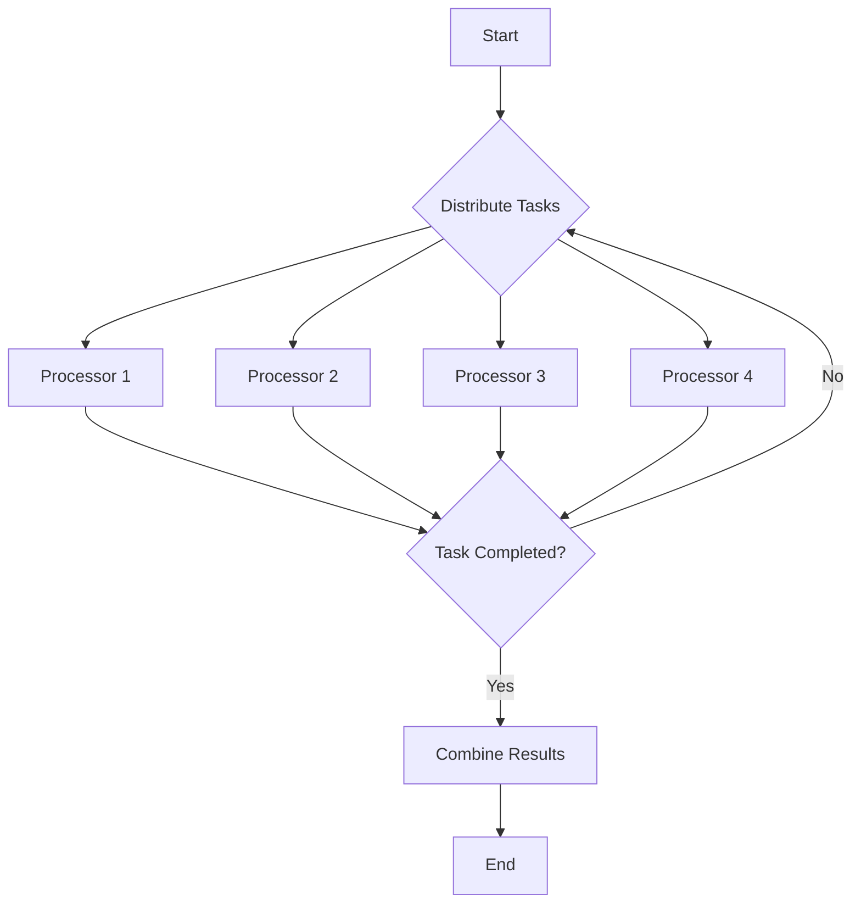

## 13.7 Performance Considerations in Parallel Algorithms

Parallel computing is a powerful tool in modern software development, allowing us to solve complex problems more efficiently by dividing tasks across multiple processors. However, achieving optimal performance in parallel algorithms requires careful consideration of several factors. In this section, we'll explore the key performance considerations in parallel algorithms, focusing on the overhead of parallelism, load balancing, and benchmarking techniques. We'll also provide practical examples and visualizations to enhance your understanding.

### Overhead of Parallelism

Parallelism introduces overhead that can impact the overall performance of an algorithm. Understanding and minimizing this overhead is crucial for achieving efficient parallel execution.

#### Cost of Communication

Communication between processors is a significant source of overhead in parallel computing. When tasks are distributed across multiple processors, they often need to exchange data. This communication can be costly in terms of time and resources.

- **Balancing Computation with Communication**: The goal is to maximize computation while minimizing communication. This involves designing algorithms that require minimal data exchange between processors. For example, consider a matrix multiplication task. Instead of exchanging entire rows or columns, we can partition the matrix into smaller blocks that can be processed independently.

```julia
using Distributed

function block_multiply(A, B, block_size)
    n = size(A, 1)
    C = zeros(n, n)
    @distributed for i in 1:block_size:n
        for j in 1:block_size:n
            for k in 1:block_size:n
                C[i:i+block_size-1, j:j+block_size-1] += A[i:i+block_size-1, k:k+block_size-1] * B[k:k+block_size-1, j:j+block_size-1]
            end
        end
    end
    return C
end

A = rand(1000, 1000)
B = rand(1000, 1000)
block_size = 100
C = block_multiply(A, B, block_size)
```

In this example, we use block matrix multiplication to reduce communication overhead by processing smaller blocks independently.

#### Load Balancing

Load balancing ensures that all processors have an equal amount of work, preventing some from idling while others are overloaded. Effective load balancing is crucial for maximizing the utilization of available resources.

- **Distributing Work Evenly**: One approach to load balancing is to divide the workload into smaller tasks and distribute them dynamically. This allows processors to request new tasks as they complete their current ones, ensuring that all processors remain busy.

```julia
using Distributed

function parallel_sum(arr)
    n = length(arr)
    sum_result = @distributed (+) for i in 1:n
        arr[i]
    end
    return sum_result
end

arr = rand(1_000_000)
total_sum = parallel_sum(arr)
```

In this example, we use the `@distributed` macro to dynamically distribute the summation task across available processors, ensuring balanced workload distribution.

### Benchmarking Parallel Code

Benchmarking is essential for evaluating the performance of parallel algorithms. It involves measuring the speedup and efficiency of parallel execution compared to serial execution.

#### Measuring Speedup and Efficiency

- **Speedup**: Speedup is the ratio of the time taken to execute a task serially to the time taken to execute it in parallel. It indicates how much faster the parallel version is compared to the serial version.

- **Efficiency**: Efficiency is the ratio of speedup to the number of processors used. It measures how effectively the parallel algorithm utilizes the available processors.

```julia
using BenchmarkTools

function benchmark_parallel_serial(arr)
    serial_time = @belapsed sum($arr)
    parallel_time = @belapsed parallel_sum($arr)
    speedup = serial_time / parallel_time
    efficiency = speedup / nprocs()
    return (serial_time, parallel_time, speedup, efficiency)
end

arr = rand(1_000_000)
results = benchmark_parallel_serial(arr)
println("Serial Time: $(results[1])")
println("Parallel Time: $(results[2])")
println("Speedup: $(results[3])")
println("Efficiency: $(results[4])")
```

This example demonstrates how to benchmark the performance of a parallel summation task, calculating speedup and efficiency.

### Visualizing Parallel Algorithm Performance

Visualizations can help us understand the performance characteristics of parallel algorithms. Let's use a flowchart to illustrate the process of parallel execution with load balancing.



**Figure 1: Parallel Execution with Load Balancing**

In this flowchart, tasks are distributed to processors, which execute them in parallel. Once a processor completes a task, it requests a new one, ensuring balanced workload distribution. The results are then combined to produce the final output.

### Try It Yourself

Experiment with the code examples provided in this section. Try modifying the block size in the block matrix multiplication example to see how it affects performance. You can also experiment with different array sizes in the parallel summation example to observe changes in speedup and efficiency.

### References and Further Reading

- [Julia Documentation on Parallel Computing](https://docs.julialang.org/en/v1/manual/parallel-computing/)
- [Parallel Computing in Julia: A Comprehensive Guide](https://julialang.org/blog/2019/07/multithreading/)
- [BenchmarkTools.jl Documentation](https://github.com/JuliaCI/BenchmarkTools.jl)

### Knowledge Check

1. What is the primary goal of load balancing in parallel algorithms?
2. How does communication overhead affect the performance of parallel algorithms?
3. What is the difference between speedup and efficiency in benchmarking parallel code?

### Embrace the Journey

Remember, mastering parallel algorithms is a journey. As you experiment with different techniques and optimizations, you'll gain a deeper understanding of how to harness the power of parallel computing in Julia. Keep exploring, stay curious, and enjoy the process!

## Quiz Time!



### What is the primary goal of load balancing in parallel algorithms?

- [x] To ensure all processors have an equal amount of work
- [ ] To minimize memory usage
- [ ] To increase the number of processors used
- [ ] To reduce code complexity

> **Explanation:** Load balancing ensures that all processors have an equal amount of work, preventing some from idling while others are overloaded.

### How does communication overhead affect parallel algorithms?

- [x] It can increase the time and resources required for execution
- [ ] It reduces the number of processors needed
- [ ] It simplifies the algorithm design
- [ ] It eliminates the need for load balancing

> **Explanation:** Communication overhead can increase the time and resources required for execution, impacting the overall performance of parallel algorithms.

### What is speedup in the context of parallel algorithms?

- [x] The ratio of serial execution time to parallel execution time
- [ ] The number of processors used
- [ ] The amount of memory saved
- [ ] The complexity of the algorithm

> **Explanation:** Speedup is the ratio of the time taken to execute a task serially to the time taken to execute it in parallel.

### What does efficiency measure in parallel algorithms?

- [x] How effectively the parallel algorithm utilizes the available processors
- [ ] The total execution time
- [ ] The amount of data processed
- [ ] The complexity of the algorithm

> **Explanation:** Efficiency measures how effectively the parallel algorithm utilizes the available processors, calculated as the ratio of speedup to the number of processors used.

### What is a common technique to reduce communication overhead?

- [x] Partitioning data into smaller blocks
- [ ] Increasing the number of processors
- [ ] Using more memory
- [ ] Simplifying the algorithm

> **Explanation:** Partitioning data into smaller blocks allows for independent processing, reducing the need for communication between processors.

### Why is benchmarking important in parallel algorithms?

- [x] To evaluate the performance and identify bottlenecks
- [ ] To increase the number of processors used
- [ ] To reduce memory usage
- [ ] To simplify the algorithm design

> **Explanation:** Benchmarking is important to evaluate the performance of parallel algorithms and identify any bottlenecks that may exist.

### What is the role of the `@distributed` macro in Julia?

- [x] To distribute tasks dynamically across available processors
- [ ] To increase memory usage
- [ ] To simplify algorithm design
- [ ] To reduce the number of processors used

> **Explanation:** The `@distributed` macro in Julia is used to dynamically distribute tasks across available processors, ensuring balanced workload distribution.

### How can load balancing be achieved in parallel algorithms?

- [x] By dividing the workload into smaller tasks and distributing them dynamically
- [ ] By increasing the number of processors
- [ ] By using more memory
- [ ] By simplifying the algorithm

> **Explanation:** Load balancing can be achieved by dividing the workload into smaller tasks and distributing them dynamically, allowing processors to request new tasks as they complete their current ones.

### What is the impact of poor load balancing on parallel algorithms?

- [x] Some processors may idle while others are overloaded
- [ ] The algorithm becomes more complex
- [ ] Memory usage increases
- [ ] The number of processors needed decreases

> **Explanation:** Poor load balancing can result in some processors idling while others are overloaded, reducing the overall efficiency of the parallel algorithm.

### True or False: Communication overhead is negligible in parallel algorithms.

- [ ] True
- [x] False

> **Explanation:** Communication overhead is not negligible in parallel algorithms and can significantly impact performance if not managed properly.


