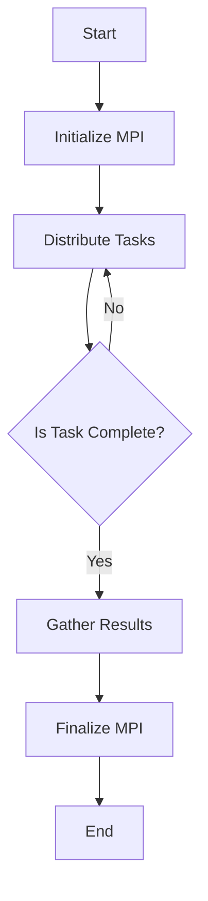

## 13.8 Cluster Computing and High-Performance Computing (HPC)

In the realm of computational science and engineering, Cluster Computing and High-Performance Computing (HPC) are pivotal for solving complex problems that require significant computational power. Julia, with its high-level syntax and performance close to that of C, is an excellent choice for HPC applications. In this section, we will explore how to leverage Julia for cluster computing and HPC, focusing on tools like MPI.jl and ClusterManagers.jl, job submission techniques, and optimization strategies for HPC environments.

### Running Julia on Clusters

Running Julia on clusters involves distributing tasks across multiple nodes to perform computations in parallel. This is essential for handling large datasets and complex simulations efficiently.

#### MPI.jl: Message Passing Interface

MPI.jl is a Julia package that provides an interface to the Message Passing Interface (MPI), a standardized and portable message-passing system designed to function on a wide variety of parallel computing architectures. MPI is crucial for communication between nodes in a cluster.

**Key Features of MPI.jl:**

- **Point-to-Point Communication:** Send and receive messages between processes.
- **Collective Communication:** Broadcast, scatter, gather, and reduce operations across processes.
- **Synchronization:** Barrier synchronization to coordinate processes.

**Sample Code Snippet:**

```julia
using MPI

MPI.Init()

comm = MPI.COMM_WORLD
rank = MPI.Comm_rank(comm)
size = MPI.Comm_size(comm)

println("Hello from process $rank out of $size")

MPI.Barrier(comm)
MPI.Finalize()
```

**Explanation:**

- **MPI.Init()** initializes the MPI environment.
- **MPI.Comm_rank** and **MPI.Comm_size** retrieve the rank of the process and the total number of processes, respectively.
- **MPI.Barrier** ensures all processes reach this point before proceeding.
- **MPI.Finalize()** cleans up the MPI environment.

#### ClusterManagers.jl: Managing Resources on HPC Systems

ClusterManagers.jl is a package that facilitates the management of resources on HPC systems. It provides interfaces to various cluster management systems, allowing you to launch and manage Julia processes on a cluster.

**Key Features of ClusterManagers.jl:**

- **Integration with Slurm, PBS, and other job schedulers.**
- **Dynamic process management.**
- **Support for heterogeneous clusters.**

**Sample Code Snippet:**

```julia
using Distributed
using ClusterManagers

addprocs(SlurmManager(4), partition="compute", time="00:30:00")

@everywhere println("Running on process $(myid())")
```

**Explanation:**

- **addprocs(SlurmManager(4))** adds 4 worker processes using Slurm.
- **@everywhere** macro ensures the code runs on all worker processes.

### Job Submission

Submitting jobs to a cluster involves using a job scheduler to manage the execution of tasks. Common job schedulers include Slurm and PBS.

#### Using Slurm

Slurm is a popular open-source job scheduler for Linux clusters. It manages job queues and allocates resources to users.

**Sample Slurm Script:**

```bash
#!/bin/bash
#SBATCH --job-name=julia_job
#SBATCH --output=output.txt
#SBATCH --ntasks=4
#SBATCH --time=01:00:00
#SBATCH --partition=compute

module load julia
srun julia my_script.jl
```

**Explanation:**

- **#SBATCH directives** specify job parameters like job name, output file, number of tasks, time limit, and partition.
- **module load julia** loads the Julia module.
- **srun** executes the Julia script using the specified resources.

#### Using PBS

PBS (Portable Batch System) is another widely used job scheduler.

**Sample PBS Script:**

```bash
#!/bin/bash
#PBS -N julia_job
#PBS -l nodes=1:ppn=4
#PBS -l walltime=01:00:00
#PBS -j oe

cd $PBS_O_WORKDIR
module load julia
mpirun -np 4 julia my_script.jl
```

**Explanation:**

- **#PBS directives** set job parameters like job name, number of nodes and processors per node, walltime, and output options.
- **mpirun** runs the Julia script with MPI support.

### Optimizing for HPC Environments

Optimization is crucial for maximizing performance in HPC environments. Here are some strategies to consider:

#### Minimizing Communication

Communication between nodes can be a bottleneck in distributed computing. Strategies to minimize communication include:

- **Data Locality:** Ensure data is processed close to where it is stored.
- **Batch Processing:** Group data transfers to reduce overhead.
- **Efficient Algorithms:** Use algorithms that minimize inter-node communication.

#### Load Balancing

Distribute work evenly across nodes to prevent some nodes from being idle while others are overloaded.

#### Memory Optimization

Efficient memory usage is critical in HPC. Consider the following:

- **Use In-Place Operations:** Modify data in place to reduce memory allocations.
- **Optimize Data Structures:** Choose data structures that minimize memory usage.

### Use Cases

Cluster computing and HPC are used in various fields for tasks that require substantial computational resources. Here are some common use cases:

#### Large-Scale Simulations

Simulations in fields like physics, chemistry, and engineering often require HPC to model complex systems accurately.

#### Weather Forecasting Models

Weather forecasting involves processing vast amounts of data to predict weather patterns. HPC enables the execution of these models in a timely manner.

### Visualizing Cluster Computing with Julia

To better understand the flow of data and tasks in a cluster computing environment using Julia, let's visualize the process using a flowchart.



**Diagram Description:**

- **Start:** Begin the cluster computing process.
- **Initialize MPI:** Set up the MPI environment for communication.
- **Distribute Tasks:** Assign tasks to different nodes in the cluster.
- **Is Task Complete?:** Check if the assigned tasks are completed.
- **Gather Results:** Collect results from all nodes.
- **Finalize MPI:** Clean up the MPI environment.
- **End:** Conclude the process.

### Try It Yourself

Experiment with the provided code examples by modifying the number of processes or changing the tasks assigned to each node. Observe how these changes affect performance and resource utilization.

### References and Links

- [MPI.jl Documentation](https://juliaparallel.github.io/MPI.jl/stable/)
- [ClusterManagers.jl Documentation](https://github.com/JuliaParallel/ClusterManagers.jl)
- [Slurm User Guide](https://slurm.schedmd.com/documentation.html)
- [PBS Pro Documentation](https://www.pbspro.org/)

### Knowledge Check

- What is the role of MPI in cluster computing?
- How does ClusterManagers.jl assist in managing HPC resources?
- What are some strategies to minimize communication in HPC environments?

### Embrace the Journey

Remember, mastering cluster computing and HPC with Julia is a journey. As you progress, you'll gain the skills to tackle increasingly complex computational challenges. Keep experimenting, stay curious, and enjoy the journey!

## Quiz Time!



### What is MPI.jl used for in Julia?

- [x] Message passing between nodes in a cluster
- [ ] Managing job submissions
- [ ] Optimizing memory usage
- [ ] Visualizing data

> **Explanation:** MPI.jl is used for message passing between nodes in a cluster, enabling communication in distributed computing environments.

### Which package helps manage resources on HPC systems in Julia?

- [ ] MPI.jl
- [x] ClusterManagers.jl
- [ ] DataFrames.jl
- [ ] Plots.jl

> **Explanation:** ClusterManagers.jl is used to manage resources on HPC systems, providing interfaces to various cluster management systems.

### What is a common job scheduler used with Julia on clusters?

- [x] Slurm
- [ ] Jupyter
- [ ] PyCall
- [ ] DataFrames

> **Explanation:** Slurm is a common job scheduler used to manage job queues and allocate resources on clusters.

### What is the purpose of the `@everywhere` macro in Julia?

- [x] To run code on all worker processes
- [ ] To initialize MPI
- [ ] To submit jobs to a scheduler
- [ ] To optimize memory usage

> **Explanation:** The `@everywhere` macro ensures that the specified code runs on all worker processes in a distributed environment.

### Which strategy helps minimize communication in HPC environments?

- [x] Data Locality
- [ ] Increasing node count
- [ ] Using more memory
- [ ] Reducing task size

> **Explanation:** Data locality ensures data is processed close to where it is stored, minimizing communication between nodes.

### What is a use case for HPC in Julia?

- [x] Large-scale simulations
- [ ] Simple arithmetic operations
- [ ] Basic data visualization
- [ ] String manipulation

> **Explanation:** HPC is used for large-scale simulations that require significant computational resources, such as those in physics and engineering.

### Which command is used to execute a Julia script with MPI support in a PBS script?

- [x] mpirun
- [ ] srun
- [ ] julia
- [ ] module load

> **Explanation:** `mpirun` is used to execute a Julia script with MPI support, allowing for parallel execution across nodes.

### What does the `MPI.Barrier` function do?

- [x] Synchronizes processes
- [ ] Initializes MPI
- [ ] Finalizes MPI
- [ ] Sends messages

> **Explanation:** `MPI.Barrier` is used to synchronize processes, ensuring all processes reach a certain point before continuing.

### What is the benefit of using in-place operations in HPC?

- [x] Reduces memory allocations
- [ ] Increases communication
- [ ] Slows down execution
- [ ] Increases complexity

> **Explanation:** In-place operations modify data directly, reducing memory allocations and improving performance in HPC environments.

### True or False: Cluster computing is only used for scientific simulations.

- [ ] True
- [x] False

> **Explanation:** Cluster computing is used in various fields beyond scientific simulations, including finance, data analysis, and more.


