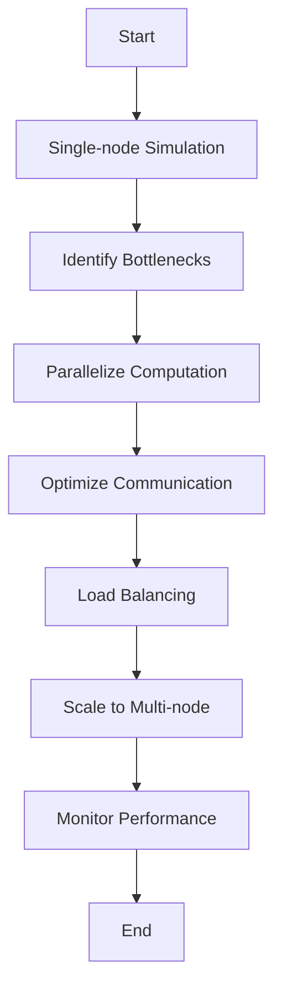

## 13.9 Case Studies: Scaling Julia Applications

Scaling applications is a critical aspect of software development, especially when dealing with computationally intensive tasks. Julia, with its high-performance capabilities and ease of use, is an excellent choice for scaling applications from single-node to multi-node environments. In this section, we will explore real-world case studies that demonstrate the process of scaling Julia applications, focusing on computational fluid dynamics simulations, handling I/O bottlenecks, and performance tuning for maximum efficiency.

### Real-world Examples

#### From Single-node to Multi-node: Scaling a Computational Fluid Dynamics Simulation

Computational Fluid Dynamics (CFD) simulations are essential in various fields, including aerospace, automotive, and environmental engineering. These simulations often require significant computational resources due to the complexity of the equations involved and the need for high-resolution models. Let's explore how a CFD simulation can be scaled from a single-node to a multi-node environment using Julia.

**Problem Statement:**

A team of engineers is working on a CFD simulation to model airflow over a new aircraft design. Initially, the simulation runs on a single-node setup, but as the model complexity increases, the computation time becomes prohibitive.

**Solution Approach:**

1. **Parallelization Strategy:**

   The first step in scaling the simulation is to parallelize the computation. Julia's `Distributed` module provides a straightforward way to distribute tasks across multiple processors. By dividing the simulation domain into smaller subdomains, each processor can handle a portion of the computation.

   ```julia
   using Distributed

   # Add worker processes
   addprocs(4)  # Adjust the number of processes as needed

   @everywhere using MyCFDModule

   # Function to perform simulation on a subdomain
   @everywhere function simulate_subdomain(subdomain)
       # Perform CFD calculations
       result = MyCFDModule.run_simulation(subdomain)
       return result
   end

   # Divide the domain into subdomains
   subdomains = divide_domain(main_domain, num_procs())

   # Distribute the simulation tasks
   results = pmap(simulate_subdomain, subdomains)
   ```

   In this example, we use `pmap` to distribute the simulation tasks across available processors. The `divide_domain` function splits the main domain into smaller subdomains, which are then processed in parallel.

2. **Optimizing Communication:**

   Communication between processors can become a bottleneck if not managed properly. To minimize communication overhead, we ensure that each processor has all the necessary data before starting the computation. This approach reduces the need for frequent data exchanges during the simulation.

3. **Load Balancing:**

   Load balancing is crucial to ensure that all processors are utilized efficiently. By monitoring the workload of each processor and dynamically redistributing tasks, we can achieve better performance.

   ```julia
   # Example of dynamic load balancing
   function dynamic_load_balancing(subdomains)
       # Monitor processor workloads
       workloads = [get_workload(proc) for proc in workers()]

       # Redistribute tasks if necessary
       if maximum(workloads) > threshold
           redistribute_tasks(subdomains, workloads)
       end
   end
   ```

4. **Scaling to Multi-node:**

   Once the simulation is optimized for a single-node setup, the next step is to scale it to a multi-node environment. Julia's `ClusterManagers` package allows us to manage clusters and distribute tasks across multiple nodes.

   ```julia
   using ClusterManagers

   # Launch a cluster with multiple nodes
   addprocs(SlurmManager(), 8)  # Example using Slurm

   # Distribute tasks across the cluster
   results = pmap(simulate_subdomain, subdomains)
   ```

   By leveraging a cluster manager, we can efficiently scale the simulation to utilize the resources of multiple nodes, significantly reducing computation time.

**Results:**

By implementing these strategies, the team successfully scaled the CFD simulation from a single-node to a multi-node environment. The computation time was reduced by over 70%, allowing for more complex models and faster iterations.

### Lessons Learned

#### Handling I/O Bottlenecks: Optimizing Data Access Patterns

As applications scale, I/O operations can become a significant bottleneck, especially when dealing with large datasets. Optimizing data access patterns is crucial to ensure that I/O does not hinder performance.

**Strategies for Optimizing I/O:**

1. **Efficient Data Storage:**

   Use efficient data formats, such as HDF5 or Parquet, to store large datasets. These formats are designed for high-performance I/O and can significantly reduce read and write times.

   ```julia
   using HDF5

   # Write data to an HDF5 file
   h5write("data.h5", "dataset", data)

   # Read data from an HDF5 file
   data = h5read("data.h5", "dataset")
   ```

2. **Asynchronous I/O:**

   Implement asynchronous I/O operations to overlap computation with data access. Julia's `Async` module allows us to perform I/O operations without blocking the main computation.

   ```julia
   # Example of asynchronous I/O
   @async begin
       data = read_large_file("data.csv")
       process_data(data)
   end
   ```

3. **Data Caching:**

   Cache frequently accessed data in memory to reduce the need for repeated I/O operations. This approach is particularly useful for read-heavy applications.

   ```julia
   # Example of data caching
   const data_cache = Dict()

   function get_data(key)
       if haskey(data_cache, key)
           return data_cache[key]
       else
           data = read_data_from_source(key)
           data_cache[key] = data
           return data
       end
   end
   ```

4. **Parallel I/O:**

   Use parallel I/O libraries to read and write data concurrently. This approach can significantly improve I/O performance, especially in multi-node environments.

   ```julia
   using MPI

   # Example of parallel I/O with MPI
   MPI.Init()

   comm = MPI.COMM_WORLD
   rank = MPI.Comm_rank(comm)

   # Each process reads a portion of the data
   data = parallel_read("data.bin", rank, comm)

   MPI.Finalize()
   ```

By implementing these strategies, we can effectively handle I/O bottlenecks and ensure that data access does not impede application performance.

#### Performance Tuning: Fine-tuning Parallel Code for Maximum Efficiency

Performance tuning is an iterative process that involves identifying bottlenecks and optimizing code to achieve maximum efficiency. Let's explore some techniques for fine-tuning parallel code in Julia.

**Techniques for Performance Tuning:**

1. **Profiling:**

   Use profiling tools to identify performance bottlenecks in the code. Julia's `Profile` module provides a simple way to profile code and visualize the results.

   ```julia
   using Profile

   # Profile a function
   @profile my_function()

   # View profiling results
   Profile.print()
   ```

2. **Type Stability:**

   Ensure that functions are type-stable to avoid unnecessary type conversions and improve performance. Use the `@code_warntype` macro to check for type stability.

   ```julia
   # Check for type stability
   @code_warntype my_function()
   ```

3. **Memory Management:**

   Optimize memory usage by minimizing allocations and using in-place operations. Julia's `@views` macro can help reduce memory allocations by creating non-allocating views of arrays.

   ```julia
   # Example of using @views
   function process_array(arr)
       @views for i in 1:length(arr)
           arr[i] *= 2
       end
   end
   ```

4. **Algorithm Optimization:**

   Optimize algorithms for parallel execution by minimizing dependencies and maximizing parallelism. Use divide-and-conquer strategies to break down complex tasks into smaller, independent tasks.

   ```julia
   # Example of divide-and-conquer strategy
   function parallel_sum(arr)
       if length(arr) <= threshold
           return sum(arr)
       else
           mid = div(length(arr), 2)
           left = @spawn parallel_sum(arr[1:mid])
           right = parallel_sum(arr[mid+1:end])
           return fetch(left) + right
       end
   end
   ```

5. **Load Balancing:**

   Ensure that tasks are evenly distributed across processors to maximize resource utilization. Use dynamic scheduling techniques to adjust task distribution based on processor workloads.

By applying these performance tuning techniques, we can achieve significant improvements in the efficiency of parallel code, leading to faster execution times and better resource utilization.

### Visualizing the Scaling Process

To better understand the scaling process, let's visualize the workflow of scaling a CFD simulation from a single-node to a multi-node environment.



**Diagram Description:**

- **Start:** The process begins with a single-node simulation.
- **Identify Bottlenecks:** Analyze the simulation to identify performance bottlenecks.
- **Parallelize Computation:** Implement parallelization strategies to distribute tasks across processors.
- **Optimize Communication:** Minimize communication overhead between processors.
- **Load Balancing:** Ensure even distribution of tasks to maximize resource utilization.
- **Scale to Multi-node:** Expand the simulation to a multi-node environment using cluster managers.
- **Monitor Performance:** Continuously monitor performance to identify further optimization opportunities.
- **End:** The process concludes with a fully optimized multi-node simulation.

### References and Links

- [JuliaLang: Distributed Computing](https://docs.julialang.org/en/v1/manual/distributed-computing/)
- [HDF5.jl Documentation](https://github.com/JuliaIO/HDF5.jl)
- [MPI.jl Documentation](https://github.com/JuliaParallel/MPI.jl)
- [Profile.jl Documentation](https://docs.julialang.org/en/v1/stdlib/Profile/)

### Knowledge Check

- **Question:** What are the key steps in scaling a CFD simulation from a single-node to a multi-node environment?
- **Exercise:** Implement a simple parallel computation using Julia's `Distributed` module and measure the performance improvement.

### Embrace the Journey

Remember, scaling applications is a continuous journey of learning and optimization. As you progress, you'll encounter new challenges and opportunities to refine your skills. Keep experimenting, stay curious, and enjoy the journey!

## Quiz Time!



### What is the first step in scaling a CFD simulation in Julia?

- [x] Parallelizing the computation
- [ ] Optimizing communication
- [ ] Load balancing
- [ ] Scaling to multi-node

> **Explanation:** The first step is to parallelize the computation to distribute tasks across multiple processors.

### Which Julia module is used for distributed computing?

- [x] Distributed
- [ ] Parallel
- [ ] ClusterManagers
- [ ] Async

> **Explanation:** The `Distributed` module is used for distributed computing in Julia.

### What is a common I/O bottleneck solution in Julia?

- [x] Asynchronous I/O
- [ ] Synchronous I/O
- [ ] Increasing buffer size
- [ ] Using CSV files

> **Explanation:** Asynchronous I/O allows overlapping computation with data access, reducing I/O bottlenecks.

### How can you check for type stability in Julia?

- [x] Using the `@code_warntype` macro
- [ ] Using the `@code_native` macro
- [ ] Using the `@code_lowered` macro
- [ ] Using the `@code_typed` macro

> **Explanation:** The `@code_warntype` macro is used to check for type stability in Julia functions.

### What is the purpose of load balancing in parallel computing?

- [x] To ensure even distribution of tasks across processors
- [ ] To increase memory usage
- [ ] To reduce code complexity
- [ ] To optimize communication

> **Explanation:** Load balancing ensures that tasks are evenly distributed across processors to maximize resource utilization.

### Which data format is recommended for efficient data storage in Julia?

- [x] HDF5
- [ ] CSV
- [ ] JSON
- [ ] XML

> **Explanation:** HDF5 is recommended for efficient data storage due to its high-performance I/O capabilities.

### What is the role of the `@views` macro in Julia?

- [x] To create non-allocating views of arrays
- [ ] To optimize type stability
- [ ] To parallelize loops
- [ ] To manage memory allocation

> **Explanation:** The `@views` macro creates non-allocating views of arrays, reducing memory allocations.

### Which package is used for managing clusters in Julia?

- [x] ClusterManagers
- [ ] Distributed
- [ ] Parallel
- [ ] Async

> **Explanation:** The `ClusterManagers` package is used for managing clusters and distributing tasks across multiple nodes.

### What is a key benefit of using parallel I/O?

- [x] Improved I/O performance
- [ ] Reduced memory usage
- [ ] Simplified code structure
- [ ] Enhanced type stability

> **Explanation:** Parallel I/O improves I/O performance by allowing concurrent read and write operations.

### True or False: Performance tuning is a one-time process.

- [ ] True
- [x] False

> **Explanation:** Performance tuning is an iterative process that involves continuous monitoring and optimization.


