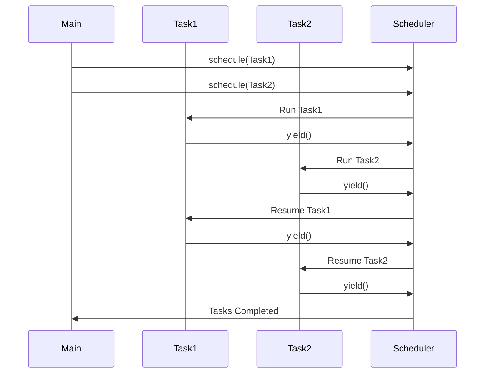

## 14.1 Understanding Tasks and Coroutines

In the realm of concurrent programming, Julia stands out with its elegant and efficient handling of tasks and coroutines. This section will guide you through the concepts of tasks and coroutines, demonstrating how they form the backbone of Julia's concurrency model. We will explore how to create, manage, and synchronize tasks, leveraging Julia's unique features to build robust and responsive applications.

### Concurrency Model

Julia's concurrency model is built on the concept of cooperative multitasking. Unlike preemptive multitasking, where the operating system decides when to switch between tasks, cooperative multitasking relies on tasks to yield control voluntarily. This approach allows for more predictable and efficient task management, as tasks yield control at well-defined points in their execution.

#### Cooperative Multitasking

In cooperative multitasking, tasks are responsible for yielding control to allow other tasks to run. This is achieved using the `yield()` function in Julia, which suspends the current task and allows the scheduler to run other tasks. This model is particularly well-suited for I/O-bound operations, where tasks can yield control while waiting for external resources.

```julia
function cooperative_example()
    for i in 1:5
        println("Task 1 - Step $i")
        yield()  # Yield control to allow other tasks to run
    end
end

task1 = @task cooperative_example()
schedule(task1)  # Schedule the task for execution
```

In this example, `task1` yields control after each step, allowing other tasks to execute. This cooperative behavior ensures that tasks do not monopolize the CPU, leading to more efficient resource utilization.

### Creating Tasks

Tasks in Julia are lightweight, concurrent units of execution. They are created using the `@task` macro, which defines a task for execution. Tasks can be scheduled to run concurrently, allowing for efficient parallel execution of code.

#### `@task` Macro

The `@task` macro is used to define a task in Julia. It takes a block of code and creates a task object that can be scheduled for execution. Tasks can be scheduled using the `schedule()` function, which adds them to the task queue for execution.

```julia
task2 = @task begin
    for i in 1:5
        println("Task 2 - Step $i")
        yield()
    end
end

schedule(task2)  # Schedule the task for execution
```

In this example, `task2` is defined using the `@task` macro and scheduled for execution. The task will execute concurrently with other scheduled tasks, yielding control at each step.

### Task Synchronization

Task synchronization is crucial for managing the execution of concurrent tasks. Julia provides several mechanisms for synchronizing tasks, including the `wait()` and `fetch()` functions.

#### Waiting on Tasks

The `wait()` function is used to block the execution of the current task until another task completes. This is useful for ensuring that a task has finished before proceeding with dependent operations.

```julia
task3 = @task begin
    sleep(2)  # Simulate a long-running operation
    println("Task 3 completed")
end

schedule(task3)
wait(task3)  # Wait for task3 to complete before proceeding
println("Task 3 has finished, continuing execution")
```

In this example, `wait(task3)` blocks the execution until `task3` completes, ensuring that subsequent code executes only after the task has finished.

#### Fetching Task Results

The `fetch()` function is used to retrieve the result of a task once it has completed. This is particularly useful for tasks that perform computations and return a result.

```julia
task4 = @task begin
    sleep(1)
    return 42  # Return a result from the task
end

schedule(task4)
result = fetch(task4)  # Fetch the result of the task
println("Task 4 result: $result")
```

In this example, `fetch(task4)` retrieves the result of `task4` once it has completed, allowing the result to be used in subsequent computations.

### Visualizing Task Execution

To better understand the flow of task execution in Julia, let's visualize the process using a sequence diagram. This diagram illustrates the interaction between tasks and the scheduler, highlighting the cooperative multitasking model.



**Diagram Description:** This sequence diagram illustrates the cooperative multitasking model in Julia. Tasks yield control to the scheduler, allowing other tasks to run. The scheduler manages the execution of tasks, ensuring efficient resource utilization.

### Try It Yourself

To deepen your understanding of tasks and coroutines in Julia, try modifying the code examples provided. Experiment with different task configurations, such as varying the number of iterations or introducing additional tasks. Observe how the scheduler manages task execution and how tasks yield control.

### References and Further Reading

- [Julia Documentation on Tasks](https://docs.julialang.org/en/v1/manual/control-flow/#Tasks-1)
- [Concurrency in Julia](https://julialang.org/blog/2019/07/multithreading/)
- [Understanding Coroutines](https://en.wikipedia.org/wiki/Coroutine)

### Knowledge Check

- Explain the concept of cooperative multitasking and how it differs from preemptive multitasking.
- Demonstrate how to create and schedule a task using the `@task` macro.
- Describe the purpose of the `wait()` and `fetch()` functions in task synchronization.

### Embrace the Journey

As you explore tasks and coroutines in Julia, remember that this is just the beginning. The concepts of concurrency and asynchronous programming open up a world of possibilities for building efficient and responsive applications. Keep experimenting, stay curious, and enjoy the journey!

## Quiz Time!



### What is the primary difference between cooperative and preemptive multitasking?

- [x] Cooperative multitasking relies on tasks to yield control voluntarily, while preemptive multitasking is managed by the operating system.
- [ ] Cooperative multitasking is managed by the operating system, while preemptive multitasking relies on tasks to yield control.
- [ ] Both cooperative and preemptive multitasking rely on tasks to yield control voluntarily.
- [ ] Cooperative multitasking does not involve task scheduling.

> **Explanation:** Cooperative multitasking relies on tasks to yield control voluntarily, allowing other tasks to run, whereas preemptive multitasking is managed by the operating system.

### How do you create a task in Julia?

- [x] Using the `@task` macro.
- [ ] Using the `@async` macro.
- [ ] Using the `@parallel` macro.
- [ ] Using the `@sync` macro.

> **Explanation:** The `@task` macro is used to create a task in Julia, defining a block of code for concurrent execution.

### What function is used to block the execution of the current task until another task completes?

- [x] `wait()`
- [ ] `yield()`
- [ ] `fetch()`
- [ ] `schedule()`

> **Explanation:** The `wait()` function is used to block the execution of the current task until another task completes.

### Which function is used to retrieve the result of a completed task?

- [x] `fetch()`
- [ ] `wait()`
- [ ] `yield()`
- [ ] `schedule()`

> **Explanation:** The `fetch()` function is used to retrieve the result of a task once it has completed.

### What is the purpose of the `yield()` function in cooperative multitasking?

- [x] To suspend the current task and allow the scheduler to run other tasks.
- [ ] To block the execution of the current task until another task completes.
- [ ] To retrieve the result of a completed task.
- [ ] To schedule a task for execution.

> **Explanation:** The `yield()` function suspends the current task, allowing the scheduler to run other tasks, which is essential for cooperative multitasking.

### In the provided code example, what does the `schedule()` function do?

- [x] It adds the task to the task queue for execution.
- [ ] It blocks the execution of the current task until another task completes.
- [ ] It retrieves the result of a completed task.
- [ ] It suspends the current task and allows the scheduler to run other tasks.

> **Explanation:** The `schedule()` function adds a task to the task queue for execution, allowing it to run concurrently with other tasks.

### What is the role of the scheduler in Julia's concurrency model?

- [x] To manage the execution of tasks and ensure efficient resource utilization.
- [ ] To block the execution of tasks until they complete.
- [ ] To retrieve the results of completed tasks.
- [ ] To suspend tasks and allow other tasks to run.

> **Explanation:** The scheduler manages the execution of tasks, ensuring efficient resource utilization and coordinating task execution.

### Which of the following is a key advantage of cooperative multitasking?

- [x] Predictable task management and efficient resource utilization.
- [ ] Tasks are managed by the operating system.
- [ ] Tasks do not need to yield control.
- [ ] Tasks can monopolize the CPU.

> **Explanation:** Cooperative multitasking allows for predictable task management and efficient resource utilization, as tasks yield control voluntarily.

### What is the output of the following code snippet?

```julia
task = @task begin
    sleep(1)
    return 10
end

schedule(task)
result = fetch(task)
println("Result: $result")
```

- [x] Result: 10
- [ ] Result: 1
- [ ] Result: 0
- [ ] Error

> **Explanation:** The task returns 10 after sleeping for 1 second, and `fetch(task)` retrieves this result, printing "Result: 10".

### True or False: In Julia, tasks can be used for both I/O-bound and CPU-bound operations.

- [x] True
- [ ] False

> **Explanation:** Tasks in Julia can be used for both I/O-bound and CPU-bound operations, allowing for efficient concurrency and parallel execution.


