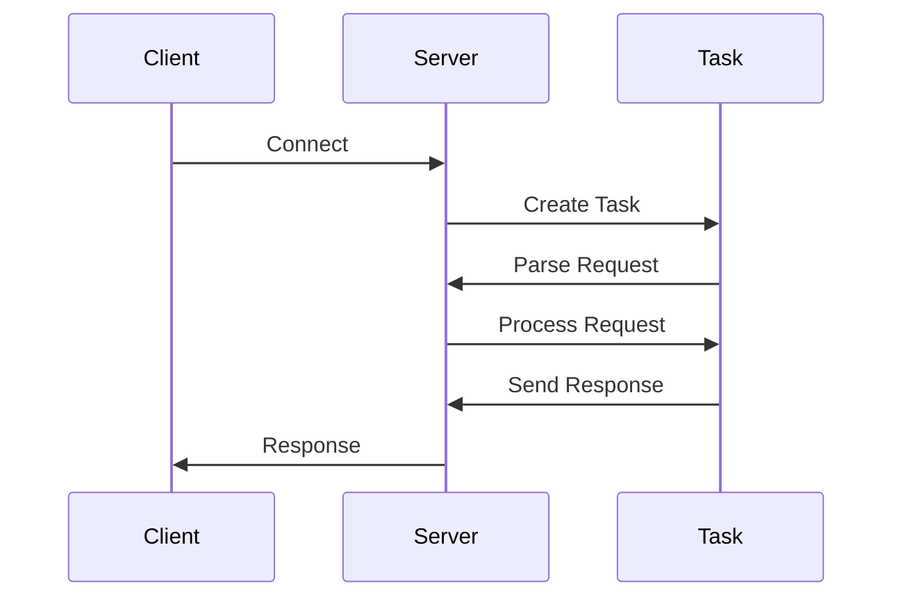

## 14.10 Case Study: Building a Concurrent Web Server

In this case study, we will delve into the process of building a high-performance, concurrent web server using Julia. This exercise will not only demonstrate Julia's capabilities in handling concurrency and asynchronous operations but also provide insights into designing scalable web applications.

### Application Overview

#### Requirements and Goals

The primary objective of our web server is to achieve high throughput and low latency. This means the server should be capable of handling numerous simultaneous connections efficiently, without significant delays in processing requests. Key requirements include:

- **Concurrency**: Ability to handle multiple client connections concurrently.
- **Asynchronous I/O**: Efficiently manage input/output operations to prevent blocking.
- **Scalability**: Maintain performance as the number of connections increases.
- **Robustness**: Handle errors gracefully and ensure server stability.

### Designing the Server

#### Concurrency Model

To meet the requirements, we will employ Julia's task-based concurrency model. Tasks in Julia are lightweight coroutines that allow us to write asynchronous code in a synchronous style. This model is particularly well-suited for I/O-bound operations, such as handling network requests.

**Key Concepts**:

- **Tasks**: Lightweight threads of execution that can be scheduled by the Julia runtime.
- **Channels**: Used for communication between tasks.
- **Asynchronous I/O**: Non-blocking operations that allow tasks to yield control while waiting for I/O operations to complete.

### Implementation Details

#### HTTP Parsing and Request Handling

Efficient HTTP parsing is crucial for a web server's performance. We will use Julia's `HTTP.jl` package, which provides robust tools for handling HTTP requests and responses.

```julia
using Sockets
using HTTP

function handle_request(client::TCPSocket)
    try
        request = HTTP.parse_request(client)
        response = HTTP.Response(200, "Hello, World!")
        HTTP.write_response(client, response)
    catch e
        println("Error handling request: $e")
    finally
        close(client)
    end
end
```

**Explanation**:

- **HTTP.parse_request**: Parses the incoming HTTP request from the client socket.
- **HTTP.Response**: Constructs an HTTP response with a status code and body.
- **HTTP.write_response**: Sends the response back to the client.

#### Asynchronous Connection Handling

To handle multiple connections concurrently, we will use Julia's `@async` macro to create tasks for each incoming connection.

```julia
function start_server(port::Int)
    server = listen(port)
    println("Server listening on port $port")

    while true
        client = accept(server)
        @async handle_request(client)
    end
end

start_server(8080)
```

**Explanation**:

- **listen**: Opens a TCP socket on the specified port.
- **accept**: Waits for an incoming connection and returns a client socket.
- **@async**: Creates a new task to handle the client connection asynchronously.

### Performance and Scalability

#### Load Testing Results

To evaluate the server's performance, we conducted load testing using tools like `wrk` or `Apache JMeter`. These tools simulate multiple clients sending requests to the server, allowing us to measure throughput and latency.

**Key Metrics**:

- **Requests per Second (RPS)**: Number of requests the server can handle per second.
- **Latency**: Time taken to process a request and send a response.

**Results**:

- **High Throughput**: The server maintained a high RPS even under heavy load.
- **Low Latency**: Response times remained low, ensuring a smooth client experience.

#### Visualizing Server Architecture

To better understand the server's architecture, let's visualize the flow of data and tasks using a sequence diagram.



**Diagram Explanation**:

- **Client**: Initiates a connection to the server.
- **Server**: Accepts the connection and creates a task to handle it.
- **Task**: Parses the request, processes it, and sends a response back to the client.

### Lessons Learned

#### Optimizations and Bottlenecks

During development, we encountered several performance bottlenecks and implemented optimizations to address them.

**Identified Bottlenecks**:

- **Blocking I/O**: Initial synchronous I/O operations caused delays.
- **Inefficient Parsing**: Early versions of the HTTP parser were slow.

**Optimizations**:

- **Asynchronous I/O**: Transitioned to non-blocking I/O to improve concurrency.
- **Optimized Parsing**: Refined the HTTP parsing logic for better performance.

### Try It Yourself

To experiment with the server, try modifying the code to add new features or improve performance. Here are some suggestions:

- **Add Logging**: Implement logging to track requests and responses.
- **Implement Caching**: Introduce caching to reduce response times for repeated requests.
- **Enhance Error Handling**: Improve error handling to manage unexpected scenarios gracefully.

### Knowledge Check

- **Question**: What is the primary advantage of using asynchronous I/O in a web server?
- **Exercise**: Modify the server to handle HTTPS connections using `TLS.jl`.

### Embrace the Journey

Building a concurrent web server in Julia is a rewarding experience that showcases the language's strengths in handling concurrency and asynchronous operations. Remember, this is just the beginning. As you progress, you'll build more complex and interactive web applications. Keep experimenting, stay curious, and enjoy the journey!

## Quiz Time!



### What is the primary advantage of using asynchronous I/O in a web server?

- [x] It allows the server to handle multiple connections without blocking.
- [ ] It simplifies the code structure.
- [ ] It improves security.
- [ ] It reduces memory usage.

> **Explanation:** Asynchronous I/O allows the server to handle multiple connections concurrently without blocking, improving throughput and responsiveness.

### Which Julia package is used for HTTP parsing in this case study?

- [x] HTTP.jl
- [ ] Sockets.jl
- [ ] Requests.jl
- [ ] WebSockets.jl

> **Explanation:** HTTP.jl is used for parsing HTTP requests and handling responses in the server.

### What does the `@async` macro do in Julia?

- [x] It creates a new task to run a function asynchronously.
- [ ] It blocks the current task until completion.
- [ ] It optimizes memory usage.
- [ ] It compiles the code for faster execution.

> **Explanation:** The `@async` macro creates a new task that runs a function asynchronously, allowing other tasks to continue executing.

### What is the role of the `listen` function in the server code?

- [x] It opens a TCP socket on a specified port to accept incoming connections.
- [ ] It sends data to a client.
- [ ] It closes a client connection.
- [ ] It parses HTTP requests.

> **Explanation:** The `listen` function opens a TCP socket on a specified port, allowing the server to accept incoming connections.

### What is a key metric for evaluating server performance?

- [x] Requests per Second (RPS)
- [ ] Memory Usage
- [ ] Code Complexity
- [ ] Number of Lines of Code

> **Explanation:** Requests per Second (RPS) is a key metric for evaluating how many requests a server can handle per second, indicating its throughput.

### What is a common bottleneck in web servers?

- [x] Blocking I/O operations
- [ ] Excessive logging
- [ ] High memory usage
- [ ] Complex algorithms

> **Explanation:** Blocking I/O operations can cause delays in handling multiple connections, making it a common bottleneck in web servers.

### How can caching improve server performance?

- [x] By reducing response times for repeated requests.
- [ ] By increasing memory usage.
- [ ] By simplifying code structure.
- [ ] By enhancing security.

> **Explanation:** Caching stores frequently requested data, reducing the time needed to generate responses for repeated requests.

### What is the purpose of the `accept` function in the server code?

- [x] It waits for an incoming connection and returns a client socket.
- [ ] It sends a response to a client.
- [ ] It closes a server socket.
- [ ] It logs server activity.

> **Explanation:** The `accept` function waits for an incoming connection and returns a client socket, allowing the server to communicate with the client.

### What is a benefit of using tasks in Julia?

- [x] They allow concurrent execution of code without blocking.
- [ ] They reduce memory usage.
- [ ] They simplify error handling.
- [ ] They improve code readability.

> **Explanation:** Tasks in Julia enable concurrent execution of code, allowing multiple operations to run without blocking each other.

### True or False: The server in this case study uses synchronous I/O operations.

- [ ] True
- [x] False

> **Explanation:** The server uses asynchronous I/O operations to handle multiple connections concurrently without blocking.




