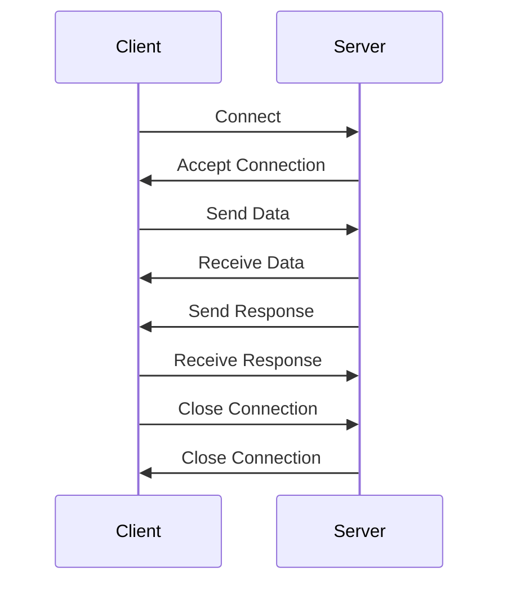

## 14.2 Asynchronous I/O and Networking with `Async` Functions

In the world of modern software development, the ability to perform tasks asynchronously is crucial for building efficient and responsive applications. Julia, with its powerful concurrency model, provides robust support for asynchronous I/O operations and networking through `Async` functions. In this section, we will explore how to leverage these capabilities to perform non-blocking I/O operations and implement custom network communication.

### Understanding Non-blocking I/O

Non-blocking I/O is a technique that allows a program to initiate an I/O operation and continue executing other tasks while waiting for the I/O operation to complete. This is particularly useful in scenarios where I/O operations, such as reading from a file or making a network request, can take a significant amount of time. By using non-blocking I/O, we can improve the responsiveness and efficiency of our applications.

#### Asynchronous Reads/Writes

In Julia, asynchronous I/O operations are facilitated by the `Async` functions, which allow us to perform reads and writes without blocking the execution of other tasks. Let's explore how to perform asynchronous reads and writes using Julia's `Async` functions.

```julia
using Sockets

function async_read(socket::TCPSocket)
    # Create a buffer to store the data
    buffer = Vector{UInt8}(undef, 1024)
    
    # Perform an asynchronous read operation
    while true
        n = readavailable(socket, buffer)
        if n == 0
            break
        end
        println("Received data: ", String(buffer[1:n]))
    end
end

function async_write(socket::TCPSocket, data::String)
    # Convert the string data to bytes
    bytes = Vector{UInt8}(data)
    
    # Perform an asynchronous write operation
    write(socket, bytes)
    flush(socket)
end
```

In the above code, we define two functions: `async_read` and `async_write`. The `async_read` function reads data from a socket asynchronously, while the `async_write` function writes data to a socket asynchronously. By using these functions, we can perform I/O operations without blocking the execution of other tasks.

### Network Programming with Sockets and Protocols

Network programming involves creating applications that communicate over a network. Julia provides support for network programming through its `Sockets` module, which allows us to create and manage network connections using sockets.

#### Implementing Custom Network Communication

To implement custom network communication, we can use sockets to establish connections between different devices on a network. Let's explore how to create a simple server-client application using sockets in Julia.

```julia
function start_server(port::Int)
    # Create a TCP server socket
    server = listen(port)
    println("Server listening on port $port")
    
    while true
        # Accept a client connection
        client = accept(server)
        println("Client connected")
        
        # Handle the client connection asynchronously
        @async begin
            async_read(client)
            async_write(client, "Hello from server!")
            close(client)
        end
    end
end

function start_client(host::String, port::Int)
    # Connect to the server
    client = connect(host, port)
    println("Connected to server")
    
    # Handle the server connection asynchronously
    @async begin
        async_write(client, "Hello from client!")
        async_read(client)
        close(client)
    end
end

@async start_server(8080)
@async start_client("localhost", 8080)
```

In the above code, we define two functions: `start_server` and `start_client`. The `start_server` function creates a TCP server socket that listens for incoming client connections. When a client connects, the server handles the connection asynchronously using the `@async` macro. The `start_client` function connects to the server and communicates with it asynchronously.

### Building an Asynchronous HTTP Client

One of the most common use cases for asynchronous I/O is making non-blocking web requests. Let's explore how to build an asynchronous HTTP client in Julia using the `HTTP` package.

```julia
using HTTP

function async_http_request(url::String)
    # Perform an asynchronous HTTP GET request
    response = HTTP.get(url)
    
    # Print the response body
    println("Response: ", String(response.body))
end

@async async_http_request("http://example.com")
```

In the above code, we define an `async_http_request` function that makes an asynchronous HTTP GET request to a specified URL. The `HTTP.get` function performs the request asynchronously, allowing us to continue executing other tasks while waiting for the response.

### Visualizing Asynchronous I/O and Networking

To better understand the flow of asynchronous I/O and networking operations, let's visualize the process using a sequence diagram.



In the sequence diagram above, we can see the flow of communication between a client and a server. The client connects to the server, sends data, receives a response, and then closes the connection. The server accepts the connection, receives data, sends a response, and then closes the connection.

### Try It Yourself

Now that we've explored the basics of asynchronous I/O and networking in Julia, it's time to try it yourself. Here are a few suggestions for modifications you can make to the code examples:

- Modify the `async_read` and `async_write` functions to handle different types of data, such as JSON or binary data.
- Implement a simple chat application using sockets, where multiple clients can connect to a server and send messages to each other.
- Extend the asynchronous HTTP client to handle different HTTP methods, such as POST or PUT, and parse JSON responses.

### Key Takeaways

- Asynchronous I/O allows us to perform I/O operations without blocking the execution of other tasks, improving the responsiveness and efficiency of our applications.
- Julia provides robust support for asynchronous I/O and networking through `Async` functions and the `Sockets` module.
- By using sockets, we can implement custom network communication and create server-client applications.
- Building an asynchronous HTTP client allows us to make non-blocking web requests and handle responses efficiently.

### References and Further Reading

- [Julia Documentation: Asynchronous I/O](https://docs.julialang.org/en/v1/manual/networking-and-streams/#Asynchronous-I/O)
- [HTTP.jl Documentation](https://juliaweb.github.io/HTTP.jl/stable/)
- [Sockets.jl Documentation](https://docs.julialang.org/en/v1/stdlib/Sockets/)

## Quiz Time!



### What is the primary benefit of non-blocking I/O?

- [x] It allows a program to continue executing other tasks while waiting for an I/O operation to complete.
- [ ] It increases the speed of I/O operations.
- [ ] It reduces the memory usage of a program.
- [ ] It simplifies the code for I/O operations.

> **Explanation:** Non-blocking I/O allows a program to continue executing other tasks while waiting for an I/O operation to complete, improving responsiveness and efficiency.

### Which Julia module provides support for network programming?

- [ ] HTTP
- [x] Sockets
- [ ] Threads
- [ ] Base

> **Explanation:** The `Sockets` module in Julia provides support for network programming, allowing us to create and manage network connections using sockets.

### What is the purpose of the `@async` macro in Julia?

- [x] To execute a block of code asynchronously.
- [ ] To create a new thread.
- [ ] To perform synchronous I/O operations.
- [ ] To handle exceptions.

> **Explanation:** The `@async` macro in Julia is used to execute a block of code asynchronously, allowing other tasks to continue executing without waiting for the block to complete.

### How can you perform an asynchronous HTTP GET request in Julia?

- [x] By using the `HTTP.get` function within an `@async` block.
- [ ] By using the `Sockets.connect` function.
- [ ] By using the `Threads.@spawn` macro.
- [ ] By using the `Base.read` function.

> **Explanation:** The `HTTP.get` function can be used within an `@async` block to perform an asynchronous HTTP GET request in Julia.

### What is the role of a socket in network programming?

- [x] It serves as an endpoint for sending and receiving data over a network.
- [ ] It is used to store data in memory.
- [ ] It is a type of database connection.
- [ ] It is a method for encrypting data.

> **Explanation:** A socket serves as an endpoint for sending and receiving data over a network, facilitating communication between devices.

### Which function is used to listen for incoming client connections on a server socket?

- [ ] connect
- [ ] accept
- [x] listen
- [ ] read

> **Explanation:** The `listen` function is used to create a server socket that listens for incoming client connections.

### What is the purpose of the `flush` function in asynchronous I/O operations?

- [x] To ensure that all buffered data is written to the output stream.
- [ ] To clear the input buffer.
- [ ] To close the socket connection.
- [ ] To read data from the input stream.

> **Explanation:** The `flush` function is used to ensure that all buffered data is written to the output stream, making it available to the recipient.

### How can you handle multiple client connections on a server asynchronously?

- [x] By using the `@async` macro to handle each client connection in a separate task.
- [ ] By creating a new thread for each client connection.
- [ ] By using the `Threads.@spawn` macro.
- [ ] By using the `Base.read` function.

> **Explanation:** The `@async` macro can be used to handle each client connection in a separate task, allowing the server to manage multiple connections asynchronously.

### What is the advantage of using asynchronous I/O in a web application?

- [x] It improves the responsiveness and scalability of the application.
- [ ] It reduces the complexity of the application code.
- [ ] It increases the security of the application.
- [ ] It simplifies the deployment process.

> **Explanation:** Asynchronous I/O improves the responsiveness and scalability of a web application by allowing it to handle multiple requests concurrently without blocking.

### True or False: Asynchronous I/O operations in Julia block the execution of other tasks.

- [ ] True
- [x] False

> **Explanation:** False. Asynchronous I/O operations in Julia do not block the execution of other tasks, allowing the program to continue executing while waiting for the I/O operation to complete.



Remember, this is just the beginning. As you progress, you'll build more complex and interactive applications using Julia's asynchronous I/O and networking capabilities. Keep experimenting, stay curious, and enjoy the journey!
