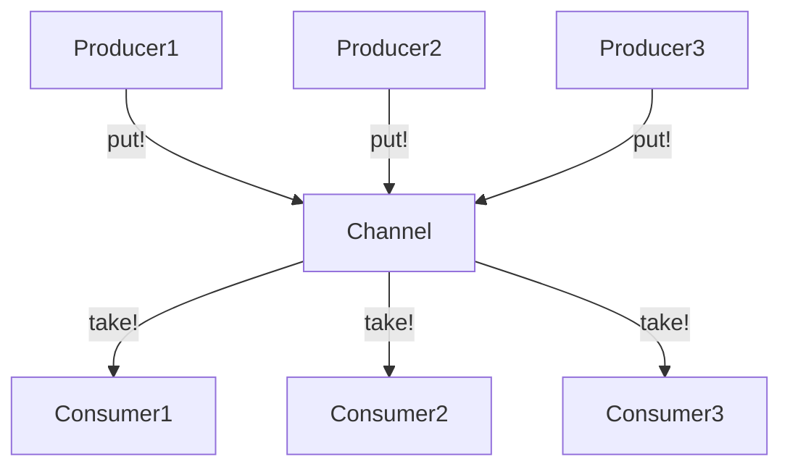

## 14.3 Implementing Producers and Consumers with Channels

In this section, we delve into the implementation of the Producer-Consumer model using Channels in Julia. This model is a cornerstone of concurrent programming, enabling efficient data processing and communication between tasks. By the end of this guide, you'll have a solid understanding of how to leverage Channels for inter-task communication, manage data pipelines, and control concurrency effectively.

### Understanding Channels in Julia

**Channels** in Julia are powerful constructs that facilitate communication between tasks. They allow for the safe exchange of data, making them ideal for implementing the Producer-Consumer model. Channels can be thought of as conduits through which data flows from producers to consumers.

#### Inter-Task Communication

Channels serve as the backbone of inter-task communication in Julia. They enable tasks to send and receive messages or data, ensuring synchronization and coordination. This is particularly useful in scenarios where tasks need to operate concurrently without interfering with each other's execution.

### The Producer-Consumer Model

The Producer-Consumer model is a classic design pattern in concurrent programming. It involves two main components:

- **Producers**: These are tasks responsible for generating data or messages.
- **Consumers**: These tasks process the data or messages produced.

This model is widely used in data pipelines, where data is produced, processed, and consumed in a streamlined manner.

#### Data Pipelines

In a data pipeline, producers generate data that is subsequently processed by consumers. This setup is common in applications such as data processing, streaming, and real-time analytics. Channels play a crucial role in facilitating the flow of data between producers and consumers.

### Implementing Channels in Julia

Let's explore how to implement the Producer-Consumer model using Channels in Julia. We'll start by creating a simple example that demonstrates the basic concepts.

#### Creating a Channel

To create a Channel in Julia, use the `Channel` constructor. You can specify the buffer size, which determines how many items the channel can hold before blocking the producer.

```julia
channel = Channel{Int}(10)
```

In this example, we create a channel that can hold up to 10 integers. The buffer size is crucial for managing the flow of data between producers and consumers.

#### Implementing a Producer

A producer is a task that generates data and sends it to the channel. Here's a simple producer function that generates numbers and sends them to the channel.

```julia
function producer(ch::Channel)
    for i in 1:20
        put!(ch, i)  # Send data to the channel
        println("Produced: $i")
        sleep(0.1)  # Simulate work
    end
    close(ch)  # Close the channel when done
end
```

The `put!` function is used to send data to the channel. The producer generates numbers from 1 to 20 and sends them to the channel, simulating work with a short delay.

#### Implementing a Consumer

A consumer is a task that receives data from the channel and processes it. Here's a simple consumer function that retrieves numbers from the channel and processes them.

```julia
function consumer(ch::Channel)
    for i in ch
        println("Consumed: $i")
        sleep(0.2)  # Simulate processing time
    end
end
```

The consumer retrieves data from the channel using a `for` loop, which iterates over the items in the channel. The `sleep` function simulates processing time.

#### Running the Producer and Consumer

To run the producer and consumer concurrently, use the `@async` macro to create asynchronous tasks.

```julia
ch = Channel{Int}(10)

@async producer(ch)
@async consumer(ch)
```

The `@async` macro allows the producer and consumer to run concurrently, enabling efficient data processing.

### Concurrency Control with Channel Buffers

Channel buffers play a vital role in controlling concurrency. By adjusting the buffer size, you can manage the flow of data between producers and consumers. A larger buffer allows the producer to generate more data before blocking, while a smaller buffer ensures that consumers process data promptly.

#### Configuring Buffer Sizes

The buffer size of a channel can significantly impact the performance and behavior of your application. Consider the following scenarios:

- **Small Buffer**: A small buffer size can lead to frequent blocking of the producer, as it must wait for the consumer to process data before generating more. This can be beneficial in scenarios where data must be processed immediately.
- **Large Buffer**: A large buffer size allows the producer to generate data more freely, reducing the likelihood of blocking. This is useful in scenarios where data can be processed in batches.

### Advanced Producer-Consumer Patterns

Let's explore some advanced patterns and techniques for implementing the Producer-Consumer model in Julia.

#### Multiple Producers and Consumers

In many applications, you may have multiple producers and consumers operating concurrently. Julia's Channels make it easy to implement this pattern.

```julia
ch = Channel{Int}(10)

for _ in 1:3
    @async producer(ch)
end

for _ in 1:3
    @async consumer(ch)
end
```

In this example, we create three producers and three consumers, all operating concurrently. This setup can improve throughput and efficiency in data processing applications.

#### Using Channels for Synchronization

Channels can also be used for synchronization between tasks. For example, you can use a channel to signal when a task has completed its work.

```julia
sync_channel = Channel{Bool}(1)

@async begin
    # Perform some work
    sleep(1)
    put!(sync_channel, true)  # Signal completion
end

take!(sync_channel)
println("Task completed")
```

In this example, a task performs some work and then signals its completion by sending a `true` value to the synchronization channel. The main task waits for this signal using the `take!` function.

### Visualizing the Producer-Consumer Workflow

To better understand the flow of data between producers and consumers, let's visualize the process using a Mermaid.js diagram.



**Diagram Description**: This diagram illustrates the flow of data in a Producer-Consumer model with multiple producers and consumers. Producers send data to a shared channel, and consumers retrieve and process the data.

### Design Considerations

When implementing the Producer-Consumer model with Channels in Julia, consider the following:

- **Buffer Size**: Choose an appropriate buffer size based on your application's requirements. A larger buffer can improve throughput, while a smaller buffer ensures timely processing.
- **Error Handling**: Implement error handling to manage exceptions that may occur during data processing. Consider using `try-catch` blocks to handle errors gracefully.
- **Performance**: Monitor the performance of your application and adjust the number of producers and consumers as needed to optimize throughput and efficiency.

### Differences and Similarities with Other Patterns

The Producer-Consumer model shares similarities with other concurrency patterns, such as the **Pipeline** pattern. Both involve the flow of data between tasks, but the Producer-Consumer model focuses on the roles of producers and consumers, while the Pipeline pattern emphasizes the stages of data processing.

### Try It Yourself

To deepen your understanding of the Producer-Consumer model with Channels in Julia, try modifying the code examples provided:

- **Experiment with Buffer Sizes**: Change the buffer size of the channel and observe how it affects the flow of data between producers and consumers.
- **Add More Producers and Consumers**: Increase the number of producers and consumers to see how it impacts performance and throughput.
- **Implement Error Handling**: Introduce error handling in the producer and consumer functions to manage exceptions gracefully.

### Knowledge Check

Before we wrap up, let's reinforce what we've learned with a few questions:

- What is the primary role of a channel in the Producer-Consumer model?
- How does the buffer size of a channel affect the flow of data?
- What are some common use cases for the Producer-Consumer model in Julia?

### Embrace the Journey

Remember, mastering the Producer-Consumer model with Channels in Julia is just the beginning. As you continue to explore concurrency patterns, you'll discover new ways to optimize and enhance your applications. Keep experimenting, stay curious, and enjoy the journey!

## Quiz Time!



### What is the primary role of a channel in Julia?

- [x] Facilitating communication between tasks
- [ ] Storing data permanently
- [ ] Managing memory allocation
- [ ] Compiling Julia code

> **Explanation:** Channels are used to facilitate communication between tasks by allowing them to exchange data.

### How does the buffer size of a channel affect the flow of data?

- [x] It determines how many items can be held before blocking the producer
- [ ] It controls the speed of data processing
- [ ] It affects the memory usage of the application
- [ ] It changes the data type of the channel

> **Explanation:** The buffer size determines how many items the channel can hold before the producer is blocked, affecting the flow of data.

### What is a common use case for the Producer-Consumer model?

- [x] Data processing pipelines
- [ ] Static website hosting
- [ ] Image rendering
- [ ] File compression

> **Explanation:** The Producer-Consumer model is commonly used in data processing pipelines where data is produced, processed, and consumed.

### Which function is used to send data to a channel in Julia?

- [x] put!
- [ ] take!
- [ ] send!
- [ ] receive!

> **Explanation:** The `put!` function is used to send data to a channel in Julia.

### What is the purpose of the `@async` macro in Julia?

- [x] To run tasks concurrently
- [ ] To allocate memory dynamically
- [ ] To compile code faster
- [ ] To manage data types

> **Explanation:** The `@async` macro is used to run tasks concurrently, allowing for asynchronous execution.

### How can channels be used for synchronization between tasks?

- [x] By signaling task completion
- [ ] By storing task results
- [ ] By managing task priorities
- [ ] By compiling tasks

> **Explanation:** Channels can be used to signal task completion, providing a mechanism for synchronization between tasks.

### What is the effect of having multiple producers and consumers?

- [x] It can improve throughput and efficiency
- [ ] It decreases memory usage
- [ ] It simplifies code structure
- [ ] It reduces the need for error handling

> **Explanation:** Having multiple producers and consumers can improve throughput and efficiency by allowing more data to be processed concurrently.

### Which pattern is similar to the Producer-Consumer model?

- [x] Pipeline pattern
- [ ] Singleton pattern
- [ ] Observer pattern
- [ ] Factory pattern

> **Explanation:** The Pipeline pattern is similar to the Producer-Consumer model as both involve the flow of data between tasks.

### What should be considered when choosing a buffer size for a channel?

- [x] Application requirements and data processing needs
- [ ] The color of the user interface
- [ ] The type of operating system
- [ ] The version of Julia being used

> **Explanation:** The buffer size should be chosen based on application requirements and data processing needs to ensure optimal performance.

### True or False: Channels in Julia can only be used for integer data.

- [ ] True
- [x] False

> **Explanation:** Channels in Julia can be used for any data type, not just integers.


