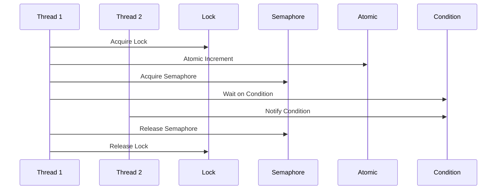

## 14.4 Synchronization Primitives and Concurrency Control

In the realm of concurrent programming, synchronization primitives are essential tools that help manage the execution of multiple tasks, ensuring data integrity and preventing race conditions. Julia, with its rich set of concurrency features, provides several synchronization primitives such as locks, semaphores, atomic operations, and condition variables. In this section, we will delve into these concepts, exploring how they can be effectively utilized in Julia to build robust and efficient concurrent applications.

### Locks and Semaphores

Locks and semaphores are fundamental synchronization primitives used to control access to shared resources. They help prevent race conditions by ensuring that only one task can access a critical section of code at a time.

#### Protecting Critical Sections

A critical section is a part of the code that accesses a shared resource, which must not be concurrently accessed by more than one task. Locks are used to protect these critical sections.

**Example: Using Locks in Julia**

```julia
using Base.Threads

lock = ReentrantLock()

counter = 0

function increment_counter()
    lock(lock) do
        global counter
        counter += 1
        println("Counter: $counter")
    end
end

Threads.@threads for _ in 1:10
    increment_counter()
end
```

In this example, a `ReentrantLock` is used to ensure that the `counter` is incremented safely by multiple threads. The `lock` function is used to acquire the lock, and the critical section is executed within the lock's scope.

#### Semaphores for Resource Management

Semaphores are more general than locks and can be used to control access to a resource pool. They maintain a count, which represents the number of available resources.

**Example: Using Semaphores in Julia**

```julia
using Base.Threads

semaphore = Semaphore(3)

function use_resource(id)
    println("Task $id waiting for resource")
    acquire(semaphore)
    try
        println("Task $id acquired resource")
        sleep(1)  # Simulate resource usage
    finally
        release(semaphore)
        println("Task $id released resource")
    end
end

Threads.@threads for i in 1:5
    use_resource(i)
end
```

In this example, a `Semaphore` is used to limit the number of concurrent tasks that can access a resource to 3. The `acquire` and `release` functions are used to manage the semaphore's permits.

### Atomic Operations

Atomic operations are used to perform thread-safe updates to shared variables without the need for locks. They ensure that a variable is updated atomically, preventing race conditions.

#### Ensuring Data Integrity

Atomic operations are particularly useful for simple operations like incrementing a counter or updating a flag.

**Example: Using Atomic Variables in Julia**

```julia
using Base.Threads

atomic_counter = Atomic{Int}(0)

function increment_atomic_counter()
    for _ in 1:1000
        atomic_add!(atomic_counter, 1)
    end
end

Threads.@threads for _ in 1:10
    increment_atomic_counter()
end

println("Final counter value: $(atomic_counter[])")
```

In this example, an `Atomic{Int}` is used to safely increment a counter from multiple threads. The `atomic_add!` function ensures that the increment operation is atomic.

### Condition Variables

Condition variables are used to coordinate the execution order of tasks. They allow tasks to wait for certain conditions to be met before proceeding.

#### Coordinating Tasks

Condition variables are often used in conjunction with locks to manage complex task dependencies.

**Example: Using Condition Variables in Julia**

```julia
using Base.Threads

lock = ReentrantLock()
condition = Condition()

data_ready = false

function producer()
    lock(lock) do
        println("Producing data...")
        sleep(2)  # Simulate data production
        global data_ready = true
        notify(condition)
        println("Data produced")
    end
end

function consumer()
    lock(lock) do
        while !data_ready
            println("Waiting for data...")
            wait(condition)
        end
        println("Data consumed")
    end
end

Threads.@spawn producer()
Threads.@spawn consumer()
```

In this example, a `Condition` is used to coordinate the execution of a producer and a consumer. The consumer waits for the `data_ready` flag to be set by the producer before proceeding.

### Visualizing Synchronization Primitives

To better understand the interaction between these synchronization primitives, let's visualize the process using a sequence diagram.



**Diagram Description:** This sequence diagram illustrates the interaction between different synchronization primitives. Thread 1 acquires a lock, performs an atomic increment, acquires a semaphore, waits on a condition, and finally releases the semaphore and lock. Thread 2 notifies the condition, allowing Thread 1 to proceed.

### Design Considerations

When using synchronization primitives in Julia, consider the following:

- **Performance Overhead:** Locks and semaphores introduce overhead. Use atomic operations when possible for simple updates.
- **Deadlocks:** Ensure that locks are acquired and released in a consistent order to prevent deadlocks.
- **Starvation:** Avoid scenarios where some tasks are perpetually waiting for resources.
- **Fairness:** Consider using fair locks or semaphores to ensure that all tasks get a chance to execute.

### Differences and Similarities

- **Locks vs. Semaphores:** Locks are binary (locked/unlocked), while semaphores can have multiple permits.
- **Atomic Operations vs. Locks:** Atomic operations are faster for simple updates but cannot handle complex critical sections.
- **Condition Variables vs. Semaphores:** Condition variables are used for task coordination, while semaphores are used for resource management.

### Try It Yourself

To deepen your understanding, try modifying the examples:

- **Experiment with different numbers of threads** in the lock and semaphore examples to observe how they affect execution.
- **Modify the atomic counter example** to perform different atomic operations, such as subtraction or bitwise operations.
- **Create a new example** using condition variables to coordinate more complex task interactions.

### References and Links

- [Julia Documentation on Concurrency](https://docs.julialang.org/en/v1/manual/multi-threading/)
- [MDN Web Docs on Concurrency](https://developer.mozilla.org/en-US/docs/Web/JavaScript/EventLoop)
- [W3Schools on Synchronization](https://www.w3schools.com/)

### Knowledge Check

- **What is the primary purpose of locks in concurrent programming?**
- **How do semaphores differ from locks?**
- **What are atomic operations, and when should they be used?**
- **How do condition variables help in task coordination?**

### Embrace the Journey

Remember, mastering synchronization primitives is just the beginning. As you progress, you'll build more complex and efficient concurrent applications. Keep experimenting, stay curious, and enjoy the journey!

## Quiz Time!



### What is the primary purpose of locks in concurrent programming?

- [x] To prevent simultaneous access to critical sections
- [ ] To increase the speed of execution
- [ ] To manage memory allocation
- [ ] To handle exceptions

> **Explanation:** Locks are used to prevent simultaneous access to critical sections, ensuring data integrity.

### How do semaphores differ from locks?

- [x] Semaphores can have multiple permits, while locks are binary
- [ ] Semaphores are faster than locks
- [ ] Semaphores are used for memory management
- [ ] Semaphores are only used in single-threaded applications

> **Explanation:** Semaphores can have multiple permits, allowing more than one task to access a resource, unlike binary locks.

### What are atomic operations used for?

- [x] Performing thread-safe updates to shared variables
- [ ] Managing memory allocation
- [ ] Handling exceptions
- [ ] Increasing execution speed

> **Explanation:** Atomic operations are used to perform thread-safe updates to shared variables without locks.

### When should atomic operations be used?

- [x] For simple updates like incrementing a counter
- [ ] For complex critical sections
- [ ] For managing memory allocation
- [ ] For handling exceptions

> **Explanation:** Atomic operations are ideal for simple updates like incrementing a counter, where locks are unnecessary.

### What is the role of condition variables in concurrency?

- [x] Coordinating the execution order of tasks
- [ ] Managing memory allocation
- [ ] Handling exceptions
- [ ] Increasing execution speed

> **Explanation:** Condition variables are used to coordinate the execution order of tasks by allowing them to wait for certain conditions.

### How can deadlocks be prevented when using locks?

- [x] By acquiring and releasing locks in a consistent order
- [ ] By using more threads
- [ ] By increasing memory allocation
- [ ] By handling exceptions

> **Explanation:** Deadlocks can be prevented by acquiring and releasing locks in a consistent order.

### What is a critical section in concurrent programming?

- [x] A part of the code that accesses a shared resource
- [ ] A section of code that handles exceptions
- [ ] A section of code that manages memory
- [ ] A section of code that increases execution speed

> **Explanation:** A critical section is a part of the code that accesses a shared resource, requiring synchronization.

### What is the advantage of using atomic operations over locks?

- [x] They are faster for simple updates
- [ ] They can handle complex critical sections
- [ ] They manage memory allocation
- [ ] They handle exceptions

> **Explanation:** Atomic operations are faster than locks for simple updates, as they do not require locking.

### How do condition variables work with locks?

- [x] They are used with locks to manage task dependencies
- [ ] They replace locks in critical sections
- [ ] They manage memory allocation
- [ ] They handle exceptions

> **Explanation:** Condition variables are used with locks to manage task dependencies and coordinate execution.

### True or False: Semaphores are only used for resource management.

- [x] True
- [ ] False

> **Explanation:** Semaphores are primarily used for resource management, controlling access to a pool of resources.


