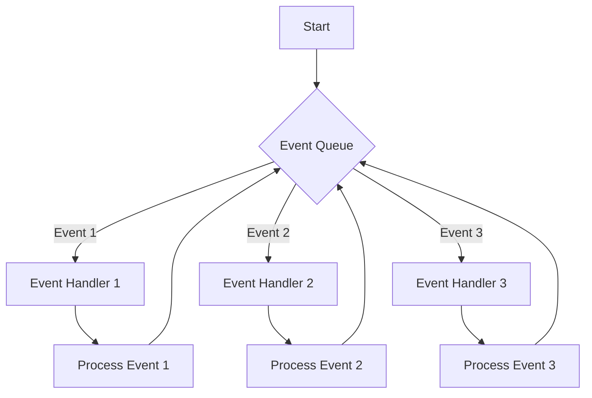
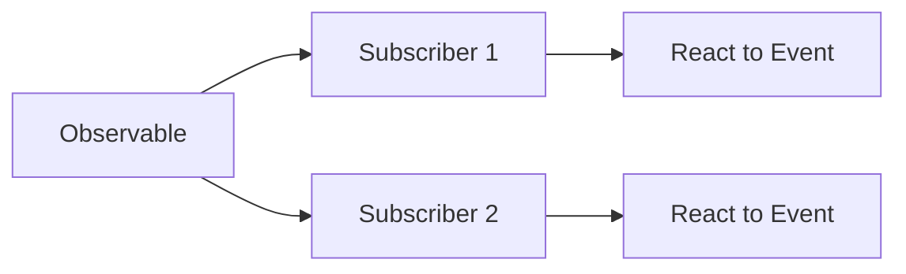

## 14.5 Event-Driven Programming Models

Event-driven programming is a paradigm that revolves around the occurrence of events and the responses to these events. In Julia, this model is particularly useful for building applications that require high responsiveness, such as graphical user interfaces (GUIs) and real-time systems. This section will delve into the core concepts of event-driven programming in Julia, including event loops, reactive programming, and practical use cases.

### Event Loops

An event loop is a programming construct that waits for and dispatches events or messages in a program. It is a central component in event-driven programming, enabling the handling of multiple events efficiently.

#### Handling Multiple Events

The primary role of an event loop is to manage multiple events by dispatching them to appropriate handlers. This is crucial in applications where multiple inputs or actions can occur simultaneously, such as user interactions in a GUI or incoming data streams in a real-time system.

**Key Concepts:**

- **Event Queue**: A data structure that holds events to be processed by the event loop.
- **Event Handlers**: Functions or methods that are triggered in response to specific events.
- **Dispatching**: The process of sending events from the queue to their corresponding handlers.

**Example: Basic Event Loop in Julia**

```julia
function handle_event(event)
    println("Handling event: $event")
end

function event_loop(events)
    for event in events
        handle_event(event)
    end
end

events = ["click", "keypress", "mousemove"]

event_loop(events)
```

In this example, we define a basic event loop that processes a list of events by calling a handler function for each event. This simple model can be extended to handle more complex scenarios, such as asynchronous events or events with different priorities.

#### Visualizing Event Loop Architecture



**Diagram Description:** This flowchart illustrates a basic event loop architecture where events are queued and dispatched to their respective handlers for processing.

### Reactive Programming

Reactive programming is a paradigm that focuses on data flows and the propagation of change. It is particularly useful in scenarios where the system needs to react to changes in data or events dynamically.

#### Observables and Subscriptions

In reactive programming, observables are data sources that emit events, and subscribers are entities that react to these events. This model allows for a declarative approach to handling data changes and events.

**Key Concepts:**

- **Observable**: A data source that emits events.
- **Subscription**: A mechanism to listen to events emitted by an observable.
- **Reactive Streams**: A sequence of events that can be processed asynchronously.

**Example: Reactive Programming with Observables in Julia**

```julia
using Reactive

observable = Signal(0)

function on_change(value)
    println("Value changed to: $value")
end

subscribe!(observable, on_change)

observable[] = 1
observable[] = 2
observable[] = 3
```

In this example, we use the `Reactive` package to create an observable and subscribe to it with a function that prints the new value whenever it changes. This demonstrates the core concept of reactive programming: reacting to data changes.

#### Visualizing Reactive Programming Flow



**Diagram Description:** This diagram shows the flow of events from an observable to multiple subscribers, each reacting to the events independently.

### Use Cases

Event-driven programming models are widely used in various applications, particularly those requiring high responsiveness and real-time processing.

#### GUI Applications

In graphical user interfaces, event-driven programming is essential for handling user interactions such as clicks, key presses, and mouse movements. The event loop continuously listens for these events and dispatches them to appropriate handlers, ensuring a responsive user experience.

**Example: GUI Event Handling**

```julia
using Gtk

win = GtkWindow("Event-Driven GUI", 400, 200)

button = GtkButton("Click Me")

function on_button_click(widget)
    println("Button clicked!")
end

signal_connect(on_button_click, button, "clicked")

push!(win, button)

showall(win)
```

In this example, we use the `Gtk` package to create a simple GUI application with a button. The button click event is connected to a handler function that prints a message when the button is clicked.

#### Real-time Systems

Real-time systems, such as those used in financial trading or industrial automation, require immediate responses to incoming data or events. Event-driven programming models enable these systems to process events as they occur, maintaining low latency and high throughput.

**Example: Real-time Data Processing**

```julia
using Sockets

server = listen(8080)

function handle_connection(client)
    while isopen(client)
        data = readline(client)
        println("Received data: $data")
    end
end

while true
    client = accept(server)
    @async handle_connection(client)
end
```

In this example, we create a simple socket server that listens for incoming connections and processes data in real-time. The event loop accepts connections and spawns asynchronous tasks to handle each connection, demonstrating the use of event-driven programming in real-time systems.

### Design Considerations

When implementing event-driven programming models in Julia, consider the following:

- **Concurrency**: Use Julia's built-in concurrency features, such as tasks and channels, to handle multiple events efficiently.
- **Scalability**: Design your event loop and handlers to scale with the number of events and subscribers.
- **Performance**: Optimize event processing to minimize latency and maximize throughput.
- **Error Handling**: Implement robust error handling to manage exceptions and ensure system stability.

### Differences and Similarities

Event-driven programming shares similarities with other asynchronous programming models, such as callback-based and promise-based models. However, it is distinct in its focus on events and the use of event loops to manage them. Reactive programming, a subset of event-driven programming, emphasizes data flows and change propagation.

### Try It Yourself

Experiment with the examples provided by modifying the event handlers or adding new events. Try creating a more complex GUI application or a real-time data processing system using the concepts discussed.

### Knowledge Check

- Explain the role of an event loop in event-driven programming.
- Describe how reactive programming differs from traditional event-driven programming.
- Provide an example of a real-world application that benefits from event-driven programming.

### Embrace the Journey

Remember, mastering event-driven programming in Julia is a journey. As you explore these concepts, you'll gain the skills to build responsive and efficient applications. Keep experimenting, stay curious, and enjoy the process!

## Quiz Time!



### What is the primary role of an event loop in event-driven programming?

- [x] To manage and dispatch events to appropriate handlers
- [ ] To execute synchronous code
- [ ] To handle only GUI events
- [ ] To manage memory allocation

> **Explanation:** The primary role of an event loop is to manage and dispatch events to appropriate handlers, ensuring efficient event processing.

### In reactive programming, what is an observable?

- [x] A data source that emits events
- [ ] A function that handles events
- [ ] A type of event loop
- [ ] A GUI component

> **Explanation:** An observable is a data source that emits events, allowing subscribers to react to changes.

### What package in Julia can be used for creating observables?

- [x] Reactive
- [ ] Gtk
- [ ] Sockets
- [ ] DataFrames

> **Explanation:** The `Reactive` package in Julia is used for creating observables and managing reactive streams.

### Which of the following is a key component of an event loop?

- [x] Event Queue
- [ ] DataFrame
- [ ] Observable
- [ ] Signal

> **Explanation:** An event queue is a key component of an event loop, holding events to be processed.

### What is the main advantage of using event-driven programming in GUI applications?

- [x] Responsiveness to user interactions
- [ ] Simplified code structure
- [ ] Reduced memory usage
- [ ] Increased data security

> **Explanation:** Event-driven programming enhances responsiveness to user interactions, making it ideal for GUI applications.

### How does reactive programming handle data changes?

- [x] By propagating changes through observables and subscribers
- [ ] By using synchronous function calls
- [ ] By storing changes in a database
- [ ] By ignoring changes until a refresh

> **Explanation:** Reactive programming handles data changes by propagating them through observables and subscribers, allowing dynamic reactions.

### What is a common use case for event-driven programming in real-time systems?

- [x] Processing incoming data streams
- [ ] Static data analysis
- [ ] Batch processing
- [ ] File storage management

> **Explanation:** Event-driven programming is commonly used in real-time systems to process incoming data streams efficiently.

### Which Julia package is used for creating GUI applications in the provided example?

- [x] Gtk
- [ ] Reactive
- [ ] Sockets
- [ ] Plots

> **Explanation:** The `Gtk` package is used for creating GUI applications in the provided example.

### What is a subscription in reactive programming?

- [x] A mechanism to listen to events emitted by an observable
- [ ] A function that emits events
- [ ] A type of event loop
- [ ] A data structure for storing events

> **Explanation:** A subscription is a mechanism to listen to events emitted by an observable, allowing reactions to data changes.

### True or False: Event-driven programming is only suitable for GUI applications.

- [ ] True
- [x] False

> **Explanation:** False. Event-driven programming is suitable for a wide range of applications, including real-time systems and data processing.


