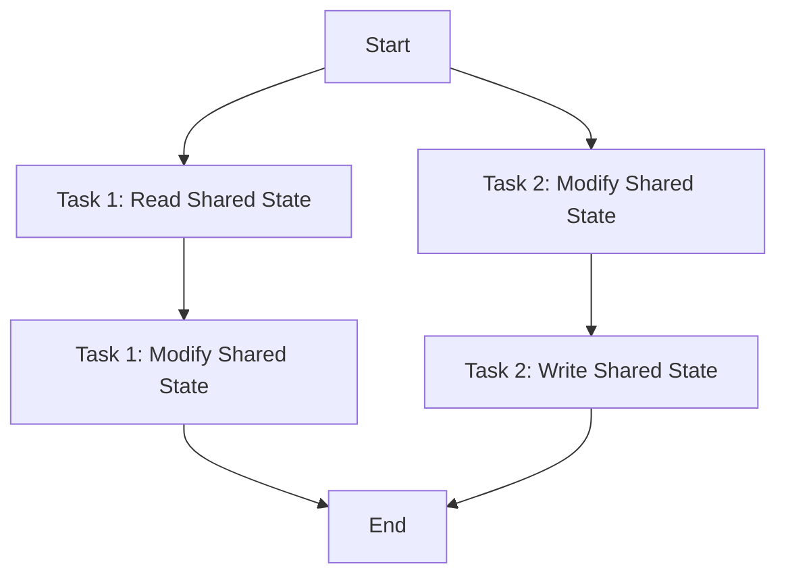

## 14.6 Managing Shared State and Avoiding Race Conditions

In the realm of concurrent programming, managing shared state and avoiding race conditions are paramount to ensuring data integrity and application reliability. Julia, with its rich concurrency model, provides several tools and techniques to help developers navigate these challenges effectively. In this section, we will delve into the intricacies of shared state management, explore the benefits of immutability, and provide strategies for debugging concurrency issues.

### Data Integrity

Data integrity is a critical aspect of concurrent programming. When multiple tasks or threads access shared data, ensuring that this data remains consistent and correct is essential. Let's explore how to design programs for safety by minimizing shared mutable state.

#### Designing for Safety

To design safe concurrent programs, it's crucial to minimize shared mutable state. By reducing the amount of data that multiple threads can modify simultaneously, we can significantly decrease the likelihood of race conditions. Here are some strategies to achieve this:

1. **Encapsulation**: Encapsulate shared data within a module or a struct, exposing only necessary operations. This limits direct access to the data and allows you to control modifications through well-defined interfaces.

2. **Functional Programming Techniques**: Embrace functional programming paradigms, which emphasize immutability and pure functions. By avoiding side effects and mutable state, you can create more predictable and safer concurrent programs.

3. **Locking Mechanisms**: Use locks, mutexes, or other synchronization primitives to control access to shared resources. While this can prevent race conditions, it may also introduce performance bottlenecks if not used judiciously.

4. **Task Local Storage**: Where possible, use task-local storage to keep data isolated within individual tasks, reducing the need for shared state.

#### Immutability

Immutability is a powerful concept in concurrent programming. By using immutable data structures, you can eliminate many of the risks associated with shared mutable state.

##### Immutable Types in Julia

Julia provides robust support for immutable types, which can be a game-changer in concurrent programming. Let's explore the benefits of using immutable data structures in Julia:

- **Thread Safety**: Immutable objects are inherently thread-safe because they cannot be modified after creation. This eliminates the need for locks or other synchronization mechanisms when accessing shared data.

- **Predictability**: Immutable data structures lead to more predictable code, as their state cannot change unexpectedly. This makes reasoning about your program's behavior easier, especially in a concurrent environment.

- **Performance**: In some cases, immutable data structures can offer performance benefits. Julia's compiler can optimize immutable objects more effectively, leading to faster execution times.

Here's a simple example of using immutable types in Julia:

```julia
struct Point
    x::Float64
    y::Float64
end

p = Point(3.0, 4.0)

# p.x = 5.0  # This will throw an error
```

By using immutable types like `Point`, you can ensure that once an object is created, its state remains constant, thus avoiding race conditions.

### Debugging Concurrency Issues

Despite best efforts, concurrency issues such as race conditions can still arise. Detecting and resolving these issues is crucial for building robust applications.

#### Tools and Techniques

Julia offers several tools and techniques to help you debug concurrency issues effectively:

1. **Logging**: Implement logging throughout your code to track the execution flow and identify potential race conditions. By logging access to shared resources, you can pinpoint where conflicts occur.

2. **Debugger.jl**: Use the `Debugger.jl` package to step through your code and inspect the state of variables at different points in time. This can help you identify unexpected changes in shared state.

3. **Thread Sanitizers**: Consider using thread sanitizers, which are tools designed to detect data races and other concurrency issues. While not specific to Julia, these tools can be integrated into your development workflow.

4. **Unit Tests**: Write comprehensive unit tests that cover concurrent scenarios. By simulating concurrent access to shared resources, you can catch race conditions early in the development process.

5. **Code Review**: Conduct thorough code reviews with a focus on concurrency. Having another set of eyes can help identify potential issues that you might have missed.

Let's look at a simple example of using logging to detect race conditions:

```julia
using Logging

counter = 0

function increment_counter()
    global counter
    @info "Incrementing counter from $counter"
    counter += 1
    @info "Counter incremented to $counter"
end

Threads.@threads for i in 1:10
    increment_counter()
end
```

In this example, logging is used to track changes to the `counter` variable. By examining the logs, you can identify if multiple threads are accessing the counter simultaneously, leading to race conditions.

### Visualizing Concurrency

To better understand the flow of concurrent operations and the potential for race conditions, let's visualize a simple scenario using a flowchart.



**Figure 1: Visualizing Concurrent Access to Shared State**

In this diagram, Task 1 and Task 2 both interact with the shared state. If Task 1 reads the state before Task 2 modifies it, a race condition may occur, leading to inconsistent results.

### Try It Yourself

To solidify your understanding of managing shared state and avoiding race conditions, try modifying the code examples provided. Experiment with different synchronization mechanisms, such as locks or atomic operations, to see how they affect the program's behavior.

### Knowledge Check

- **What are the benefits of using immutable types in concurrent programming?**
- **How can logging help in detecting race conditions?**
- **What are some strategies for minimizing shared mutable state?**

### Embrace the Journey

Remember, mastering concurrency and avoiding race conditions is a journey. As you continue to explore Julia's concurrency model, you'll develop a deeper understanding of how to build safe and efficient concurrent programs. Keep experimenting, stay curious, and enjoy the process!

## Quiz Time!



### What is a primary benefit of using immutable types in concurrent programming?

- [x] They are inherently thread-safe.
- [ ] They are easier to modify.
- [ ] They require more memory.
- [ ] They are slower to access.

> **Explanation:** Immutable types are inherently thread-safe because they cannot be modified after creation, eliminating the need for synchronization mechanisms.

### Which tool can help you step through your code and inspect variable states in Julia?

- [x] Debugger.jl
- [ ] Logger.jl
- [ ] ThreadSanitizer
- [ ] BenchmarkTools.jl

> **Explanation:** Debugger.jl allows you to step through your code and inspect variable states, which is useful for identifying concurrency issues.

### What is a common strategy to minimize shared mutable state?

- [x] Encapsulation
- [ ] Global variables
- [ ] Increasing thread count
- [ ] Using more memory

> **Explanation:** Encapsulation limits direct access to shared data, allowing modifications through well-defined interfaces, thus minimizing shared mutable state.

### How can logging be used to detect race conditions?

- [x] By tracking execution flow and resource access
- [ ] By increasing execution speed
- [ ] By reducing memory usage
- [ ] By simplifying code structure

> **Explanation:** Logging helps track execution flow and resource access, allowing you to identify where conflicts occur in concurrent scenarios.

### Which of the following is NOT a benefit of using immutable data structures?

- [ ] Thread safety
- [ ] Predictability
- [ ] Performance optimization
- [x] Increased mutability

> **Explanation:** Immutable data structures are not mutable, which is why they are thread-safe and predictable, but they do not offer increased mutability.

### What is a race condition?

- [x] A situation where the outcome depends on the sequence of events
- [ ] A condition that improves performance
- [ ] A method to increase thread count
- [ ] A type of data structure

> **Explanation:** A race condition occurs when the outcome of a program depends on the sequence or timing of uncontrollable events, often leading to unpredictable results.

### Which synchronization mechanism can be used to control access to shared resources?

- [x] Locks
- [ ] Global variables
- [ ] Immutable types
- [ ] Logging

> **Explanation:** Locks are used to control access to shared resources, preventing multiple threads from modifying the resource simultaneously.

### What is the role of unit tests in concurrent programming?

- [x] To simulate concurrent access and catch race conditions
- [ ] To increase code execution speed
- [ ] To reduce memory usage
- [ ] To simplify code structure

> **Explanation:** Unit tests simulate concurrent access to shared resources, helping to catch race conditions early in the development process.

### What does encapsulation help achieve in concurrent programming?

- [x] Limits direct access to shared data
- [ ] Increases code complexity
- [ ] Reduces execution speed
- [ ] Increases memory usage

> **Explanation:** Encapsulation limits direct access to shared data, allowing modifications through well-defined interfaces, thus minimizing shared mutable state.

### True or False: Immutable types in Julia can be modified after creation.

- [ ] True
- [x] False

> **Explanation:** Immutable types in Julia cannot be modified after creation, which makes them inherently thread-safe and predictable.


