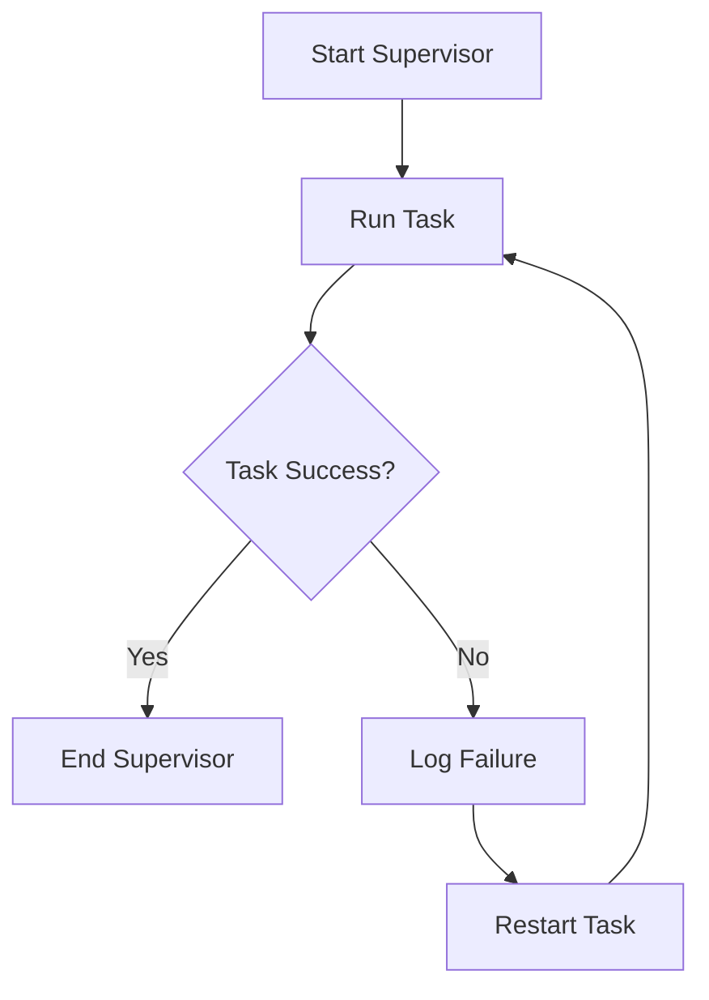

## 14.7 Patterns for Fault Tolerance and Resilience

In the world of software development, ensuring that applications can withstand and recover from faults is crucial. Julia, with its rich set of features for concurrency and parallelism, provides various patterns for building fault-tolerant and resilient systems. In this section, we'll explore key concepts and patterns that help achieve fault tolerance and resilience in Julia applications.

### Error Handling in Concurrency

Concurrency introduces complexity in error handling. When multiple tasks run simultaneously, failures in one task can affect others. Let's explore how to handle errors gracefully in concurrent Julia applications.

#### Graceful Degradation

Graceful degradation is a design approach where a system continues to operate, albeit at a reduced level of functionality, when part of it fails. This pattern is essential for maintaining service availability and user satisfaction.

- **Designing for Graceful Degradation**: Identify critical and non-critical components in your application. Ensure that failures in non-critical components do not impact the overall system functionality.

- **Example**: Consider a web service that processes user requests. If a non-essential logging service fails, the main service should still handle user requests without interruption.

```julia
function process_request(request)
    try
        # Main processing logic
        println("Processing request: ", request)
        # Simulate a non-critical failure
        log_request(request)
    catch e
        println("Warning: Failed to log request - ", e)
    end
end

function log_request(request)
    # Simulate a failure
    error("Logging service unavailable")
end

process_request("User request data")
```

In this example, the `process_request` function continues to process the request even if the `log_request` function fails.

#### Supervision Strategies

Supervision strategies involve monitoring tasks and taking corrective actions when failures occur. This pattern is crucial for maintaining system stability and reliability.

- **Monitoring Tasks**: Use Julia's task management features to monitor and restart failed tasks.

- **Example**: Implement a simple supervisor that restarts a task if it fails.

```julia
function supervised_task()
    try
        # Simulate task work
        println("Task running...")
        error("Simulated task failure")
    catch e
        println("Task failed: ", e)
        return false
    end
    return true
end

function supervisor()
    while true
        success = supervised_task()
        if !success
            println("Restarting task...")
            sleep(1)  # Delay before restart
        else
            break
        end
    end
end

supervisor()
```

In this example, the `supervisor` function continuously monitors the `supervised_task` and restarts it upon failure.

### Resilience Patterns

Resilience patterns focus on isolating failures and preventing cascading errors. These patterns are essential for building robust systems that can recover from faults.

#### Bulkheads

The bulkhead pattern involves isolating different parts of a system to prevent failures in one part from affecting others. This pattern is inspired by ship design, where compartments are isolated to prevent flooding.

- **Implementing Bulkheads**: Divide your application into isolated components with limited interaction. Use separate processes or threads for each component.

- **Example**: Use Julia's `Distributed` module to run tasks in separate processes.

```julia
using Distributed

addprocs(2)

@everywhere function isolated_task(id)
    try
        println("Task $id running on process $(myid())")
        if id == 1
            error("Simulated failure in task $id")
        end
    catch e
        println("Task $id failed: ", e)
    end
end

@distributed for i in 1:2
    isolated_task(i)
end
```

In this example, tasks are run in separate processes, isolating failures and preventing them from affecting each other.

#### Timeouts

Timeouts are used to limit the time a task can take to complete. This pattern prevents tasks from hanging indefinitely and affecting system responsiveness.

- **Implementing Timeouts**: Use Julia's `Base.Timeout` to specify a maximum execution time for tasks.

- **Example**: Implement a timeout for a long-running task.

```julia
using Base: @async, sleep, timeout

function long_running_task()
    println("Starting long-running task...")
    sleep(5)  # Simulate long computation
    println("Task completed")
end

try
    timeout(2) do
        long_running_task()
    end
catch e
    println("Task timed out: ", e)
end
```

In this example, the `long_running_task` is terminated if it exceeds the specified timeout.

### Visualizing Fault Tolerance Patterns

To better understand the flow of fault tolerance patterns, let's visualize the supervision strategy using a flowchart.



**Figure 1**: Supervision Strategy Flowchart

This flowchart illustrates the process of monitoring a task, logging failures, and restarting the task if necessary.

### Design Considerations

When implementing fault tolerance and resilience patterns in Julia, consider the following:

- **Performance Impact**: Fault tolerance mechanisms can introduce overhead. Balance resilience with performance requirements.
- **Complexity**: Introducing fault tolerance can increase system complexity. Use patterns judiciously and document your design.
- **Testing**: Thoroughly test fault tolerance mechanisms to ensure they work as expected under various failure scenarios.

### Differences and Similarities

Fault tolerance and resilience patterns are often confused with each other. While both aim to improve system reliability, fault tolerance focuses on handling failures gracefully, whereas resilience emphasizes recovery and maintaining service continuity.

### Try It Yourself

Experiment with the provided code examples by modifying them to simulate different failure scenarios. For instance, try changing the failure conditions in the `supervised_task` or adjust the timeout duration in the `long_running_task`.

### Knowledge Check

- What is the difference between fault tolerance and resilience?
- How does the bulkhead pattern help in building resilient systems?
- Why is it important to implement timeouts in concurrent applications?

### Embrace the Journey

Remember, building fault-tolerant and resilient systems is an ongoing process. As you gain experience, you'll develop a deeper understanding of these patterns and their applications. Keep experimenting, stay curious, and enjoy the journey!

## Quiz Time!



### What is the primary goal of graceful degradation?

- [x] To ensure the system continues operating at a reduced level of functionality during failures.
- [ ] To completely shut down the system when a failure occurs.
- [ ] To increase the system's performance during failures.
- [ ] To ignore any failures and continue as normal.

> **Explanation:** Graceful degradation aims to maintain system functionality, even if it's reduced, during failures.

### Which pattern involves isolating different parts of a system to prevent cascading failures?

- [x] Bulkheads
- [ ] Supervision
- [ ] Graceful Degradation
- [ ] Timeouts

> **Explanation:** The bulkhead pattern isolates system components to prevent failures in one part from affecting others.

### How can you implement a timeout in a Julia task?

- [x] Using `Base.Timeout` to specify a maximum execution time.
- [ ] By manually checking the task's execution time.
- [ ] By using a separate thread to monitor the task.
- [ ] By setting a global timeout variable.

> **Explanation:** `Base.Timeout` is used to specify a maximum execution time for tasks in Julia.

### What is the role of a supervisor in fault tolerance?

- [x] To monitor tasks and restart them if they fail.
- [ ] To execute tasks in parallel.
- [ ] To log all task activities.
- [ ] To improve task performance.

> **Explanation:** A supervisor monitors tasks and takes corrective actions, such as restarting, when failures occur.

### Which of the following is a benefit of using the bulkhead pattern?

- [x] It prevents cascading failures.
- [ ] It increases system performance.
- [ ] It simplifies system design.
- [ ] It reduces the need for error handling.

> **Explanation:** The bulkhead pattern prevents failures in one part of the system from affecting others, thus preventing cascading failures.

### What is a potential downside of implementing fault tolerance mechanisms?

- [x] Increased system complexity.
- [ ] Reduced system reliability.
- [ ] Decreased system availability.
- [ ] Increased system performance.

> **Explanation:** Fault tolerance mechanisms can increase system complexity, requiring careful design and documentation.

### How does the supervision strategy contribute to system resilience?

- [x] By monitoring tasks and taking corrective actions upon failure.
- [ ] By isolating tasks in separate processes.
- [ ] By reducing task execution time.
- [ ] By ignoring minor task failures.

> **Explanation:** Supervision strategies involve monitoring tasks and restarting them if they fail, contributing to system resilience.

### What is the purpose of using timeouts in concurrent applications?

- [x] To prevent tasks from hanging indefinitely.
- [ ] To increase task execution speed.
- [ ] To log task activities.
- [ ] To reduce system complexity.

> **Explanation:** Timeouts prevent tasks from hanging indefinitely, ensuring system responsiveness.

### True or False: Resilience focuses on handling failures gracefully.

- [ ] True
- [x] False

> **Explanation:** Resilience emphasizes recovery and maintaining service continuity, while fault tolerance focuses on handling failures gracefully.

### Which pattern is inspired by ship design?

- [x] Bulkheads
- [ ] Supervision
- [ ] Graceful Degradation
- [ ] Timeouts

> **Explanation:** The bulkhead pattern is inspired by ship design, where compartments are isolated to prevent flooding.


