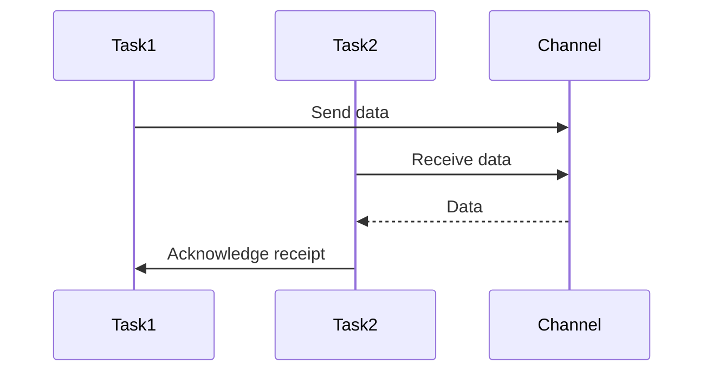

## 14.8 Best Practices for Concurrent Programming

Concurrent programming is a powerful paradigm that allows developers to write programs that can perform multiple tasks simultaneously. In Julia, this is achieved through the use of tasks, coroutines, and channels, which enable efficient management of concurrent operations. In this section, we will explore best practices for concurrent programming in Julia, focusing on avoiding deadlocks, stress testing, and minimizing overhead for optimal performance.

### Understanding Concurrency in Julia

Before diving into best practices, let's briefly understand how concurrency is implemented in Julia. Julia provides a rich set of tools for concurrent programming, including:

- **Tasks**: Lightweight coroutines that allow for cooperative multitasking.
- **Channels**: Used for communication between tasks, enabling data exchange and synchronization.
- **Asynchronous I/O**: Allows non-blocking operations, freeing up tasks to perform other work while waiting for I/O operations to complete.

These tools enable developers to write efficient and scalable concurrent programs. However, with great power comes great responsibility, and it's crucial to follow best practices to avoid common pitfalls.

### Design Guidelines

#### Avoiding Deadlocks

Deadlocks occur when two or more tasks are waiting for each other to release resources, resulting in a standstill. To avoid deadlocks in Julia:

- **Careful Ordering of Locks and Resources**: Always acquire locks in a consistent order across tasks. This prevents circular wait conditions, which are a common cause of deadlocks.

```julia
lock1 = ReentrantLock()
lock2 = ReentrantLock()

function safe_function()
    lock(lock1) do
        lock(lock2) do
            # Critical section
            println("Locks acquired in order")
        end
    end
end
```

- **Timeouts and Deadlock Detection**: Implement timeouts for lock acquisition to detect potential deadlocks. If a lock cannot be acquired within a specified time, handle the situation gracefully.

```julia
function try_lock_with_timeout(lock, timeout)
    start_time = time()
    while !trylock(lock)
        if time() - start_time > timeout
            println("Timeout reached, potential deadlock detected")
            return false
        end
        sleep(0.1) # Sleep briefly before retrying
    end
    return true
end
```

#### Testing Concurrent Programs

Testing concurrent programs can be challenging due to the non-deterministic nature of task scheduling. To ensure the reliability of your concurrent programs, consider the following:

- **Stress Testing**: Simulate high-load conditions to identify issues that may not surface under normal operation. This involves running your program with a large number of tasks and data to uncover race conditions and deadlocks.

```julia
function stress_test_concurrent_function()
    tasks = []
    for i in 1:1000
        push!(tasks, @async begin
            # Simulate workload
            sleep(rand())
            println("Task $i completed")
        end)
    end
    wait.(tasks) # Wait for all tasks to complete
end
```

- **Deterministic Testing**: Use deterministic testing frameworks to control task scheduling and reproduce specific scenarios. This helps in identifying and fixing concurrency-related bugs.

#### Performance Considerations

Concurrent programming can introduce overhead, which may negate the performance benefits if not managed properly. Here are some tips to minimize overhead:

- **Minimizing Context Switching**: Excessive context switching between tasks can degrade performance. Group related operations within a single task to reduce context switches.

```julia
function process_data_in_batches(data)
    batch_size = 100
    for i in 1:batch_size:length(data)
        @async begin
            # Process a batch of data
            batch = data[i:min(i+batch_size-1, end)]
            println("Processing batch starting at index $i")
        end
    end
end
```

- **Balancing Complexity and Gains**: Evaluate the complexity added by concurrency against the performance gains. In some cases, a simpler sequential approach may be more efficient.

### Visualizing Concurrency in Julia

To better understand the flow of concurrent operations in Julia, let's visualize the interaction between tasks and channels using a Mermaid.js sequence diagram.



**Diagram Description**: This sequence diagram illustrates the interaction between two tasks using a channel. Task1 sends data to the channel, which is then received by Task2. Task2 acknowledges the receipt back to Task1.

### Key Takeaways

- **Avoid Deadlocks**: Use consistent lock ordering and implement timeouts for lock acquisition.
- **Test Thoroughly**: Conduct stress testing and use deterministic testing frameworks to identify concurrency issues.
- **Optimize Performance**: Minimize context switching and balance the complexity of concurrency with performance gains.

### Try It Yourself

Experiment with the provided code examples by modifying the number of tasks or the data being processed. Observe how these changes impact performance and identify potential concurrency issues.

### References and Further Reading

- [Julia Documentation on Concurrency](https://docs.julialang.org/en/v1/manual/concurrency/)
- [Concurrency in Julia: A Practical Guide](https://julialang.org/blog/2019/07/multithreading/)
- [Effective Concurrency in Julia](https://julialang.org/blog/2020/03/parallel-computing/)

### Embrace the Journey

Remember, mastering concurrent programming in Julia is a journey. As you progress, you'll develop more efficient and scalable applications. Keep experimenting, stay curious, and enjoy the process!

## Quiz Time!



### What is a deadlock in concurrent programming?

- [x] A situation where two or more tasks wait indefinitely for each other to release resources.
- [ ] A method to optimize task execution.
- [ ] A type of error in sequential programming.
- [ ] A technique for improving performance.

> **Explanation:** A deadlock occurs when tasks are waiting for each other to release resources, causing a standstill.

### How can you avoid deadlocks in Julia?

- [x] By acquiring locks in a consistent order.
- [ ] By using more tasks.
- [ ] By increasing the number of channels.
- [ ] By reducing the number of locks.

> **Explanation:** Acquiring locks in a consistent order prevents circular wait conditions, reducing the risk of deadlocks.

### What is the purpose of stress testing in concurrent programming?

- [x] To simulate high-load conditions and identify potential issues.
- [ ] To improve the readability of code.
- [ ] To reduce the number of tasks.
- [ ] To simplify the program structure.

> **Explanation:** Stress testing helps uncover issues like race conditions and deadlocks by simulating high-load conditions.

### Which tool in Julia is used for communication between tasks?

- [x] Channels
- [ ] Locks
- [ ] Arrays
- [ ] Functions

> **Explanation:** Channels are used for communication and synchronization between tasks in Julia.

### What is the benefit of minimizing context switching in concurrent programs?

- [x] It reduces overhead and improves performance.
- [ ] It increases the number of tasks.
- [ ] It simplifies the code structure.
- [ ] It enhances code readability.

> **Explanation:** Minimizing context switching reduces overhead, leading to better performance in concurrent programs.

### What is the role of asynchronous I/O in Julia?

- [x] It allows non-blocking operations, freeing up tasks for other work.
- [ ] It increases the number of tasks.
- [ ] It simplifies the code structure.
- [ ] It enhances code readability.

> **Explanation:** Asynchronous I/O enables non-blocking operations, allowing tasks to perform other work while waiting for I/O operations to complete.

### How can you detect potential deadlocks in Julia?

- [x] By implementing timeouts for lock acquisition.
- [ ] By increasing the number of tasks.
- [ ] By reducing the number of channels.
- [ ] By simplifying the program structure.

> **Explanation:** Implementing timeouts for lock acquisition helps detect potential deadlocks by identifying when a lock cannot be acquired within a specified time.

### What is the advantage of using deterministic testing frameworks?

- [x] They help control task scheduling and reproduce specific scenarios.
- [ ] They increase the number of tasks.
- [ ] They simplify the code structure.
- [ ] They enhance code readability.

> **Explanation:** Deterministic testing frameworks allow for controlled task scheduling, helping identify and fix concurrency-related bugs.

### Which of the following is a key takeaway for optimizing performance in concurrent programs?

- [x] Minimize context switching and balance complexity with performance gains.
- [ ] Increase the number of tasks.
- [ ] Simplify the code structure.
- [ ] Enhance code readability.

> **Explanation:** Minimizing context switching and balancing complexity with performance gains are crucial for optimizing performance in concurrent programs.

### True or False: Concurrent programming always improves performance.

- [ ] True
- [x] False

> **Explanation:** Concurrent programming can introduce overhead, and in some cases, a simpler sequential approach may be more efficient.


