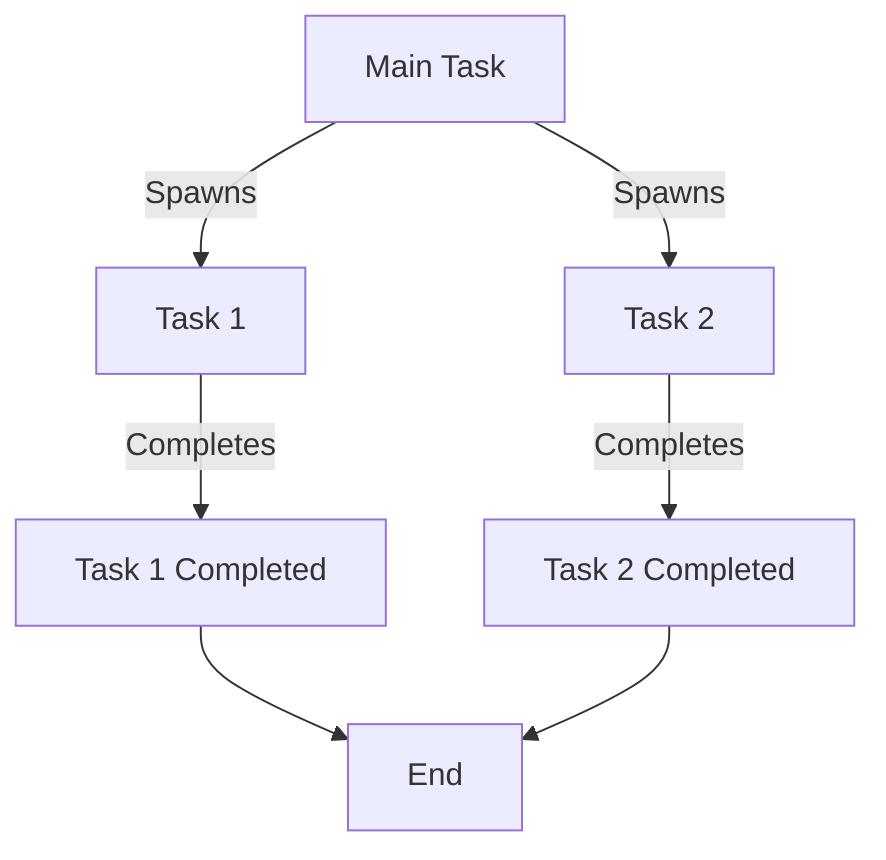

## 14.9 Debugging Concurrent Applications

Debugging concurrent applications can be a challenging task due to the inherent complexity of managing multiple tasks that execute simultaneously. In this section, we will explore the tools and strategies available in Julia to effectively debug concurrent applications. We will also discuss common pitfalls, such as Heisenbugs, and how to mitigate them through deterministic testing and other techniques.

### Understanding Concurrency in Julia

Before diving into debugging, it's essential to understand how concurrency works in Julia. Julia provides several constructs for concurrent programming, including tasks (coroutines), channels, and asynchronous I/O. These constructs allow developers to write programs that can perform multiple operations simultaneously, improving performance and responsiveness.

### Tools for Concurrency Debugging

#### Logging

Logging is a fundamental tool for debugging concurrent applications. By recording detailed logs of task activity, developers can trace the execution flow and identify issues. In Julia, the `Logging` standard library provides a flexible and efficient way to log messages at various levels (e.g., debug, info, warn, error).

```julia
using Logging

function concurrent_function()
    @info "Starting concurrent function"
    # Simulate some work
    sleep(1)
    @info "Finished concurrent function"
end

task = @async concurrent_function()
```

In the example above, we use the `@info` macro to log messages at the info level. These logs help us trace when the concurrent function starts and finishes.

#### Debuggers

Debuggers are invaluable for inspecting the state of a program at runtime. `Debugger.jl` is a powerful tool for debugging Julia code, including concurrent applications. It allows you to set breakpoints, step through code, and inspect variables.

To use `Debugger.jl` in a concurrent context, you need to be aware of the task-based execution model. You can attach the debugger to specific tasks to monitor their execution.

```julia
using Debugger

function debug_concurrent_function()
    @info "Debugging concurrent function"
    # Simulate some work
    sleep(1)
    @info "Finished debugging"
end

@enter debug_concurrent_function()
```

By using `@enter`, you can step into the `debug_concurrent_function` and examine its execution in detail.

### Common Pitfalls in Concurrent Applications

#### Heisenbugs

Heisenbugs are timing-sensitive bugs that are notoriously difficult to reproduce. They often arise in concurrent applications due to race conditions, where the outcome of a program depends on the relative timing of events.

To mitigate Heisenbugs, consider the following strategies:

- **Use Locks and Synchronization Primitives**: Ensure that shared resources are accessed in a thread-safe manner.
- **Avoid Global State**: Minimize the use of global variables that can be modified by multiple tasks.
- **Test Under Different Conditions**: Run your application under various conditions to increase the likelihood of exposing timing issues.

#### Race Conditions

Race conditions occur when two or more tasks access shared data concurrently, and the final outcome depends on the order of execution. These can lead to inconsistent or incorrect results.

To prevent race conditions:

- **Use Atomic Operations**: Ensure that operations on shared data are atomic, meaning they are completed without interruption.
- **Employ Channels**: Use channels to safely communicate between tasks and avoid direct access to shared data.

### Strategies for Debugging Concurrent Applications

#### Deterministic Testing

Deterministic testing involves controlling the scheduling of tasks to ensure reproducibility. By making the execution order predictable, you can more easily identify and fix concurrency issues.

```julia
using Base.Threads

function deterministic_test()
    @info "Starting deterministic test"
    # Control task scheduling
    @sync begin
        @spawn begin
            sleep(1)
            @info "Task 1 completed"
        end
        @spawn begin
            sleep(2)
            @info "Task 2 completed"
        end
    end
    @info "Deterministic test finished"
end

deterministic_test()
```

In this example, we use `@sync` and `@spawn` to control the execution order of tasks, ensuring that `Task 1` completes before `Task 2`.

#### Visualizing Task Execution

Visualizing the execution of tasks can provide insights into the behavior of concurrent applications. Use tools like `ProfileView.jl` to generate flame graphs that show the time spent in different parts of your code.

```julia
using Profile
using ProfileView

function profile_concurrent_function()
    @info "Profiling concurrent function"
    @profile begin
        # Simulate some work
        sleep(1)
    end
    ProfileView.view()
end

profile_concurrent_function()
```

The flame graph generated by `ProfileView.view()` helps identify performance bottlenecks and understand task execution patterns.

### Try It Yourself

Experiment with the code examples provided in this section. Try modifying the sleep durations in the `deterministic_test` function to observe how it affects the execution order. Use `Debugger.jl` to step through the `debug_concurrent_function` and explore its behavior.

### Visualizing Concurrency in Julia

To better understand concurrency in Julia, let's visualize the flow of tasks using a Mermaid.js diagram.



**Figure 1: Task Execution Flow in a Concurrent Application**

This diagram illustrates the flow of tasks in a concurrent application. The main task spawns `Task 1` and `Task 2`, which complete independently before reaching the end.

### References and Further Reading

- [Julia Documentation on Concurrency](https://docs.julialang.org/en/v1/manual/parallel-computing/)
- [Logging in Julia](https://docs.julialang.org/en/v1/stdlib/Logging/)
- [Debugger.jl GitHub Repository](https://github.com/JuliaDebug/Debugger.jl)
- [ProfileView.jl GitHub Repository](https://github.com/timholy/ProfileView.jl)

### Knowledge Check

- What are Heisenbugs, and how can you mitigate them in concurrent applications?
- How does deterministic testing help in debugging concurrent applications?
- What tools can you use to visualize task execution in Julia?

### Embrace the Journey

Debugging concurrent applications can be complex, but with the right tools and strategies, you can master it. Remember, this is just the beginning. As you progress, you'll build more robust and reliable concurrent applications. Keep experimenting, stay curious, and enjoy the journey!

## Quiz Time!



### What is a Heisenbug?

- [x] A timing-sensitive bug that is hard to reproduce
- [ ] A bug that occurs only in single-threaded applications
- [ ] A bug that is easy to fix
- [ ] A bug related to memory leaks

> **Explanation:** Heisenbugs are timing-sensitive bugs that are difficult to reproduce, often occurring in concurrent applications due to race conditions.

### Which tool can be used for logging in Julia?

- [x] Logging
- [ ] Debugger.jl
- [ ] ProfileView.jl
- [ ] DataFrames.jl

> **Explanation:** The `Logging` standard library in Julia provides a flexible way to log messages at various levels.

### How can deterministic testing help in debugging?

- [x] By controlling task scheduling for reproducibility
- [ ] By increasing the randomness of task execution
- [ ] By eliminating all bugs automatically
- [ ] By reducing the need for logging

> **Explanation:** Deterministic testing involves controlling task scheduling to ensure reproducibility, making it easier to identify and fix concurrency issues.

### What is the purpose of using channels in concurrent applications?

- [x] To safely communicate between tasks
- [ ] To increase the speed of task execution
- [ ] To reduce memory usage
- [ ] To eliminate the need for synchronization

> **Explanation:** Channels are used to safely communicate between tasks, avoiding direct access to shared data and preventing race conditions.

### Which tool can be used to visualize task execution in Julia?

- [x] ProfileView.jl
- [ ] Logging
- [ ] Debugger.jl
- [ ] DataFrames.jl

> **Explanation:** `ProfileView.jl` generates flame graphs that help identify performance bottlenecks and understand task execution patterns.

### What is the role of `@sync` in deterministic testing?

- [x] To control the execution order of tasks
- [ ] To increase the randomness of task execution
- [ ] To eliminate all bugs automatically
- [ ] To reduce the need for logging

> **Explanation:** `@sync` is used to control the execution order of tasks, ensuring that certain tasks complete before others.

### How can you prevent race conditions in concurrent applications?

- [x] Use atomic operations
- [x] Employ channels
- [ ] Increase the number of tasks
- [ ] Avoid using locks

> **Explanation:** Using atomic operations and employing channels are effective ways to prevent race conditions by ensuring safe access to shared data.

### What is the benefit of using `Debugger.jl` in concurrent applications?

- [x] It allows you to set breakpoints and inspect variables
- [ ] It automatically fixes all bugs
- [ ] It increases the speed of task execution
- [ ] It reduces memory usage

> **Explanation:** `Debugger.jl` allows you to set breakpoints, step through code, and inspect variables, making it a valuable tool for debugging concurrent applications.

### What is a common pitfall in concurrent applications?

- [x] Race conditions
- [ ] Increased memory usage
- [ ] Reduced task execution speed
- [ ] Lack of logging

> **Explanation:** Race conditions are a common pitfall in concurrent applications, occurring when tasks access shared data concurrently without proper synchronization.

### True or False: Logging is not useful in debugging concurrent applications.

- [ ] True
- [x] False

> **Explanation:** False. Logging is a fundamental tool for debugging concurrent applications, as it helps trace the execution flow and identify issues.


