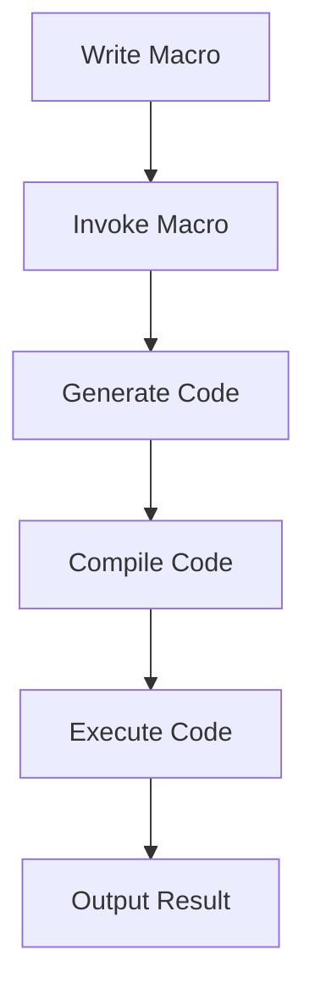

## 15.1 Introduction to Metaprogramming Concepts

Metaprogramming is a powerful programming paradigm that allows developers to write code that can generate, modify, or transform other code. In Julia, metaprogramming is a core feature that leverages the language's dynamic nature, enabling developers to create more abstract, reusable, and expressive code. However, with great power comes great responsibility, as metaprogramming can also introduce complexity and potential pitfalls if not used judiciously.

### What is Metaprogramming?

Metaprogramming involves writing programs that can manipulate other programs or themselves. This concept is akin to writing a script that writes scripts, allowing for a high degree of automation and abstraction. In Julia, metaprogramming is primarily achieved through macros and the manipulation of Julia's Abstract Syntax Tree (AST).

#### Code Manipulating Code

At its core, metaprogramming is about code that can manipulate code. This can involve generating new code, transforming existing code, or even analyzing code to optimize or modify its behavior. In Julia, this is facilitated by the language's ability to treat code as data, allowing developers to inspect and modify code structures programmatically.

```julia
macro sayhello(name)
    return :(println("Hello, ", $name))
end

@sayhello "Julia"
```

In the example above, the `@sayhello` macro takes a name and generates code that prints a greeting. This is a simple demonstration of how macros can be used to generate code dynamically.

### Advantages of Metaprogramming

Metaprogramming offers several advantages, particularly in terms of abstraction and reusability. By allowing developers to write code that writes code, metaprogramming can reduce boilerplate, increase expressiveness, and enable more flexible and adaptable software designs.

#### Abstraction and Reusability

One of the primary benefits of metaprogramming is its ability to abstract complex patterns and make code more reusable. By encapsulating repetitive patterns into macros or code-generating functions, developers can write more concise and maintainable code.

```julia
macro define_accessors(struct_name, field_name)
    quote
        function get_$(field_name)(obj::$struct_name)
            return obj.$field_name
        end

        function set_$(field_name)(obj::$struct_name, value)
            obj.$field_name = value
        end
    end
end

struct Person
    name::String
    age::Int
end

@define_accessors(Person, name)
@define_accessors(Person, age)

p = Person("Alice", 30)
println(get_name(p))  # Output: Alice
set_age(p, 31)
println(get_age(p))   # Output: 31
```

In this example, the `@define_accessors` macro generates getter and setter functions for the fields of a struct, reducing the need to manually write these functions for each field.

### Risks and Considerations

While metaprogramming offers powerful capabilities, it also introduces risks and considerations that developers must be aware of. The primary concern is the potential for increased complexity, which can make code harder to understand, maintain, and debug.

#### Complexity

Metaprogramming can lead to code that is difficult to read and understand, especially for developers who are not familiar with the metaprogramming constructs used. This can result in code that is more prone to errors and harder to maintain.

```julia
macro complex_example(expr)
    return :(println("Evaluating: ", $(string(expr)), " = ", $expr))
end

@complex_example 3 + 4 * 2
```

In this example, the `@complex_example` macro evaluates an expression and prints both the expression and its result. While this can be useful for debugging, it can also make the codebase more complex and harder to follow.

### Visualizing Metaprogramming in Julia

To better understand how metaprogramming works in Julia, let's visualize the process using a flowchart. This diagram illustrates the steps involved in using a macro to transform code.



**Diagram Description:** This flowchart represents the process of metaprogramming in Julia. It starts with writing a macro, invoking it, generating code, compiling the code, executing it, and finally outputting the result.

### Key Concepts in Julia Metaprogramming

To effectively use metaprogramming in Julia, it's important to understand several key concepts, including macros, expressions, and the Abstract Syntax Tree (AST).

#### Macros

Macros are a fundamental tool in Julia's metaprogramming arsenal. They allow developers to define code transformations that are applied at compile time. Macros are invoked with the `@` symbol and can take arguments that are used to generate new code.

```julia
macro double(x)
    return :($x + $x)
end

result = @double 5  # Output: 10
```

In this example, the `@double` macro takes an expression and generates code that doubles its value.

#### Expressions and the Abstract Syntax Tree (AST)

In Julia, code is represented as expressions, which are data structures that describe the code's syntax. The Abstract Syntax Tree (AST) is a hierarchical representation of these expressions, allowing developers to inspect and manipulate code at a structural level.

```julia
expr = :(a + b * c)
println(expr)  # Output: :(a + b * c)
println(typeof(expr))  # Output: Expr
```

The `Expr` type in Julia represents expressions, and developers can use it to analyze and transform code programmatically.

### Practical Applications of Metaprogramming

Metaprogramming can be applied in various practical scenarios, from generating boilerplate code to implementing domain-specific languages (DSLs). Here are a few examples:

#### Generating Boilerplate Code

Metaprogramming can be used to automate the generation of repetitive code patterns, reducing the need for manual coding and minimizing the risk of errors.

```julia
macro log_function(name)
    return quote
        function $name(args...)
            println("Calling function: ", $(string(name)))
            return $name(args...)
        end
    end
end

@log_function my_function
```

#### Implementing Domain-Specific Languages (DSLs)

Metaprogramming can be used to create DSLs, which are specialized languages tailored to specific problem domains. This can make code more expressive and easier to understand.

```julia
macro arithmetic(expr)
    return :(println("Result: ", $expr))
end

@arithmetic 3 + 4 * 2
```

### Try It Yourself

To deepen your understanding of metaprogramming in Julia, try modifying the examples provided. Experiment with creating your own macros and expressions, and observe how they transform code. Here are a few suggestions:

- Modify the `@sayhello` macro to include a customizable greeting message.
- Create a macro that generates a function to calculate the factorial of a number.
- Experiment with manipulating expressions to create a simple DSL for mathematical operations.

### References and Further Reading

For more information on metaprogramming in Julia, consider exploring the following resources:

- [Julia Documentation on Metaprogramming](https://docs.julialang.org/en/v1/manual/metaprogramming/)
- [Metaprogramming in Julia: A Comprehensive Guide](https://julialang.org/blog/2017/04/metaprogramming/)
- [Understanding Julia's AST](https://docs.julialang.org/en/v1/devdocs/ast/)

### Knowledge Check

To reinforce your understanding of metaprogramming concepts in Julia, consider the following questions:

- What is the primary purpose of metaprogramming?
- How do macros differ from functions in Julia?
- What are some potential risks associated with metaprogramming?
- How can metaprogramming be used to reduce boilerplate code?
- What is the role of the Abstract Syntax Tree (AST) in metaprogramming?

### Embrace the Journey

Metaprogramming in Julia opens up a world of possibilities for creating more abstract, reusable, and expressive code. As you explore these concepts, remember that this is just the beginning. Keep experimenting, stay curious, and enjoy the journey of mastering metaprogramming in Julia!

## Quiz Time!



### What is the primary purpose of metaprogramming?

- [x] To write code that can generate or transform other code
- [ ] To optimize code for performance
- [ ] To simplify user interfaces
- [ ] To manage memory allocation

> **Explanation:** Metaprogramming involves writing code that can manipulate other code, allowing for automation and abstraction.

### How do macros differ from functions in Julia?

- [x] Macros operate at compile time, while functions operate at runtime
- [ ] Macros are faster than functions
- [ ] Functions can modify code, but macros cannot
- [ ] Macros are used for input/output operations

> **Explanation:** Macros in Julia are used to transform code at compile time, whereas functions are executed at runtime.

### What is a potential risk of using metaprogramming?

- [x] Increased complexity and difficulty in understanding code
- [ ] Reduced code execution speed
- [ ] Limited code reusability
- [ ] Inability to handle large datasets

> **Explanation:** Metaprogramming can make code more complex and harder to understand, which can lead to maintenance challenges.

### How can metaprogramming help reduce boilerplate code?

- [x] By automating the generation of repetitive code patterns
- [ ] By optimizing code for faster execution
- [ ] By simplifying user interfaces
- [ ] By managing memory allocation

> **Explanation:** Metaprogramming can automate the creation of repetitive code, reducing the need for manual coding.

### What is the role of the Abstract Syntax Tree (AST) in metaprogramming?

- [x] It represents the structure of code, allowing for inspection and transformation
- [ ] It optimizes code for performance
- [ ] It simplifies user interfaces
- [ ] It manages memory allocation

> **Explanation:** The AST is a hierarchical representation of code that can be inspected and manipulated in metaprogramming.

### What is a macro in Julia?

- [x] A construct that allows code transformation at compile time
- [ ] A function that executes at runtime
- [ ] A tool for memory management
- [ ] A data structure for storing variables

> **Explanation:** Macros in Julia are used to transform code at compile time, enabling metaprogramming.

### What is an expression in Julia?

- [x] A data structure that represents code syntax
- [ ] A function that executes code
- [ ] A tool for memory management
- [ ] A data structure for storing variables

> **Explanation:** In Julia, expressions are data structures that describe the syntax of code, used in metaprogramming.

### How can metaprogramming be used in domain-specific languages (DSLs)?

- [x] By creating specialized languages tailored to specific problem domains
- [ ] By optimizing code for faster execution
- [ ] By simplifying user interfaces
- [ ] By managing memory allocation

> **Explanation:** Metaprogramming can be used to create DSLs, which are specialized languages for specific domains.

### What is a potential benefit of metaprogramming?

- [x] Increased code expressiveness and flexibility
- [ ] Reduced code execution speed
- [ ] Limited code reusability
- [ ] Inability to handle large datasets

> **Explanation:** Metaprogramming can increase code expressiveness and flexibility by allowing for dynamic code generation.

### True or False: Metaprogramming can only be used in Julia.

- [ ] True
- [x] False

> **Explanation:** Metaprogramming is a concept that can be used in various programming languages, not just Julia.


