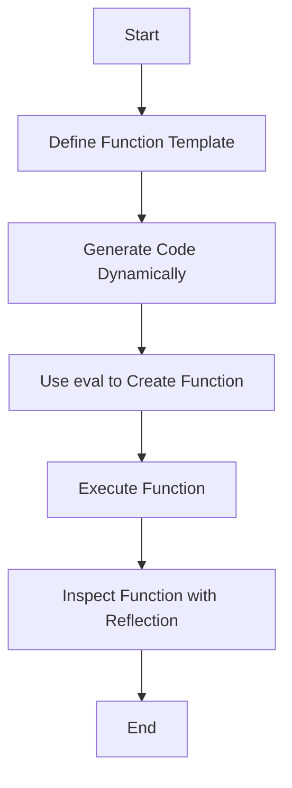

## 15.10 Advanced Metaprogramming Techniques

Metaprogramming in Julia allows us to write code that manipulates other code, providing powerful tools for creating more flexible and efficient programs. In this section, we will delve into advanced metaprogramming techniques, including reflection and introspection, dynamic code generation, and the use of metaprogramming libraries. These techniques enable developers to write more expressive and concise code, automate repetitive tasks, and optimize performance.

### Reflection and Introspection

Reflection and introspection are techniques that allow a program to examine and modify its own structure and behavior at runtime. In Julia, these techniques are facilitated by a set of built-in functions that provide access to metadata about types, methods, and other program elements.

#### Accessing Metadata

Julia provides several functions for accessing metadata, which can be used to inspect the structure of code and understand its behavior. Some of the most commonly used functions include:

- **`methods`**: This function returns a list of methods associated with a given function. It is useful for understanding how a function behaves with different types of arguments.

  ```julia
  # Example: Inspecting methods of a function
  methods(+)  # Lists all methods of the addition operator
  ```

- **`fieldnames`**: This function returns the names of the fields of a composite type. It is useful for introspecting the structure of user-defined types.

  ```julia
  # Example: Inspecting fields of a composite type
  struct Person
      name::String
      age::Int
  end

  fieldnames(Person)  # Returns (:name, :age)
  ```

- **`typeof`**: This function returns the type of a given value, which is useful for understanding the data types being used in a program.

  ```julia
  # Example: Inspecting the type of a value
  typeof(42)  # Returns Int64
  ```

- **`supertype`**: This function returns the supertype of a given type, allowing you to explore the type hierarchy.

  ```julia
  # Example: Inspecting the supertype of a type
  supertype(Int64)  # Returns Signed
  ```

These functions provide a foundation for building more complex metaprogramming constructs by allowing you to dynamically inspect and manipulate code.

### Dynamic Code Generation

Dynamic code generation involves creating and executing code at runtime. This can be particularly useful for optimizing performance, automating repetitive tasks, or implementing domain-specific languages.

#### Creating Functions at Runtime

In Julia, you can use the `eval` function to define new functions dynamically. This allows you to generate code based on runtime conditions and execute it immediately.

```julia
function create_adder(x)
    return eval(:(function adder(y)
        return $x + y
    end))
end

adder_5 = create_adder(5)
println(adder_5(10))  # Outputs 15
```

In this example, the `create_adder` function generates a new function `adder` that adds a fixed value `x` to its argument `y`. The `eval` function evaluates the generated expression, creating the new function at runtime.

#### Considerations for Dynamic Code Generation

While dynamic code generation can be powerful, it also comes with some considerations:

- **Performance**: Using `eval` can introduce performance overhead, as the generated code must be compiled at runtime. Use it judiciously and consider alternatives like macros for compile-time code generation.
- **Security**: Dynamically generated code can pose security risks, especially if it involves user input. Always validate and sanitize inputs to avoid code injection vulnerabilities.

### Metaprogramming Libraries

Julia's ecosystem includes several libraries that simplify metaprogramming tasks, providing higher-level abstractions and utilities for code manipulation.

#### Helper Packages

One of the most popular metaprogramming libraries in Julia is `MacroTools.jl`, which provides a set of utilities for working with macros and expressions.

- **`MacroTools.jl`**: This package offers functions for pattern matching, expression manipulation, and code generation, making it easier to write complex macros.

  ```julia
  using MacroTools

  # Example: Using MacroTools for expression manipulation
  expr = :(x + y)
  transformed_expr = MacroTools.postwalk(expr) do node
      if node == :x
          return :a
      else
          return node
      end
  end

  println(transformed_expr)  # Outputs :(a + y)
  ```

In this example, `MacroTools.postwalk` is used to traverse and transform an expression, replacing occurrences of `:x` with `:a`.

#### Other Useful Libraries

- **`ExprTools.jl`**: Provides utilities for working with Julia's expression objects, including functions for constructing and deconstructing expressions.
- **`GeneratedFunctions.jl`**: Facilitates the creation of generated functions, which are functions that generate specialized code based on their input types.

### Visualizing Metaprogramming Concepts

To better understand the flow of metaprogramming in Julia, let's visualize the process of dynamic code generation and introspection using Mermaid.js diagrams.



**Diagram Description**: This flowchart illustrates the process of dynamic code generation in Julia. It starts with defining a function template, generating code dynamically, using `eval` to create the function, executing the function, and finally inspecting it using reflection techniques.

### Try It Yourself

To deepen your understanding of advanced metaprogramming techniques, try modifying the code examples provided:

- Experiment with different expressions in the `create_adder` function to generate more complex functions.
- Use `MacroTools.jl` to transform expressions in creative ways, such as replacing operators or changing function calls.
- Explore other metaprogramming libraries and see how they can simplify your code manipulation tasks.

### Knowledge Check

Before we conclude, let's reinforce what we've learned with a few questions:

- How can you use reflection to inspect the methods of a function in Julia?
- What are the potential risks of using `eval` for dynamic code generation?
- How does `MacroTools.jl` simplify the process of writing macros?

### Embrace the Journey

Remember, mastering advanced metaprogramming techniques in Julia is a journey. As you continue to explore these concepts, you'll unlock new possibilities for writing more efficient and expressive code. Keep experimenting, stay curious, and enjoy the process of discovery!

## Quiz Time!



### What function in Julia can be used to inspect the methods of a given function?

- [x] methods
- [ ] fieldnames
- [ ] typeof
- [ ] eval

> **Explanation:** The `methods` function returns a list of methods associated with a given function, allowing you to inspect its behavior with different types of arguments.

### Which function is used to evaluate expressions and create functions at runtime in Julia?

- [ ] typeof
- [ ] fieldnames
- [x] eval
- [ ] supertype

> **Explanation:** The `eval` function is used to evaluate expressions and create functions dynamically at runtime.

### What is a potential risk of using `eval` for dynamic code generation?

- [ ] Improved performance
- [x] Security vulnerabilities
- [ ] Increased readability
- [ ] Simplified syntax

> **Explanation:** Using `eval` can pose security risks, especially if it involves user input, as it may lead to code injection vulnerabilities.

### Which package provides utilities for pattern matching and expression manipulation in Julia?

- [ ] ExprTools.jl
- [x] MacroTools.jl
- [ ] GeneratedFunctions.jl
- [ ] DataFrames.jl

> **Explanation:** `MacroTools.jl` offers functions for pattern matching, expression manipulation, and code generation, simplifying the process of writing complex macros.

### What does the `fieldnames` function return when applied to a composite type?

- [ ] The methods of the type
- [x] The names of the fields
- [ ] The supertype of the type
- [ ] The type of the fields

> **Explanation:** The `fieldnames` function returns the names of the fields of a composite type, allowing you to introspect its structure.

### Which function can be used to determine the type of a given value in Julia?

- [x] typeof
- [ ] eval
- [ ] methods
- [ ] fieldnames

> **Explanation:** The `typeof` function returns the type of a given value, which is useful for understanding the data types being used in a program.

### What is the purpose of the `supertype` function in Julia?

- [ ] To create functions dynamically
- [ ] To inspect the fields of a type
- [x] To return the supertype of a given type
- [ ] To evaluate expressions

> **Explanation:** The `supertype` function returns the supertype of a given type, allowing you to explore the type hierarchy.

### Which library facilitates the creation of generated functions in Julia?

- [ ] MacroTools.jl
- [ ] ExprTools.jl
- [x] GeneratedFunctions.jl
- [ ] DataFrames.jl

> **Explanation:** `GeneratedFunctions.jl` facilitates the creation of generated functions, which are functions that generate specialized code based on their input types.

### True or False: Using `eval` can introduce performance overhead because the generated code must be compiled at runtime.

- [x] True
- [ ] False

> **Explanation:** True. Using `eval` can introduce performance overhead because the generated code must be compiled at runtime, which can slow down execution.

### Which of the following is NOT a consideration when using dynamic code generation?

- [ ] Performance overhead
- [ ] Security risks
- [ ] Code readability
- [x] Improved syntax highlighting

> **Explanation:** Improved syntax highlighting is not a consideration when using dynamic code generation. Performance overhead, security risks, and code readability are important considerations.



By mastering these advanced metaprogramming techniques, you'll be well-equipped to tackle complex programming challenges in Julia. Keep exploring and pushing the boundaries of what's possible with this powerful language!
