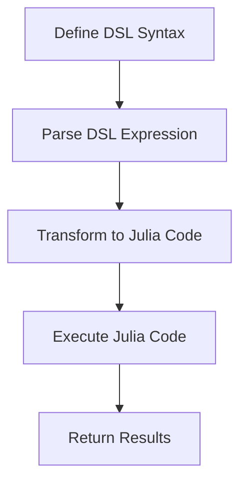

## 15.11 Case Study: Creating a Mini-Language in Julia

In this case study, we will embark on an exciting journey to create a mini-language, or domain-specific language (DSL), using Julia. This project will guide us through the design, implementation, and evaluation of a DSL tailored for mathematical modeling. By the end of this case study, you'll have a deeper understanding of how to leverage Julia's powerful metaprogramming capabilities to create custom languages that simplify complex tasks.

### Project Overview

#### Objective

The primary objective of this project is to design a DSL that simplifies mathematical modeling. This DSL will allow users to express mathematical equations and models in a more intuitive and readable format, which will then be translated into efficient Julia code for execution.

#### Design and Implementation

##### Syntax Choices

Designing the syntax of a DSL is a crucial step. Our goal is to create a syntax that is both expressive and easy to understand. For our mathematical modeling DSL, we will focus on:

- **Variables and Constants**: Allow users to define variables and constants using a straightforward syntax.
- **Operators**: Support common mathematical operators such as addition, subtraction, multiplication, and division.
- **Functions**: Provide a way to define and use mathematical functions.
- **Equations**: Enable the expression of equations and systems of equations.

Let's start by defining a simple syntax for our DSL:

```julia
x = Variable("x")
y = Variable("y")

a = Constant(5)
b = Constant(3)

equation = Equation(a * x + b * y == 10)
```

In this syntax, `Variable` and `Constant` are constructs of our DSL, and `Equation` represents a mathematical equation. Our task is to map this syntax to Julia code that can be executed.

##### Mapping Syntax to Julia Code

To translate our DSL syntax into executable Julia code, we will use Julia's metaprogramming capabilities, particularly macros. Macros allow us to transform expressions at compile time, making them ideal for DSL implementation.

Here's how we can implement a macro to handle our DSL syntax:

```julia
macro model(expr)
    # Transform the DSL expression into Julia code
    # This is a simplified example
    return :(solve($expr))
end

@model equation
```

In this example, the `@model` macro takes an equation expressed in our DSL and transforms it into a call to a `solve` function, which we will define to handle the mathematical computation.

#### Challenges and Solutions

##### Parsing Issues

One of the main challenges in creating a DSL is handling complex syntax and edge cases. Julia's metaprogramming provides tools to parse and manipulate expressions, but it requires careful design to ensure robustness.

To address parsing issues, we can use Julia's `Expr` type to represent and manipulate expressions. Here's an example of how we can parse and transform a simple expression:

```julia
function parse_expression(expr::Expr)
    # Handle different types of expressions
    if expr.head == :call
        # Process function calls
        return process_function_call(expr)
    elseif expr.head == :==
        # Process equations
        return process_equation(expr)
    else
        error("Unsupported expression type")
    end
end

function process_function_call(expr::Expr)
    # Transform function calls into executable code
    # Example: f(x) -> f(x)
    return expr
end

function process_equation(expr::Expr)
    # Transform equations into a solvable form
    # Example: a * x + b * y == 10 -> solve(a * x + b * y == 10)
    return :(solve($expr))
end
```

By defining functions to handle different types of expressions, we can build a robust parser that translates our DSL syntax into executable Julia code.

#### Evaluation

##### Performance and Usability

Evaluating the performance and usability of our DSL is essential to ensure it meets the needs of its users. We need to assess the trade-offs involved in using a DSL compared to writing native Julia code.

- **Performance**: While a DSL can simplify code, it may introduce overhead due to additional parsing and transformation steps. We should benchmark the performance of our DSL against equivalent Julia code to identify any bottlenecks.

- **Usability**: The primary benefit of a DSL is improved readability and ease of use. We should gather feedback from users to ensure the DSL syntax is intuitive and meets their needs.

### Try It Yourself

To encourage experimentation, let's modify our DSL to support additional mathematical constructs, such as differentiation or integration. Try extending the DSL syntax and implementing the necessary transformations in the macro.

### Visualizing the DSL Workflow

To better understand the workflow of our DSL, let's visualize the process using a flowchart:



This flowchart illustrates the steps involved in processing a DSL expression, from defining the syntax to executing the corresponding Julia code.

### References and Links

For further reading on DSLs and metaprogramming in Julia, consider exploring the following resources:

- [Julia Documentation on Metaprogramming](https://docs.julialang.org/en/v1/manual/metaprogramming/)
- [Domain-Specific Languages in Julia](https://julialang.org/blog/2017/04/dsl/)
- [Metaprogramming in Julia: A Tutorial](https://www.juliabloggers.com/metaprogramming-in-julia-a-tutorial/)

### Knowledge Check

To reinforce your understanding, consider the following questions:

- What are the key components of a DSL?
- How can macros be used to transform DSL syntax into executable code?
- What are the trade-offs of using a DSL compared to native code?

### Embrace the Journey

Remember, creating a DSL is a journey of exploration and creativity. As you experiment with different syntax and transformations, you'll gain valuable insights into the power of metaprogramming in Julia. Keep experimenting, stay curious, and enjoy the journey!

### Quiz Time!



### What is the primary objective of creating a DSL in this case study?

- [x] To simplify mathematical modeling
- [ ] To improve Julia's performance
- [ ] To replace Julia's syntax
- [ ] To create a new programming language

> **Explanation:** The primary objective is to design a DSL that simplifies mathematical modeling.

### Which Julia feature is primarily used to implement the DSL?

- [x] Macros
- [ ] Functions
- [ ] Modules
- [ ] Types

> **Explanation:** Macros are used to transform DSL syntax into executable Julia code.

### What is a key challenge in creating a DSL?

- [x] Handling complex syntax and edge cases
- [ ] Improving hardware performance
- [ ] Reducing code size
- [ ] Increasing the number of variables

> **Explanation:** Handling complex syntax and edge cases is a significant challenge in DSL creation.

### What is the role of the `@model` macro in the DSL?

- [x] To transform DSL expressions into Julia code
- [ ] To execute mathematical equations
- [ ] To define variables
- [ ] To improve performance

> **Explanation:** The `@model` macro transforms DSL expressions into executable Julia code.

### How can the performance of a DSL be evaluated?

- [x] By benchmarking against equivalent Julia code
- [ ] By counting the number of lines of code
- [ ] By measuring the number of variables used
- [ ] By checking the syntax complexity

> **Explanation:** Performance can be evaluated by benchmarking the DSL against equivalent Julia code.

### What is a benefit of using a DSL?

- [x] Improved readability and ease of use
- [ ] Increased code complexity
- [ ] Reduced execution speed
- [ ] More hardware requirements

> **Explanation:** A DSL improves readability and ease of use for specific tasks.

### What is the purpose of the `parse_expression` function?

- [x] To handle different types of DSL expressions
- [ ] To execute Julia code
- [ ] To define variables
- [ ] To improve performance

> **Explanation:** The `parse_expression` function handles different types of DSL expressions.

### What does the flowchart in the case study represent?

- [x] The workflow of processing a DSL expression
- [ ] The execution of Julia code
- [ ] The definition of variables
- [ ] The performance evaluation process

> **Explanation:** The flowchart represents the workflow of processing a DSL expression.

### What is a trade-off of using a DSL?

- [x] Potential performance overhead
- [ ] Increased code complexity
- [ ] Reduced readability
- [ ] More hardware requirements

> **Explanation:** A trade-off of using a DSL is potential performance overhead due to additional parsing and transformation steps.

### True or False: A DSL can replace Julia's syntax entirely.

- [ ] True
- [x] False

> **Explanation:** A DSL is designed for specific tasks and does not replace Julia's syntax entirely.


