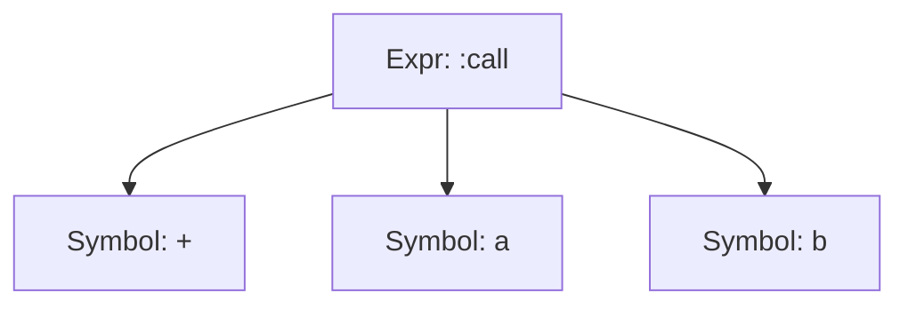

## 15.2 Understanding Julia's Abstract Syntax Tree (AST)

In the world of programming, understanding how code is represented and manipulated at a lower level can unlock powerful capabilities. In Julia, this is achieved through the Abstract Syntax Tree (AST), a crucial concept for metaprogramming and macros. This section will delve into the intricacies of Julia's AST, focusing on `Expr` objects, how to inspect and manipulate them, and their role in transforming code.

### Expr Objects: The Building Blocks of Julia's AST

#### Representation of Code

In Julia, code is not just a sequence of characters but a structured representation known as the Abstract Syntax Tree (AST). The AST is composed of `Expr` objects, which encapsulate the syntactic structure of Julia code. Each `Expr` object represents a node in the tree, with the entire tree representing a complete expression or program.

- **Expr Object Structure**: An `Expr` object consists of a head, which indicates the type of expression (e.g., `:call`, `:macrocall`, `:quote`), and arguments, which are the sub-expressions or literals involved in the expression.

```julia
expr = :(a + b)
println(expr)  # Output: :(a + b)
```

In this example, `:(a + b)` is an `Expr` object with a head of `:call`, indicating a function call, and arguments `a`, `+`, and `b`.

#### Inspecting the AST

Understanding the structure of an AST is crucial for effective metaprogramming. Julia provides tools to inspect and analyze the AST of any given code.

##### Using `dump` and `Meta.parse`

- **`dump` Function**: The `dump` function provides a detailed view of the structure of an `Expr` object, revealing its head and arguments.

```julia
expr = :(a + b)
dump(expr)
```

This will output a detailed breakdown of the `Expr` object, showing the head `:call` and its arguments.

- **`Meta.parse` Function**: The `Meta.parse` function converts a string of Julia code into an `Expr` object, allowing you to inspect its structure.

```julia
parsed_expr = Meta.parse("a + b")
dump(parsed_expr)
```

This converts the string `"a + b"` into an `Expr` object, which can then be inspected using `dump`.

#### Manipulating ASTs

Manipulating ASTs involves constructing and modifying `Expr` objects to transform code dynamically. This capability is at the heart of metaprogramming in Julia.

##### Building and Modifying Expressions

- **Constructing `Expr` Objects Manually**: You can manually create `Expr` objects by specifying the head and arguments, allowing you to build complex expressions programmatically.

```julia
expr = Expr(:call, :+, :a, :b)
println(expr)  # Output: :(a + b)
```

- **Modifying Existing Expressions**: You can modify the arguments of an `Expr` object to change its behavior.

```julia
expr.args[2] = :*
println(expr)  # Output: :(a * b)
```

This example changes the operator from `+` to `*`, demonstrating how you can alter the behavior of code by manipulating its AST.

### Visualizing Julia's AST

To better understand the structure and flow of an AST, we can visualize it using diagrams. Below is a simple representation of the AST for the expression `a + b`.



**Figure 1**: This diagram illustrates the AST for the expression `a + b`, showing the `:call` head and its arguments.

### Practical Applications of AST Manipulation

Understanding and manipulating ASTs can lead to powerful applications in Julia programming, particularly in metaprogramming and macros.

#### Creating Custom Macros

Macros in Julia are a direct application of AST manipulation. They allow you to transform code before it is evaluated, enabling domain-specific language creation and code generation.

```julia
macro sayhello(name)
    return :(println("Hello, ", $name))
end

@sayhello "World"  # Output: Hello, World
```

In this example, the `sayhello` macro constructs an `Expr` object that represents a `println` call, demonstrating how macros can generate code dynamically.

#### Code Transformation and Optimization

By manipulating ASTs, you can perform code transformations and optimizations that would be difficult or impossible with traditional programming techniques.

- **Inlining Functions**: You can replace function calls with their definitions to optimize performance.
- **Loop Unrolling**: You can expand loops to reduce overhead and improve execution speed.

### Try It Yourself: Experimenting with ASTs

To deepen your understanding of Julia's AST, try modifying the following code examples and observe the changes:

1. **Modify the Operator**: Change the operator in the expression `a + b` to another operator, such as `-` or `/`, and inspect the resulting AST.

```julia
expr = :(a + b)
expr.args[2] = :/
println(expr)  # Output: :(a / b)
```

2. **Create a Nested Expression**: Construct a nested expression, such as `(a + b) * c`, and visualize its AST.

```julia
nested_expr = Expr(:call, :*, Expr(:call, :+, :a, :b), :c)
dump(nested_expr)
```

### References and Further Reading

- [Julia Documentation on Metaprogramming](https://docs.julialang.org/en/v1/manual/metaprogramming/)
- [Understanding Abstract Syntax Trees](https://en.wikipedia.org/wiki/Abstract_syntax_tree)

### Knowledge Check

Before moving on, let's summarize the key takeaways from this section:

- **Expr Objects**: The fundamental building blocks of Julia's AST, representing code as structured data.
- **Inspecting ASTs**: Tools like `dump` and `Meta.parse` allow you to explore the structure of expressions.
- **Manipulating ASTs**: You can construct and modify `Expr` objects to transform code dynamically.

Remember, mastering ASTs and `Expr` objects is a journey. As you continue to explore Julia's metaprogramming capabilities, you'll unlock new levels of flexibility and power in your code.

## Quiz Time!



### What is an `Expr` object in Julia?

- [x] A representation of a node in the Abstract Syntax Tree
- [ ] A function for parsing strings
- [ ] A type of variable in Julia
- [ ] A built-in macro in Julia

> **Explanation:** An `Expr` object represents a node in the Abstract Syntax Tree, encapsulating the syntactic structure of Julia code.

### Which function is used to convert a string of Julia code into an `Expr` object?

- [ ] `dump`
- [x] `Meta.parse`
- [ ] `eval`
- [ ] `quote`

> **Explanation:** `Meta.parse` is used to convert a string of Julia code into an `Expr` object.

### What does the `dump` function do?

- [x] Provides a detailed view of the structure of an `Expr` object
- [ ] Executes a string of code
- [ ] Converts an `Expr` object to a string
- [ ] Compiles Julia code

> **Explanation:** The `dump` function provides a detailed view of the structure of an `Expr` object, showing its head and arguments.

### How can you manually construct an `Expr` object?

- [ ] Using the `eval` function
- [x] By specifying the head and arguments
- [ ] By calling a built-in macro
- [ ] By using the `quote` keyword

> **Explanation:** You can manually construct an `Expr` object by specifying the head and arguments, allowing you to build complex expressions programmatically.

### What is the head of an `Expr` object?

- [x] It indicates the type of expression
- [ ] It is the first argument of the expression
- [ ] It is the result of evaluating the expression
- [ ] It is the name of the function being called

> **Explanation:** The head of an `Expr` object indicates the type of expression, such as `:call` for function calls.

### Which of the following is a practical application of AST manipulation?

- [x] Creating custom macros
- [ ] Defining new data types
- [ ] Writing unit tests
- [ ] Managing package dependencies

> **Explanation:** Creating custom macros is a practical application of AST manipulation, allowing you to transform code before it is evaluated.

### What does the `quote` keyword do in Julia?

- [x] It creates an `Expr` object representing the quoted code
- [ ] It executes the quoted code
- [ ] It comments out the quoted code
- [ ] It converts the quoted code to a string

> **Explanation:** The `quote` keyword creates an `Expr` object representing the quoted code, preserving its structure for manipulation.

### How can you modify an existing `Expr` object?

- [ ] By using the `eval` function
- [x] By changing its arguments
- [ ] By calling a built-in macro
- [ ] By using the `quote` keyword

> **Explanation:** You can modify an existing `Expr` object by changing its arguments, altering the behavior of the represented code.

### What is the purpose of visualizing an AST?

- [x] To understand the structure and flow of code
- [ ] To execute the code
- [ ] To convert code to a string
- [ ] To compile the code

> **Explanation:** Visualizing an AST helps you understand the structure and flow of code, making it easier to manipulate and transform.

### True or False: An `Expr` object can represent an entire program.

- [x] True
- [ ] False

> **Explanation:** True. An `Expr` object can represent an entire program, as it encapsulates the syntactic structure of Julia code.



Remember, this is just the beginning. As you progress, you'll build more complex and interactive applications using Julia's powerful metaprogramming capabilities. Keep experimenting, stay curious, and enjoy the journey!
