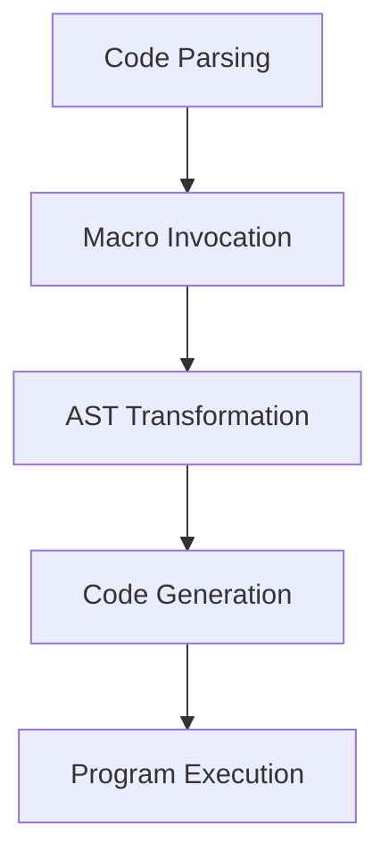

## 15.3 Writing Macros for Code Transformation

In the world of Julia programming, macros are powerful tools that allow us to perform code transformations at compile time. They enable developers to write more expressive and efficient code by manipulating the abstract syntax tree (AST) before the code is executed. In this section, we will delve into the intricacies of writing macros for code transformation, covering everything from basic syntax to advanced hygienic practices.

### Defining Macros

Macros in Julia are defined using the `macro` keyword. They take expressions as input and return transformed expressions. This allows us to create reusable code patterns that can be applied across different parts of our programs.

#### Macro Syntax

To define a macro, use the `macro` keyword followed by the macro name and a set of arguments. The body of the macro should return an expression that represents the transformed code.

```julia
macro sayhello(name)
    return :(println("Hello, ", $name))
end
```

In this example, the `sayhello` macro takes a single argument `name` and returns an expression that prints a greeting. The `$` symbol is used to interpolate the argument into the expression.

#### Macro Invocation

Macros are invoked using the `@` symbol followed by the macro name. When a macro is invoked, it is executed at compile time, transforming the code before it is evaluated.

```julia
@sayhello("Julia")
```

This invocation will print "Hello, Julia" to the console. The key advantage of macros is their ability to manipulate code structure, enabling powerful abstractions and optimizations.

### Compile-Time Execution

One of the defining features of macros is their execution at parse time. This means that macros are evaluated before the program is run, allowing for transformations that would be impossible or inefficient at runtime.

#### Transforming Code Before Evaluation

Macros can be used to generate boilerplate code, enforce coding standards, or implement domain-specific languages (DSLs). By transforming code at compile time, macros can optimize performance and reduce runtime overhead.

```julia
macro timeit(expr)
    return quote
        local start = time()
        local result = $expr
        println("Execution time: ", time() - start, " seconds")
        result
    end
end

@timeit begin
    sleep(2)
end
```

In this example, the `timeit` macro measures the execution time of a block of code. By transforming the code to include timing logic, we can easily profile different parts of our program.

### Hygienic Macros

Hygiene is a crucial concept in macro design, ensuring that macros do not inadvertently capture or overwrite variables in the surrounding scope. Julia provides mechanisms to maintain hygiene and prevent variable name clashes.

#### Variable Scoping

When writing macros, it's important to ensure that variables introduced by the macro do not interfere with variables in the caller's scope. Julia achieves this through hygienic macros, which automatically rename variables to avoid conflicts.

```julia
macro increment(var)
    return quote
        local temp = $var
        $var = temp + 1
    end
end

x = 5
@increment(x)
println(x)  # Output: 6
```

In this example, the `increment` macro safely increments the value of `x` without affecting other variables. The use of `local` ensures that the temporary variable does not clash with existing variables.

### Advanced Macro Techniques

As we become more comfortable with macros, we can explore advanced techniques for creating more sophisticated code transformations. These techniques include manipulating the AST, using generated functions, and building domain-specific languages.

#### Manipulating the Abstract Syntax Tree

The AST is a tree representation of the code structure. By manipulating the AST, we can perform complex transformations that go beyond simple text substitution.

```julia
macro debug(expr)
    return quote
        println("Debug: ", $(string(expr)), " = ", $expr)
        $expr
    end
end

@debug 1 + 2 * 3
```

This `debug` macro prints the expression and its result, providing valuable insights during development. By accessing the AST, we can create macros that analyze and modify code in powerful ways.

#### Generated Functions

Generated functions are a special type of function in Julia that are generated at compile time based on the types of their arguments. They can be used in conjunction with macros to create highly optimized code.

```julia
@generated function mysum(T::Type, args...)
    quote
        sum = zero(T)
        for arg in args
            sum += arg
        end
        sum
    end
end

println(mysum(Int, 1, 2, 3))  # Output: 6
```

In this example, the `mysum` function is generated based on the type of its arguments, allowing for efficient summation of numbers.

### Best Practices for Writing Macros

When writing macros, it's important to follow best practices to ensure that they are robust, maintainable, and easy to use. Here are some key considerations:

- **Keep Macros Simple**: Avoid overly complex macros that are difficult to understand and debug. Aim for clarity and simplicity.
- **Document Macros Thoroughly**: Provide clear documentation for each macro, including its purpose, usage, and any limitations.
- **Test Macros Extensively**: Ensure that macros are thoroughly tested to catch any edge cases or unexpected behavior.
- **Use Hygienic Practices**: Leverage Julia's hygienic macro features to prevent variable name clashes and maintain code integrity.

### Try It Yourself

To deepen your understanding of macros, try modifying the examples provided in this section. Experiment with different code transformations and observe how they affect the program's behavior. Consider creating your own macros to automate repetitive tasks or enforce coding standards.

### Visualizing Macro Execution

To better understand how macros transform code, let's visualize the process using a flowchart. This diagram illustrates the steps involved in macro execution, from parsing to code transformation.



**Figure 1**: This flowchart represents the macro execution process, highlighting the key stages of code transformation.

### References and Further Reading

For more information on macros and metaprogramming in Julia, consider exploring the following resources:

- [Julia Documentation on Macros](https://docs.julialang.org/en/v1/manual/metaprogramming/#Macros)
- [Metaprogramming in Julia by Chris Rackauckas](https://julialang.org/blog/2017/04/metaprogramming/)
- [Advanced Julia: Macros and Metaprogramming](https://www.juliabloggers.com/advanced-julia-macros-and-metaprogramming/)

### Knowledge Check

To reinforce your understanding of macros, consider the following questions and challenges:

- What are the key differences between macros and functions in Julia?
- How can macros be used to optimize code performance?
- Create a macro that logs the execution time of a function and prints the result.

### Embrace the Journey

As you continue your journey with Julia, remember that mastering macros is just one step towards becoming an expert developer. Keep experimenting, stay curious, and enjoy the process of learning and discovery.

## Quiz Time!



### What is the primary purpose of macros in Julia?

- [x] To transform code at compile time
- [ ] To execute code at runtime
- [ ] To manage memory allocation
- [ ] To handle exceptions

> **Explanation:** Macros in Julia are used to transform code at compile time, allowing for optimizations and code generation before execution.

### How are macros invoked in Julia?

- [x] Using the `@` symbol followed by the macro name
- [ ] Using the `#` symbol followed by the macro name
- [ ] Using the `!` symbol followed by the macro name
- [ ] Using the `&` symbol followed by the macro name

> **Explanation:** Macros are invoked using the `@` symbol followed by the macro name, which signals the compiler to execute the macro.

### What is a key feature of hygienic macros?

- [x] They prevent variable name clashes
- [ ] They optimize memory usage
- [ ] They enhance runtime performance
- [ ] They simplify error handling

> **Explanation:** Hygienic macros ensure that variables introduced by the macro do not clash with variables in the caller's scope, maintaining code integrity.

### What is the role of the `$` symbol in macro definitions?

- [x] To interpolate variables into expressions
- [ ] To declare local variables
- [ ] To indicate a comment
- [ ] To define a function

> **Explanation:** The `$` symbol is used to interpolate variables into expressions within a macro, allowing dynamic code generation.

### Which of the following is a best practice for writing macros?

- [x] Keep macros simple and clear
- [ ] Use macros for all code transformations
- [ ] Avoid documenting macros
- [ ] Test macros only in production

> **Explanation:** Keeping macros simple and clear is a best practice to ensure they are maintainable and easy to understand.

### What is the Abstract Syntax Tree (AST) in the context of macros?

- [x] A tree representation of the code structure
- [ ] A list of function calls
- [ ] A sequence of memory addresses
- [ ] A collection of variable names

> **Explanation:** The AST is a tree representation of the code structure, which macros manipulate to perform code transformations.

### How can macros be used to optimize performance?

- [x] By generating boilerplate code at compile time
- [ ] By reducing memory usage at runtime
- [ ] By simplifying error handling
- [ ] By managing variable scope

> **Explanation:** Macros can optimize performance by generating boilerplate code at compile time, reducing runtime overhead.

### What is a generated function in Julia?

- [x] A function generated at compile time based on argument types
- [ ] A function that manages memory allocation
- [ ] A function that handles exceptions
- [ ] A function that logs execution time

> **Explanation:** A generated function is created at compile time based on the types of its arguments, allowing for optimized code execution.

### What is the purpose of the `quote` block in a macro?

- [x] To create a block of code to be returned as an expression
- [ ] To declare a local variable
- [ ] To handle exceptions
- [ ] To define a function

> **Explanation:** The `quote` block is used to create a block of code that is returned as an expression from a macro, enabling code transformation.

### True or False: Macros in Julia can be used to create domain-specific languages (DSLs).

- [x] True
- [ ] False

> **Explanation:** True. Macros can be used to create domain-specific languages by transforming code into specialized constructs.



Remember, mastering macros is a journey that requires practice and experimentation. Keep exploring and pushing the boundaries of what you can achieve with Julia!
