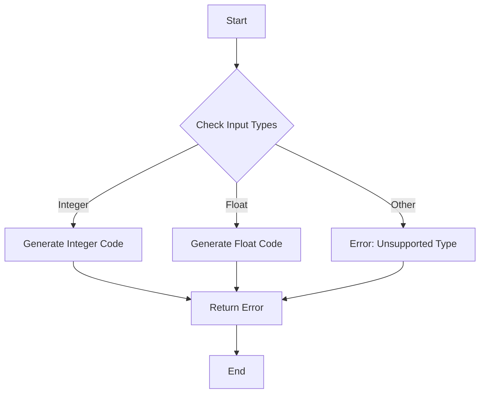

## 15.4 Generated Functions and Their Use Cases

In the realm of Julia programming, generated functions stand out as a powerful feature that allows developers to write type-specialized code, optimizing performance and enhancing flexibility. In this section, we will delve into the purpose of generated functions, how to define them using the `@generated` macro, and explore various use cases where they can be particularly beneficial.

### Purpose of Generated Functions

Generated functions in Julia are designed to create type-specialized code. This means that the function's behavior can be tailored based on the types of its arguments, allowing for more efficient execution. The primary purposes of generated functions include:

- **Type-Specialized Code**: By generating code that is specific to the types of the inputs, we can optimize the performance of functions, especially in scenarios where type information can lead to significant improvements.
- **Performance Optimization**: Generated functions can be used to unroll loops, inline operations, or perform other optimizations that are contingent on the types of the inputs.

### Defining Generated Functions

To define a generated function in Julia, we use the `@generated` macro. This macro allows us to write a function that returns an expression based on the types of its arguments. Here's a step-by-step guide on how to define a generated function:

1. **Use the `@generated` Macro**: Begin by annotating the function with `@generated`. This tells Julia that the function will generate code based on its input types.

2. **Return an Expression**: Inside the function, return an expression that represents the code to be executed. This expression is generated based on the types of the arguments.

3. **Access Argument Types**: Use the `Base.@pure` macro to ensure that the generated function is pure, meaning it does not have side effects and its output depends only on its input types.

Here's a simple example to illustrate the concept:

```julia
@generated function add_elements(T::Type, a::T, b::T)
    if T <: Integer
        return :(a + b)  # For integers, use simple addition
    elseif T <: AbstractFloat
        return :(a + b)  # For floats, use simple addition
    else
        return :(error("Unsupported type"))
    end
end
```

In this example, the `add_elements` function generates different code based on whether the inputs are integers or floating-point numbers.

### Use Cases for Generated Functions

Generated functions are particularly useful in scenarios where performance optimization is crucial. Here are some common use cases:

#### Optimizing Performance

One of the most compelling use cases for generated functions is performance optimization. By generating type-specific code, we can eliminate unnecessary computations and streamline execution. For example, consider a scenario where we want to unroll loops for fixed-size arrays:

```julia
@generated function sum_fixed_array(arr::NTuple{N, T}) where {N, T}
    ex = Expr(:block)
    for i in 1:N
        push!(ex.args, :(arr[$i]))
    end
    return :(+($(ex.args...)))
end

arr = (1, 2, 3, 4)
println(sum_fixed_array(arr))  # Output: 10
```

In this example, the `sum_fixed_array` function generates a specialized version of the sum operation for tuples of a fixed size, effectively unrolling the loop and summing the elements directly.

#### Type-Specialized Code

Generated functions are also useful for creating type-specialized code that can adapt to different input types. This is particularly beneficial in generic programming, where functions need to handle a wide range of types efficiently.

Consider a scenario where we want to implement a function that computes the dot product of two vectors, but we want to optimize it for different types of numeric data:

```julia
@generated function dot_product(v1::Vector{T}, v2::Vector{T}) where T
    if T <: Integer
        return :(sum(v1[i] * v2[i] for i in 1:length(v1)))
    elseif T <: AbstractFloat
        return :(sum(v1[i] * v2[i] for i in 1:length(v1)))
    else
        return :(error("Unsupported type"))
    end
end

v1 = [1, 2, 3]
v2 = [4, 5, 6]
println(dot_product(v1, v2))  # Output: 32
```

In this example, the `dot_product` function generates different implementations based on whether the input vectors contain integers or floating-point numbers.

### Visualizing Generated Functions

To better understand how generated functions work, let's visualize the process using a flowchart. This flowchart illustrates the decision-making process within a generated function, highlighting how different code paths are chosen based on input types.



**Figure 1**: This flowchart represents the decision-making process within a generated function, where different code paths are chosen based on the input types.

### Design Considerations

When using generated functions, it's important to consider the following:

- **Complexity**: Generated functions can become complex, especially when dealing with a wide range of input types. It's important to keep the logic simple and maintainable.
- **Performance**: While generated functions can optimize performance, they can also introduce overhead if not used judiciously. It's important to profile and test the performance impact of generated functions.
- **Type Stability**: Ensure that the generated code is type-stable, meaning that the return type is predictable based on the input types. This can help avoid performance pitfalls.

### Differences and Similarities

Generated functions are often compared to macros in Julia. While both can be used to generate code, there are key differences:

- **Macros**: Macros operate at the syntax level and can transform code before it is compiled. They are not type-aware and cannot generate code based on input types.
- **Generated Functions**: Generated functions operate at the type level and can generate code based on the types of the inputs. They are more suitable for type-specific optimizations.

### Try It Yourself

To get hands-on experience with generated functions, try modifying the examples provided in this section. Experiment with different input types and observe how the generated code changes. Here are some suggestions:

- Modify the `add_elements` function to handle complex numbers.
- Extend the `sum_fixed_array` function to support arrays of different dimensions.
- Implement a generated function that computes the cross product of two vectors.

### Knowledge Check

Before we wrap up, let's reinforce what we've learned with a few questions:

- What is the primary purpose of generated functions in Julia?
- How do generated functions differ from macros?
- What are some common use cases for generated functions?

### Embrace the Journey

Remember, mastering generated functions is just one step in your journey to becoming an expert Julia developer. As you continue to explore the language, you'll discover even more powerful features and techniques. Keep experimenting, stay curious, and enjoy the journey!

## Quiz Time!



### What is the primary purpose of generated functions in Julia?

- [x] To create type-specialized code
- [ ] To handle exceptions
- [ ] To manage memory allocation
- [ ] To perform input validation

> **Explanation:** Generated functions are primarily used to create type-specialized code, optimizing performance based on input types.

### How do generated functions differ from macros in Julia?

- [x] Generated functions operate at the type level
- [ ] Generated functions are used for error handling
- [ ] Macros are used for type-specific optimizations
- [ ] Macros operate at the type level

> **Explanation:** Generated functions operate at the type level, allowing them to generate code based on input types, whereas macros operate at the syntax level.

### Which of the following is a common use case for generated functions?

- [x] Optimizing performance by unrolling loops
- [ ] Handling user input
- [ ] Managing file I/O operations
- [ ] Creating user interfaces

> **Explanation:** Generated functions are commonly used to optimize performance, such as unrolling loops for fixed-size arrays.

### What macro is used to define a generated function in Julia?

- [x] @generated
- [ ] @macro
- [ ] @function
- [ ] @type

> **Explanation:** The `@generated` macro is used to define a generated function in Julia.

### What should a generated function return?

- [x] An expression based on input types
- [ ] A string message
- [ ] A boolean value
- [ ] A list of errors

> **Explanation:** A generated function should return an expression that is generated based on the input types.

### What is a key consideration when using generated functions?

- [x] Ensuring type stability
- [ ] Avoiding all loops
- [ ] Using only integer types
- [ ] Disabling error handling

> **Explanation:** Ensuring type stability is crucial when using generated functions to avoid performance pitfalls.

### What is a potential downside of using generated functions?

- [x] Increased complexity
- [ ] Reduced code readability
- [ ] Limited input types
- [ ] Lack of error handling

> **Explanation:** Generated functions can become complex, especially when dealing with a wide range of input types.

### Which of the following is NOT a purpose of generated functions?

- [x] Managing user sessions
- [ ] Creating type-specialized code
- [ ] Optimizing performance
- [ ] Generating code based on input types

> **Explanation:** Managing user sessions is not a purpose of generated functions; they are used for creating type-specialized code and optimizing performance.

### True or False: Generated functions can generate code based on the values of the inputs.

- [ ] True
- [x] False

> **Explanation:** Generated functions generate code based on the types of the inputs, not the values.

### What is a benefit of using generated functions?

- [x] Improved performance through type specialization
- [ ] Simplified error handling
- [ ] Enhanced user interface design
- [ ] Easier file management

> **Explanation:** Generated functions improve performance by creating type-specialized code, optimizing execution based on input types.


