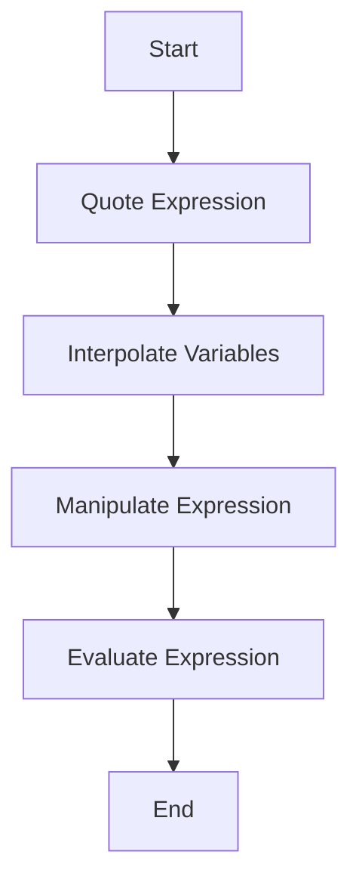

## 15.5 Expression Manipulation and Quoting

In the world of programming, metaprogramming stands out as a powerful tool that allows developers to write code that can generate and manipulate other code. Julia, with its rich metaprogramming capabilities, provides a unique approach to expression manipulation and quoting. This section will guide you through the essential concepts of quoting expressions, interpolation, and evaluating expressions, enabling you to harness the full potential of Julia's metaprogramming features.

### Quoting Expressions

Quoting is a fundamental concept in Julia's metaprogramming. It allows you to create expressions without evaluating them immediately. This capability is crucial for writing macros and other metaprogramming constructs.

#### The `:( )` and `quote`

In Julia, expressions can be quoted using the `:( )` syntax or the `quote` block. Both methods serve the same purpose but differ slightly in their usage and readability.

- **Using `:( )` Syntax**: This is a concise way to quote expressions. It is particularly useful for short expressions.

```julia
expr = :(x + y)
println(expr)  # Output: :(x + y)
```

- **Using `quote` Block**: This method is more readable for longer expressions and allows for multiline expressions.

```julia
expr = quote
    x + y
end
println(expr)  # Output: quote
               #            x + y
               #        end
```

Both methods create an `Expr` object, which represents the structure of the code without executing it.

### Interpolation

Interpolation allows you to insert values or variables into quoted expressions. This feature is essential for creating dynamic code that can adapt to different contexts or inputs.

#### Inserting Values

To insert a variable or value into a quoted expression, use the `$` symbol. This tells Julia to evaluate the variable and insert its value into the expression.

```julia
a = 5
expr = :(x + $a)
println(expr)  # Output: :(x + 5)
```

In this example, the variable `a` is evaluated, and its value is inserted into the expression, resulting in `:(x + 5)`.

### Evaluating Expressions

Once you have created and manipulated an expression, you may want to evaluate it. Julia provides the `eval` function to execute expressions in a given context.

#### `eval` Function

The `eval` function takes an expression and evaluates it in the global scope. This function is powerful but should be used with caution, as it can execute arbitrary code.

```julia
x = 10
y = 20
expr = :(x + y)
result = eval(expr)
println(result)  # Output: 30
```

In this example, the expression `:(x + y)` is evaluated, and the result is `30`.

### Practical Applications

Expression manipulation and quoting are not just theoretical concepts; they have practical applications in various areas of software development.

#### Macros

Macros are a prime example of where expression manipulation and quoting are used extensively. They allow you to define code transformations that are applied at compile time.

```julia
macro sayhello(name)
    return :(println("Hello, $name!"))
end

@sayhello "Julia"
```

In this macro, the `name` variable is interpolated into the quoted expression, creating a dynamic greeting message.

#### Code Generation

Expression manipulation can also be used for code generation, where you create code programmatically based on certain conditions or inputs.

```julia
function generate_add_function(a, b)
    expr = quote
        function add()
            return $a + $b
        end
    end
    eval(expr)
end

generate_add_function(3, 4)
println(add())  # Output: 7
```

In this example, a function is generated dynamically based on the values of `a` and `b`.

### Visualizing Expression Manipulation

To better understand how expression manipulation works, let's visualize the process using a flowchart.



**Figure 1**: This flowchart illustrates the process of expression manipulation in Julia, from quoting an expression to evaluating it.

### Best Practices

When working with expression manipulation and quoting in Julia, consider the following best practices:

- **Use Quoting Judiciously**: Only quote expressions when necessary, as it can make code harder to read and understand.
- **Be Cautious with `eval`**: Avoid using `eval` with untrusted input, as it can execute arbitrary code and pose security risks.
- **Leverage Macros**: Use macros to encapsulate complex code transformations and improve code readability.
- **Test Thoroughly**: Ensure that your expression manipulations work as expected by writing comprehensive tests.

### Try It Yourself

Experiment with the concepts covered in this section by modifying the code examples. Try creating your own macros, generating functions dynamically, and exploring the capabilities of expression manipulation in Julia.

### Further Reading

For more information on metaprogramming in Julia, consider exploring the following resources:

- [Julia Documentation on Metaprogramming](https://docs.julialang.org/en/v1/manual/metaprogramming/)
- [Metaprogramming in Julia: A Comprehensive Guide](https://julialang.org/blog/2019/07/metaprogramming/)
- [Understanding Julia's `Expr` Type](https://docs.julialang.org/en/v1/base/base/#Core.Expr)

### Knowledge Check

Before moving on, let's reinforce what we've learned with a few questions:

- What is the purpose of quoting expressions in Julia?
- How do you interpolate a variable into a quoted expression?
- What are the potential risks of using the `eval` function?

### Embrace the Journey

Remember, mastering expression manipulation and quoting in Julia is a journey. As you continue to explore these concepts, you'll unlock new possibilities for creating dynamic and efficient code. Keep experimenting, stay curious, and enjoy the process!

## Quiz Time!



### What is the primary purpose of quoting expressions in Julia?

- [x] To create expressions without immediate evaluation
- [ ] To execute code immediately
- [ ] To optimize code performance
- [ ] To simplify syntax

> **Explanation:** Quoting expressions allows you to create expressions without evaluating them immediately, which is essential for metaprogramming.

### How do you interpolate a variable into a quoted expression in Julia?

- [x] Use the `$` symbol
- [ ] Use the `#` symbol
- [ ] Use the `@` symbol
- [ ] Use the `%` symbol

> **Explanation:** The `$` symbol is used to interpolate variables into quoted expressions in Julia.

### Which function is used to evaluate expressions in Julia?

- [x] `eval`
- [ ] `execute`
- [ ] `run`
- [ ] `compute`

> **Explanation:** The `eval` function is used to evaluate expressions in Julia.

### What is a potential risk of using the `eval` function?

- [x] It can execute arbitrary code
- [ ] It can slow down the program
- [ ] It can cause syntax errors
- [ ] It can increase memory usage

> **Explanation:** The `eval` function can execute arbitrary code, which poses a security risk if used with untrusted input.

### Which syntax is more readable for longer expressions?

- [x] `quote` block
- [ ] `:( )` syntax
- [ ] `@macro` syntax
- [ ] `#quote` syntax

> **Explanation:** The `quote` block is more readable for longer expressions and allows for multiline expressions.

### What is the result of evaluating the expression `:(x + y)` if `x = 10` and `y = 20`?

- [x] 30
- [ ] 10
- [ ] 20
- [ ] 0

> **Explanation:** The expression `:(x + y)` evaluates to `30` when `x = 10` and `y = 20`.

### Which of the following is a practical application of expression manipulation?

- [x] Macros
- [ ] Data visualization
- [ ] File I/O
- [ ] Networking

> **Explanation:** Macros are a practical application of expression manipulation, allowing for code transformations at compile time.

### What is the output of the following code?
```julia
a = 5
expr = :(x + $a)
println(expr)
```

- [x] `:(x + 5)`
- [ ] `:(x + a)`
- [ ] `:(x + $a)`
- [ ] `:(x + 0)`

> **Explanation:** The variable `a` is interpolated into the expression, resulting in `:(x + 5)`.

### True or False: The `eval` function evaluates expressions in the local scope.

- [ ] True
- [x] False

> **Explanation:** The `eval` function evaluates expressions in the global scope, not the local scope.

### Which of the following best practices should be considered when working with expression manipulation?

- [x] Test thoroughly
- [x] Use quoting judiciously
- [x] Be cautious with `eval`
- [ ] Avoid using macros

> **Explanation:** Testing thoroughly, using quoting judiciously, and being cautious with `eval` are important best practices when working with expression manipulation.


