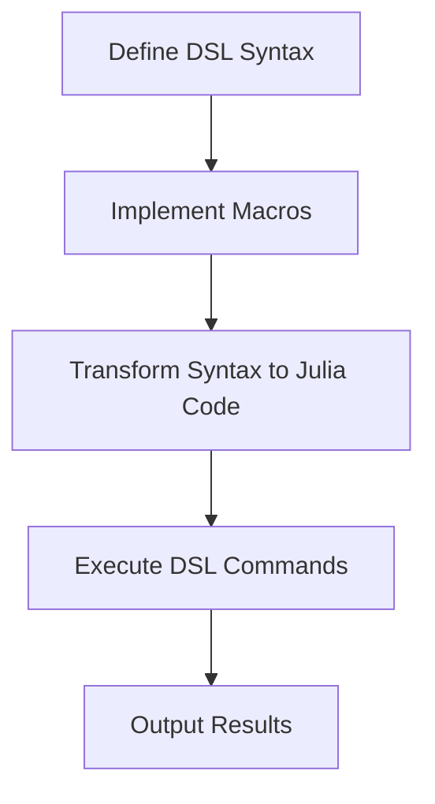

## 15.6 Building Domain-Specific Languages (DSLs)

Domain-Specific Languages (DSLs) are specialized mini-languages tailored to a specific application domain. They provide a way to express domain concepts directly and concisely, often simplifying complex problems. In Julia, the power of metaprogramming and macros makes it an excellent choice for building DSLs. This section will guide you through the process of creating DSLs in Julia, highlighting the advantages, techniques, and examples.

### Advantages of DSLs

#### Tailored Syntax

DSLs offer a syntax that is closely aligned with the domain they are designed for. This tailored syntax allows domain experts to express complex ideas more naturally and succinctly. For instance, a DSL for financial modeling might allow users to express calculations in terms of financial instruments and operations, rather than generic programming constructs.

- **Simplify Complex Domain Problems**: By abstracting away the underlying programming complexity, DSLs enable users to focus on the domain-specific logic. This can lead to more readable and maintainable code.

### Creating a DSL in Julia

Creating a DSL in Julia involves several steps, from defining the syntax to implementing the underlying logic. Let's explore these steps in detail.

#### Leveraging Macros

Macros in Julia are powerful tools for transforming custom syntax into executable Julia code. They operate on the Abstract Syntax Tree (AST) of the code, allowing you to manipulate and generate code dynamically.

- **Transform Custom Syntax into Julia Code**: Macros can be used to parse and transform domain-specific syntax into Julia expressions. This transformation is key to implementing a DSL.

##### Example: A Simple Arithmetic DSL

Let's start with a simple example of an arithmetic DSL that allows users to write expressions in a more natural way.

```julia
macro arithmetic(expr)
    return :(eval($expr))
end

@arithmetic 2 + 3 * 4
```

In this example, the `@arithmetic` macro takes an expression and evaluates it. While this is a trivial example, it demonstrates the basic idea of transforming custom syntax into Julia code.

#### Designing the Syntax

Designing the syntax of a DSL is a crucial step. The syntax should be intuitive for domain experts and should closely resemble the domain's natural language.

- **Identify Key Concepts**: Start by identifying the key concepts and operations in the domain. These will form the building blocks of your DSL.
- **Define Syntax Rules**: Define the syntax rules that will govern how these concepts are expressed in the DSL.

##### Example: A Query Language DSL

Consider a DSL for querying data. The syntax might resemble SQL, allowing users to express queries in a familiar way.

```julia
macro query(expr)
    # Transform the query syntax into Julia code
    return :(println("Executing query: ", $expr))
end

@query SELECT name, age FROM users WHERE age > 30
```

In this example, the `@query` macro transforms a query-like syntax into a Julia expression that prints the query. In a real-world application, this would be transformed into code that executes the query against a database.

#### Implementing the Logic

Once the syntax is defined, the next step is to implement the logic that will execute the DSL commands. This often involves transforming the DSL syntax into calls to existing libraries or functions.

- **Map DSL Constructs to Julia Functions**: Map the constructs of the DSL to Julia functions or libraries that perform the desired operations.

##### Example: A Simulation Framework DSL

Let's create a DSL for a simple physics simulation framework.

```julia
macro simulate(expr)
    # Parse and execute the simulation commands
    return :(println("Simulating: ", $expr))
end

@simulate PARTICLE position=(0,0) velocity=(1,1) MASS=1.0
```

In this example, the `@simulate` macro parses a simulation command and prints it. In a real application, this would be transformed into code that sets up and runs the simulation.

### Examples of DSLs in Julia

Julia's flexibility and performance make it an ideal platform for building DSLs. Here are some examples of DSLs that can be implemented in Julia.

#### Query Languages

DSLs for querying data, similar to SQL, can be implemented in Julia to provide a more natural way to express data queries.

- **Example**: A DSL for querying a database of scientific data, allowing researchers to express queries in terms of scientific concepts.

#### Simulation Frameworks

DSLs for simulation frameworks can simplify the process of setting up and running simulations.

- **Example**: A DSL for setting up physics simulations, allowing users to define particles, forces, and interactions in a concise syntax.

### Visualizing DSLs with Diagrams

To better understand the structure and flow of a DSL, let's use a diagram to visualize the process of transforming DSL syntax into executable code.



**Diagram Description**: This flowchart illustrates the process of building a DSL in Julia. It starts with defining the DSL syntax, implementing macros to transform the syntax into Julia code, executing the DSL commands, and finally outputting the results.

### Try It Yourself

Now that we've explored the basics of building DSLs in Julia, it's time to try it yourself. Here are some exercises to get you started:

1. **Modify the Arithmetic DSL**: Extend the arithmetic DSL to support additional operations, such as exponentiation or trigonometric functions.
2. **Create a Simple Query DSL**: Implement a DSL for querying a list of dictionaries, allowing users to filter and select data based on conditions.
3. **Build a Simulation DSL**: Create a DSL for setting up and running simple simulations, such as a bouncing ball or a pendulum.

### References and Further Reading

- [Julia Documentation on Macros](https://docs.julialang.org/en/v1/manual/metaprogramming/#Macros)
- [Domain-Specific Languages in Practice](https://martinfowler.com/books/dsl.html)
- [Metaprogramming in Julia](https://julialang.org/blog/2012/04/metaprogramming/)

### Knowledge Check

Before we conclude, let's reinforce what we've learned with a few questions:

- What are the key advantages of using DSLs in software development?
- How can macros be used to transform DSL syntax into executable code?
- What are some common applications of DSLs in Julia?

### Embrace the Journey

Building DSLs in Julia is a powerful way to simplify complex domain problems and create more intuitive interfaces for domain experts. Remember, this is just the beginning. As you progress, you'll be able to create more sophisticated DSLs that can transform the way domain experts interact with software. Keep experimenting, stay curious, and enjoy the journey!

## Quiz Time!



### What is a primary advantage of using DSLs?

- [x] Simplifying complex domain problems
- [ ] Increasing code verbosity
- [ ] Enhancing low-level programming
- [ ] Reducing the need for documentation

> **Explanation:** DSLs simplify complex domain problems by providing a tailored syntax that aligns with the domain's concepts.

### How do macros assist in building DSLs in Julia?

- [x] By transforming custom syntax into Julia code
- [ ] By compiling Julia code into machine code
- [ ] By optimizing memory usage
- [ ] By providing a graphical user interface

> **Explanation:** Macros in Julia transform custom syntax into executable Julia code, which is essential for implementing DSLs.

### What is the role of the Abstract Syntax Tree (AST) in macros?

- [x] It represents the structure of code for transformation
- [ ] It compiles code into machine language
- [ ] It manages memory allocation
- [ ] It provides error handling

> **Explanation:** The AST represents the structure of code, allowing macros to manipulate and transform it.

### Which of the following is an example of a DSL application?

- [x] Query languages
- [ ] Operating systems
- [ ] Device drivers
- [ ] Network protocols

> **Explanation:** Query languages are a common application of DSLs, providing a way to express data queries naturally.

### What is a key consideration when designing DSL syntax?

- [x] Intuitiveness for domain experts
- [ ] Complexity of implementation
- [ ] Compatibility with all programming languages
- [ ] Use of low-level constructs

> **Explanation:** The syntax of a DSL should be intuitive for domain experts to ensure ease of use and understanding.

### In the context of DSLs, what does the term "tailored syntax" refer to?

- [x] Syntax that closely aligns with domain concepts
- [ ] Syntax that is universally applicable
- [ ] Syntax that is optimized for performance
- [ ] Syntax that is difficult to understand

> **Explanation:** Tailored syntax refers to a syntax that is designed to closely align with the concepts and language of a specific domain.

### What is a common use case for simulation framework DSLs?

- [x] Setting up and running simulations
- [ ] Developing web applications
- [ ] Writing device drivers
- [ ] Designing user interfaces

> **Explanation:** Simulation framework DSLs are used to simplify the process of setting up and running simulations.

### How can DSLs improve code maintainability?

- [x] By abstracting away programming complexity
- [ ] By increasing code verbosity
- [ ] By reducing the need for comments
- [ ] By using low-level programming constructs

> **Explanation:** DSLs improve maintainability by abstracting away programming complexity, allowing users to focus on domain-specific logic.

### What is the first step in creating a DSL?

- [x] Designing the syntax
- [ ] Implementing the logic
- [ ] Testing the code
- [ ] Optimizing performance

> **Explanation:** Designing the syntax is the first step in creating a DSL, as it defines how domain concepts will be expressed.

### True or False: DSLs can only be used for data querying.

- [ ] True
- [x] False

> **Explanation:** False. DSLs can be used for a wide range of applications, including data querying, simulation frameworks, and more.


