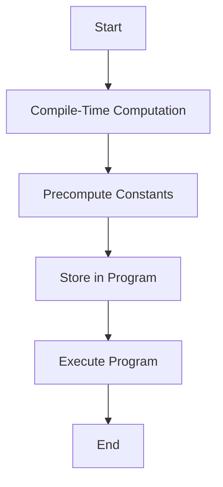
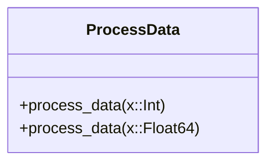

## 15.7 Using Metaprogramming for Performance Gains

Metaprogramming in Julia offers a powerful toolkit for developers aiming to optimize performance. By shifting computations from runtime to compile-time, unrolling loops, and implementing type-specific optimizations, we can achieve significant efficiency improvements. In this section, we will explore these techniques in detail, providing clear explanations, code examples, and visual aids to enhance understanding.

### Compile-Time Computation

Compile-time computation is a technique where certain calculations are performed during the compilation phase rather than at runtime. This can drastically reduce the workload during execution, leading to faster and more efficient programs.

#### Reducing Runtime Work

One of the primary goals of compile-time computation is to reduce the amount of work that needs to be done at runtime. By moving computations to compile-time, we can eliminate redundant calculations and streamline the execution process.

**Example: Precomputing Constants**

Consider a scenario where we need to compute a mathematical constant that remains unchanged throughout the program. Instead of recalculating it every time, we can use a macro to compute it once at compile-time.

```julia
macro precompute_constant()
    return :(const PI_APPROX = 3.14159)
end

@precompute_constant

function circle_area(radius)
    return PI_APPROX * radius^2
end

println(circle_area(5))  # Output: 78.53975
```

In this example, the `@precompute_constant` macro computes the constant `PI_APPROX` at compile-time, reducing runtime overhead.

#### Visualizing Compile-Time Computation

To better understand how compile-time computation works, let's visualize the process using a flowchart.



**Caption:** The flowchart illustrates the process of compile-time computation, where constants are precomputed and stored in the program, reducing runtime workload.

### Unrolling Loops

Loop unrolling is a technique used to optimize loops by reducing the overhead associated with loop control. By generating code that eliminates unnecessary loop iterations, we can achieve faster execution times.

#### Reducing Overhead

Loop control structures, such as incrementing counters and checking conditions, can introduce significant overhead. By unrolling loops, we can minimize this overhead and improve performance.

**Example: Unrolling a Simple Loop**

Let's consider a simple loop that sums the elements of an array. We can use metaprogramming to unroll this loop and reduce overhead.

```julia
function sum_unrolled(arr)
    @assert length(arr) % 4 == 0 "Array length must be a multiple of 4"
    total = 0
    for i in 1:4:length(arr)
        total += arr[i] + arr[i+1] + arr[i+2] + arr[i+3]
    end
    return total
end

arr = [1, 2, 3, 4, 5, 6, 7, 8]
println(sum_unrolled(arr))  # Output: 36
```

In this example, the loop is unrolled by manually summing four elements at a time, reducing the loop control overhead.

#### Visualizing Loop Unrolling

To visualize loop unrolling, we can use a sequence diagram to show how the loop iterations are optimized.

```mermaid
sequenceDiagram
    participant Program
    participant Loop
    participant UnrolledLoop

    Program->>Loop: Start Iteration
    Loop->>Loop: Increment Counter
    Loop->>Loop: Check Condition
    Loop->>Program: Execute Body
    Loop->>Loop: Repeat

    Program->>UnrolledLoop: Start Iteration
    UnrolledLoop->>Program: Execute Body (4x)
    UnrolledLoop->>UnrolledLoop: Repeat
```

**Caption:** The sequence diagram compares a standard loop with an unrolled loop, highlighting the reduction in loop control operations.

### Type-Specific Optimizations

Type-specific optimizations involve writing specialized code paths for certain data types, allowing for more efficient execution. Julia's powerful type system and multiple dispatch capabilities make it an ideal language for implementing these optimizations.

#### Specialized Implementations

By leveraging Julia's type system, we can create specialized implementations that take advantage of specific data types, leading to performance gains.

**Example: Optimizing for Integer Types**

Consider a function that performs different operations based on the type of its input. We can use multiple dispatch to optimize the function for integer types.

```julia
function process_data(x::Int)
    return x * 2  # Optimized for integers
end

function process_data(x::Float64)
    return x / 2.0  # Optimized for floats
end

println(process_data(10))    # Output: 20
println(process_data(10.0))  # Output: 5.0
```

In this example, the `process_data` function has specialized implementations for `Int` and `Float64` types, allowing for optimized performance.

#### Visualizing Type-Specific Optimizations

To visualize type-specific optimizations, we can use a class diagram to represent the different implementations based on data types.



**Caption:** The class diagram illustrates the `ProcessData` class with specialized implementations for integer and float types.

### Try It Yourself

Now that we've explored the concepts of compile-time computation, loop unrolling, and type-specific optimizations, it's time to try them out yourself. Experiment with the code examples provided and see how you can apply these techniques to your own projects.

- **Modify the `circle_area` function** to use a different mathematical constant.
- **Unroll the loop in the `sum_unrolled` function** for arrays of different lengths.
- **Create a new function with type-specific optimizations** for additional data types.

### Knowledge Check

Let's reinforce what we've learned with a few questions and exercises:

1. **What is the primary benefit of compile-time computation?**
   - Reducing runtime workload by precomputing values.

2. **How does loop unrolling improve performance?**
   - By minimizing loop control overhead and reducing the number of iterations.

3. **What is the advantage of type-specific optimizations?**
   - Allowing for specialized implementations that take advantage of specific data types.

### Embrace the Journey

Remember, mastering metaprogramming for performance gains is a journey. As you continue to explore these techniques, you'll discover new ways to optimize your Julia programs. Stay curious, keep experimenting, and enjoy the process!

## Quiz Time!



### What is the primary benefit of compile-time computation?

- [x] Reducing runtime workload by precomputing values
- [ ] Increasing code complexity
- [ ] Enhancing code readability
- [ ] Improving error handling

> **Explanation:** Compile-time computation reduces runtime workload by precomputing values, leading to faster execution.

### How does loop unrolling improve performance?

- [x] By minimizing loop control overhead
- [ ] By increasing the number of iterations
- [ ] By adding more conditional checks
- [ ] By using more memory

> **Explanation:** Loop unrolling minimizes loop control overhead by reducing the number of iterations and eliminating unnecessary operations.

### What is the advantage of type-specific optimizations?

- [x] Allowing for specialized implementations
- [ ] Making code less readable
- [ ] Increasing runtime errors
- [ ] Reducing code flexibility

> **Explanation:** Type-specific optimizations allow for specialized implementations that take advantage of specific data types, improving performance.

### Which technique involves moving computations from runtime to compile-time?

- [x] Compile-time computation
- [ ] Loop unrolling
- [ ] Type-specific optimizations
- [ ] Dynamic dispatch

> **Explanation:** Compile-time computation involves moving computations from runtime to compile-time, reducing runtime workload.

### What is a common use case for loop unrolling?

- [x] Reducing loop control overhead
- [ ] Increasing code complexity
- [ ] Enhancing error handling
- [ ] Improving code readability

> **Explanation:** Loop unrolling is commonly used to reduce loop control overhead, leading to faster execution.

### How can type-specific optimizations be implemented in Julia?

- [x] Using multiple dispatch
- [ ] Using global variables
- [ ] Using macros
- [ ] Using dynamic typing

> **Explanation:** Type-specific optimizations can be implemented in Julia using multiple dispatch, allowing for specialized implementations based on data types.

### What is the role of macros in compile-time computation?

- [x] Precomputing values
- [ ] Increasing runtime errors
- [ ] Enhancing code readability
- [ ] Reducing code flexibility

> **Explanation:** Macros play a crucial role in compile-time computation by precomputing values and reducing runtime workload.

### Which of the following is NOT a benefit of metaprogramming for performance gains?

- [ ] Reducing runtime workload
- [ ] Minimizing loop control overhead
- [ ] Allowing for specialized implementations
- [x] Increasing code complexity

> **Explanation:** While metaprogramming offers many benefits for performance gains, increasing code complexity is not one of them.

### What is a key consideration when using type-specific optimizations?

- [x] Ensuring specialized implementations are efficient
- [ ] Making code less readable
- [ ] Increasing runtime errors
- [ ] Reducing code flexibility

> **Explanation:** When using type-specific optimizations, it's important to ensure that specialized implementations are efficient and improve performance.

### True or False: Compile-time computation can lead to faster execution by reducing runtime workload.

- [x] True
- [ ] False

> **Explanation:** True. Compile-time computation reduces runtime workload by precomputing values, leading to faster execution.


