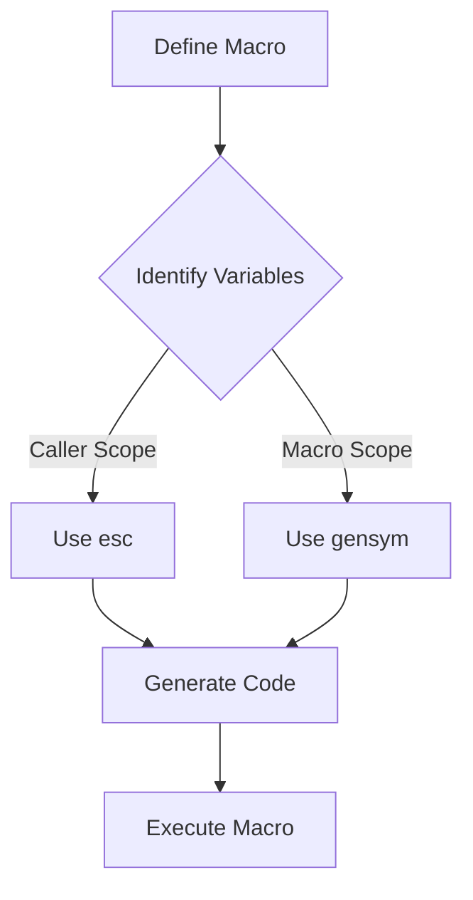

## 15.8 Hygiene in Macros and Best Practices

Macros in Julia provide powerful metaprogramming capabilities, allowing developers to generate and transform code programmatically. However, with great power comes the responsibility to ensure that macros are hygienic and maintainable. In this section, we will delve into the concept of macro hygiene, explore best practices for writing clean and effective macros, and discuss how to document them for clarity and usability.

### Variable Hygiene

#### Avoiding Conflicts

One of the primary concerns when writing macros is avoiding variable conflicts. Macros operate at the syntactic level, which means they can inadvertently introduce naming conflicts if not handled carefully. To manage scope and prevent such conflicts, Julia provides tools like `esc` and `gensym`.

**Using `esc`**

The `esc` function is used to escape expressions, ensuring that they are evaluated in the correct scope. When writing macros, it's crucial to determine which parts of the macro should be evaluated in the caller's scope and which should remain in the macro's scope.

```julia
macro example(x)
    return :(println("The value is ", $(esc(x))))
end

y = 10
@example y  # Outputs: The value is 10
```

In this example, `esc(x)` ensures that `x` is evaluated in the scope where the macro is called, not where it is defined.

**Using `gensym`**

`gensym` generates unique symbol names, which can be used to avoid naming conflicts within macros. This is particularly useful when creating temporary variables.

```julia
macro safe_temp()
    temp_var = gensym("temp")
    return quote
        $temp_var = 42
        println("Temporary variable: ", $temp_var)
    end
end

@safe_temp  # Outputs: Temporary variable: 42
```

Here, `gensym("temp")` ensures that the temporary variable does not clash with any existing variables in the user's code.

### Best Practices

#### Clarity

Writing macros that are easy to understand and maintain is essential for long-term code health. Here are some tips for achieving clarity in your macros:

- **Keep Macros Simple**: Avoid overly complex logic within macros. If a macro becomes too complex, consider refactoring it into smaller, more manageable pieces.
- **Use Descriptive Names**: Name your macros and any generated variables clearly to convey their purpose and functionality.
- **Limit Side Effects**: Macros should have predictable behavior and minimal side effects. This makes them easier to reason about and debug.

#### Documenting Macros

Proper documentation is crucial for macros, as their behavior can be less intuitive than regular functions. Here are some guidelines for documenting macros effectively:

- **Usage Instructions**: Provide clear explanations of how the macro should be used, including any expected input and output.
- **Behavior and Limitations**: Describe what the macro does, any limitations it has, and any potential pitfalls users should be aware of.
- **Examples**: Include examples of how to use the macro in practice. This helps users understand its application and potential edge cases.

### Code Examples

Let's explore some practical examples to illustrate these concepts.

**Example 1: A Hygienic Logging Macro**

```julia
macro log(expr)
    return quote
        println("Logging: ", $(esc(expr)))
    end
end

x = 5
@log x + 1  # Outputs: Logging: 6
```

In this example, the `log` macro uses `esc` to ensure that the expression `x + 1` is evaluated in the caller's scope.

**Example 2: A Macro with Temporary Variables**

```julia
macro compute_sum(a, b)
    temp = gensym("temp")
    return quote
        $temp = $(esc(a)) + $(esc(b))
        println("Sum: ", $temp)
    end
end

@compute_sum 3, 4  # Outputs: Sum: 7
```

Here, `gensym` is used to create a unique temporary variable, avoiding any potential conflicts with existing variables.

### Visualizing Macro Hygiene

To better understand the concept of macro hygiene, let's visualize the process of variable scoping and conflict avoidance using a flowchart.



**Caption**: This flowchart illustrates the process of ensuring macro hygiene by identifying variable scopes and using `esc` and `gensym` appropriately.

### References and Links

For further reading on macros and metaprogramming in Julia, consider exploring the following resources:

- [Julia Documentation on Macros](https://docs.julialang.org/en/v1/manual/metaprogramming/#Macros)
- [Metaprogramming in Julia: A Comprehensive Guide](https://julialang.org/blog/2017/04/metaprogramming/)
- [Understanding Julia's `esc` and `gensym`](https://discourse.julialang.org/t/understanding-esc-and-gensym/)

### Knowledge Check

To reinforce your understanding of macro hygiene and best practices, consider the following questions:

- What is the purpose of using `esc` in a macro?
- How does `gensym` help prevent variable conflicts?
- Why is it important to document macros thoroughly?

### Embrace the Journey

Remember, mastering macros and metaprogramming in Julia is a journey. As you continue to experiment and learn, you'll discover new ways to leverage these powerful tools to write more efficient and expressive code. Keep exploring, stay curious, and enjoy the process!

### Quiz Time!



### What is the primary purpose of using `esc` in a macro?

- [x] To ensure expressions are evaluated in the caller's scope
- [ ] To create unique variable names
- [ ] To optimize performance
- [ ] To simplify code

> **Explanation:** `esc` is used to ensure that expressions are evaluated in the caller's scope, maintaining the correct context.

### How does `gensym` help in writing macros?

- [x] It generates unique symbol names to avoid conflicts
- [ ] It optimizes code execution
- [ ] It simplifies macro syntax
- [ ] It provides debugging information

> **Explanation:** `gensym` generates unique symbol names, preventing naming conflicts within macros.

### What is a key benefit of documenting macros?

- [x] It provides clear usage instructions and behavior explanations
- [ ] It reduces code execution time
- [ ] It automatically optimizes the macro
- [ ] It eliminates the need for `esc`

> **Explanation:** Documenting macros helps users understand how to use them, their behavior, and any limitations.

### Which function is used to escape expressions in macros?

- [x] `esc`
- [ ] `gensym`
- [ ] `quote`
- [ ] `macroexpand`

> **Explanation:** The `esc` function is used to escape expressions, ensuring they are evaluated in the correct scope.

### What should be avoided in macro design for clarity?

- [x] Overly complex logic
- [ ] Descriptive names
- [ ] Limiting side effects
- [ ] Clear documentation

> **Explanation:** Overly complex logic should be avoided to maintain clarity and ease of understanding.

### Why is it important to limit side effects in macros?

- [x] To ensure predictable behavior
- [ ] To increase execution speed
- [ ] To reduce memory usage
- [ ] To simplify syntax

> **Explanation:** Limiting side effects ensures that macros have predictable behavior, making them easier to reason about and debug.

### What is a common use case for `gensym` in macros?

- [x] Creating temporary variables
- [ ] Escaping expressions
- [ ] Optimizing performance
- [ ] Simplifying syntax

> **Explanation:** `gensym` is commonly used to create temporary variables with unique names to avoid conflicts.

### What is the role of `quote` in macros?

- [x] To create code expressions
- [ ] To escape variables
- [ ] To generate unique symbols
- [ ] To optimize code

> **Explanation:** `quote` is used to create code expressions that can be manipulated within macros.

### True or False: Macros should have minimal side effects for better maintainability.

- [x] True
- [ ] False

> **Explanation:** Macros with minimal side effects are easier to maintain and debug, as their behavior is more predictable.

### What is a recommended practice for naming macros?

- [x] Use descriptive names that convey purpose
- [ ] Use short, cryptic names
- [ ] Use numbers in names
- [ ] Use random names

> **Explanation:** Descriptive names help convey the purpose and functionality of macros, aiding in understanding and maintenance.


