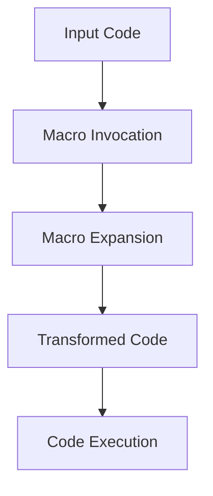

## 15.9 Debugging Macros and Generated Code

Debugging macros and generated code in Julia can be a challenging yet rewarding endeavor. As we delve into the intricacies of metaprogramming, understanding how to effectively troubleshoot and optimize these powerful constructs is essential for any Julia developer. In this section, we will explore the tools, common issues, and strategies for debugging macros and generated code, empowering you to harness the full potential of Julia's metaprogramming capabilities.

### Understanding Macros and Generated Code

Before diving into debugging, let's briefly revisit what macros and generated code are in Julia. Macros are a powerful feature that allows you to transform code before it is evaluated. They operate on the abstract syntax tree (AST) of the code, enabling you to perform complex code manipulations. Generated code, on the other hand, refers to code that is dynamically created and executed at runtime, often using macros or other metaprogramming techniques.

### Tools for Macro Debugging

#### `@macroexpand` Macro

One of the most useful tools for debugging macros in Julia is the `@macroexpand` macro. This tool allows you to see the result of macro expansion, providing insight into how your macro transforms the input code.

```julia
macro my_macro(x)
    return :(println("The value is: ", $x))
end

expanded_code = @macroexpand @my_macro(42)
println(expanded_code)
```

In this example, `@macroexpand` reveals the transformation performed by `my_macro`, helping us understand how the input code is altered.

#### `@macroexpand1` for Step-by-Step Expansion

For more complex macros, `@macroexpand1` can be invaluable. It performs a single step of macro expansion, allowing you to break down the transformation process into manageable parts.

```julia
macro nested_macro(x)
    return :(@my_macro($x + 1))
end

step1 = @macroexpand1 @nested_macro(41)
println(step1)
step2 = @macroexpand step1
println(step2)
```

By using `@macroexpand1`, we can observe each stage of the macro expansion, making it easier to identify issues.

### Common Issues in Macro Debugging

#### Scoping Errors

Scoping errors are a frequent source of bugs in macros. These occur when variables are misused or incorrectly escaped, leading to unexpected behavior.

```julia
macro bad_scope(x)
    y = 10
    return :(println($x + y))
end

@bad_scope(5)
```

In this example, the variable `y` is not correctly scoped, causing an error. To fix this, we need to use `esc` to ensure proper variable handling.

```julia
macro good_scope(x)
    y = 10
    return :(println($x + $(esc(:y))))
end

@good_scope(5)
```

By using `esc`, we ensure that `y` is correctly scoped, resolving the issue.

### Strategies for Debugging Macros

#### Step-by-Step Expansion

Breaking down macros into smaller parts for testing is a highly effective strategy. By isolating each component, you can identify and fix issues more easily.

```julia
macro complex_macro(x)
    part1 = :(println("Part 1: ", $x))
    part2 = :(println("Part 2: ", $x * 2))
    return :($part1; $part2)
end

println(@macroexpand1 @complex_macro(3))
println(@macroexpand @complex_macro(3))
```

By testing each part separately, you can pinpoint the source of errors and make necessary adjustments.

#### Using Debugging Tools

Julia provides several debugging tools that can aid in macro debugging. Tools like `Debugger.jl` and `Rebugger.jl` offer interactive debugging capabilities, allowing you to step through code and inspect variables.

```julia
using Debugger

function test_macro()
    @complex_macro(3)
end

@enter test_macro()
```

By using these tools, you can gain deeper insights into the execution flow and identify issues more effectively.

### Visualizing Macro Expansion

To further aid in understanding macro expansion, we can use diagrams to visualize the transformation process. Below is a simple flowchart illustrating the steps involved in macro expansion.



**Figure 1: Macro Expansion Process**

This diagram provides a high-level overview of how macros transform input code into executable code, highlighting the key stages involved.

### Try It Yourself

To solidify your understanding, try modifying the code examples provided. Experiment with different macro definitions and observe how `@macroexpand` and `@macroexpand1` reveal the transformations. Consider creating your own macros and debugging them using the strategies discussed.

### References and Further Reading

- [Julia Documentation on Macros](https://docs.julialang.org/en/v1/manual/metaprogramming/#Macros)
- [JuliaLang GitHub Repository](https://github.com/JuliaLang/julia)
- [Debugger.jl Documentation](https://github.com/JuliaDebug/Debugger.jl)

### Knowledge Check

To reinforce your learning, consider the following questions:

1. What is the purpose of the `@macroexpand` macro in Julia?
2. How can scoping errors affect macro behavior?
3. What strategies can be used to debug complex macros?
4. How does `@macroexpand1` differ from `@macroexpand`?
5. What tools are available for interactive debugging in Julia?

### Embrace the Journey

Remember, mastering macros and generated code in Julia is a journey. As you continue to explore and experiment, you'll gain a deeper understanding of these powerful constructs. Stay curious, keep experimenting, and enjoy the process of learning and discovery.

## Quiz Time!



### What is the primary purpose of the `@macroexpand` macro in Julia?

- [x] To see the result of macro expansion
- [ ] To execute the macro
- [ ] To define a new macro
- [ ] To optimize the macro

> **Explanation:** The `@macroexpand` macro is used to see the result of macro expansion, helping developers understand how the macro transforms the input code.

### How does `@macroexpand1` differ from `@macroexpand`?

- [x] It performs a single step of macro expansion
- [ ] It executes the macro
- [ ] It optimizes the macro
- [ ] It defines a new macro

> **Explanation:** `@macroexpand1` performs a single step of macro expansion, allowing developers to break down the transformation process into manageable parts.

### What is a common issue when debugging macros?

- [x] Scoping errors
- [ ] Syntax errors
- [ ] Compilation errors
- [ ] Runtime errors

> **Explanation:** Scoping errors are a common issue in macros, often caused by misuse of variables or incorrect `esc` usage.

### Which tool can be used for interactive debugging in Julia?

- [x] Debugger.jl
- [ ] MacroTools.jl
- [ ] Optim.jl
- [ ] DataFrames.jl

> **Explanation:** Debugger.jl is a tool for interactive debugging in Julia, allowing developers to step through code and inspect variables.

### What strategy can help in debugging complex macros?

- [x] Step-by-step expansion
- [ ] Ignoring errors
- [ ] Using only `@macroexpand`
- [ ] Avoiding macros

> **Explanation:** Step-by-step expansion helps in debugging complex macros by isolating each component and identifying issues more easily.

### What does the `esc` function do in macros?

- [x] Ensures proper variable scoping
- [ ] Executes the macro
- [ ] Optimizes the macro
- [ ] Defines a new macro

> **Explanation:** The `esc` function ensures proper variable scoping in macros, preventing scoping errors.

### Which of the following is a common pitfall in macro debugging?

- [x] Misuse of `esc`
- [ ] Overuse of `@macroexpand`
- [ ] Lack of comments
- [ ] Using too many macros

> **Explanation:** Misuse of `esc` is a common pitfall in macro debugging, leading to scoping errors.

### What is generated code in Julia?

- [x] Code dynamically created and executed at runtime
- [ ] Code written by the developer
- [ ] Code that is precompiled
- [ ] Code that is optimized

> **Explanation:** Generated code in Julia refers to code that is dynamically created and executed at runtime, often using macros or other metaprogramming techniques.

### True or False: Macros operate on the abstract syntax tree (AST) of the code.

- [x] True
- [ ] False

> **Explanation:** True. Macros operate on the abstract syntax tree (AST) of the code, allowing for complex code manipulations.

### Which diagram type is used to visualize the macro expansion process?

- [x] Flowchart
- [ ] Class diagram
- [ ] Sequence diagram
- [ ] State diagram

> **Explanation:** A flowchart is used to visualize the macro expansion process, illustrating the transformation from input code to executable code.



By mastering the art of debugging macros and generated code, you'll unlock new levels of efficiency and creativity in your Julia programming journey. Keep exploring, stay curious, and enjoy the process of learning and discovery.
