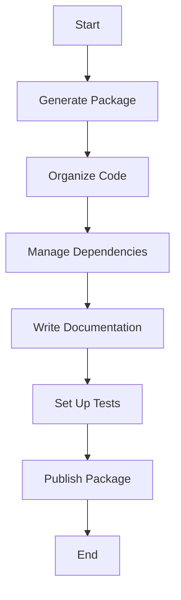

## 16.1 Packaging Julia Applications for Distribution

### Introduction to Packaging

Packaging is a crucial step in software development, enabling developers to share, deploy, and maintain applications efficiently. In Julia, packaging is not just about bundling code; it's about creating a structured, maintainable, and scalable application that can be easily shared and reused. Understanding the nuances of packaging in Julia will empower you to distribute your applications effectively, whether for open-source contributions or internal deployments.

#### Understanding the Importance of Packaging

Packaging serves multiple purposes:

- **Reusability**: Packages allow code to be reused across different projects, reducing duplication and enhancing maintainability.
- **Distribution**: Packaging facilitates the sharing of applications with others, whether through public registries or private repositories.
- **Version Control**: Proper packaging ensures that dependencies and versions are managed, preventing conflicts and ensuring compatibility.
- **Documentation and Testing**: A well-packaged application includes comprehensive documentation and testing, ensuring that users can understand and trust the software.

#### Differences Between Scripts, Packages, and Applications in Julia

- **Scripts**: These are standalone files that execute a series of commands. They are suitable for small tasks but lack the structure and scalability of packages.
- **Packages**: These are collections of modules and functions organized in a directory structure. Packages are designed for reuse and distribution, with metadata files that manage dependencies and versions.
- **Applications**: These are complete software solutions that may consist of multiple packages and scripts. Applications are typically packaged for deployment, ensuring that all components work seamlessly together.

### Creating a Julia Package

Creating a Julia package involves several steps, from scaffolding the package structure to organizing code and managing dependencies.

#### Using `Pkg.generate()` to Scaffold a New Package

The `Pkg` module in Julia provides tools for package management, including the `generate` function, which scaffolds a new package with the necessary directory structure and files.

```julia
using Pkg

Pkg.generate("MyPackage")
```

This command creates a directory named `MyPackage` with the following structure:

```
MyPackage/
├── Project.toml
└── src/
    └── MyPackage.jl
```

- **Project.toml**: This file contains metadata about the package, including its name, version, and dependencies.
- **src/MyPackage.jl**: This is the main source file where you define your package's modules and functions.

#### Organizing Code Within the `src` Directory and Structuring Modules

The `src` directory is where you place your package's code. Organizing your code into modules helps maintain clarity and separation of concerns.

```julia

module MyPackage

export greet

function greet(name::String)
    println("Hello, $name!")
end

end # module
```

- **Modules**: Use modules to encapsulate functionality and manage namespaces.
- **Exporting Functions**: Use the `export` keyword to specify which functions or variables should be accessible to users of the package.

### Project and Manifest Files

Managing dependencies is a critical aspect of packaging. Julia uses `Project.toml` and `Manifest.toml` files to handle this.

#### Managing Dependencies with `Project.toml` and `Manifest.toml`

- **Project.toml**: This file lists the package's dependencies and their versions. It also includes metadata such as the package's name, version, and authors.

```toml
name = "MyPackage"
uuid = "12345678-1234-5678-1234-567812345678"
version = "0.1.0"

[deps]
DataFrames = "a93c6f00-e57d-5684-b7b6-d8193f3e46c0"
```

- **Manifest.toml**: This file is automatically generated and contains a complete snapshot of the dependency graph, including all transitive dependencies and their exact versions.

#### Specifying Compatibility and Version Constraints

It's important to specify compatibility constraints to ensure that your package works with specific versions of its dependencies.

```toml
[compat]
julia = "1.6"
DataFrames = "0.22"
```

- **Version Constraints**: Use semantic versioning to specify compatible versions of dependencies.
- **Julia Version**: Specify the versions of Julia that your package supports.

### Documentation and Testing

Comprehensive documentation and testing are essential for a robust package.

#### Writing Documentation with Documenter.jl

Documenter.jl is a popular tool for generating documentation for Julia packages. It converts docstrings and markdown files into HTML documentation.

```julia

"""
    greet(name::String)

Prints a greeting message to the specified name.
"""
function greet(name::String)
    println("Hello, $name!")
end
```

- **Docstrings**: Use triple quotes to write docstrings for functions and modules.
- **Markdown Files**: Include additional documentation in markdown files within the `docs` directory.

#### Setting Up Test Suites Using the `Test` Standard Library

Testing ensures that your package functions as expected. Julia's `Test` standard library provides tools for writing and running tests.

```julia
using Test
using MyPackage

@testset "Greet Tests" begin
    @test greet("World") == "Hello, World!"
end
```

- **Test Sets**: Group related tests using `@testset`.
- **Assertions**: Use `@test` to assert expected outcomes.

### Publishing Packages

Once your package is ready, you can publish it to Julia's General Registry, making it available to the community.

#### Registering Packages in Julia's General Registry

To register a package, you need to follow the guidelines provided by the Julia community, which include ensuring that your package meets certain quality standards.

1. **Create a GitHub Repository**: Host your package's code on GitHub.
2. **Tag a Release**: Use Git tags to mark a release version.
3. **Submit a Pull Request**: Use the JuliaRegistrator bot to submit a pull request to the General Registry.

#### Best Practices for Maintainable and User-Friendly Packages

- **Consistent Naming**: Use clear and descriptive names for your package and its functions.
- **Comprehensive Documentation**: Ensure that your package is well-documented, with examples and usage instructions.
- **Robust Testing**: Write thorough tests to cover all aspects of your package's functionality.
- **Semantic Versioning**: Follow semantic versioning principles to communicate changes and compatibility.

### Visualizing the Packaging Process

To better understand the packaging process, let's visualize the workflow using a flowchart.



- **Start**: Begin by generating a new package.
- **Generate Package**: Use `Pkg.generate()` to create the package structure.
- **Organize Code**: Structure your code within modules and the `src` directory.
- **Manage Dependencies**: Use `Project.toml` and `Manifest.toml` to handle dependencies.
- **Write Documentation**: Document your package using Documenter.jl.
- **Set Up Tests**: Write tests using the `Test` standard library.
- **Publish Package**: Register your package in the General Registry.

### Try It Yourself

Now that we've covered the basics of packaging Julia applications, try creating your own package. Experiment with different module structures, add dependencies, and write tests. Consider publishing your package to the General Registry to share it with the community.

### Knowledge Check

- **What is the purpose of the `Project.toml` file?**
- **How do you specify version constraints for dependencies?**
- **What tool can you use to generate documentation for a Julia package?**
- **Why is testing important in package development?**
- **What are the steps to publish a package to Julia's General Registry?**

### Embrace the Journey

Remember, packaging is just the beginning. As you continue to develop and distribute Julia applications, you'll refine your skills and contribute to the vibrant Julia community. Keep experimenting, stay curious, and enjoy the journey!

## Quiz Time!



### What is the primary purpose of packaging in Julia?

- [x] To enable distribution and reuse of code
- [ ] To increase the execution speed of scripts
- [ ] To convert scripts into binary executables
- [ ] To obfuscate code for security

> **Explanation:** Packaging in Julia is primarily about enabling the distribution and reuse of code, making it easier to share and maintain.

### Which command is used to scaffold a new Julia package?

- [x] `Pkg.generate()`
- [ ] `Pkg.init()`
- [ ] `Pkg.create()`
- [ ] `Pkg.build()`

> **Explanation:** `Pkg.generate()` is the command used to create the initial structure of a new Julia package.

### What file contains the complete snapshot of a package's dependency graph?

- [x] `Manifest.toml`
- [ ] `Project.toml`
- [ ] `Dependencies.toml`
- [ ] `Package.toml`

> **Explanation:** `Manifest.toml` contains a complete snapshot of the dependency graph, including all transitive dependencies.

### How do you specify compatibility constraints for a dependency in Julia?

- [x] By using the `[compat]` section in `Project.toml`
- [ ] By editing the `Manifest.toml` directly
- [ ] By using the `Pkg.add()` command
- [ ] By setting environment variables

> **Explanation:** Compatibility constraints are specified in the `[compat]` section of the `Project.toml` file.

### Which tool is commonly used for generating documentation in Julia?

- [x] Documenter.jl
- [ ] DocGen.jl
- [ ] DocMaker.jl
- [ ] DocBuilder.jl

> **Explanation:** Documenter.jl is the tool commonly used for generating documentation for Julia packages.

### What is the purpose of the `Test` standard library in Julia?

- [x] To provide tools for writing and running tests
- [ ] To compile Julia code into executables
- [ ] To manage package dependencies
- [ ] To generate documentation

> **Explanation:** The `Test` standard library provides tools for writing and running tests to ensure package functionality.

### What is the first step in publishing a package to Julia's General Registry?

- [x] Create a GitHub repository for the package
- [ ] Submit a pull request to the General Registry
- [ ] Tag a release version
- [ ] Write comprehensive documentation

> **Explanation:** The first step is to create a GitHub repository for the package, where the code will be hosted.

### What is semantic versioning?

- [x] A versioning system that communicates changes and compatibility
- [ ] A method for optimizing code execution
- [ ] A tool for generating package documentation
- [ ] A technique for managing memory allocation

> **Explanation:** Semantic versioning is a system that uses version numbers to communicate changes and compatibility.

### Which file is automatically generated and should not be manually edited?

- [x] `Manifest.toml`
- [ ] `Project.toml`
- [ ] `README.md`
- [ ] `LICENSE`

> **Explanation:** `Manifest.toml` is automatically generated and should not be manually edited, as it contains a detailed dependency graph.

### True or False: Packages in Julia can only be shared through the General Registry.

- [ ] True
- [x] False

> **Explanation:** Packages in Julia can be shared through other means, such as private registries or direct distribution, not just the General Registry.




