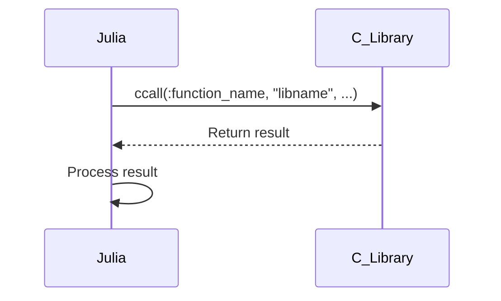

## 16.10 Integrating C and Fortran Libraries

Integrating C and Fortran libraries into Julia applications can significantly enhance performance and functionality by leveraging existing codebases and optimized libraries. This section will guide you through the process of integrating these libraries, focusing on the advantages, techniques, and best practices.

### Advantages of Integration

Integrating C and Fortran libraries into Julia offers several benefits:

- **Performance**: C and Fortran libraries are often highly optimized for performance, making them ideal for computationally intensive tasks.
- **Reusability**: By integrating existing libraries, you can reuse well-tested and reliable code, reducing development time and effort.
- **Interoperability**: Combining Julia with C and Fortran allows you to create applications that can interact with a wide range of systems and technologies.

### Using `ccall` with C Libraries

Julia provides the `ccall` function to call C functions directly. This allows you to interface with C libraries seamlessly.

#### Basic Usage of `ccall`

The `ccall` function requires the following parameters:

1. **Function Name**: The name of the C function you want to call.
2. **Library**: The library where the function is located.
3. **Return Type**: The type of value the function returns.
4. **Argument Types**: A tuple specifying the types of the arguments the function accepts.
5. **Arguments**: The actual arguments to pass to the function.

Here's a simple example of using `ccall` to call the `sqrt` function from the C standard library:

```julia
result = ccall((:sqrt, "libm"), Float64, (Float64,), 9.0)

println("The square root of 9.0 is $result")
```

#### Handling Pointers and Arrays

When dealing with pointers and arrays, you need to ensure that the memory layout is compatible between Julia and C. Use `Ptr` types in Julia to represent C pointers.

```julia
function sum_array(arr::Vector{Float64})
    n = length(arr)
    return ccall((:sum_array, "libsum"), Float64, (Ptr{Float64}, Cint), arr, n)
end

arr = [1.0, 2.0, 3.0]
result = sum_array(arr)
println("The sum of the array is $result")
```

### Using `ccall` with Fortran Libraries

Fortran libraries often use different calling conventions and array ordering. Julia's `ccall` can also be used to call Fortran functions, but you need to handle these differences.

#### Calling Fortran Functions

Fortran uses column-major order for arrays, while Julia uses column-major order as well, which simplifies integration. However, you must ensure that the function signatures match.

```julia
function dot_product(x::Vector{Float64}, y::Vector{Float64})
    n = length(x)
    return ccall((:dot_product, "libfortran"), Float64, (Ptr{Float64}, Ptr{Float64}, Cint), x, y, n)
end

x = [1.0, 2.0, 3.0]
y = [4.0, 5.0, 6.0]
result = dot_product(x, y)
println("The dot product is $result")
```

### Memory Management

When integrating C and Fortran libraries, memory management is crucial to ensure compatibility and prevent leaks.

#### Allocating and Deallocating Memory

Use Julia's `Libc` module to allocate and deallocate memory when interfacing with C libraries.

```julia
using Libc

ptr = Libc.malloc(10 * sizeof(Float64))

ccall(:memset, Ptr{Cvoid}, (Ptr{Cvoid}, Cint, Csize_t), ptr, 0, 10 * sizeof(Float64))

Libc.free(ptr)
```

### Examples of Interfacing with High-Performance Libraries

Julia can interface with high-performance libraries like LAPACK and BLAS, which are often written in Fortran.

#### Interfacing with LAPACK

LAPACK provides routines for linear algebra operations. Here's an example of calling a LAPACK function to solve a linear system:

```julia
using LinearAlgebra

A = [3.0 1.0; 1.0 2.0]
b = [9.0, 8.0]

x = A \ b

println("The solution is $x")
```

### Automation with Clang.jl and CBinding.jl

Automating the generation of Julia interfaces for C headers can save time and reduce errors. Tools like Clang.jl and CBinding.jl facilitate this process.

#### Using Clang.jl

Clang.jl provides a way to parse C headers and generate Julia bindings automatically.

```julia
using Clang

ctx = Clang.Context()
Clang.parse_header(ctx, "example.h")
Clang.write_julia(ctx, "example.jl")
```

#### Using CBinding.jl

CBinding.jl offers a more manual approach to defining bindings, which can be useful for complex libraries.

```julia
using CBinding

struct MyStruct
    a::Cint
    b::Cdouble
end

function my_function(x::MyStruct)
    return ccall((:my_function, "libexample"), Cvoid, (Ref{MyStruct},), x)
end
```

### Try It Yourself

Experiment with the examples provided by modifying the function names, libraries, and parameters to call different C and Fortran functions. This hands-on approach will help solidify your understanding of integrating C and Fortran libraries into Julia applications.

### Visualizing the Integration Process

To better understand the integration process, let's visualize the workflow of calling a C function from Julia using a sequence diagram.



This diagram illustrates the sequence of steps involved in calling a C function from Julia, highlighting the interaction between Julia and the C library.

### Key Takeaways

- **`ccall` is a powerful tool** for integrating C and Fortran libraries into Julia applications.
- **Memory management** is crucial when interfacing with external libraries to prevent leaks and ensure compatibility.
- **Automation tools like Clang.jl and CBinding.jl** can simplify the process of generating bindings for C libraries.
- **Experimentation and practice** are key to mastering the integration of C and Fortran libraries in Julia.

### References and Further Reading

- [Julia Documentation on `ccall`](https://docs.julialang.org/en/v1/manual/calling-c-and-fortran-code/)
- [Clang.jl GitHub Repository](https://github.com/JuliaInterop/Clang.jl)
- [CBinding.jl GitHub Repository](https://github.com/analytech-solutions/CBinding.jl)

## Quiz Time!



### What is the primary function used in Julia to call C functions?

- [x] `ccall`
- [ ] `cfunction`
- [ ] `callC`
- [ ] `invokeC`

> **Explanation:** `ccall` is the function used in Julia to call C functions directly.

### Which memory layout does Julia use for arrays?

- [x] Column-major order
- [ ] Row-major order
- [ ] Mixed-major order
- [ ] None of the above

> **Explanation:** Julia uses column-major order for arrays, similar to Fortran.

### What is the purpose of Clang.jl?

- [x] To parse C headers and generate Julia bindings
- [ ] To compile C code
- [ ] To execute C functions
- [ ] To optimize C libraries

> **Explanation:** Clang.jl is used to parse C headers and automatically generate Julia bindings.

### Which module in Julia is used for memory allocation and deallocation?

- [x] `Libc`
- [ ] `Memory`
- [ ] `Alloc`
- [ ] `System`

> **Explanation:** The `Libc` module in Julia provides functions for memory allocation and deallocation.

### What is a key advantage of integrating C and Fortran libraries into Julia?

- [x] Performance enhancement
- [ ] Increased code complexity
- [ ] Reduced functionality
- [ ] Slower execution

> **Explanation:** Integrating C and Fortran libraries can enhance performance by leveraging optimized code.

### Which tool can be used for manual binding of C libraries in Julia?

- [x] CBinding.jl
- [ ] AutoBind.jl
- [ ] BindC.jl
- [ ] CLink.jl

> **Explanation:** CBinding.jl is used for manual binding of C libraries in Julia.

### What is a common challenge when integrating Fortran libraries?

- [x] Handling different calling conventions
- [ ] Lack of library support
- [ ] Incompatible data types
- [ ] Limited functionality

> **Explanation:** Handling different calling conventions is a common challenge when integrating Fortran libraries.

### Which of the following is a high-performance library often used with Julia?

- [x] LAPACK
- [ ] NumPy
- [ ] TensorFlow
- [ ] Pandas

> **Explanation:** LAPACK is a high-performance library commonly used for linear algebra operations in Julia.

### True or False: Julia can only interface with C libraries, not Fortran.

- [ ] True
- [x] False

> **Explanation:** Julia can interface with both C and Fortran libraries using `ccall`.

### What is the role of `Ptr` types in Julia?

- [x] To represent C pointers
- [ ] To define new data types
- [ ] To manage memory allocation
- [ ] To optimize code execution

> **Explanation:** `Ptr` types in Julia are used to represent C pointers, facilitating interaction with C libraries.



Remember, integrating C and Fortran libraries into Julia is a powerful way to enhance your applications. Keep experimenting, stay curious, and enjoy the journey of mastering Julia's interoperability capabilities!
