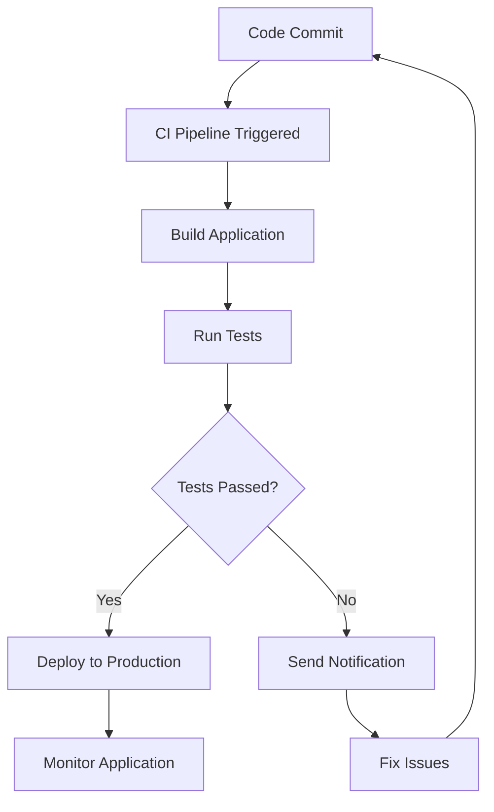

## 16.11 Best Practices for Deployment and Continuous Integration

In the world of software development, deploying applications efficiently and ensuring continuous integration (CI) are crucial for maintaining a robust and scalable system. This section will guide you through the best practices for deploying Julia applications and setting up CI pipelines. We'll cover automating builds and tests, managing dependencies, deploying strategies, and ensuring security and maintenance.

### Automating Builds and Tests

Automating the build and test processes is a cornerstone of modern software development. It ensures that your code is always in a deployable state and helps catch errors early in the development cycle.

#### Setting Up Continuous Integration Pipelines

Continuous Integration (CI) is a development practice where developers integrate code into a shared repository frequently. Each integration can then be verified by an automated build and automated tests. Let's explore how to set up CI pipelines using popular tools like GitHub Actions and Travis CI.

**GitHub Actions**

GitHub Actions is a powerful CI/CD tool integrated directly into GitHub. It allows you to automate workflows for your Julia projects.

```yaml
name: CI

on:
  push:
    branches: [main]
  pull_request:
    branches: [main]

jobs:
  build:
    runs-on: ubuntu-latest

    steps:
    - uses: actions/checkout@v2
    - name: Set up Julia
      uses: julia-actions/setup-julia@v1
      with:
        version: '1.6'
    - name: Install dependencies
      run: julia -e 'using Pkg; Pkg.instantiate()'
    - name: Run tests
      run: julia -e 'using Pkg; Pkg.test()'
```

**Travis CI**

Travis CI is another popular CI service that can be used to build and test Julia projects.

```yaml
language: julia
julia:
  - 1.6
  - nightly
os:
  - linux
  - osx
  - windows
script:
  - julia -e 'using Pkg; Pkg.test()'
```

### Testing Across Environments

Ensuring that your application works across different environments is essential for a robust deployment strategy. This involves testing your application with various Julia versions and operating systems.

#### Compatibility Testing

Use CI tools to test your application across multiple Julia versions and platforms. This ensures that your code remains compatible and functional regardless of the environment.

```yaml
jobs:
  build:
    strategy:
      matrix:
        os: [ubuntu-latest, macos-latest, windows-latest]
        julia: ['1.5', '1.6', 'nightly']
    runs-on: ${{ matrix.os }}

    steps:
    - uses: actions/checkout@v2
    - name: Set up Julia
      uses: julia-actions/setup-julia@v1
      with:
        version: ${{ matrix.julia }}
    - name: Install dependencies
      run: julia -e 'using Pkg; Pkg.instantiate()'
    - name: Run tests
      run: julia -e 'using Pkg; Pkg.test()'
```

### Managing Dependencies

Managing dependencies effectively is crucial for ensuring that your application runs smoothly across different environments.

#### Using Environments

Julia's package manager, Pkg.jl, provides a robust way to manage dependencies through environments. An environment is essentially a set of packages that are isolated from other environments, allowing you to manage package versions and dependencies effectively.

```julia
using Pkg
Pkg.activate("my_project")

Pkg.add("DataFrames")
Pkg.add("Plots")
```

#### Project and Manifest Files

Julia uses `Project.toml` and `Manifest.toml` files to manage dependencies. The `Project.toml` file lists the direct dependencies of your project, while the `Manifest.toml` file records the exact versions of all dependencies, ensuring reproducibility.

```toml
name = "MyProject"
uuid = "12345678-1234-5678-1234-567812345678"
authors = ["Your Name <your.email@example.com>"]
version = "0.1.0"

[deps]
DataFrames = "a93c6f00-e57d-5684-b7b6-d8193f3e46c0"
Plots = "91a5bcdd-55d7-5caf-9e0b-520d859cae80"
```

### Deployment Strategies

Deploying your application consistently across different environments is key to a successful deployment strategy. Docker is a popular tool for achieving this.

#### Dockerizing Julia Applications

Docker allows you to package your application and its dependencies into a container, ensuring consistency across different environments.

```dockerfile
FROM julia:1.6

WORKDIR /app

COPY . .

RUN julia -e 'using Pkg; Pkg.instantiate()'

CMD ["julia", "src/main.jl"]
```

Build and run your Docker container:

```bash
docker build -t my-julia-app .
docker run --rm my-julia-app
```

### Monitoring and Logging

Implementing robust monitoring and logging is essential for maintaining the health of your application and quickly diagnosing issues.

#### Logging Frameworks

Julia provides a built-in logging framework that allows you to capture and record log messages at different levels (e.g., debug, info, warn, error).

```julia
using Logging

function my_function()
    @info "This is an info message"
    @warn "This is a warning message"
    @error "This is an error message"
end
```

#### Monitoring Tools

Consider using monitoring tools like Prometheus and Grafana to track the performance and health of your Julia applications.

### Security and Maintenance

Ensuring the security and maintenance of your application is crucial for protecting against vulnerabilities and ensuring long-term stability.

#### Regularly Updating Dependencies

Regularly update your dependencies to benefit from security patches and improvements. Use tools like `Pkg.update()` to keep your packages up to date.

```julia
using Pkg
Pkg.update()
```

#### Handling Security Vulnerabilities

Stay informed about security vulnerabilities in your dependencies and apply patches promptly. Consider using tools like `PkgAudit.jl` to check for known vulnerabilities.

### Try It Yourself

Now that we've covered the best practices for deployment and continuous integration, try setting up a CI pipeline for your own Julia project. Experiment with Docker to containerize your application and explore different logging and monitoring tools to enhance your application's reliability.

## Visualizing Deployment and CI Workflow

To better understand the deployment and CI workflow, let's visualize the process using a flowchart.



**Figure 1:** This flowchart illustrates the typical workflow for deploying a Julia application using CI. It starts with a code commit, followed by triggering the CI pipeline, building the application, running tests, and deploying to production if tests pass.

## Quiz Time!



### What is the primary purpose of Continuous Integration (CI)?

- [x] To automate the integration of code into a shared repository
- [ ] To manually test code changes
- [ ] To deploy applications to production
- [ ] To write documentation

> **Explanation:** Continuous Integration (CI) automates the integration of code into a shared repository, allowing for automated builds and tests.

### Which tool is integrated directly into GitHub for CI/CD?

- [x] GitHub Actions
- [ ] Travis CI
- [ ] Jenkins
- [ ] CircleCI

> **Explanation:** GitHub Actions is a CI/CD tool integrated directly into GitHub, allowing for automated workflows.

### What file format does Julia use to manage project dependencies?

- [x] TOML
- [ ] JSON
- [ ] YAML
- [ ] XML

> **Explanation:** Julia uses `Project.toml` and `Manifest.toml` files to manage project dependencies.

### What is the benefit of Dockerizing applications?

- [x] Ensures consistency across different environments
- [ ] Increases application speed
- [ ] Reduces code size
- [ ] Improves code readability

> **Explanation:** Dockerizing applications ensures consistency across different environments by packaging the application and its dependencies into a container.

### Which logging level is used to capture error messages in Julia?

- [ ] Debug
- [ ] Info
- [ ] Warn
- [x] Error

> **Explanation:** The `Error` logging level is used to capture error messages in Julia.

### What command is used to update Julia packages?

- [x] `Pkg.update()`
- [ ] `Pkg.install()`
- [ ] `Pkg.remove()`
- [ ] `Pkg.build()`

> **Explanation:** The `Pkg.update()` command is used to update Julia packages to their latest versions.

### Which tool can be used to check for known vulnerabilities in Julia packages?

- [x] PkgAudit.jl
- [ ] PkgCheck.jl
- [ ] PkgScan.jl
- [ ] PkgSecure.jl

> **Explanation:** PkgAudit.jl is a tool used to check for known vulnerabilities in Julia packages.

### What is the purpose of the `Manifest.toml` file in Julia?

- [x] To record the exact versions of all dependencies
- [ ] To list the direct dependencies of a project
- [ ] To store environment variables
- [ ] To configure CI pipelines

> **Explanation:** The `Manifest.toml` file records the exact versions of all dependencies, ensuring reproducibility.

### Which tool is commonly used for monitoring Julia applications?

- [ ] Jenkins
- [ ] Docker
- [x] Prometheus
- [ ] GitHub Actions

> **Explanation:** Prometheus is commonly used for monitoring applications, including those written in Julia.

### True or False: Continuous Integration helps catch errors early in the development cycle.

- [x] True
- [ ] False

> **Explanation:** Continuous Integration helps catch errors early in the development cycle by automating builds and tests.



Remember, mastering deployment and continuous integration is a journey. As you progress, you'll find more efficient ways to automate and streamline your processes. Keep experimenting, stay curious, and enjoy the journey!
