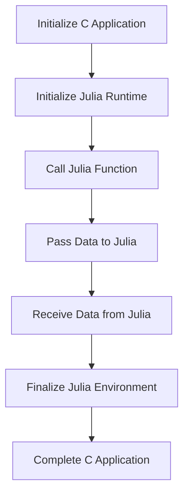

## 16.12 Case Study: Embedding Julia in a C Application

In this case study, we explore the process of embedding Julia, a high-level, high-performance programming language, into a C application. This integration is particularly useful for applications that require high-performance numerical computations, leveraging Julia's strengths in these areas. We will cover the integration process, data exchange mechanisms, performance evaluation, and the challenges encountered along with their solutions.

### Background

C is a powerful language widely used for system programming and applications where performance is critical. However, when it comes to numerical computations, Julia offers significant advantages due to its design and optimization for such tasks. By embedding Julia into a C application, we can harness Julia's computational capabilities while maintaining the existing C infrastructure.

### Integration Process

The integration of Julia into a C application involves several key steps:

1. **Setting Up the Julia Environment**: Before embedding Julia, ensure that Julia is installed on your system and accessible from your C application.

2. **Initializing the Julia Runtime**: The Julia runtime must be initialized within the C application. This involves setting up the necessary environment and calling the appropriate initialization functions.

3. **Calling Julia Functions from C**: Once the runtime is initialized, you can call Julia functions from your C code. This requires careful handling of data types and memory management.

4. **Finalizing the Julia Environment**: After computations are complete, the Julia environment should be properly finalized to release resources.

#### Step-by-Step Guide

Let's walk through the process with a simple example:

```c
#include <julia.h>

int main() {
    // Initialize the Julia runtime
    jl_init();

    // Define a Julia expression to evaluate
    jl_eval_string("println(sqrt(2.0))");

    // Finalize the Julia environment
    jl_atexit_hook(0);

    return 0;
}
```

- **Initialization**: The `jl_init()` function initializes the Julia runtime. This must be called before any other Julia functions are used.
- **Execution**: The `jl_eval_string()` function evaluates a Julia expression. In this example, it calculates and prints the square root of 2.
- **Finalization**: The `jl_atexit_hook(0)` function ensures that the Julia environment is properly shut down.

### Data Exchange Mechanism

Efficient data exchange between C and Julia is crucial for performance. This involves converting data types and managing memory across the two languages.

#### Passing Data from C to Julia

To pass data from C to Julia, you need to convert C data types to Julia-compatible types. This often involves using Julia's C API functions.

```c
#include <julia.h>

int main() {
    jl_init();

    // Create a Julia array from a C array
    double c_array[] = {1.0, 2.0, 3.0};
    jl_value_t* array_type = jl_apply_array_type((jl_value_t*)jl_float64_type, 1);
    jl_array_t* julia_array = jl_ptr_to_array_1d(array_type, c_array, 3, 0);

    // Pass the array to a Julia function
    jl_function_t* sum_func = jl_get_function(jl_base_module, "sum");
    jl_value_t* result = jl_call1(sum_func, (jl_value_t*)julia_array);

    // Print the result
    double sum = jl_unbox_float64(result);
    printf("Sum: %f\n", sum);

    jl_atexit_hook(0);
    return 0;
}
```

- **Array Conversion**: The `jl_ptr_to_array_1d()` function converts a C array to a Julia array.
- **Function Call**: The `jl_call1()` function calls a Julia function with one argument.
- **Result Handling**: The `jl_unbox_float64()` function extracts a double value from a Julia object.

#### Passing Data from Julia to C

When passing data back to C, ensure that the data is converted to C-compatible types.

```c
#include <julia.h>

int main() {
    jl_init();

    // Define a Julia function that returns an array
    jl_eval_string("function create_array() return [4.0, 5.0, 6.0] end");

    // Call the function and get the result
    jl_function_t* create_array_func = jl_get_function(jl_main_module, "create_array");
    jl_array_t* julia_array = (jl_array_t*)jl_call0(create_array_func);

    // Access the data in the Julia array
    double* c_array = (double*)jl_array_data(julia_array);
    for (size_t i = 0; i < jl_array_len(julia_array); i++) {
        printf("Element %zu: %f\n", i, c_array[i]);
    }

    jl_atexit_hook(0);
    return 0;
}
```

- **Function Definition**: A Julia function is defined to create and return an array.
- **Data Access**: The `jl_array_data()` function provides access to the data in a Julia array.

### Performance Evaluation

Embedding Julia in a C application can significantly enhance performance, especially for numerical computations. However, it is essential to evaluate the performance impact to ensure that the integration meets the application's requirements.

#### Benchmarking

To assess performance, benchmark the application before and after embedding Julia. Use tools like `BenchmarkTools.jl` in Julia and `time` in C to measure execution time and resource usage.

```julia
using BenchmarkTools

function compute()
    # Perform some intensive computation
    return sum(sqrt(i) for i in 1:10^6)
end

@benchmark compute()
```

- **Benchmarking in Julia**: Use `@benchmark` to measure the performance of Julia functions.

#### Profiling

Profiling helps identify bottlenecks and optimize performance. Use Julia's `Profile` module and C's profiling tools to analyze the application's performance.

```julia
using Profile

@profile compute()
Profile.print()
```

- **Profiling in Julia**: Use `@profile` to collect performance data and `Profile.print()` to display it.

### Challenges and Solutions

Integrating Julia with C presents several challenges, including error handling, resource management, and interoperability optimization.

#### Error Handling

Errors in Julia functions can propagate to the C application. Use Julia's exception handling mechanisms to manage errors effectively.

```c
jl_value_t* result = jl_call1(sum_func, (jl_value_t*)julia_array);
if (jl_exception_occurred()) {
    printf("Error: %s\n", jl_typeof_str(jl_exception_occurred()));
    jl_atexit_hook(0);
    return 1;
}
```

- **Exception Checking**: Use `jl_exception_occurred()` to check for exceptions after calling a Julia function.

#### Resource Management

Properly manage resources to prevent memory leaks and ensure efficient execution. Use Julia's garbage collector and C's memory management functions.

#### Optimizing Interoperability

Optimize data conversion and function calls to minimize overhead. Use efficient data structures and avoid unnecessary conversions.

### Try It Yourself

Experiment with the provided code examples by modifying the Julia functions or the data passed between C and Julia. Try implementing additional numerical computations or integrating more complex Julia libraries.

### Visualizing the Integration Process

Below is a diagram illustrating the integration process between a C application and Julia.



- **Diagram Explanation**: This flowchart represents the steps involved in embedding Julia in a C application, from initialization to finalization.

### References and Links

- [Julia Documentation](https://docs.julialang.org/en/v1/manual/embedding/)
- [C Programming Language](https://en.wikipedia.org/wiki/C_(programming_language))
- [BenchmarkTools.jl](https://github.com/JuliaCI/BenchmarkTools.jl)

### Knowledge Check

- What are the key steps in embedding Julia in a C application?
- How can data be efficiently exchanged between C and Julia?
- What tools can be used for performance evaluation?

### Embrace the Journey

Remember, integrating Julia into a C application is just the beginning. As you progress, you'll discover more ways to optimize and enhance your applications. Keep experimenting, stay curious, and enjoy the journey!

## Quiz Time!



### What is the first step in embedding Julia in a C application?

- [x] Initializing the Julia runtime
- [ ] Defining Julia functions
- [ ] Passing data to Julia
- [ ] Finalizing the Julia environment

> **Explanation:** Initializing the Julia runtime is the first step to set up the environment for embedding Julia in a C application.

### How can data be passed from C to Julia?

- [x] By converting C data types to Julia-compatible types
- [ ] By using C pointers directly
- [ ] By copying data manually
- [ ] By using a special data exchange library

> **Explanation:** Data must be converted to Julia-compatible types using Julia's C API functions for seamless integration.

### What function is used to evaluate a Julia expression in C?

- [x] `jl_eval_string()`
- [ ] `jl_call1()`
- [ ] `jl_init()`
- [ ] `jl_atexit_hook()`

> **Explanation:** `jl_eval_string()` is used to evaluate a Julia expression from C.

### Which function is used to finalize the Julia environment in C?

- [x] `jl_atexit_hook()`
- [ ] `jl_eval_string()`
- [ ] `jl_call1()`
- [ ] `jl_init()`

> **Explanation:** `jl_atexit_hook()` is used to properly shut down the Julia environment.

### What is a key benefit of embedding Julia in a C application?

- [x] Enhanced performance for numerical computations
- [ ] Simplified code structure
- [ ] Reduced application size
- [ ] Increased portability

> **Explanation:** Embedding Julia enhances performance, especially for numerical computations, by leveraging Julia's strengths.

### What tool can be used for benchmarking in Julia?

- [x] `BenchmarkTools.jl`
- [ ] `Profile.jl`
- [ ] `Debugger.jl`
- [ ] `Rebugger.jl`

> **Explanation:** `BenchmarkTools.jl` is used for benchmarking Julia code to assess performance.

### How can errors be handled when calling Julia functions from C?

- [x] By checking `jl_exception_occurred()`
- [ ] By using C's `try-catch` blocks
- [ ] By ignoring errors
- [ ] By using a special error handling library

> **Explanation:** `jl_exception_occurred()` is used to check for exceptions after calling a Julia function from C.

### What is a challenge when embedding Julia in a C application?

- [x] Managing resources and memory
- [ ] Writing C code
- [ ] Compiling the application
- [ ] Using Julia's syntax

> **Explanation:** Resource and memory management is a challenge due to the interaction between C and Julia's memory models.

### What is the purpose of `jl_ptr_to_array_1d()`?

- [x] To convert a C array to a Julia array
- [ ] To convert a Julia array to a C array
- [ ] To initialize the Julia runtime
- [ ] To finalize the Julia environment

> **Explanation:** `jl_ptr_to_array_1d()` converts a C array to a Julia array for data exchange.

### True or False: Julia can only be embedded in C applications for numerical computations.

- [ ] True
- [x] False

> **Explanation:** While Julia excels in numerical computations, it can be embedded in C applications for various purposes beyond just numerical tasks.


