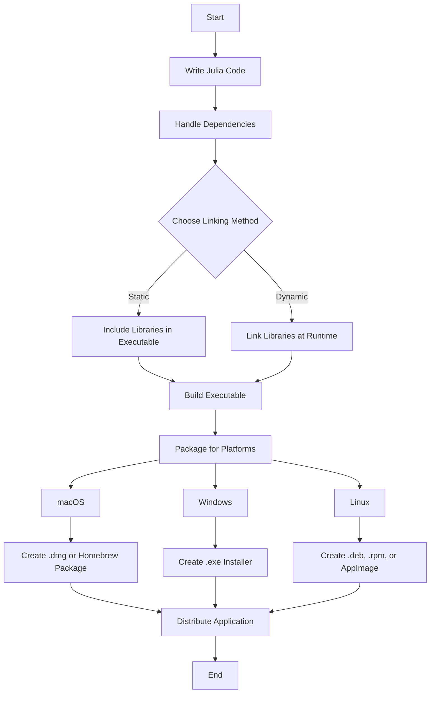

## 16.13 Cross-Platform Considerations and Executable Creation

As we delve into the world of cross-platform development with Julia, we must consider the unique challenges and opportunities that arise when building applications that run seamlessly across different operating systems. This section will guide you through the essential concepts and tools needed to create cross-platform executables in Julia, ensuring your applications are robust, efficient, and accessible to a wide audience.

### Building for Multiple Platforms

When developing software intended for multiple platforms, such as Windows, macOS, and Linux, it's crucial to address the inherent differences in file systems, libraries, and compilers. These differences can affect how your application behaves and performs on each platform.

#### Addressing Differences in File Systems, Libraries, and Compilers

1. **File Systems**: Each operating system has its own file system conventions. For instance, Windows uses backslashes (`\`) for paths, while Unix-based systems like macOS and Linux use forward slashes (`/`). To handle these differences, use Julia's `joinpath` function, which constructs file paths in a platform-independent manner.

   ```julia
   # Constructing a file path in a cross-platform way
   path = joinpath("home", "user", "documents", "file.txt")
   println(path)  # Output varies depending on the OS
   ```

2. **Libraries**: The availability and behavior of libraries can vary across platforms. Use Julia's package management system to specify dependencies and ensure they are compatible with all target platforms. Consider using `BinaryBuilder.jl` to create cross-platform binaries for dependencies.

3. **Compilers**: Different platforms may require different compilers or compiler flags. Julia's `Pkg` system allows you to specify build scripts that can handle platform-specific compilation tasks.

### Static vs. Dynamic Linking

Linking is a crucial aspect of building executables, and choosing between static and dynamic linking can significantly impact your application's performance and portability.

#### Deciding Which Approach Suits the Application Needs

- **Static Linking**: This approach includes all necessary libraries within the executable, resulting in a larger file size but ensuring that the application has all it needs to run independently of the system's installed libraries. Static linking is beneficial when deploying to environments where you cannot guarantee the presence of required libraries.

- **Dynamic Linking**: This method links libraries at runtime, resulting in smaller executables but requiring that the necessary libraries be present on the target system. Dynamic linking is advantageous when you want to reduce the executable size and leverage shared libraries for updates and security patches.

### Using BinaryBuilder.jl and BinaryProvider.jl

To facilitate cross-platform development, Julia provides tools like `BinaryBuilder.jl` and `BinaryProvider.jl`, which help create and manage cross-platform binaries for dependencies.

#### Creating Cross-Platform Binaries for Dependencies

1. **BinaryBuilder.jl**: This tool automates the process of building binaries for multiple platforms. It uses Docker to create a consistent build environment, ensuring that the binaries are portable across different systems.

   ```julia
   using BinaryBuilder

   # Example of building a simple binary
   BinaryBuilder.run_wizard()
   ```

2. **BinaryProvider.jl**: Once you have built your binaries, `BinaryProvider.jl` helps distribute them. It provides a way to download and install these binaries as part of your Julia package, ensuring that your application can access the necessary dependencies regardless of the user's platform.

### Testing on Different Platforms

Ensuring consistent behavior across platforms requires thorough testing. Here are some strategies to achieve this:

1. **Automated Testing**: Use continuous integration (CI) services like Travis CI, GitHub Actions, or GitLab CI to automate testing on different platforms. These services allow you to define workflows that run your test suite on Windows, macOS, and Linux.

2. **Virtual Machines and Containers**: Use virtual machines or Docker containers to simulate different environments on your development machine. This approach allows you to test platform-specific features and configurations without needing physical access to each platform.

3. **Cross-Platform Testing Tools**: Leverage tools like `CrossTest.jl`, which provide abstractions for writing tests that run consistently across platforms.

### Packaging Tools

Creating installers or packages for your application is the final step in cross-platform development. This process ensures that users can easily install and run your application on their preferred platform.

#### Creating Installers or Packages for macOS, Windows, and Linux

1. **macOS**: Use tools like `Pkg.jl` to create `.dmg` files or `Homebrew` for distributing your application.

2. **Windows**: Consider using `Inno Setup` or `NSIS` to create `.exe` installers. These tools allow you to define installation scripts that handle tasks like setting environment variables and creating shortcuts.

3. **Linux**: Use package managers like `apt` for Debian-based systems or `rpm` for Red Hat-based systems. Alternatively, create AppImages or Snap packages for a more universal approach.

### Try It Yourself

Experiment with creating a simple Julia application and packaging it for different platforms. Start by writing a basic script, then use `BinaryBuilder.jl` to handle dependencies and create platform-specific installers. Modify the script to include platform-specific features, and observe how the packaging process adapts.

### Visualizing the Cross-Platform Development Workflow

To better understand the cross-platform development process, let's visualize the workflow using a flowchart.



This flowchart illustrates the steps involved in developing a cross-platform Julia application, from writing the code to distributing the final product.

### Key Takeaways

- **Cross-Platform Development**: Understand the differences in file systems, libraries, and compilers across platforms.
- **Linking Methods**: Choose between static and dynamic linking based on your application's needs.
- **BinaryBuilder.jl**: Use this tool to create cross-platform binaries for dependencies.
- **Testing**: Implement strategies for testing on different platforms to ensure consistent behavior.
- **Packaging**: Create installers or packages for macOS, Windows, and Linux to facilitate distribution.

### Embrace the Journey

Remember, cross-platform development is an ongoing journey of learning and adaptation. As you progress, you'll encounter new challenges and opportunities to refine your skills. Keep experimenting, stay curious, and enjoy the process of bringing your Julia applications to a global audience.

## Quiz Time!



### What is the primary purpose of using `joinpath` in Julia?

- [x] To construct file paths in a platform-independent manner.
- [ ] To join multiple strings into a single string.
- [ ] To concatenate arrays.
- [ ] To merge two dictionaries.

> **Explanation:** `joinpath` is used to construct file paths in a way that is compatible with the file system conventions of different operating systems.

### Which tool is used to automate the process of building binaries for multiple platforms in Julia?

- [ ] BinaryProvider.jl
- [x] BinaryBuilder.jl
- [ ] Pkg.jl
- [ ] Homebrew

> **Explanation:** `BinaryBuilder.jl` is the tool used to automate the creation of cross-platform binaries in Julia.

### What is a key advantage of static linking?

- [x] The application has all it needs to run independently of the system's installed libraries.
- [ ] The executable size is smaller.
- [ ] Libraries are linked at runtime.
- [ ] It allows for easy updates to shared libraries.

> **Explanation:** Static linking includes all necessary libraries within the executable, ensuring it can run independently of the system's installed libraries.

### What is a benefit of dynamic linking?

- [ ] Larger executable size.
- [x] Smaller executable size.
- [ ] Libraries are included within the executable.
- [ ] The application runs independently of the system's libraries.

> **Explanation:** Dynamic linking results in smaller executables because libraries are linked at runtime rather than being included in the executable.

### Which of the following is a strategy for testing applications on different platforms?

- [x] Using continuous integration services like GitHub Actions.
- [ ] Only testing on the developer's machine.
- [ ] Ignoring platform-specific features.
- [ ] Testing only on Windows.

> **Explanation:** Continuous integration services allow automated testing on multiple platforms, ensuring consistent behavior across different environments.

### What is the role of `BinaryProvider.jl` in Julia?

- [x] To distribute cross-platform binaries as part of a Julia package.
- [ ] To create cross-platform binaries.
- [ ] To manage package dependencies.
- [ ] To compile Julia code.

> **Explanation:** `BinaryProvider.jl` helps distribute cross-platform binaries, ensuring that applications can access necessary dependencies on any platform.

### Which tool can be used to create `.exe` installers for Windows?

- [ ] Homebrew
- [ ] AppImage
- [x] Inno Setup
- [ ] Snap

> **Explanation:** Inno Setup is a tool used to create `.exe` installers for Windows applications.

### What is a common format for packaging applications on Linux?

- [ ] .dmg
- [ ] .exe
- [x] .deb
- [ ] .zip

> **Explanation:** `.deb` is a common package format for Debian-based Linux systems.

### Which linking method requires the necessary libraries to be present on the target system?

- [ ] Static linking
- [x] Dynamic linking
- [ ] Both static and dynamic linking
- [ ] Neither static nor dynamic linking

> **Explanation:** Dynamic linking requires the necessary libraries to be present on the target system, as they are linked at runtime.

### True or False: `BinaryBuilder.jl` uses Docker to create a consistent build environment.

- [x] True
- [ ] False

> **Explanation:** `BinaryBuilder.jl` uses Docker to ensure a consistent build environment, which is crucial for creating portable binaries.


