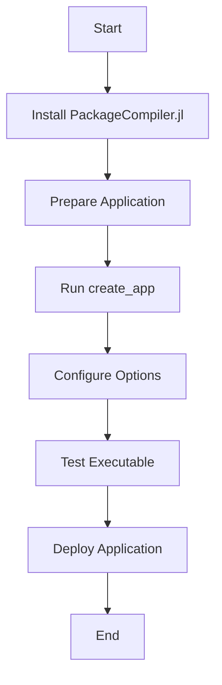

## 16.2 Creating Executables with PackageCompiler.jl

In the world of software development, deploying applications efficiently and effectively is as crucial as writing the code itself. For Julia developers, **PackageCompiler.jl** offers a powerful solution to compile Julia applications into standalone executables or shared libraries. This capability not only reduces startup times but also bundles dependencies, making it easier to distribute applications to users without requiring them to install Julia. Let's dive into the intricacies of using PackageCompiler.jl to create executables, exploring its purpose, functionalities, and deployment considerations.

### Purpose of PackageCompiler.jl

**PackageCompiler.jl** serves several key purposes in the Julia ecosystem:

- **Compiling Julia Applications**: Transform your Julia scripts into standalone executables or shared libraries, enabling seamless distribution and execution on systems without a Julia installation.
- **Reducing Startup Times**: By precompiling code and dependencies, executables start faster, enhancing user experience.
- **Bundling Dependencies**: PackageCompiler.jl includes all necessary dependencies within the executable, ensuring that your application runs consistently across different environments.

### Building Executables

Creating executables with PackageCompiler.jl involves a series of steps that guide you through setting up and configuring the compilation process. Let's explore these steps in detail.

#### Using `create_app` to Compile an Application

The `create_app` function is the cornerstone of building executables in Julia. It compiles your application into a format that can be executed independently of the Julia runtime. Here's a step-by-step guide to using `create_app`:

1. **Install PackageCompiler.jl**: Ensure you have PackageCompiler.jl installed in your Julia environment. You can add it using the Julia package manager:

   ```julia
   using Pkg
   Pkg.add("PackageCompiler")
   ```

2. **Prepare Your Application**: Organize your Julia application into a directory structure with a `Project.toml` and `Manifest.toml` file. This setup helps PackageCompiler.jl understand the dependencies and configuration of your application.

3. **Compile the Application**: Use the `create_app` function to compile your application. Here's an example command:

   ```julia
   using PackageCompiler

   create_app("path/to/your/app", "path/to/output/directory")
   ```

   - **Input Path**: The path to your application's source directory.
   - **Output Path**: The directory where the compiled executable will be stored.

4. **Configure Compilation Options**: Customize the compilation process by specifying options such as the target platform, optimization levels, and more. For example:

   ```julia
   create_app("path/to/your/app", "path/to/output/directory"; 
              precompile_execution_file="precompile.jl",
              cpu_target="generic",
              incremental=false)
   ```

   - **precompile_execution_file**: A Julia script that runs during compilation to precompile specific functions.
   - **cpu_target**: Specifies the CPU architecture for the executable.
   - **incremental**: Determines whether to use incremental compilation.

5. **Test the Executable**: Once compiled, test the executable on the target system to ensure it functions as expected.

#### Code Example: Compiling a Simple Julia Application

Let's compile a simple Julia application that prints "Hello, World!" to the console.

```julia
println("Hello, World!")
```

To compile this application:

1. Create a directory for your application and place `hello.jl` inside it.
2. Create a `Project.toml` file in the same directory:

   ```toml
   [deps]
   ```

3. Run the `create_app` command:

   ```julia
   using PackageCompiler

   create_app("path/to/hello_app", "path/to/output")
   ```

4. Navigate to the output directory and execute the compiled binary:

   ```bash
   ./hello_app/bin/hello
   ```

This should print "Hello, World!" to the console, demonstrating a successful compilation.

### System Images

In addition to creating standalone executables, PackageCompiler.jl allows you to create custom system images. These images can significantly reduce load times by precompiling packages and dependencies.

#### Creating Custom System Images with `create_sysimage`

The `create_sysimage` function is used to generate custom system images. Here's how you can create one:

1. **Identify Packages to Precompile**: Determine which packages and modules you want to include in the system image for faster load times.

2. **Use `create_sysimage`**: Execute the `create_sysimage` function with the desired packages:

   ```julia
   using PackageCompiler

   create_sysimage([:Package1, :Package2], sysimage_path="custom_sysimage.so")
   ```

   - **sysimage_path**: The path where the system image will be saved.

3. **Load the System Image**: Use the `--sysimage` flag to load the custom system image when starting Julia:

   ```bash
   julia --sysimage custom_sysimage.so
   ```

#### Precompiling Packages for Faster Load Times

Precompiling packages into a system image can drastically reduce the time it takes to load them during execution. This is particularly useful for applications that rely on large or complex libraries.

### Deployment Considerations

When deploying Julia applications compiled with PackageCompiler.jl, several factors must be considered to ensure smooth operation across different environments.

#### Cross-Platform Compilation

- **Target Platforms**: Ensure that the compiled executable is compatible with the target operating systems and architectures. Use the `cpu_target` option to specify the desired architecture.
- **Handling System-Specific Dependencies**: Address any system-specific dependencies or libraries that your application relies on. This may involve bundling additional resources or providing installation instructions for users.

#### Managing Resources and External Files

- **Resource Bundling**: Include any necessary resources, such as configuration files or data sets, within the compiled application. Use relative paths to ensure portability.
- **External File Access**: If your application accesses external files, ensure that the paths are correctly configured and accessible on the target system.

### Use Cases and Examples

PackageCompiler.jl is versatile and can be used in various scenarios:

- **Distributing Applications**: Share your Julia applications with users who do not have Julia installed. This is particularly useful for commercial software or tools intended for a broad audience.
- **Embedding Julia Code**: Compile Julia code into shared libraries that can be embedded in other systems or applications, such as C or Python programs.

#### Example: Distributing a Julia Application

Consider a data analysis tool written in Julia. By compiling it into an executable, you can distribute it to analysts who may not be familiar with Julia, allowing them to use the tool without installing the Julia runtime.

### Try It Yourself

To deepen your understanding, try modifying the code examples provided. For instance, add a new function to the `hello.jl` script and observe how the changes affect the compilation process and the resulting executable.

### Visualizing the Compilation Process

To better understand the workflow of creating executables with PackageCompiler.jl, let's visualize the process using a flowchart.



**Figure 1**: The flowchart illustrates the steps involved in compiling a Julia application into an executable using PackageCompiler.jl.

### References and Links

For further reading and exploration, consider the following resources:

- [PackageCompiler.jl Documentation](https://julialang.github.io/PackageCompiler.jl/dev/)
- [JuliaLang Official Website](https://julialang.org/)
- [Julia Discourse Forum](https://discourse.julialang.org/)

### Knowledge Check

To reinforce your learning, consider the following questions:

- What are the primary benefits of using PackageCompiler.jl?
- How does `create_app` differ from `create_sysimage`?
- What considerations should be made for cross-platform deployment?

### Embrace the Journey

Remember, mastering the art of creating executables with PackageCompiler.jl is just the beginning. As you progress, you'll discover more ways to optimize and deploy your Julia applications. Keep experimenting, stay curious, and enjoy the journey!

## Quiz Time!



### What is the primary purpose of PackageCompiler.jl?

- [x] To compile Julia applications into standalone executables
- [ ] To write Julia code
- [ ] To manage Julia packages
- [ ] To debug Julia applications

> **Explanation:** PackageCompiler.jl is used to compile Julia applications into standalone executables or shared libraries.

### Which function is used to compile a Julia application into an executable?

- [x] create_app
- [ ] create_sysimage
- [ ] compile_executable
- [ ] build_app

> **Explanation:** The `create_app` function is used to compile a Julia application into an executable.

### What is the purpose of creating a custom system image?

- [x] To reduce load times by precompiling packages
- [ ] To increase application size
- [ ] To make the application run slower
- [ ] To remove dependencies

> **Explanation:** Custom system images are created to reduce load times by precompiling packages and dependencies.

### How can you specify the CPU architecture for the executable?

- [x] By using the cpu_target option
- [ ] By editing the Project.toml file
- [ ] By using the --cpu flag
- [ ] By recompiling Julia

> **Explanation:** The `cpu_target` option allows you to specify the CPU architecture for the executable.

### What should you consider when deploying a compiled Julia application?

- [x] Cross-platform compatibility
- [x] Handling system-specific dependencies
- [ ] Ignoring resource management
- [ ] Removing external files

> **Explanation:** Cross-platform compatibility and handling system-specific dependencies are crucial for deploying compiled Julia applications.

### What is a benefit of using PackageCompiler.jl for distribution?

- [x] Users do not need to install Julia
- [ ] It increases application size
- [ ] It makes the application slower
- [ ] It removes all dependencies

> **Explanation:** PackageCompiler.jl allows you to distribute applications without requiring users to install Julia.

### Which function is used to create a custom system image?

- [x] create_sysimage
- [ ] create_app
- [ ] build_sysimage
- [ ] compile_image

> **Explanation:** The `create_sysimage` function is used to create a custom system image.

### What is included in a compiled executable?

- [x] All necessary dependencies
- [ ] Only the main script
- [ ] No dependencies
- [ ] Only external files

> **Explanation:** A compiled executable includes all necessary dependencies to ensure it runs consistently across different environments.

### Can PackageCompiler.jl be used to create shared libraries?

- [x] True
- [ ] False

> **Explanation:** PackageCompiler.jl can compile Julia code into shared libraries, which can be embedded in other systems.

### What is a key consideration when managing resources in compiled applications?

- [x] Use relative paths for portability
- [ ] Ignore external files
- [ ] Use absolute paths only
- [ ] Remove all resources

> **Explanation:** Using relative paths ensures portability and accessibility of resources in compiled applications.



By following this guide, you are now equipped with the knowledge to create executables using PackageCompiler.jl, enhancing your ability to deploy Julia applications efficiently. Keep exploring and applying these concepts to build robust and scalable software solutions.
