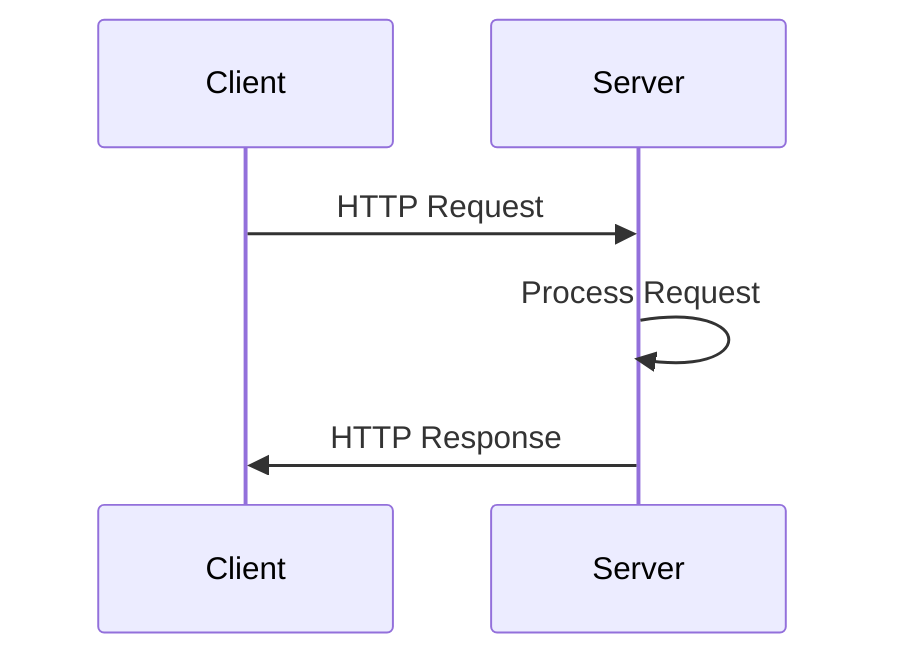

## 16.5 Developing Web Services and APIs with HTTP.jl

In this section, we will delve into the world of web services and APIs using the powerful HTTP.jl library in Julia. Whether you're building a simple web service or a complex RESTful API, HTTP.jl provides the tools you need to handle HTTP requests and responses efficiently. Let's explore how to set up a server, define endpoints, manage data serialization, and ensure your application is secure and scalable.

### Overview of HTTP.jl

HTTP.jl is a flexible, high-performance HTTP client and server library for Julia. It is designed to handle both client-side and server-side HTTP operations, making it an excellent choice for developing web services and APIs. With its comprehensive feature set, HTTP.jl allows you to:

- Set up HTTP servers to listen for incoming requests.
- Define and manage endpoints for various HTTP methods (GET, POST, PUT, DELETE, etc.).
- Handle request parsing and response generation.
- Implement middleware for tasks like logging, authentication, and rate limiting.
- Ensure secure communication with TLS/SSL support.

### Building a RESTful API

REST (Representational State Transfer) is an architectural style for designing networked applications. It relies on stateless, client-server communication, typically over HTTP. Let's walk through the process of building a RESTful API using HTTP.jl.

#### Setting Up an HTTP Server

To start, we need to set up an HTTP server that can handle incoming requests. Here's a basic example:

```julia
using HTTP

function request_handler(req::HTTP.Request)
    return HTTP.Response(200, "Hello, World!")
end

HTTP.serve(request_handler, "0.0.0.0", 8080)
```

- **Explanation**: This code sets up a simple HTTP server that listens on all network interfaces (`0.0.0.0`) at port `8080`. The `request_handler` function responds with a "Hello, World!" message for every request.

#### Defining Endpoints and Handling HTTP Methods

In a RESTful API, different endpoints correspond to different resources or actions. Let's define a few endpoints and handle various HTTP methods:

```julia
function api_handler(req::HTTP.Request)
    if req.method == "GET" && req.target == "/hello"
        return HTTP.Response(200, "Hello, GET!")
    elseif req.method == "POST" && req.target == "/hello"
        return HTTP.Response(200, "Hello, POST!")
    else
        return HTTP.Response(404, "Not Found")
    end
end

HTTP.serve(api_handler, "0.0.0.0", 8080)
```

- **Explanation**: This server handles GET and POST requests to the `/hello` endpoint. If the request doesn't match these criteria, it returns a 404 Not Found response.

### Request and Response Handling

Handling requests and generating appropriate responses is crucial for a robust API. Let's explore how to parse query parameters, headers, and body content, and return responses with the correct status codes and content types.

#### Parsing Query Parameters and Headers

```julia
function query_handler(req::HTTP.Request)
    query_params = HTTP.URIs.queryparams(req.target)
    headers = req.headers
    return HTTP.Response(200, "Query Params: $(query_params), Headers: $(headers)")
end

HTTP.serve(query_handler, "0.0.0.0", 8080)
```

- **Explanation**: This example extracts query parameters and headers from the request and includes them in the response.

#### Returning Responses with Status Codes and Content Types

```julia
function content_handler(req::HTTP.Request)
    if req.method == "GET"
        return HTTP.Response(200, "Content-Type" => "text/plain", body = "Plain text response")
    else
        return HTTP.Response(405, "Content-Type" => "application/json", body = "{\"error\": \"Method Not Allowed\"}")
    end
end

HTTP.serve(content_handler, "0.0.0.0", 8080)
```

- **Explanation**: This server returns a plain text response for GET requests and a JSON error message for other methods.

### JSON and Data Serialization

APIs often need to exchange data in JSON format. Julia provides several packages for JSON serialization, including JSON3.jl and JSON.jl. Let's see how to use them.

#### Using JSON3.jl for JSON Encoding and Decoding

```julia
using JSON3

function json_handler(req::HTTP.Request)
    if req.method == "POST"
        data = JSON3.read(String(req.body))
        response_data = JSON3.write(data)
        return HTTP.Response(200, "Content-Type" => "application/json", body = response_data)
    else
        return HTTP.Response(405, "Method Not Allowed")
    end
end

HTTP.serve(json_handler, "0.0.0.0", 8080)
```

- **Explanation**: This server reads JSON data from POST requests, processes it, and returns it as a JSON response.

### Middleware and Pipelines

Middleware functions allow you to process requests and responses in a modular way. They are useful for tasks like logging, authentication, and rate limiting.

#### Implementing Middleware for Logging

```julia
function logging_middleware(handler)
    return function(req::HTTP.Request)
        println("Received request: $(req.method) $(req.target)")
        response = handler(req)
        println("Sending response: $(response.status)")
        return response
    end
end

HTTP.serve(logging_middleware(api_handler), "0.0.0.0", 8080)
```

- **Explanation**: This middleware logs each request and response, wrapping around the main `api_handler`.

#### Composing Request Handlers with Function Pipelines

```julia
function auth_middleware(handler)
    return function(req::HTTP.Request)
        if get(req.headers, "Authorization", "") == "Bearer valid_token"
            return handler(req)
        else
            return HTTP.Response(401, "Unauthorized")
        end
    end
end

HTTP.serve(auth_middleware(logging_middleware(api_handler)), "0.0.0.0", 8080)
```

- **Explanation**: This example demonstrates how to chain middleware functions, first checking for authorization and then logging the request.

### Deployment and Scaling

Deploying your server in a production environment requires careful consideration of performance and scalability.

#### Running the Server in Production

To run your server in production, consider using a process manager like `systemd` or `Docker` to manage the server lifecycle. Additionally, ensure that your server is configured to handle a large number of concurrent connections.

#### Load Balancing with Multiple Server Instances

For scalability, you can run multiple instances of your server behind a load balancer. This setup distributes incoming requests across instances, improving performance and reliability.

### Security Considerations

Security is paramount when developing web services. Here are some best practices to follow:

#### Implementing TLS/SSL

Use TLS/SSL to encrypt data in transit, protecting it from eavesdropping and tampering. You can use a reverse proxy like Nginx or Apache to handle TLS termination.

#### Protecting Against Common Web Vulnerabilities

- **Input Validation**: Always validate and sanitize user input to prevent injection attacks.
- **Rate Limiting**: Implement rate limiting to protect against denial-of-service attacks.
- **Authentication and Authorization**: Use secure methods for authentication and authorization, such as OAuth2 or JWT.

### Try It Yourself

Experiment with the code examples provided in this section. Try modifying the endpoints, adding new middleware functions, or implementing additional security measures. This hands-on practice will deepen your understanding of developing web services with HTTP.jl.

### Visualizing the Request-Response Cycle

To better understand the flow of requests and responses in an HTTP.jl server, let's visualize the process:



- **Description**: This diagram illustrates the basic request-response cycle between a client and a server.

### References and Links

For further reading and deeper dives into the topics covered, consider exploring the following resources:

- [HTTP.jl Documentation](https://juliaweb.github.io/HTTP.jl/stable/)
- [JSON3.jl Documentation](https://github.com/quinnj/JSON3.jl)
- [RESTful API Design](https://restfulapi.net/)

### Knowledge Check

Before moving on, take a moment to reflect on what you've learned. Can you explain how to set up an HTTP server in Julia? How would you implement middleware for authentication? These questions will help reinforce your understanding.

### Embrace the Journey

Remember, developing web services and APIs is a journey. As you progress, you'll build more complex and interactive applications. Keep experimenting, stay curious, and enjoy the process!

## Quiz Time!



### What is HTTP.jl primarily used for in Julia?

- [x] Handling HTTP requests and responses
- [ ] Managing database connections
- [ ] Performing mathematical computations
- [ ] Creating graphical user interfaces

> **Explanation:** HTTP.jl is a library for handling HTTP requests and responses, making it ideal for developing web services and APIs.

### Which HTTP method is typically used to retrieve data from a server?

- [x] GET
- [ ] POST
- [ ] PUT
- [ ] DELETE

> **Explanation:** The GET method is used to request data from a specified resource.

### What is the purpose of middleware in HTTP.jl?

- [x] To process requests and responses in a modular way
- [ ] To manage database transactions
- [ ] To perform mathematical calculations
- [ ] To create user interfaces

> **Explanation:** Middleware functions allow you to process requests and responses in a modular way, often used for logging, authentication, and other tasks.

### How can you secure data in transit when developing web services?

- [x] Implement TLS/SSL
- [ ] Use plain text communication
- [ ] Disable encryption
- [ ] Use only HTTP without HTTPS

> **Explanation:** Implementing TLS/SSL encrypts data in transit, protecting it from eavesdropping and tampering.

### What is the primary function of a load balancer in a web service architecture?

- [x] Distribute incoming requests across multiple server instances
- [ ] Store user data
- [ ] Perform data analysis
- [ ] Create user interfaces

> **Explanation:** A load balancer distributes incoming requests across multiple server instances, improving performance and reliability.

### Which package is commonly used for JSON serialization in Julia?

- [x] JSON3.jl
- [ ] DataFrames.jl
- [ ] Plots.jl
- [ ] LinearAlgebra.jl

> **Explanation:** JSON3.jl is a package used for encoding and decoding JSON data in Julia.

### What is the role of the `HTTP.serve` function?

- [x] To start an HTTP server
- [ ] To perform mathematical calculations
- [ ] To manage database connections
- [ ] To create graphical user interfaces

> **Explanation:** The `HTTP.serve` function starts an HTTP server that listens for incoming requests.

### Which HTTP status code indicates a successful request?

- [x] 200
- [ ] 404
- [ ] 500
- [ ] 401

> **Explanation:** The 200 status code indicates that the request was successful.

### What is the purpose of the `Authorization` header in HTTP requests?

- [x] To provide credentials for authentication
- [ ] To specify the content type
- [ ] To indicate the request method
- [ ] To define the response format

> **Explanation:** The `Authorization` header is used to provide credentials for authentication.

### True or False: Middleware functions can be chained together in HTTP.jl.

- [x] True
- [ ] False

> **Explanation:** Middleware functions can be chained together to process requests and responses in a sequence.



By mastering the concepts and techniques covered in this section, you'll be well-equipped to develop robust and scalable web services and APIs using HTTP.jl in Julia. Keep exploring and building your skills!
