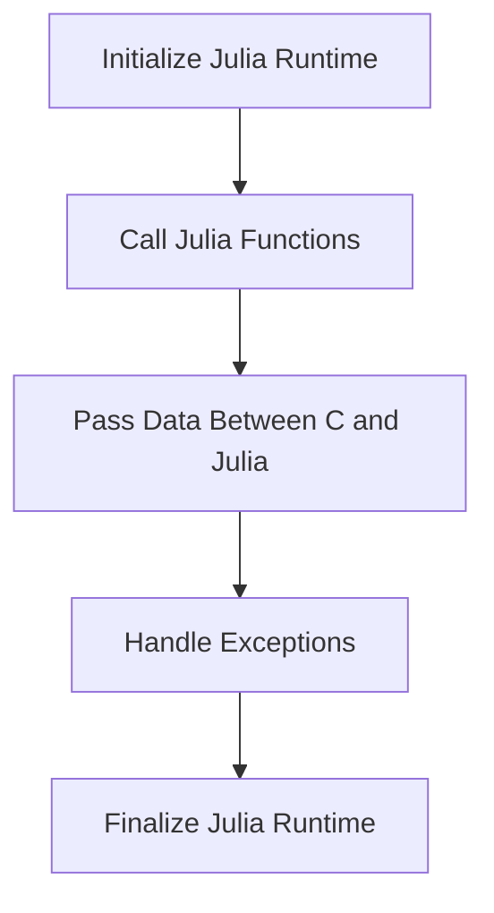

## 16.6 Embedding Julia in Other Languages

As software developers, we often encounter scenarios where we need to integrate different programming languages to leverage their unique strengths. Julia, known for its high performance and rich ecosystem, can be embedded into other languages to enhance applications with its numerical computing capabilities. In this section, we will explore how to embed Julia in other languages, focusing on using Julia's C API, data type mappings, error handling, and practical examples.

### Reasons for Embedding Julia

Before diving into the technical details, let's understand why embedding Julia in other languages can be beneficial:

- **Performance**: Julia is designed for high-performance numerical computing. By embedding Julia, you can leverage its speed and efficiency in computational tasks within existing applications.
- **Rich Libraries**: Julia has a vast array of libraries for scientific computing, machine learning, and data manipulation. Embedding Julia allows you to access these libraries without rewriting them in another language.
- **Interoperability**: Embedding Julia enables seamless integration with existing codebases, allowing you to enhance applications with Julia's capabilities without a complete rewrite.
- **Flexibility**: Julia can be used for scripting and automation within other software, providing flexibility in extending application functionalities.

### Using Julia's C API

Julia provides a C API that allows you to embed its runtime into C/C++ applications. This API enables you to initialize the Julia runtime, call Julia functions, and pass data between C and Julia.

#### Initializing and Finalizing the Julia Runtime

To use Julia from C, you must first initialize the Julia runtime. This is done using the `jl_init()` function. Once you are done with Julia, you should finalize the runtime using `jl_atexit_hook()` to clean up resources.

```c
#include <julia.h>

int main(int argc, char *argv[]) {
    // Initialize the Julia runtime
    jl_init();

    // Your code to call Julia functions goes here

    // Finalize the Julia runtime
    jl_atexit_hook(0);
    return 0;
}
```

#### Calling Julia Functions

Once the Julia runtime is initialized, you can call Julia functions from C. This involves evaluating Julia code strings or calling pre-defined Julia functions.

```c
#include <julia.h>

int main(int argc, char *argv[]) {
    jl_init();

    // Evaluate a simple Julia expression
    jl_eval_string("println(sqrt(2.0))");

    // Call a Julia function
    jl_function_t *func = jl_get_function(jl_base_module, "sqrt");
    jl_value_t *arg = jl_box_float64(2.0);
    jl_value_t *ret = jl_call1(func, arg);

    // Print the result
    double result = jl_unbox_float64(ret);
    printf("The square root of 2 is: %f\n", result);

    jl_atexit_hook(0);
    return 0;
}
```

### Data Type Mappings

When embedding Julia, it's crucial to understand how data types map between C and Julia. This involves converting types and handling pointers and arrays.

#### Converting Types

Julia's C API provides functions to convert between C and Julia types. For example, `jl_box_float64()` converts a C `double` to a Julia `Float64`, and `jl_unbox_float64()` does the reverse.

```c
double c_value = 3.14;
jl_value_t *julia_value = jl_box_float64(c_value);
double back_to_c = jl_unbox_float64(julia_value);
```

#### Handling Pointers and Arrays

Passing arrays between C and Julia requires careful handling of pointers. Julia arrays can be created using `jl_ptr_to_array_1d()` and accessed using `jl_array_data()`.

```c
double c_array[] = {1.0, 2.0, 3.0};
jl_value_t *array_type = jl_apply_array_type((jl_value_t*)jl_float64_type, 1);
jl_array_t *julia_array = jl_ptr_to_array_1d(array_type, c_array, 3, 0);

// Accessing data from Julia array
double *data = (double*)jl_array_data(julia_array);
printf("First element: %f\n", data[0]);
```

### Error Handling

Managing exceptions and errors across the language boundary is essential for robust integration. Julia's C API provides mechanisms to handle errors gracefully.

#### Managing Exceptions

When calling Julia functions, you should check for exceptions using `jl_exception_occurred()`. If an exception occurs, you can retrieve and handle it appropriately.

```c
jl_value_t *ret = jl_call1(func, arg);
if (jl_exception_occurred()) {
    // Handle the exception
    jl_printf(JL_STDERR, "Exception: %s \n", jl_typeof_str(jl_exception_occurred()));
}
```

### Examples and Use Cases

Embedding Julia can be applied in various scenarios, such as extending applications with Julia's numerical computing capabilities or using Julia for scripting and automation.

#### Extending Applications

Consider a C++ application that requires high-performance matrix operations. By embedding Julia, you can offload these operations to Julia's efficient libraries.

```cpp
#include <julia.h>

void perform_matrix_operations() {
    jl_init();

    // Define a Julia function for matrix multiplication
    jl_eval_string("function multiply_matrices(A, B) return A * B end");

    // Create Julia matrices
    jl_value_t *A = jl_eval_string("[1.0 2.0; 3.0 4.0]");
    jl_value_t *B = jl_eval_string("[5.0 6.0; 7.0 8.0]");

    // Call the Julia function
    jl_function_t *multiply_matrices = jl_get_function(jl_main_module, "multiply_matrices");
    jl_value_t *result = jl_call2(multiply_matrices, A, B);

    // Print the result
    jl_eval_string("println($result)");

    jl_atexit_hook(0);
}
```

#### Scripting and Automation

Embedding Julia allows you to use it as a scripting language within other software, providing flexibility in automation tasks.

```c
#include <julia.h>

void run_julia_script() {
    jl_init();

    // Load and execute a Julia script
    jl_eval_string("include(\"script.jl\")");

    jl_atexit_hook(0);
}
```

### Visualizing Julia's Embedding Process

To better understand the process of embedding Julia, let's visualize the interaction between C/C++ and Julia using a flowchart.



**Caption**: This flowchart illustrates the steps involved in embedding Julia in a C/C++ application, from initializing the runtime to finalizing it after executing Julia functions.

### References and Links

For further reading and deeper dives into embedding Julia, consider the following resources:

- [Julia's C API Documentation](https://docs.julialang.org/en/v1/manual/embedding/)
- [JuliaLang GitHub Repository](https://github.com/JuliaLang/julia)
- [Interfacing with C](https://docs.julialang.org/en/v1/manual/calling-c-and-fortran-code/)

### Knowledge Check

To reinforce your understanding of embedding Julia, consider the following questions and exercises:

- **Question**: What are the benefits of embedding Julia in other languages?
- **Exercise**: Modify the provided C code examples to call a different Julia function, such as a trigonometric function.
- **Challenge**: Create a C++ application that uses Julia to perform statistical analysis on a dataset.

### Embrace the Journey

Remember, embedding Julia in other languages is just the beginning. As you progress, you'll discover more ways to integrate Julia's powerful capabilities into your applications. Keep experimenting, stay curious, and enjoy the journey!

## Quiz Time!



### What is the primary reason for embedding Julia in other languages?

- [x] To leverage Julia's high-performance capabilities
- [ ] To replace the existing language entirely
- [ ] To avoid using Julia's libraries
- [ ] To simplify the codebase

> **Explanation:** Embedding Julia allows developers to leverage its high-performance capabilities and rich libraries within existing applications.

### Which function is used to initialize the Julia runtime in C?

- [x] `jl_init()`
- [ ] `jl_start()`
- [ ] `jl_begin()`
- [ ] `jl_initialize()`

> **Explanation:** The `jl_init()` function is used to initialize the Julia runtime when embedding it in C applications.

### How do you convert a C `double` to a Julia `Float64`?

- [x] `jl_box_float64()`
- [ ] `jl_convert_float64()`
- [ ] `jl_cast_float64()`
- [ ] `jl_wrap_float64()`

> **Explanation:** The `jl_box_float64()` function is used to convert a C `double` to a Julia `Float64`.

### What should you do if a Julia function call results in an exception?

- [x] Check `jl_exception_occurred()` and handle the exception
- [ ] Ignore the exception
- [ ] Restart the Julia runtime
- [ ] Call the function again

> **Explanation:** If a Julia function call results in an exception, you should check `jl_exception_occurred()` and handle the exception appropriately.

### Which of the following is a use case for embedding Julia?

- [x] Extending applications with numerical computing capabilities
- [ ] Replacing all C code with Julia
- [ ] Simplifying the user interface
- [ ] Reducing the application's size

> **Explanation:** Embedding Julia is useful for extending applications with its numerical computing capabilities.

### What is the purpose of `jl_atexit_hook()`?

- [x] To finalize the Julia runtime and clean up resources
- [ ] To start the Julia runtime
- [ ] To handle exceptions
- [ ] To convert data types

> **Explanation:** The `jl_atexit_hook()` function is used to finalize the Julia runtime and clean up resources.

### How can you pass a C array to Julia?

- [x] Use `jl_ptr_to_array_1d()`
- [ ] Use `jl_array_from_c()`
- [ ] Use `jl_array_create()`
- [ ] Use `jl_array_transfer()`

> **Explanation:** The `jl_ptr_to_array_1d()` function is used to pass a C array to Julia.

### What is a benefit of using Julia for scripting within other software?

- [x] Provides flexibility in automation tasks
- [ ] Simplifies the codebase
- [ ] Reduces the need for testing
- [ ] Eliminates the need for other languages

> **Explanation:** Using Julia for scripting within other software provides flexibility in automation tasks.

### Which function is used to call a Julia function from C?

- [x] `jl_call1()`
- [ ] `jl_exec()`
- [ ] `jl_run()`
- [ ] `jl_invoke()`

> **Explanation:** The `jl_call1()` function is used to call a Julia function from C.

### True or False: Embedding Julia in other languages can help in leveraging its rich libraries.

- [x] True
- [ ] False

> **Explanation:** True. Embedding Julia allows developers to leverage its rich libraries for various computational tasks.


