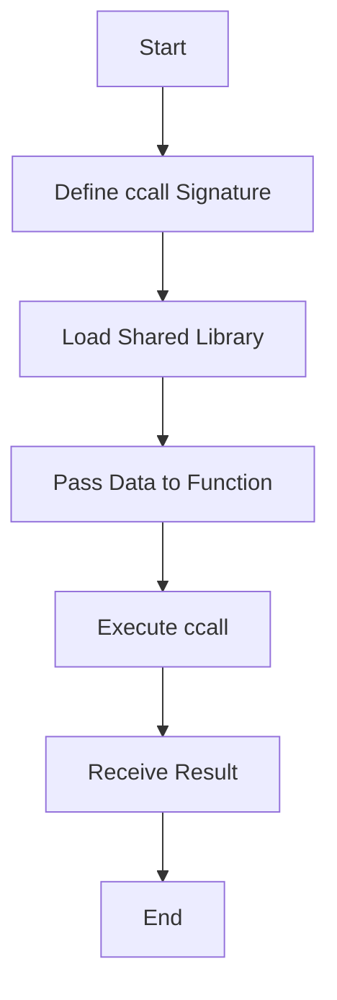

## 16.7 Using Julia's Foreign Function Interfaces

In the world of software development, the ability to leverage existing libraries and code written in other languages is invaluable. Julia, with its powerful Foreign Function Interface (FFI), allows us to seamlessly call functions from C and Fortran libraries, among others. This capability not only enhances Julia's versatility but also enables developers to integrate high-performance native code into their applications. In this section, we'll explore how to effectively use Julia's FFI, focusing on the `ccall` function, loading shared libraries, and best practices for interfacing with C and Fortran code.

### Overview of FFI in Julia

Julia's FFI is primarily facilitated through the `ccall` function, which allows us to call C functions directly from Julia. This integration is crucial for performance-critical applications where leveraging existing C libraries can provide significant speedups. Additionally, Julia's FFI supports calling Fortran code, albeit with some additional considerations due to differences in calling conventions and name mangling.

#### Key Concepts

- **`ccall` Function**: The cornerstone of Julia's FFI, enabling direct calls to C functions.
- **Shared Libraries**: Dynamic libraries that can be loaded at runtime, allowing for modular and reusable code.
- **Data Passing**: Techniques for passing data between Julia and foreign functions, including handling pointers and memory management.

### Defining `ccall` Signatures

To call a C function using `ccall`, we must define its signature, specifying the function's name, the library it resides in, the types of its arguments, and its return type. This process is akin to declaring a function prototype in C.

#### Basic `ccall` Syntax

```julia
result = ccall((function_name, library), ReturnType, (ArgType1, ArgType2, ...), arg1, arg2, ...)
```

- **`function_name`**: The name of the C function to call.
- **`library`**: The shared library containing the function.
- **`ReturnType`**: The type of the value returned by the function.
- **`ArgType1, ArgType2, ...`**: The types of the function's arguments.
- **`arg1, arg2, ...`**: The actual arguments to pass to the function.

#### Example: Calling a C Function

Let's consider a simple example where we call the `sqrt` function from the C standard library:

```julia
result = ccall((:sqrt, "libm"), Float64, (Float64,), 9.0)

println("The square root of 9.0 is $result")
```

In this example, we specify the function name `:sqrt`, the library `"libm"`, the return type `Float64`, and the argument type `Float64`. The `ccall` function then executes the C function and returns the result.

### Loading Shared Libraries

Before calling functions from a shared library, we must ensure the library is loaded. Julia provides the `Libdl` module for this purpose, which allows us to load dynamic libraries at runtime.

#### Using `Libdl` to Load Libraries

```julia
using Libdl

lib = Libdl.dlopen("path/to/library.so")

result = ccall((:function_name, lib), ReturnType, (ArgType1, ArgType2, ...), arg1, arg2, ...)
```

- **`Libdl.dlopen`**: Loads the specified shared library and returns a handle that can be used in `ccall`.
- **`lib`**: The handle to the loaded library, used in place of the library name in `ccall`.

### Calling Fortran Code

Interfacing with Fortran code involves additional considerations due to differences in calling conventions and name mangling. Fortran compilers often append underscores to function names, and argument passing conventions may differ.

#### Handling Name Mangling

When calling Fortran functions, we must account for potential name mangling. This typically involves appending an underscore to the function name in `ccall`.

```julia
result = ccall((:fortran_function_, "libfortran"), ReturnType, (ArgType1, ArgType2, ...), arg1, arg2, ...)
```

#### Example: Calling a Fortran Function

Consider a Fortran function `add` that adds two numbers:

```fortran
! Fortran code
subroutine add(a, b, result)
    real(8), intent(in) :: a, b
    real(8), intent(out) :: result
    result = a + b
end subroutine add
```

To call this function from Julia, we use:

```julia
result = ccall((:add_, "libfortran"), Cvoid, (Ref{Float64}, Ref{Float64}, Ref{Float64}), a, b, result)

println("The result of adding $a and $b is $result")
```

### Passing Data

When interfacing with C or Fortran code, we often need to pass data between Julia and the foreign functions. This involves working with pointers, memory allocation, and data structures.

#### Working with Pointers

Julia's `Ptr` type is used to represent pointers. We can create pointers to Julia data using the `Ref` function, which creates a reference to a value.

```julia
a = 5.0
ptr = Ref(a)

ccall((:c_function, "libc"), ReturnType, (Ptr{Float64},), ptr)
```

#### Memory Allocation

When a foreign function requires a pointer to a buffer, we can allocate memory in Julia using the `Array` type and pass a pointer to the array's data.

```julia
buffer = Array{UInt8}(undef, 1024)
ccall((:c_function, "libc"), ReturnType, (Ptr{UInt8},), buffer)
```

### Best Practices

When using Julia's FFI, it's important to follow best practices to ensure thread safety and handle platform-specific details.

#### Ensuring Thread Safety

- **Avoid Global State**: Minimize the use of global variables in foreign code to prevent race conditions.
- **Use Locks**: Employ locks or other synchronization mechanisms when accessing shared resources.

#### Handling Platform-Specific Details

- **Library Paths**: Ensure library paths are correct for the target platform.
- **Calling Conventions**: Verify that calling conventions match between Julia and the foreign code.

### Examples

Let's explore some practical examples of interfacing with system libraries, OpenSSL, and custom native code.

#### Interfacing with System Libraries

```julia
time = ccall((:clock, "libc"), Int32, ())

println("Current clock time: $time")
```

#### Using OpenSSL

```julia
using Libdl

libcrypto = Libdl.dlopen("libcrypto.so")

function md5(data::Vector{UInt8})
    digest = Vector{UInt8}(undef, 16)
    ccall((:MD5, libcrypto), Ptr{UInt8}, (Ptr{UInt8}, Csize_t, Ptr{UInt8}), data, length(data), digest)
    return digest
end

data = [0x61, 0x62, 0x63]  # "abc" in ASCII
digest = md5(data)

println("MD5 digest: ", join(digest, ", "))
```

### Try It Yourself

Experiment with the examples provided by modifying the function names, argument types, and libraries. Try calling different functions from the C standard library or other shared libraries available on your system.

### Visualizing Julia's FFI Workflow

To better understand the workflow of using Julia's FFI, let's visualize the process using a flowchart.



This flowchart illustrates the steps involved in calling a foreign function using Julia's FFI, from defining the `ccall` signature to receiving the result.

### References and Links

For further reading and deeper dives into the topics covered, consider the following resources:

- [Julia Documentation on ccall](https://docs.julialang.org/en/v1/manual/calling-c-and-fortran-code/)
- [Libdl Module Documentation](https://docs.julialang.org/en/v1/stdlib/Libdl/)
- [OpenSSL Documentation](https://www.openssl.org/docs/)

### Knowledge Check

To reinforce your understanding of Julia's FFI, consider the following questions and exercises:

- What is the purpose of the `ccall` function in Julia?
- How do you handle name mangling when calling Fortran functions?
- Experiment with calling a function from a shared library on your system.

### Embrace the Journey

Remember, mastering Julia's FFI is a journey. As you progress, you'll unlock the ability to integrate powerful native code into your Julia applications. Keep experimenting, stay curious, and enjoy the process!

## Quiz Time!



### What is the primary function used in Julia for calling C functions?

- [x] `ccall`
- [ ] `callc`
- [ ] `cfunction`
- [ ] `clib`

> **Explanation:** The `ccall` function is used in Julia to call C functions directly.

### Which module in Julia is used to load shared libraries?

- [x] `Libdl`
- [ ] `SharedLib`
- [ ] `LibraryLoader`
- [ ] `DynamicLib`

> **Explanation:** The `Libdl` module provides functions for loading shared libraries in Julia.

### How do you handle name mangling when calling Fortran functions?

- [x] Append an underscore to the function name
- [ ] Use a special keyword
- [ ] No special handling is needed
- [ ] Use a different calling convention

> **Explanation:** Fortran compilers often append underscores to function names, so we must account for this in `ccall`.

### What type is used in Julia to represent pointers?

- [x] `Ptr`
- [ ] `Pointer`
- [ ] `Ref`
- [ ] `Address`

> **Explanation:** The `Ptr` type is used in Julia to represent pointers.

### Which function is used to create a reference to a value in Julia?

- [x] `Ref`
- [ ] `Pointer`
- [ ] `Address`
- [ ] `Reference`

> **Explanation:** The `Ref` function creates a reference to a value, which can be used as a pointer.

### What is a key consideration when ensuring thread safety in foreign code?

- [x] Avoiding global state
- [ ] Using global variables
- [ ] Ignoring race conditions
- [ ] Using only local variables

> **Explanation:** Avoiding global state helps prevent race conditions and ensures thread safety.

### What is the purpose of the `Libdl.dlopen` function?

- [x] To load a shared library
- [ ] To close a shared library
- [ ] To list available libraries
- [ ] To unload a shared library

> **Explanation:** `Libdl.dlopen` is used to load a shared library and obtain a handle for it.

### Which of the following is a best practice when interfacing with foreign code?

- [x] Use locks for shared resources
- [ ] Ignore platform-specific details
- [ ] Use global variables extensively
- [ ] Avoid using locks

> **Explanation:** Using locks for shared resources helps ensure thread safety when interfacing with foreign code.

### True or False: Julia's FFI can only call C functions.

- [ ] True
- [x] False

> **Explanation:** Julia's FFI can call functions from C, Fortran, and other languages with compatible calling conventions.

### What is the return type used in `ccall` when a function does not return a value?

- [x] `Cvoid`
- [ ] `Void`
- [ ] `None`
- [ ] `Null`

> **Explanation:** `Cvoid` is used as the return type in `ccall` when a function does not return a value.


