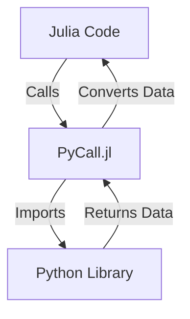

## 16.8 Interfacing with Python Using PyCall.jl

In the world of programming, the ability to leverage multiple languages within a single project can significantly enhance productivity and performance. Julia, known for its high-performance capabilities, can be seamlessly integrated with Python's extensive library ecosystem using PyCall.jl. This section will guide you through the process of interfacing with Python using PyCall.jl, from installation to advanced usage.

### Understanding PyCall.jl

**PyCall.jl** is a powerful Julia package that allows you to call Python functions and use Python libraries directly from Julia. This capability is particularly useful for Julia developers who want to take advantage of Python's rich ecosystem of libraries, such as TensorFlow, NumPy, and Pandas, without leaving the Julia environment.

#### Key Features of PyCall.jl

- **Seamless Integration**: Call Python functions and access Python libraries as if they were native Julia functions.
- **Automatic Data Conversion**: Automatically convert data types between Julia and Python, simplifying the interaction between the two languages.
- **Extensive Compatibility**: Compatible with a wide range of Python versions and environments.

### Installation and Configuration

Before you can start using PyCall.jl, you need to install and configure it to work with your desired Python environment.

#### Installing PyCall.jl

To install PyCall.jl, open the Julia REPL and execute the following command:

```julia
using Pkg
Pkg.add("PyCall")
```

#### Configuring PyCall.jl

PyCall.jl needs to know which Python environment to use. By default, it will use the Python version that comes with your system. However, you can specify a different Python environment by setting the `PYTHON` environment variable before building PyCall.jl.

```julia
ENV["PYTHON"] = "/path/to/your/python"
Pkg.build("PyCall")
```

This command tells PyCall.jl to use the specified Python interpreter. Make sure to replace `"/path/to/your/python"` with the actual path to your Python executable.

### Basic Usage

Once PyCall.jl is installed and configured, you can start using Python libraries in your Julia code.

#### Importing Python Modules

To import a Python module, use the `pyimport` function. For example, to import the `math` module:

```julia
math = pyimport("math")
```

#### Calling Python Functions

You can call Python functions just like you would in Python. For example, to call the `sqrt` function from the `math` module:

```julia
result = math.sqrt(16)
println("The square root of 16 is $result")
```

#### Accessing Python Attributes

Access Python attributes using the dot notation. For example, to access the value of `pi` from the `math` module:

```julia
pi_value = math.pi
println("The value of pi is $pi_value")
```

### Data Conversion

PyCall.jl handles data conversion between Julia and Python automatically, but you can also perform manual conversions when needed.

#### Automatic Data Conversion

PyCall.jl automatically converts basic data types between Julia and Python. For example, Julia arrays are converted to NumPy arrays, and vice versa.

```julia
numpy = pyimport("numpy")
julia_array = [1, 2, 3, 4]
numpy_array = numpy.array(julia_array)
println("NumPy array: $numpy_array")
```

#### Manual Data Conversion

For more control over data conversion, you can use the `PyObject` and `convert` functions.

```julia
py_list = PyObject([1, 2, 3])
julia_list = convert(Vector{Int}, py_list)
println("Julia list: $julia_list")
```

### Advanced Features

PyCall.jl offers advanced features for handling Python exceptions, managing the Global Interpreter Lock (GIL), and more.

#### Handling Python Exceptions

Python exceptions can be caught and handled in Julia using the `try-catch` block.

```julia
try
    result = math.sqrt(-1)
catch e
    println("Caught a Python exception: $e")
end
```

#### Managing the Global Interpreter Lock

When working with multi-threaded applications, managing the GIL is crucial. PyCall.jl provides functions to acquire and release the GIL.

```julia
using PyCall

function thread_safe_python_call()
    pycall(python_function, ReturnType, args...; kwargs...)
end
```

### Mixing Julia and Python Libraries

One of the most powerful features of PyCall.jl is the ability to combine Julia's performance with Python's extensive library ecosystem.

#### Example: Using TensorFlow from Julia

```julia
tensorflow = pyimport("tensorflow")
x = tensorflow.constant(3.0)
y = tensorflow.constant(4.0)
result = tensorflow.add(x, y)
println("TensorFlow result: $result")
```

#### Example: Using NumPy and Pandas

```julia
numpy = pyimport("numpy")
pandas = pyimport("pandas")

data = numpy.array([1, 2, 3, 4])
df = pandas.DataFrame(data, columns=["Numbers"])
println("Pandas DataFrame:")
println(df)
```

### Try It Yourself

Experiment with the code examples provided above. Try modifying the code to use different Python libraries or functions. For instance, replace TensorFlow with another machine learning library like PyTorch, or use Pandas to perform data analysis on a different dataset.

### Visualizing the Integration

To better understand how Julia and Python interact through PyCall.jl, consider the following diagram:



**Diagram Description**: This flowchart illustrates the interaction between Julia code and Python libraries using PyCall.jl. Julia code calls PyCall.jl, which imports the desired Python library. The library returns data to PyCall.jl, which then converts the data for use in Julia.

### References and Links

- [PyCall.jl Documentation](https://github.com/JuliaPy/PyCall.jl)
- [Python Official Documentation](https://docs.python.org/3/)
- [NumPy Documentation](https://numpy.org/doc/)
- [Pandas Documentation](https://pandas.pydata.org/docs/)

### Knowledge Check

- What is PyCall.jl, and why is it useful?
- How do you specify a different Python environment for PyCall.jl?
- What function is used to import Python modules in Julia?
- How does PyCall.jl handle data conversion between Julia and Python?
- What are some advanced features of PyCall.jl?

### Embrace the Journey

Remember, integrating Python with Julia using PyCall.jl opens up a world of possibilities. As you continue to explore and experiment, you'll discover new ways to leverage the strengths of both languages. Keep learning, stay curious, and enjoy the journey!

## Quiz Time!



### What is PyCall.jl used for?

- [x] Calling Python functions and libraries from Julia
- [ ] Compiling Julia code to Python
- [ ] Running Julia code in a Python environment
- [ ] Converting Python code to Julia

> **Explanation:** PyCall.jl is a package that allows Julia to call Python functions and use Python libraries directly.

### How do you specify a Python environment for PyCall.jl?

- [x] Set the `PYTHON` environment variable and rebuild PyCall
- [ ] Use the `pyenv` command in Julia
- [ ] Install Python through Julia's package manager
- [ ] Modify the Julia system path

> **Explanation:** You specify a Python environment by setting the `PYTHON` environment variable and rebuilding PyCall.jl.

### Which function is used to import Python modules in Julia?

- [x] `pyimport`
- [ ] `import`
- [ ] `using`
- [ ] `include`

> **Explanation:** The `pyimport` function is used to import Python modules in Julia.

### How does PyCall.jl handle data conversion?

- [x] Automatically converts basic data types between Julia and Python
- [ ] Requires manual conversion for all data types
- [ ] Converts data types only when explicitly specified
- [ ] Does not support data conversion

> **Explanation:** PyCall.jl automatically converts basic data types between Julia and Python.

### What is the purpose of the Global Interpreter Lock (GIL) in Python?

- [x] To manage access to Python objects in multi-threaded programs
- [ ] To lock Python scripts from unauthorized access
- [ ] To prevent Python code from running on multiple processors
- [ ] To ensure Python code is compiled correctly

> **Explanation:** The GIL is used to manage access to Python objects in multi-threaded programs.

### Can PyCall.jl handle Python exceptions?

- [x] Yes, using Julia's `try-catch` block
- [ ] No, exceptions must be handled in Python
- [ ] Yes, using a special PyCall function
- [ ] No, exceptions are ignored

> **Explanation:** Python exceptions can be caught and handled in Julia using the `try-catch` block.

### What is a key advantage of using PyCall.jl?

- [x] Combining Julia's performance with Python's library ecosystem
- [ ] Running Python code faster than in a native Python environment
- [ ] Compiling Python code to Julia bytecode
- [ ] Automatically translating Python syntax to Julia

> **Explanation:** PyCall.jl allows you to combine Julia's performance with Python's extensive library ecosystem.

### Which Python library is commonly used for numerical computations?

- [x] NumPy
- [ ] Pandas
- [ ] TensorFlow
- [ ] Matplotlib

> **Explanation:** NumPy is commonly used for numerical computations in Python.

### Is it possible to use TensorFlow from Julia using PyCall.jl?

- [x] True
- [ ] False

> **Explanation:** PyCall.jl allows you to use TensorFlow and other Python libraries from Julia.

### What is the first step to use PyCall.jl in a Julia project?

- [x] Install PyCall.jl using Julia's package manager
- [ ] Install Python through Julia
- [ ] Set up a virtual environment in Python
- [ ] Compile Julia code to Python

> **Explanation:** The first step is to install PyCall.jl using Julia's package manager.


