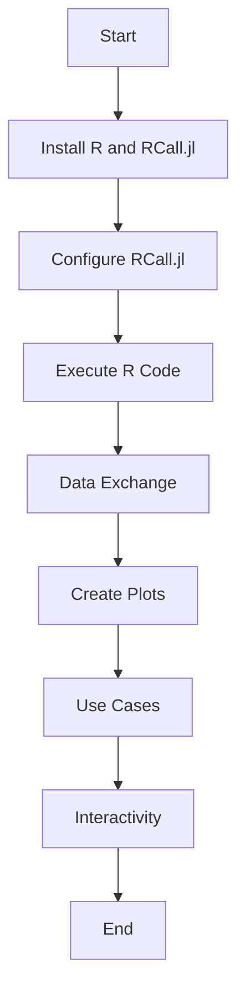

## 16.9 Calling R Functions with RCall.jl

In the world of data science and statistical computing, R is renowned for its extensive libraries and capabilities. However, Julia, with its high-performance and easy-to-use syntax, is becoming increasingly popular among developers and data scientists. By using the RCall.jl package, we can leverage the best of both worlds, integrating R's statistical prowess directly into Julia applications. This section will guide you through the process of setting up and using RCall.jl to call R functions from Julia, exchange data between the two languages, and create plots using R's powerful visualization libraries.

### Introduction to RCall.jl

**RCall.jl** is a Julia package that provides an interface to R, allowing Julia users to execute R code and access R's extensive libraries directly from Julia. This integration is particularly useful for developers who wish to utilize R's specialized statistical methods and visualization tools while benefiting from Julia's performance and ease of use.

#### Key Features of RCall.jl

- **Seamless Integration**: Execute R code and access R libraries from within Julia.
- **Data Exchange**: Convert data structures between Julia and R effortlessly.
- **Plotting Capabilities**: Use R's plotting libraries, such as ggplot2, within Julia applications.
- **Interactivity**: Embed R outputs and plots in Julia applications for enhanced interactivity.

### Setting Up RCall

Before we can start using RCall.jl, we need to ensure that both Julia and R are properly installed on your system. Follow these steps to set up RCall.jl:

#### Step 1: Install R

Ensure that R is installed on your system. You can download R from the [Comprehensive R Archive Network (CRAN)](https://cran.r-project.org/).

#### Step 2: Install RCall.jl

Open the Julia REPL and execute the following command to install RCall.jl:

```julia
using Pkg
Pkg.add("RCall")
```

#### Step 3: Configure RCall

RCall.jl needs to know the location of your R installation. This is usually configured automatically, but if you encounter any issues, you can manually set the R_HOME environment variable to point to your R installation directory.

```julia
ENV["R_HOME"] = "/path/to/R"
```

### Executing R Code

Once RCall.jl is set up, you can start executing R code from within Julia. RCall.jl provides a simple interface for running R expressions and sourcing R scripts.

#### Running R Expressions

You can execute R expressions using the `R` string macro. Here's an example of running a simple R expression:

```julia
using RCall

R"print('Hello from R!')"
```

This will output:

```
Hello from R!
```

#### Sourcing R Scripts

To run an entire R script, use the `RCall.@rinclude` macro. This is useful for executing complex R scripts that are saved as files.

```julia
RCall.@rinclude "path/to/your_script.R"
```

### Data Exchange

One of the most powerful features of RCall.jl is its ability to exchange data between Julia and R. This allows you to leverage R's statistical functions on data that is generated or processed in Julia.

#### Converting Data Structures

RCall.jl provides functions to convert data frames, vectors, and matrices between Julia and R. Here's how you can convert a Julia DataFrame to an R data frame and vice versa:

```julia
using DataFrames, RCall

julia_df = DataFrame(A = 1:3, B = ["x", "y", "z"])

R"r_df <- $julia_df"

julia_df_converted = rcopy(DataFrame, R"r_df")
```

#### Working with Vectors and Matrices

You can also convert vectors and matrices between Julia and R:

```julia
julia_vector = [1, 2, 3]

R"r_vector <- $julia_vector"

julia_vector_converted = rcopy(Vector{Int}, R"r_vector")
```

### Creating Plots

R is well-known for its powerful plotting libraries, such as ggplot2. With RCall.jl, you can create plots in R and display them in Julia.

#### Using ggplot2

Here's an example of creating a plot using ggplot2 in R and displaying it in Julia:

```julia
using RCall

R"""
library(ggplot2)
data(mtcars)
ggplot(mtcars, aes(x = wt, y = mpg)) +
  geom_point() +
  theme_minimal()
"""
```

This code will generate a scatter plot of the `mtcars` dataset, plotting `wt` (weight) against `mpg` (miles per gallon).

### Use Cases

Integrating R with Julia opens up a wide range of possibilities, especially in fields that require specialized statistical methods or advanced data visualization.

#### Specialized Statistical Methods

R has a vast array of statistical packages that are not yet available in Julia. By using RCall.jl, you can access these methods directly from your Julia code. For example, you can perform time series analysis using the `forecast` package in R:

```julia
using RCall

R"""
library(forecast)
data(AirPassengers)
fit <- auto.arima(AirPassengers)
forecast(fit, h = 12)
"""
```

#### Advanced Data Visualization

While Julia has its own powerful plotting libraries, R's ggplot2 offers advanced customization and theming options that are unmatched. By embedding R plots in Julia applications, you can create visually appealing and informative graphics.

### Interactivity

RCall.jl allows you to embed R plots or outputs within Julia applications, enhancing interactivity and user experience. This is particularly useful for creating interactive dashboards or reports.

#### Embedding R Plots

You can embed R plots in Julia applications using packages like `Pluto.jl` or `Dash.jl`. Here's a simple example using `Pluto.jl`:

```julia
using Pluto, RCall

Pluto.run(1234) # Start Pluto server

R"""
library(ggplot2)
ggplot(mtcars, aes(x = wt, y = mpg)) +
  geom_point() +
  theme_minimal()
"""
```

### Try It Yourself

Now that you have a basic understanding of how to use RCall.jl, try modifying the examples above to suit your needs. Experiment with different R functions, data structures, and plots to see how they can be integrated into your Julia projects.

### Visualizing RCall.jl Integration

To better understand how RCall.jl facilitates the interaction between Julia and R, let's visualize the process using a flowchart:



**Figure 1**: This flowchart illustrates the steps involved in integrating R functions into Julia using RCall.jl.

### References and Links

- [RCall.jl Documentation](https://github.com/JuliaInterop/RCall.jl)
- [CRAN - The Comprehensive R Archive Network](https://cran.r-project.org/)
- [ggplot2 Documentation](https://ggplot2.tidyverse.org/)

### Knowledge Check

- What are the benefits of using RCall.jl in Julia applications?
- How do you convert a Julia DataFrame to an R data frame using RCall.jl?
- What are some use cases for integrating R with Julia?

### Embrace the Journey

Remember, integrating R with Julia using RCall.jl is just the beginning. As you explore more, you'll discover new ways to leverage the strengths of both languages. Keep experimenting, stay curious, and enjoy the journey!

## Quiz Time!



### What is the primary purpose of RCall.jl in Julia?

- [x] To integrate R's statistical computing capabilities into Julia
- [ ] To convert Julia code into R code
- [ ] To replace Julia's plotting libraries
- [ ] To compile Julia code into R scripts

> **Explanation:** RCall.jl is used to integrate R's statistical computing capabilities into Julia, allowing users to execute R code and access R libraries directly from Julia.

### How do you install RCall.jl in Julia?

- [x] Using the Pkg.add("RCall") command in the Julia REPL
- [ ] By downloading it from CRAN
- [ ] By compiling it from source
- [ ] By using the R package manager

> **Explanation:** RCall.jl is installed in Julia using the Pkg.add("RCall") command in the Julia REPL.

### Which macro is used to execute R expressions in Julia?

- [x] R
- [ ] @rinclude
- [ ] @rscript
- [ ] @rexecute

> **Explanation:** The R string macro is used to execute R expressions in Julia.

### How can you convert a Julia DataFrame to an R data frame?

- [x] Using the R"r_df <- $julia_df" command
- [ ] Using the DataFrame function
- [ ] Using the convert function
- [ ] Using the rcopy function

> **Explanation:** You can convert a Julia DataFrame to an R data frame using the R"r_df <- $julia_df" command.

### What is a common use case for RCall.jl?

- [x] Utilizing specialized statistical methods available in R
- [ ] Compiling Julia code into R scripts
- [ ] Replacing Julia's plotting libraries
- [ ] Converting R code into Julia code

> **Explanation:** A common use case for RCall.jl is utilizing specialized statistical methods available in R.

### Which R package is commonly used for advanced data visualization?

- [x] ggplot2
- [ ] dplyr
- [ ] tidyr
- [ ] stringr

> **Explanation:** ggplot2 is a popular R package used for advanced data visualization.

### How do you embed R plots in Julia applications?

- [x] Using packages like Pluto.jl or Dash.jl
- [ ] By converting them to Julia plots
- [ ] By exporting them as images
- [ ] By compiling them into Julia scripts

> **Explanation:** You can embed R plots in Julia applications using packages like Pluto.jl or Dash.jl.

### What is the purpose of the RCall.@rinclude macro?

- [x] To source an entire R script in Julia
- [ ] To execute a single R expression
- [ ] To convert R code into Julia code
- [ ] To compile R scripts into Julia

> **Explanation:** The RCall.@rinclude macro is used to source an entire R script in Julia.

### What is the first step in setting up RCall.jl?

- [x] Installing R on your system
- [ ] Installing Julia on your system
- [ ] Configuring the R_HOME environment variable
- [ ] Installing ggplot2

> **Explanation:** The first step in setting up RCall.jl is installing R on your system.

### True or False: RCall.jl allows for seamless data exchange between Julia and R.

- [x] True
- [ ] False

> **Explanation:** RCall.jl allows for seamless data exchange between Julia and R, enabling the conversion of data structures like data frames, vectors, and matrices.


