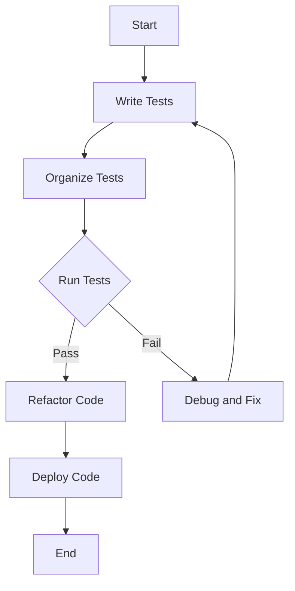

## 17.1 Unit Testing with the `Test` Standard Library

Unit testing is a fundamental practice in software development that ensures the correctness of individual components of a program. In Julia, the `Test` standard library provides a robust framework for writing and running unit tests. This section will guide you through the essentials of unit testing in Julia, from writing basic tests to structuring and executing them effectively.

### Importance of Testing

Testing is crucial for maintaining code quality and reliability. It helps in:

- **Ensuring Correctness**: Verifying that each part of your code behaves as expected.
- **Preventing Regressions**: Catching unintended changes in behavior when modifying code.
- **Facilitating Refactoring**: Providing confidence to refactor code without introducing bugs.
- **Improving Documentation**: Serving as a form of documentation that describes how the code is supposed to work.

### Writing Tests

The `Test` library in Julia offers several macros to facilitate writing tests. Let's explore the primary tools: `@test`, `@test_throws`, and `@testset`.

#### Using `@test`

The `@test` macro is the most basic form of assertion in Julia. It checks whether a given expression evaluates to `true`.

```julia
using Test

function add(a, b)
    return a + b
end

@test add(2, 3) == 5  # This test will pass
@test add(2, 3) == 6  # This test will fail
```

In the example above, the first test will pass because `add(2, 3)` equals `5`, while the second test will fail.

#### Using `@test_throws`

The `@test_throws` macro is used to verify that a specific exception is thrown by a piece of code.

```julia
function divide(a, b)
    if b == 0
        throw(DivideError())
    end
    return a / b
end

@test_throws DivideError divide(1, 0)
```

This test checks that dividing by zero correctly throws a `DivideError`.

#### Using `@testset`

The `@testset` macro groups related tests together, providing a way to organize tests and see aggregated results.

```julia
@testset "Arithmetic Tests" begin
    @test add(1, 1) == 2
    @test add(0, 0) == 0
    @test_throws DivideError divide(1, 0)
end
```

### Structuring Tests

Organizing tests is crucial for maintaining a clean and scalable codebase. Here are some strategies:

#### Organizing Tests into Modules and Files

- **Modules**: Use modules to encapsulate related tests. This helps in avoiding name clashes and maintaining a clear structure.
- **Files**: Separate tests into different files based on functionality or modules. For example, you might have `test_math.jl` for mathematical operations and `test_io.jl` for input/output operations.

```julia
module TestMath
    using Test
    include("math.jl")

    @testset "Math Tests" begin
        @test add(1, 2) == 3
        @test subtract(5, 3) == 2
    end
end
```

#### Running Tests

Julia provides several ways to run tests, ensuring that they are executed in a controlled environment.

#### Executing Tests with `Pkg.test()`

The `Pkg.test()` function runs tests defined in the `test` directory of a package. This is the recommended way to run tests for a Julia package.

```julia
using Pkg
Pkg.test("YourPackageName")
```

#### Running Tests Directly via Scripts

You can also run tests directly from a script using the `include` function.

```julia
include("test/test_math.jl")
```

### Best Practices

Adopting best practices in testing ensures that your tests are effective and maintainable.

#### Keeping Tests Independent

Ensure that tests do not depend on each other. Each test should set up its own environment and not rely on the state left by another test.

#### Making Tests Reproducible

Tests should produce the same results every time they are run. Avoid using random data without setting a seed, and ensure that external dependencies are controlled.

#### Writing Comprehensive Tests

Cover all possible edge cases and scenarios. This includes testing both expected and unexpected inputs.

#### Using Descriptive Test Names

Use descriptive names for test sets and individual tests to make it clear what is being tested.

```julia
@testset "Edge Case Tests" begin
    @test add(0, 0) == 0
    @test add(-1, 1) == 0
end
```

### Try It Yourself

Experiment with the following code by modifying the test cases and observing the results. Try adding new functions and writing tests for them.

```julia
using Test

function multiply(a, b)
    return a * b
end

@testset "Multiplication Tests" begin
    @test multiply(2, 3) == 6
    @test multiply(0, 5) == 0
    @test multiply(-1, 5) == -5
end
```

### Visualizing the Testing Process

To better understand the testing workflow, let's visualize the process using a flowchart.



**Caption**: This flowchart illustrates the typical workflow of writing, organizing, running, and maintaining tests in Julia.

### References and Links

- [Julia Documentation on Testing](https://docs.julialang.org/en/v1/stdlib/Test/)
- [Test.jl GitHub Repository](https://github.com/JuliaLang/julia/tree/master/stdlib/Test)
- [Effective Testing with Julia](https://julialang.org/blog/2019/06/efficient-testing/)

### Knowledge Check

- What is the purpose of the `@test` macro?
- How can you verify that a function throws an exception?
- Why is it important to keep tests independent?
- How do you run tests for a Julia package using `Pkg.test()`?

### Embrace the Journey

Remember, testing is an ongoing process. As you write more code, you'll encounter new scenarios and edge cases. Keep refining your tests, stay curious, and enjoy the journey of building robust and reliable software!

## Quiz Time!



### What is the primary purpose of unit testing?

- [x] To ensure individual components of a program work correctly
- [ ] To optimize code performance
- [ ] To design user interfaces
- [ ] To manage project dependencies

> **Explanation:** Unit testing focuses on verifying the correctness of individual components or functions within a program.

### Which macro is used to check if a specific exception is thrown?

- [ ] `@test`
- [x] `@test_throws`
- [ ] `@testset`
- [ ] `@assert`

> **Explanation:** The `@test_throws` macro is used to verify that a specific exception is thrown by a piece of code.

### How can you group related tests in Julia?

- [ ] Using `@test`
- [ ] Using `@test_throws`
- [x] Using `@testset`
- [ ] Using `@assert`

> **Explanation:** The `@testset` macro is used to group related tests together, allowing for better organization and aggregated results.

### What is the recommended way to run tests for a Julia package?

- [ ] Using `include()`
- [x] Using `Pkg.test()`
- [ ] Using `run()`
- [ ] Using `execute()`

> **Explanation:** `Pkg.test()` is the recommended way to run tests for a Julia package, as it executes tests defined in the `test` directory.

### Why should tests be independent?

- [x] To ensure they do not affect each other's outcomes
- [ ] To improve code readability
- [ ] To reduce execution time
- [ ] To simplify test writing

> **Explanation:** Independent tests ensure that the outcome of one test does not affect another, leading to more reliable and reproducible results.

### What should you avoid to make tests reproducible?

- [ ] Using descriptive names
- [x] Using random data without a seed
- [ ] Organizing tests into modules
- [ ] Writing comprehensive tests

> **Explanation:** Using random data without setting a seed can lead to non-reproducible test results, as the data may vary between runs.

### What is a benefit of using descriptive test names?

- [x] It makes it clear what is being tested
- [ ] It reduces the number of tests needed
- [ ] It speeds up test execution
- [ ] It simplifies code refactoring

> **Explanation:** Descriptive test names clarify the purpose of each test, making it easier to understand what is being verified.

### What is the role of `@testset` in testing?

- [ ] To execute tests
- [ ] To check for exceptions
- [x] To organize related tests
- [ ] To optimize code

> **Explanation:** `@testset` is used to organize related tests into groups, providing a structured way to manage and run tests.

### How can you run a specific test file directly in Julia?

- [x] Using `include("test_file.jl")`
- [ ] Using `Pkg.test()`
- [ ] Using `run("test_file.jl")`
- [ ] Using `execute("test_file.jl")`

> **Explanation:** You can run a specific test file directly by using the `include` function with the file name.

### True or False: Unit tests can serve as a form of documentation.

- [x] True
- [ ] False

> **Explanation:** Unit tests can serve as documentation by demonstrating how functions are expected to behave and interact with each other.




