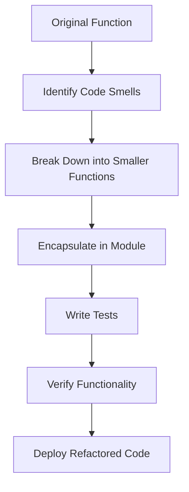

## 17.10 Refactoring Strategies for Improving Code Quality

Refactoring is a crucial process in software development that involves restructuring existing code without changing its external behavior. This practice enhances code readability, reduces complexity, and improves maintainability. In this section, we will delve into refactoring strategies specifically tailored for Julia, a language known for its high-performance capabilities and expressive syntax. We will explore how to identify refactoring needs, apply effective techniques, utilize tools, and ensure that functionality remains intact through testing.

### Identifying Refactoring Needs

Before embarking on refactoring, it's essential to recognize when and where it is needed. Here are some key indicators:

- **Code Smells**: These are symptoms of deeper problems in the code. Common code smells include long methods, large classes, and excessive comments. In Julia, look for functions that do too much or have unclear responsibilities.
- **Duplicated Logic**: Repeated code blocks can lead to maintenance challenges. Identify and consolidate duplicate logic to improve code reusability.
- **Complexity**: High cyclomatic complexity indicates that a function or module is doing too much. Simplifying complex code can make it easier to understand and test.
- **Poor Naming Conventions**: Names should be descriptive and consistent. Poor naming can obscure the purpose of variables and functions.
- **Inconsistent Style**: Code that lacks a consistent style can be difficult to read and maintain. Adhering to a style guide can help maintain consistency.

#### Example: Identifying Code Smells

Consider the following Julia code snippet:

```julia
function process_data(data)
    result = []
    for item in data
        if item > 0
            push!(result, item * 2)
        else
            push!(result, item)
        end
    end
    return result
end
```

**Code Smells**:
- The function `process_data` is doing multiple things: iterating over data, checking conditions, and modifying data.
- The logic for processing positive and non-positive items is mixed, making it harder to understand.

### Refactoring Techniques

Once you've identified areas for improvement, apply these refactoring techniques:

#### Simplifying Functions

Break down large functions into smaller, more focused ones. This enhances readability and makes testing easier.

**Refactored Example**:

```julia
function process_data(data)
    return [process_item(item) for item in data]
end

function process_item(item)
    return item > 0 ? item * 2 : item
end
```

**Explanation**:
- The `process_data` function now delegates the processing of each item to `process_item`, making the code cleaner and more modular.

#### Improving Modularity

Modular code is easier to understand, test, and maintain. Use Julia's module system to encapsulate related functionality.

**Example**:

```julia
module DataProcessor

export process_data

function process_data(data)
    return [process_item(item) for item in data]
end

function process_item(item)
    return item > 0 ? item * 2 : item
end

end
```

**Explanation**:
- The `DataProcessor` module encapsulates the data processing logic, making it reusable and easier to manage.

#### Reducing Cyclomatic Complexity

Cyclomatic complexity measures the number of linearly independent paths through a program's source code. Reduce complexity by simplifying conditional logic and breaking down functions.

**Example**:

```julia
function calculate_discount(price, customer_type)
    if customer_type == "regular"
        return price * 0.95
    elseif customer_type == "premium"
        return price * 0.90
    else
        return price
    end
end
```

**Refactored Example**:

```julia
function calculate_discount(price, customer_type)
    discount_rate = get_discount_rate(customer_type)
    return price * discount_rate
end

function get_discount_rate(customer_type)
    return customer_type == "regular" ? 0.95 : customer_type == "premium" ? 0.90 : 1.0
end
```

**Explanation**:
- The `calculate_discount` function is simplified by extracting the discount rate logic into a separate function.

### Tools to Assist Refactoring

Refactoring can be aided by various tools that automate and streamline the process:

- **Static Analysis Tools**: Tools like `Lint.jl` can help identify potential issues in your code, such as unused variables or type mismatches.
- **Code Formatters**: Use `JuliaFormatter.jl` to ensure your code adheres to a consistent style guide, improving readability and maintainability.
- **Version Control Systems**: Git can track changes and help you manage different versions of your code, making it easier to revert changes if needed.

### Maintaining Functionality

Refactoring should not alter the external behavior of your code. To ensure this, follow these practices:

#### Comprehensive Testing

Write tests before and after refactoring to verify that the code behaves as expected. Use Julia's `Test` module to create unit tests.

**Example**:

```julia
using Test

@testset "Data Processing Tests" begin
    @test process_data([1, -2, 3]) == [2, -2, 6]
    @test process_data([]) == []
end
```

**Explanation**:
- The test suite ensures that `process_data` produces the expected results, even after refactoring.

#### Continuous Integration

Set up continuous integration (CI) pipelines to automatically run tests whenever changes are made. This ensures that refactoring does not introduce regressions.

### Visualizing Refactoring Processes

To better understand the refactoring process, let's visualize the transformation of a complex function into a modular structure using a flowchart.



**Description**: This flowchart illustrates the steps involved in refactoring a complex function. It begins with identifying code smells, followed by breaking down the function, encapsulating it in a module, writing tests, verifying functionality, and finally deploying the refactored code.

### Try It Yourself

Experiment with the refactoring examples provided. Try modifying the `process_item` function to handle additional conditions or refactor the `calculate_discount` function to support more customer types. Observe how these changes affect the overall code structure and readability.

### Knowledge Check

- **Question**: What are some common code smells that indicate the need for refactoring?
- **Challenge**: Refactor a function in your own codebase that has high cyclomatic complexity. Break it down into smaller, more manageable functions.

### Embrace the Journey

Refactoring is an ongoing process that requires patience and practice. As you continue to refine your skills, you'll find that your code becomes more elegant, efficient, and maintainable. Remember, this is just the beginning. Keep experimenting, stay curious, and enjoy the journey!

## Quiz Time!



### What is the primary goal of refactoring?

- [x] To improve code readability and maintainability without changing its external behavior
- [ ] To add new features to the code
- [ ] To increase the execution speed of the code
- [ ] To reduce the size of the codebase

> **Explanation:** Refactoring focuses on improving the internal structure of the code to make it more readable and maintainable, without altering its external behavior.

### Which of the following is a common code smell?

- [x] Duplicated logic
- [ ] High execution speed
- [ ] Low memory usage
- [ ] Efficient algorithms

> **Explanation:** Duplicated logic is a code smell because it can lead to maintenance challenges and inconsistencies.

### What tool can be used to ensure consistent code style in Julia?

- [x] JuliaFormatter.jl
- [ ] Lint.jl
- [ ] Test.jl
- [ ] BenchmarkTools.jl

> **Explanation:** JuliaFormatter.jl is a code formatter that helps maintain consistent style across Julia codebases.

### How can cyclomatic complexity be reduced?

- [x] By breaking down complex functions into smaller, simpler ones
- [ ] By adding more conditional statements
- [ ] By increasing the number of loops
- [ ] By using more global variables

> **Explanation:** Reducing cyclomatic complexity involves simplifying code by breaking down complex functions into smaller, more manageable ones.

### What is the purpose of writing tests before and after refactoring?

- [x] To ensure that the code's behavior remains consistent
- [ ] To increase the code's execution speed
- [ ] To reduce the code's memory usage
- [ ] To add new features to the code

> **Explanation:** Writing tests before and after refactoring ensures that the code's behavior remains consistent and that no regressions are introduced.

### Which of the following is NOT a benefit of modular code?

- [ ] Easier to understand
- [ ] Easier to test
- [ ] Easier to maintain
- [x] Increases code execution speed

> **Explanation:** While modular code is easier to understand, test, and maintain, it does not necessarily increase execution speed.

### What is a key benefit of using version control systems like Git during refactoring?

- [x] They allow you to track changes and revert if necessary
- [ ] They automatically refactor code for you
- [ ] They increase code execution speed
- [ ] They reduce memory usage

> **Explanation:** Version control systems like Git help track changes and allow you to revert to previous versions if needed, which is particularly useful during refactoring.

### What does the `Test` module in Julia help with?

- [x] Writing and running unit tests
- [ ] Formatting code
- [ ] Analyzing code for errors
- [ ] Increasing code execution speed

> **Explanation:** The `Test` module in Julia is used for writing and running unit tests to ensure code correctness.

### True or False: Refactoring should change the external behavior of the code.

- [ ] True
- [x] False

> **Explanation:** Refactoring should not change the external behavior of the code; it should only improve the internal structure.

### What is the first step in the refactoring process according to the flowchart?

- [x] Identify Code Smells
- [ ] Write Tests
- [ ] Deploy Refactored Code
- [ ] Break Down into Smaller Functions

> **Explanation:** The first step in the refactoring process is to identify code smells, which indicate areas that need improvement.


