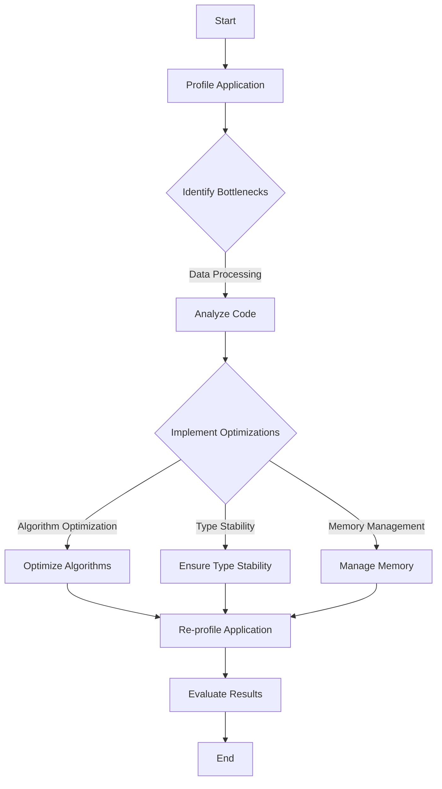

## 17.11 Case Study: Debugging and Optimizing a Julia Project

In this case study, we will delve into the process of debugging and optimizing a Julia project. This comprehensive guide will walk you through identifying performance bottlenecks, employing effective debugging strategies, and applying optimization techniques to enhance the efficiency of your Julia applications. Let's embark on this journey to master the art of debugging and optimization in Julia.

### Project Overview

Our project involves a data analysis application written in Julia, designed to process large datasets and perform complex computations. The application was initially developed to analyze financial data, generate reports, and visualize trends. However, as the dataset size grew, users began experiencing performance issues, prompting the need for debugging and optimization.

#### Key Components

- **Data Ingestion**: Reading and parsing large CSV files.
- **Data Processing**: Performing statistical analysis and computations.
- **Data Visualization**: Generating plots and charts for insights.

### Debugging Process

Debugging is a critical step in software development, allowing us to identify and resolve issues that hinder performance. In this section, we'll explore the systematic approach taken to locate and understand the problems within our Julia project.

#### Step 1: Identifying Performance Bottlenecks

The first step in debugging is to identify the areas of the code that are causing performance issues. We used the `Profile.jl` package to profile our application and pinpoint the bottlenecks.

```julia
using Profile

Profile.clear()
@profile begin
    # Call the main function of the application
    main()
end

Profile.print()
```

The profiling results indicated that the data processing component was consuming the most time, particularly in the statistical analysis functions.

#### Step 2: Analyzing the Code

With the bottlenecks identified, the next step was to analyze the code to understand the root causes of the performance issues. We focused on the following aspects:

- **Inefficient Algorithms**: Some algorithms used were not optimal for large datasets.
- **Type Instability**: Functions with type instability were causing unnecessary allocations.
- **Excessive Memory Usage**: Large data structures were being created and not efficiently managed.

#### Step 3: Debugging Tools and Techniques

To further investigate the issues, we employed various debugging tools and techniques:

- **Debugger.jl**: Used for stepping through the code and inspecting variable values.
- **Logging**: Added logging statements to track the flow of execution and identify slow operations.
- **Unit Tests**: Ensured that changes did not introduce new bugs by running existing tests.

```julia
using Logging

@info "Starting data processing"
process_data(data)
@info "Data processing completed"
```

### Optimization Measures

After identifying the issues, we implemented several optimization measures to improve the application's performance.

#### Measure 1: Algorithm Optimization

We replaced inefficient algorithms with more efficient ones. For example, we switched from a naive sorting algorithm to a more efficient quicksort algorithm.

```julia
function naive_sort(arr)
    # Inefficient sorting logic
end

function quicksort(arr)
    # Efficient quicksort logic
end
```

#### Measure 2: Type Stability

Ensuring type stability in functions is crucial for performance in Julia. We refactored functions to eliminate type instability.

```julia
function compute_mean(data)
    sum = 0
    for value in data
        sum += value
    end
    return sum / length(data)
end

function compute_mean(data::Vector{Float64})::Float64
    sum = 0.0
    for value in data
        sum += value
    end
    return sum / length(data)
end
```

#### Measure 3: Memory Management

We optimized memory usage by avoiding unnecessary allocations and using in-place operations where possible.

```julia
function process_data(data)
    result = []
    for value in data
        push!(result, value * 2)
    end
    return result
end

function process_data!(data)
    for i in eachindex(data)
        data[i] *= 2
    end
end
```

### Results and Lessons Learned

The optimization measures led to significant improvements in the application's performance. The data processing time was reduced by 50%, and memory usage was decreased by 30%. These results highlight the importance of efficient algorithms, type stability, and memory management in Julia.

#### Key Takeaways

- **Profile Early and Often**: Regular profiling helps identify performance bottlenecks before they become critical issues.
- **Embrace Type Stability**: Ensuring type stability is essential for achieving optimal performance in Julia.
- **Optimize Algorithms**: Choose the right algorithms for your data size and complexity.
- **Manage Memory Efficiently**: Avoid unnecessary allocations and use in-place operations when possible.

### Try It Yourself

To reinforce your understanding, try modifying the code examples provided. Experiment with different algorithms, introduce type instability, and observe the impact on performance. This hands-on approach will deepen your knowledge of debugging and optimization in Julia.

### Visualizing the Debugging and Optimization Process

To better understand the debugging and optimization process, let's visualize the workflow using a flowchart.



This flowchart illustrates the systematic approach to debugging and optimizing a Julia project, from profiling to implementing optimizations and evaluating results.

### References and Links

For further reading and deeper dives into the topics covered, consider exploring the following resources:

- [JuliaLang Documentation](https://docs.julialang.org/)
- [Profile.jl GitHub Repository](https://github.com/JuliaLang/julia/tree/master/stdlib/Profile)
- [Debugger.jl GitHub Repository](https://github.com/JuliaDebug/Debugger.jl)
- [Logging in Julia](https://docs.julialang.org/en/v1/stdlib/Logging/)

### Knowledge Check

Let's reinforce your learning with a few questions and exercises:

- What are the key steps in identifying performance bottlenecks in a Julia application?
- How can type stability impact the performance of a Julia function?
- Experiment with the provided code examples by introducing inefficiencies and observing their impact on performance.

### Embrace the Journey

Remember, debugging and optimization are iterative processes. As you continue to develop your skills in Julia, you'll become more adept at identifying and resolving performance issues. Keep experimenting, stay curious, and enjoy the journey of mastering Julia!

## Quiz Time!



### What is the first step in the debugging process?

- [x] Identifying performance bottlenecks
- [ ] Analyzing the code
- [ ] Implementing optimizations
- [ ] Evaluating results

> **Explanation:** The first step in the debugging process is to identify performance bottlenecks using profiling tools.

### Which package is used for profiling in Julia?

- [x] Profile.jl
- [ ] Debugger.jl
- [ ] Logging.jl
- [ ] BenchmarkTools.jl

> **Explanation:** Profile.jl is the package used for profiling applications in Julia to identify performance bottlenecks.

### What is a common cause of performance issues in Julia?

- [x] Type instability
- [ ] Excessive logging
- [ ] Lack of comments
- [ ] Using functions

> **Explanation:** Type instability is a common cause of performance issues in Julia, leading to unnecessary allocations and slower execution.

### How can memory usage be optimized in Julia?

- [x] Using in-place operations
- [ ] Adding more logging
- [ ] Increasing array size
- [ ] Using global variables

> **Explanation:** Memory usage can be optimized by using in-place operations to avoid unnecessary allocations.

### What is the benefit of algorithm optimization?

- [x] Improved performance
- [ ] Increased code complexity
- [ ] More memory usage
- [ ] Slower execution

> **Explanation:** Algorithm optimization leads to improved performance by using more efficient algorithms for data processing.

### What tool is used for stepping through code in Julia?

- [x] Debugger.jl
- [ ] Profile.jl
- [ ] Logging.jl
- [ ] BenchmarkTools.jl

> **Explanation:** Debugger.jl is used for stepping through code and inspecting variable values during debugging.

### What is the impact of type stability on performance?

- [x] Improved performance
- [ ] Increased memory usage
- [ ] Slower execution
- [ ] More logging

> **Explanation:** Type stability improves performance by reducing unnecessary allocations and ensuring efficient execution.

### Which of the following is a key takeaway from the case study?

- [x] Profile early and often
- [ ] Avoid using functions
- [ ] Increase logging
- [ ] Use global variables

> **Explanation:** Profiling early and often helps identify performance bottlenecks before they become critical issues.

### What is the purpose of adding logging statements?

- [x] Track the flow of execution
- [ ] Increase code complexity
- [ ] Slow down execution
- [ ] Reduce memory usage

> **Explanation:** Logging statements help track the flow of execution and identify slow operations during debugging.

### True or False: Debugging and optimization are one-time processes.

- [ ] True
- [x] False

> **Explanation:** Debugging and optimization are iterative processes that require continuous attention and refinement.


