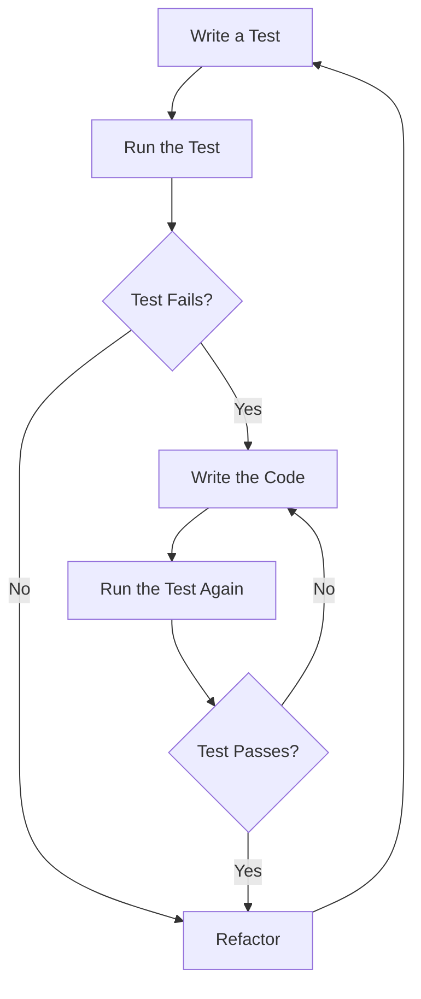

## 17.2 Test-Driven Development (TDD) Strategies

Test-Driven Development (TDD) is a software development process that emphasizes writing tests before implementing the actual code. This approach not only ensures that the code meets its requirements but also promotes better design, fewer defects, and improved documentation. In this section, we will delve into the principles of TDD, explore its workflow in Julia, discuss its advantages, and provide a comprehensive case study to illustrate its application.

### Principles of TDD

The core principles of TDD revolve around the idea of writing tests before the actual code. This approach is encapsulated in the following steps:

1. **Write a Test**: Begin by writing a test for a new feature or functionality. This test should fail initially since the feature has not been implemented yet.
2. **Run the Test**: Execute the test to ensure it fails. This step confirms that the test is valid and that the feature is not yet present.
3. **Write the Code**: Implement the minimum amount of code necessary to pass the test.
4. **Run the Test Again**: Execute the test once more to verify that it passes with the new code.
5. **Refactor**: Clean up the code while ensuring that the test continues to pass. This step involves improving the code's structure and readability without altering its behavior.
6. **Repeat**: Continue this cycle for each new feature or functionality.

By adhering to these principles, developers can create robust and reliable software that meets its requirements.

### Workflow in Julia

Julia, with its powerful features and expressive syntax, is well-suited for TDD. The workflow for TDD in Julia involves the following steps:

1. **Set Up the Testing Environment**: Use Julia's built-in `Test` module to create and manage tests. This module provides a comprehensive set of tools for writing and running tests.

   ```julia
   using Test
   ```

2. **Write a Failing Test**: Start by writing a test for the desired functionality. For example, if you are developing a function to add two numbers, write a test that checks the expected output.

   ```julia
   @testset "Addition Function" begin
       @test add(2, 3) == 5
   end
   ```

3. **Run the Test**: Execute the test to ensure it fails. This step confirms that the feature is not yet implemented.

   ```julia
   # Run the test using the Julia REPL or a script
   ```

4. **Implement the Code**: Write the minimum amount of code necessary to pass the test.

   ```julia
   function add(a, b)
       return a + b
   end
   ```

5. **Run the Test Again**: Execute the test once more to verify that it passes with the new code.

   ```julia
   # Run the test again to ensure it passes
   ```

6. **Refactor**: Improve the code's structure and readability while ensuring that the test continues to pass.

   ```julia
   # Refactor the code if necessary
   ```

7. **Repeat**: Continue this cycle for each new feature or functionality.

By following this workflow, developers can create well-tested and reliable software in Julia.

### Advantages of TDD

TDD offers several advantages that contribute to the development of high-quality software:

- **Improved Design**: Writing tests before code encourages developers to think about the design and requirements of the software. This leads to better-structured and more maintainable code.
- **Fewer Defects**: By writing tests for each feature, developers can catch defects early in the development process. This reduces the likelihood of bugs and improves the overall quality of the software.
- **Better Documentation**: Tests serve as documentation for the software's functionality. They provide a clear and concise description of what the software is supposed to do, making it easier for other developers to understand and maintain the code.

### Case Study: Applying TDD to Develop a New Feature

To illustrate the application of TDD, let's consider a case study where we develop a new feature for a simple calculator application. The feature we want to implement is a function that calculates the factorial of a number.

#### Step 1: Write a Failing Test

We begin by writing a test for the factorial function. The test checks that the function returns the correct factorial for a given input.

```julia
@testset "Factorial Function" begin
    @test factorial(0) == 1
    @test factorial(1) == 1
    @test factorial(5) == 120
end
```

#### Step 2: Run the Test

Next, we run the test to ensure it fails, confirming that the feature is not yet implemented.

```julia
```

#### Step 3: Implement the Code

We then write the minimum amount of code necessary to pass the test. In this case, we implement a simple recursive function to calculate the factorial.

```julia
function factorial(n::Int)
    if n == 0
        return 1
    else
        return n * factorial(n - 1)
    end
end
```

#### Step 4: Run the Test Again

We execute the test once more to verify that it passes with the new code.

```julia
```

#### Step 5: Refactor

Finally, we refactor the code to improve its structure and readability. In this case, the code is already simple and clear, so no further refactoring is necessary.

```julia
```

#### Step 6: Repeat

We continue this cycle for each new feature or functionality we want to add to the calculator application.

### Visualizing the TDD Workflow

To better understand the TDD workflow, let's visualize the process using a flowchart:



**Figure 1**: The TDD Workflow

This flowchart illustrates the iterative nature of TDD, where each cycle begins with writing a test and ends with refactoring the code.

### Try It Yourself

To gain a deeper understanding of TDD, try modifying the code examples provided in this section. For instance, you can:

- Add more test cases to the factorial function to cover edge cases.
- Implement additional features for the calculator application, such as subtraction or division, using the TDD approach.
- Experiment with different refactoring techniques to improve the code's structure and readability.

### References and Links

For further reading on TDD and its application in Julia, consider the following resources:

- [Test-Driven Development by Example](https://www.amazon.com/Test-Driven-Development-Kent-Beck/dp/0321146530) by Kent Beck
- [The Art of Unit Testing](https://www.manning.com/books/the-art-of-unit-testing) by Roy Osherove
- [JuliaLang: Testing](https://docs.julialang.org/en/v1/stdlib/Test/) - Official Julia documentation on the `Test` module

### Knowledge Check

To reinforce your understanding of TDD, consider the following questions:

- What are the core principles of TDD?
- How does TDD improve software design and reduce defects?
- What are the steps involved in the TDD workflow in Julia?
- How can tests serve as documentation for software functionality?

### Embrace the Journey

Remember, TDD is a powerful tool that can help you create high-quality software. As you continue to explore and apply TDD strategies, you'll gain a deeper understanding of software design and testing. Keep experimenting, stay curious, and enjoy the journey!

## Quiz Time!



### What is the first step in the TDD process?

- [x] Write a test
- [ ] Implement the code
- [ ] Refactor the code
- [ ] Run the test

> **Explanation:** The first step in the TDD process is to write a test for the desired functionality.

### What is the purpose of running a test before implementing the code?

- [x] To ensure the test fails
- [ ] To verify the code works
- [ ] To refactor the code
- [ ] To document the code

> **Explanation:** Running the test before implementing the code ensures that the test fails, confirming that the feature is not yet present.

### How does TDD improve software design?

- [x] Encourages thinking about design and requirements
- [ ] Increases code complexity
- [ ] Reduces test coverage
- [ ] Promotes code duplication

> **Explanation:** TDD encourages developers to think about the design and requirements of the software, leading to better-structured and more maintainable code.

### What is the role of refactoring in the TDD process?

- [x] Improve code structure and readability
- [ ] Add new features
- [ ] Increase test coverage
- [ ] Document the code

> **Explanation:** Refactoring involves improving the code's structure and readability without altering its behavior.

### What is the main advantage of writing tests before code?

- [x] Catch defects early
- [ ] Increase code complexity
- [ ] Reduce test coverage
- [ ] Promote code duplication

> **Explanation:** Writing tests before code helps catch defects early in the development process, reducing the likelihood of bugs.

### How do tests serve as documentation?

- [x] Provide a clear description of software functionality
- [ ] Increase code complexity
- [ ] Reduce test coverage
- [ ] Promote code duplication

> **Explanation:** Tests provide a clear and concise description of what the software is supposed to do, making it easier for other developers to understand and maintain the code.

### What is the purpose of refactoring in TDD?

- [x] Improve code structure and readability
- [ ] Add new features
- [ ] Increase test coverage
- [ ] Document the code

> **Explanation:** Refactoring involves improving the code's structure and readability without altering its behavior.

### What is the main benefit of TDD?

- [x] Improved software quality
- [ ] Increased code complexity
- [ ] Reduced test coverage
- [ ] Promoted code duplication

> **Explanation:** TDD leads to improved software quality by encouraging better design and catching defects early.

### True or False: TDD involves writing tests after implementing the code.

- [ ] True
- [x] False

> **Explanation:** TDD involves writing tests before implementing the code, not after.

### True or False: TDD can help reduce software defects.

- [x] True
- [ ] False

> **Explanation:** TDD helps reduce software defects by catching them early in the development process.




