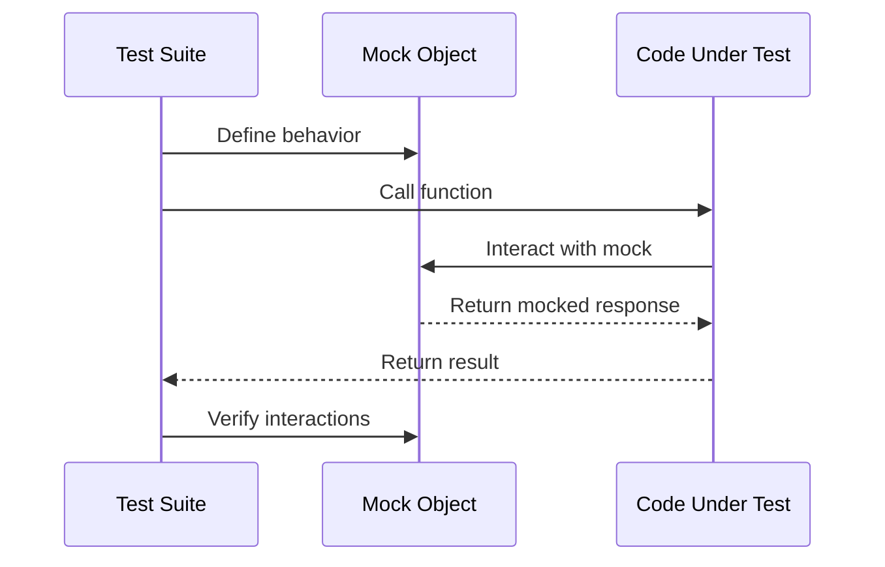

## 17.3 Mocking and Stubbing with Mocking.jl

In the realm of software testing, ensuring that each component of your application behaves as expected is crucial. Mocking and stubbing are powerful techniques that allow developers to isolate the code under test by simulating external dependencies. This section delves into the use of Mocking.jl, a Julia package designed to facilitate these practices, enabling you to create robust and reliable test suites.

### Purpose of Mocking

Mocking serves a vital role in testing by allowing you to:

- **Isolate Code Under Test**: By simulating external dependencies, you can focus on testing the functionality of the code itself without interference from other components.
- **Simulate Complex Interactions**: Mocks can mimic the behavior of complex systems, such as network services or databases, enabling you to test how your code interacts with these systems.
- **Verify Interactions**: Beyond just simulating behavior, mocks can also verify that certain interactions occur, such as ensuring a function is called with specific arguments.

### Using Mocking.jl

Mocking.jl is a powerful tool in the Julia ecosystem that provides the functionality needed to create mocks, specify their behaviors, and verify interactions. Let's explore how to use Mocking.jl effectively.

#### Creating Mocks

To begin using Mocking.jl, you need to create mock objects that simulate the behavior of real objects. Here's a simple example:

```julia
using Mocking

function fetch_data(service)
    return service.get_data()
end

mock_service = mock()

when(mock_service.get_data()) do
    return "mocked data"
end

result = fetch_data(mock_service)
println(result)  # Output: "mocked data"
```

In this example, we define a mock for a service object and specify that when the `get_data` method is called, it should return "mocked data". This allows us to test the `fetch_data` function without needing a real service.

#### Specifying Behaviors

Mocking.jl allows you to specify detailed behaviors for your mocks, including return values and side effects. You can also define different behaviors based on input arguments:

```julia
when(mock_service.get_data("param1")) do
    return "data for param1"
end

when(mock_service.get_data("param2")) do
    return "data for param2"
end

println(fetch_data(mock_service, "param1"))  # Output: "data for param1"
println(fetch_data(mock_service, "param2"))  # Output: "data for param2"
```

#### Verifying Calls

One of the key benefits of mocking is the ability to verify that certain interactions occur. Mocking.jl provides tools to check if a function was called with specific arguments:

```julia
verify_called(mock_service.get_data("param1"))
verify_called(mock_service.get_data("param2"))
```

This verification step ensures that your code interacts with the mock as expected, providing an additional layer of confidence in your tests.

### Examples of Mocking

Mocking is particularly useful in scenarios where your code interacts with external systems. Let's explore some common use cases:

#### Mocking Network Requests

When testing code that makes network requests, you can use mocks to simulate responses from a server:

```julia
using Mocking

function fetch_from_api(api)
    return api.get("/endpoint")
end

mock_api = mock()

when(mock_api.get("/endpoint")) do
    return "mocked response"
end

response = fetch_from_api(mock_api)
println(response)  # Output: "mocked response"
```

#### Mocking File I/O

For code that reads from or writes to files, mocks can simulate file operations without touching the filesystem:

```julia
using Mocking

function read_file(file)
    return file.read()
end

mock_file = mock()

when(mock_file.read()) do
    return "mocked file content"
end

content = read_file(mock_file)
println(content)  # Output: "mocked file content"
```

#### Mocking Database Interactions

Database interactions can be complex and time-consuming to test. Mocks can simulate database queries and updates:

```julia
using Mocking

function query_database(db, query)
    return db.execute(query)
end

mock_db = mock()

when(mock_db.execute("SELECT * FROM table")) do
    return "mocked query result"
end

result = query_database(mock_db, "SELECT * FROM table")
println(result)  # Output: "mocked query result"
```

### Combining with Test Suites

Integrating mocks into your existing test structures can enhance your test coverage and reliability. Here's how you can combine Mocking.jl with Julia's built-in testing framework:

```julia
using Test
using Mocking

function process_data(service)
    data = service.get_data()
    return "Processed: $data"
end

@testset "Process Data Tests" begin
    # Create a mock service
    mock_service = mock()

    # Define mock behavior
    when(mock_service.get_data()) do
        return "mocked data"
    end

    # Test the process_data function
    @test process_data(mock_service) == "Processed: mocked data"

    # Verify that the mock was called
    verify_called(mock_service.get_data())
end
```

In this example, we create a test suite using Julia's `Test` module and integrate a mock service to test the `process_data` function. This approach ensures that your tests are both isolated and comprehensive.

### Visualizing Mocking and Stubbing

To better understand the flow of mocking and stubbing, let's visualize the process using a sequence diagram:



**Diagram Description**: This sequence diagram illustrates the interaction between the test suite, the mock object, and the code under test. The test suite defines the behavior of the mock, calls the function being tested, and verifies the interactions with the mock.

### References and Links

For further reading on mocking and stubbing in Julia, consider exploring the following resources:

- [Mocking.jl Documentation](https://github.com/invenia/Mocking.jl)
- [Julia Testing Documentation](https://docs.julialang.org/en/v1/stdlib/Test/)
- [Test-Driven Development with Julia](https://julialang.org/blog/2019/07/tdd/)

### Knowledge Check

To reinforce your understanding of mocking and stubbing with Mocking.jl, consider the following questions:

- What is the primary purpose of mocking in software testing?
- How can you specify different behaviors for a mock based on input arguments?
- What is the benefit of verifying interactions with a mock?

### Embrace the Journey

Remember, mastering mocking and stubbing is just one step in your journey to becoming a proficient Julia developer. As you continue to explore and experiment with these techniques, you'll gain deeper insights into test-driven development and software reliability. Keep experimenting, stay curious, and enjoy the journey!

### Quiz Time!



### What is the primary purpose of mocking in software testing?

- [x] Isolating code under test by simulating external dependencies
- [ ] Improving code performance
- [ ] Simplifying code logic
- [ ] Enhancing user interface design

> **Explanation:** Mocking is primarily used to isolate the code under test by simulating external dependencies, allowing developers to focus on testing the functionality of the code itself.

### How can you specify different behaviors for a mock based on input arguments?

- [x] By defining different behaviors using the `when` function with specific arguments
- [ ] By creating multiple mock objects
- [ ] By modifying the original function
- [ ] By using conditional statements within the mock

> **Explanation:** Mocking.jl allows you to specify different behaviors for a mock based on input arguments using the `when` function, enabling you to simulate various scenarios.

### What is the benefit of verifying interactions with a mock?

- [x] Ensuring that the code interacts with the mock as expected
- [ ] Increasing code execution speed
- [ ] Reducing memory usage
- [ ] Simplifying code syntax

> **Explanation:** Verifying interactions with a mock ensures that the code interacts with the mock as expected, providing an additional layer of confidence in your tests.

### Which of the following is a common use case for mocking?

- [x] Simulating network requests
- [ ] Optimizing algorithm performance
- [ ] Enhancing graphical user interfaces
- [ ] Managing memory allocation

> **Explanation:** Mocking is commonly used to simulate network requests, allowing developers to test how their code interacts with external services.

### What is the role of the `verify_called` function in Mocking.jl?

- [x] To check if a function was called with specific arguments
- [ ] To execute the mock behavior
- [ ] To define the mock behavior
- [ ] To create a new mock object

> **Explanation:** The `verify_called` function in Mocking.jl is used to check if a function was called with specific arguments, verifying the interactions with the mock.

### How can mocks be integrated into existing test structures?

- [x] By using them within test suites to enhance test coverage
- [ ] By replacing all real objects with mocks
- [ ] By modifying the original codebase
- [ ] By using them only in production environments

> **Explanation:** Mocks can be integrated into existing test structures by using them within test suites, enhancing test coverage and reliability.

### What is a key advantage of using mocks in testing?

- [x] They allow testing of code in isolation from external dependencies
- [ ] They automatically optimize code performance
- [ ] They simplify code syntax
- [ ] They enhance graphical user interfaces

> **Explanation:** A key advantage of using mocks in testing is that they allow testing of code in isolation from external dependencies, ensuring that tests are focused and reliable.

### What is the purpose of the `when` function in Mocking.jl?

- [x] To define the behavior of a mock when a specific function is called
- [ ] To execute the mock behavior
- [ ] To verify interactions with the mock
- [ ] To create a new mock object

> **Explanation:** The `when` function in Mocking.jl is used to define the behavior of a mock when a specific function is called, allowing you to simulate various scenarios.

### In the context of mocking, what does "stubbing" refer to?

- [x] Providing predefined responses to function calls
- [ ] Optimizing code performance
- [ ] Simplifying code syntax
- [ ] Enhancing graphical user interfaces

> **Explanation:** In the context of mocking, "stubbing" refers to providing predefined responses to function calls, simulating the behavior of external dependencies.

### True or False: Mocking.jl can be used to simulate file I/O operations.

- [x] True
- [ ] False

> **Explanation:** True. Mocking.jl can be used to simulate file I/O operations, allowing developers to test code that interacts with the filesystem without actually reading or writing files.


